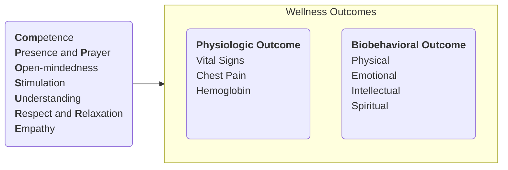

---
tags:
  - A110
title: Theory of Composure Behaviors
description: The presence of nurses is a meaningful occasion for the patient to develop mutual trust, acceptance, and eventually satisfying relationships. Carmelita Divinagracia puts forth a series of behaviors that contribute to positive physiologic and biobehavioral patient outcomes.
date: 2024-01-01
---
# Nursing Theorist Carmelita Divinagracia
- **Master in Nursing** (1975), **Doctoral Degree in Nursing** (2001) from the University of the Philippines
- Dean of the College of Nursing of the U.E.R.M. Memorial Medical Center
- **Anastacia Giron Tupas Award** (PNA) Laureate in 2008
- Member of **CHED's Technical Committee** on Nursing Education
- Expert in **Nursing Research** and **Education**
___
# Theory of Composure Behaviors
It is a condition of being in a state of well-being, a coordinated and integrated living pattern that involves the dimension of wellness. %%It was tested on 31 recovering patients in the Philippine Heart Center.%%

## Competence
**In-depth knowledge and clinical expertise** demonstrated in caring for patients. It can also stand for **consistency** and **congruency** of words and actions of the nurse.
## Presence and Prayer
A form of nursing measure which means **being with another person during times of need**, involving therapeutic communication, active listening, and therapeutic touch. It is also a form of nursing measure that is demonstrated through **reciting a prayer** with the patient and concretized through the nurse's personal relationship and faith in God.
## Open-mindedness
A form of nursing measure which means **being receptive to new ideas, reason, or evidence**. The nurse **considers the patient's preferences and demonstrates flexibility** in accommodating for the patient's views.
## Stimulation
A form of nursing measure demonstrated by means of providing **encouragement that conveys hope and strength**, guidance in the form of giving **explanation and supervision** during procedures, **the use of complimentary words, praise, or smiling whenever appropriate**. Appreciation of what the patient can do is reinforced through positive encouraging remarks with a **kind and approving behavioral approach**.
## Understanding
The **expression of interest and acceptance of the patient's entire being** and condition. It is manifested through concerned and affable facial approaches, helping the patient feel important, heard, and unique.
## Respect
**Acknowledgement of the patients' presence and being**. It may be done through the use of preferred naming, formalities in speech e.g. *po* and *opo*, respectful nods and recognition of the patient.
## Relaxation
A physiological intervention; **an exercise that involves alternate tension and relaxation** of selected muscle groups.
## Empathy
The nurse must **accurately sense another person's inner experience as if it were their own**. An empathic nurse relates to the current thoughts of the patient by perceiving things from their perspective.
___
# Discussion
From the time the nurse admits a patient to the time of their discharge, **the nurse's presence becomes a meaningful occasion** for both parties to develop mutual trust, acceptance, and eventually satisfying relationships. The framework [[#Theory of Composure Behaviors|here]] displays the effect of the Composure behaviors on the wellness outcomes of the patient, both in biobehavioral and physiologic aspects. Composure behaviors are related to the principle of **holistic care**, wherein a patient's wellness outcomes can be achieved through a series of attributes that cater to every aspect of a patient's wellness.
## Patient Wellness Outcomes
Wellness outcomes refer to the perceived wellness of selected orthopedic patients after receiving nursing care in terms of physiologic and biobehavioral aspects. Many illnesses are curable and may only have a temporary effect on health. Others, like diabetes, are not curable but can be managed. These outcomes reflect the patients' needs during their admission.
- **Physiologic Wellness Outcomes**: perceived wellness in relation to vital signs, bone pain sensation, and complete blood count.
- **Biobehavioral Wellness Outcomes**: perceived wellness in relation to physical, intellectual, emotional, and spiritual care.
	- **Physical**: muscle strength, mobility, posture, gait, exercise and activity tolerance, cardiorespiratory endurance. These should be able to aid the person in functioning effectively in daily work. It involves both physical fitness and physical dexterity. These people are **fit rather than unfit**
	- **Emotional**: awareness, orientation, *understanding of own and other personal feelings*, ability to *control and cope with emotions* with positivity, optimism, and being constructive. **Happy rather than depressed**
	- **Intellectual**: knowledge and perception of a healthy self and *ability to recognize the presence of risk factors and preventive measures*. Intellectual health involve *being free of cognitive-impairment from illness or other systems that affect learning*. Being **informed rather than ignorant**
	- **Spiritual**: development of the inner self or one's soul through *a relationship with God*. They are able to establish a value system and act on the system and their principles, which aids in carrying out meaningful and constructive lifetime goals. This is generally characterized as **fulfilled rather than unfulfilled**.
## Active Listening
The most basic form of holistic communication is **Active Listening**. It is a specific way of hearing what a person says and feel, then reflecting that information back to the speaker. It shows **interest, empathic understanding, and gentle, compassionate attention** to what the patient has to say. **Reflecting** the information back to them allows them to see your understanding of their situation, making them **feel heard and understood**. **There is no extraneous analysis, interpretation, judgment, or advice**. This leads to less anxiety, less complaints, and better compliance.
>[!INFO]
>Reports of "*feeling invisible and isolated*" is very common among admitted patients. Active listening is a highly relevant behavioral skill for nurses to learn and employ.
## Positive Total Outlook
**A positive total outlook is key to wellness**. It affects all dimensions of wellness, where in a "well" person is *satisfied with their work, spirituality* and *social life*. They *enjoy leisure time, are physically fit*, and *displays a positive emotional-mental outlook*. They are happy to be fulfilled. **Self-perception** of wellness may even be more important than actual condition. A good determinant of high-level wellness is **the willingness to reward oneself**.

The development of a system to **allow a patient to perceive themselves positively** is an important aspect of improving this aspect of care. **Lifestyles that encourage improved self-perception** is important.