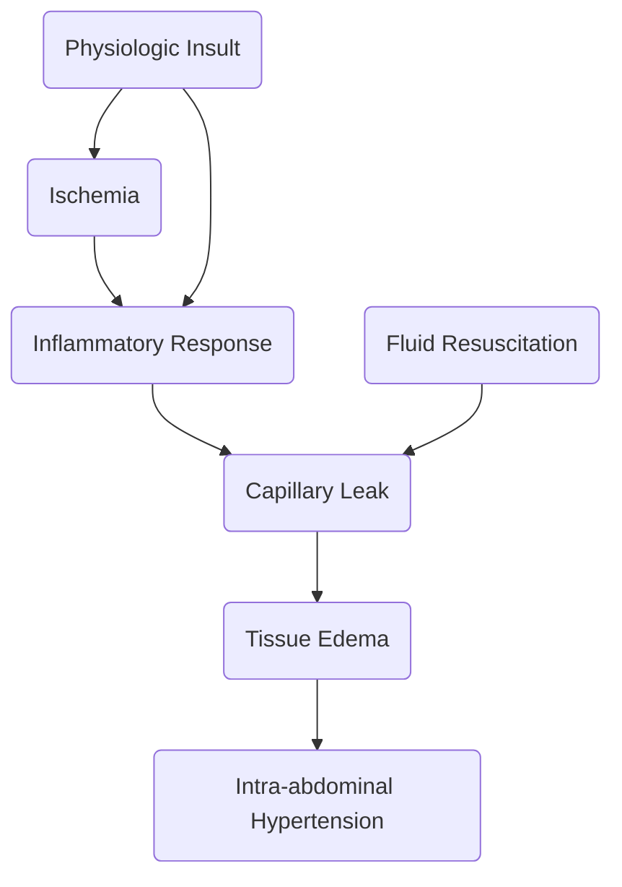

---
tags:
  - B418
  - MS
  - COMP
title: B418 MIDTERMS
description: A compilation for the midterm topics in Critical Care Nursing by Dr. Rotairo and Dr. Ferrer (and the other one I forgot who). This covers electrocardiography, gastrointestinal and liver dysfunction, and chronic/end-stage kidney disease.
date: 2024-11-03
---
The following discussions are based on these topics:
1. [[ECG|Electrocardiography]]
2. [[GI Dysfunction|Gastrointestinal and Liver Dysfunction]]
3. [[Kidney Disease]]
  
  >[!CITE] Reference
 >These discussions are based on [Dr. Edgar M. Rotairo's presentation](https://drive.google.com/file/d/1TEoEePWAJlSJ0I_03Z2v2NSEXqO4pati/view?usp=drive_link) and Dr. Ferrer's live lecture.

___
# Electrocardiography
Electrocardiography (ECG/EKG) is the **graphic recording of the electrical activity (electric potentials) of the heart**. It is a noninvasive and affordable method of monitoring, often readily available in health care facilities. It uses **metal electrodes** attached to the extremities and chest wall to measure electric potential, which is then visualized by the ECG machine.
## Conduction System of the Heart
1. In normal physiology, the electrical impulse originates from the **sinoatrial node**, depolarizing the **right atrium**, being recorded as a **P wave**.
2. The impulse travels down to the **atrioventricular node**,
3. The **Bundle of His** continues the impulse, splitting into the **right and left bundle branches**.
4. Finally, the **Purkinje Fibers** are predominant carriers of impulse within the ventricles, travelling downward, turning at the apex of the heart to wrap around the myocardium upwards. The resulting ventricular contraction is seen as the **QRS Complex**.
5. Finally, the **T wave** is a sign of **ventricular repolarization**.
![[heart_conduction_system.png]]
### Depolarization-Repolarization Cycle

| Phase                                 | Electrolyte Flow                                        |
| ------------------------------------- | ------------------------------------------------------- |
| **Phase 0**: **Rapid Depolarization** | Sodium rapidly enters cardiac cells                     |
|                                       | Calcium slowly enters cardiac cells                     |
| **Phase 1**: **Early Repolarization** | Sodium channels close                                   |
|                                       | Potassium temporarily increases from efflux             |
| **Phase 2**: **Plateau Phase**        | Calcium continues to flow in                            |
|                                       | Potassium continues to flow out                         |
| **Phase 3**: **Rapid Repolarization** | Potassium channels open, rapid diffusion                |
|                                       | Calcium channels become inactivated                     |
| **Phase 4**: **Resting Phase**        | Sodium-Potassium pump returns Na and K to their states. |
|                                       | Cell membranes become impermeable to sodium ions.       |
___
## Lead Placement
The following are the corresponding leads to which wall of the heart is being detected:
- **II, III, AVF**: inferior wall
- **I, AVL**: lateral wall
- **V1, V2**: septal wall
- **V3, V4**: anterior wall
- **V5, V6**: lateral wall
- **AVR**: no specific view
>[!INFO] Coronary Artery Sources
>- The **Right Coronary Artery** supplies the inferior wall.
>- The **Left Coronary Artery** supplies the anterior, septal, and lateral walls.

![[lead_placement2.png]]
### Unipolar Precordial Leads
1. **V₁**: 4th ICS, Right Sternal Margin
2. **V₂**: 4th ICS, Left Sternal Margin
3. **V₃**: Midway between V₂ and V₄
4. **V₄**: 5th ICS, MCL
5. **V₅**: AAL on the same level as V₄
6. **V₆**: MAL on the same level as V₄

![[lead_placement1.png]]
### Lead Axes
The two leads to consider for axis deviation is **Lead I** and **Lead AVF**. If both are positive, the axis remains normal.

| Lead I   | Lead AVF | Axis                   |
| -------- | -------- | ---------------------- |
| Positive | Positive | Normal                 |
| Positive | Negative | Left                   |
| Negative | Positive | Right                  |
| Negative | Negative | Extreme Axis Deviation |
## ECG Wave Parameters
An **electrocardiograph** is an axis of time (0.04 s per cell) and electrical potential (inc). These cells are grouped into a five by five larger square, spanning 200 milliseconds.
1. **P Wave**: atrial depolarization;  the duration of **atrial conduction**. Normally **0.5 to 2.5 mm** in amplitude when graphed, and **up to 0.10s** in duration in adults.
	- **Rapid sequence of P waves** (sawtooth appearance) indicate **atrial flutter**, as the atrium rapidly depolarizes.
	- **Absence of P waves** is termed **atrial fibrillation**, when the heart fails to establish meaningful contractions, and instead wiggles in place.
2. **PR Interval**: significant duration for detecting **heart block**, as it is the period of time for impulses to travel from the SA node to the ventricles. It is measured in limb leads with the longest PR. Normally **0.12 to 0.20 s** in adults, equivalent to 70 to 90 BPM.
3. **QRS Complex**: ventricular depolarization. Normally **0.06 to 0.10 s**, at least less than **0.12 s**.
4. **QT Interval**: Normally **less than 0.44 s**.
	- A prolonged QT interval can also result from heart block.
5. **ST Segment**: the period from the end of ventricular depolarization to ventricular repolarization.
	- **ST segment elevation** is a characteristic finding for **myocardial infarction**.
	- **ST segment depression** is a sign of **myocardial ischemia**.
6. **T Wave**: ventricular repolarization

![[ecg_components.png]]

## Reading ECGs
There are multiple parameters that an ECG reading depends on. These include the **Rate**, the actual heart rate of the patient; **Pattern**, **QRS Complexes**; **P Waves**; and the **P-QRS Complex Relationship**.

>[!TIP] Heart Rate Calculation
>The formula $\text{HR}=1500/\text{\# of small squares}$ or 
$\text{HR}=300/\text{\# of big squares}$  can be used to determine the heart rate of an individual from an ECG reading.

1. **Sinus Rhythm**: the **normal** rhythm, with a **P** wave followed by **QRST** with no narrowing or widening. The normal heart rate is dictated by the **sinus** (SA) **node**, the heart's **primary pacemaker**. In an adult, the resting heart rate ranges from **60 – 100 beats/min**.

![[ecg_sinus-rhythm.png]]

2. **Sinus Bradycardia**: a **normal waveform** but with **a slow heart rate**, **less than 60 beats/min**.

![[ecg_sinus-bradycardia.png]]

3. **Sinus Tachycardia**: a **normal waveform** but with **a fast heart rate**, **more than 100 beats/min**.

![[ecg_sinus-tachycardia.png]]

4. **Sinus Arrhythmia**: a **normal waveform** occurring in **irregular intervals**; with the longest PP interval or RR interval being larger by the shortest by **0.16 seconds or more**.

![[ecg_sinus-arrhythmia.png]]

5. **Premature Atrial Complex**: a **prematurely occurring PQRST complex**. The P wave appears outside of the normal sinus beat, resulting in a long PR interval and a narrow QRS complex.

![[ecg_premature-atrial-complex.png]]

6. **Atrial Flutter**: an atrial rate of 220 to 300 beats/min, with only the P section of the waveform (atrial depolarization) appearing as flutter waves.

![[ecg_atrial-flutter.png]]

7. **Atrial Fibrillation**: the atrium is rapidly triggered, resulting in **no discernible P waves**, with an **irregular RR interval**.

![[ecg_atrial-fibrillation.png]]

8. **Junctional Rhythm**: once the primary pacemaker (SA node) fails to lead the heart's impulses, the **AV Node** takes over, but produces a lower normal heart rate. The **P wave becomes inverted or buried within or follows the QRS complex**, and the **QRS complex itself is narrow**.

![[ecg_junctional-rhythm.png]]

9. **Premature Ventricular Complex**: a **prematurely occurring complex**; the QRS complex ends up looking **wide** and **bizarre**, with **no preceding P wave**. The following **T wave becomes inverted** in defection to the QRS complex. After each PVC, a **compensatory pause** occurs for the heart to reorient its signals.

![[ecg_ventricular_premature_complex.png]]

10. **Ventricular Tachycardia**: a series of **at least three consecutive PVCs** that display **rapid**, **bizarre**, **wide QRS complexes** (>0.10s). As previously mentioned, PVCs **do not have a preceding P wave**, which normally act as the origin of ventricular impulses.

![[ecg_ventricular-tachycardia.png]]

11. **Ventricular Fibrillation**: the **complete loss of discernible P, QRS, and ST segments** as the ventricle loses its ability to contract as a unit. This is **the most common mechanism of cardiac arrest** in myocardial ischemia and infarction.

![[ecg_ventricular-fibrillation.png]]
### Heart Blocks
**Atrioventricular  blocks** are a dysfunction of the conductive system of the heart where the time between the activation of the atrium and the ventricles (PR segment) become prolonged.
1. **First Degree Atrioventricular Blocks**: a **prolonged PR interval** (>0.2s). The impulse continues as normal, hence this often appears asymptomatically and does not require treatment.
![[ecg_heart-block-first-degree.png]]

2. **Type 1 (Mobitz I or Wenckebach) Second Degree Atrioventricular Blocks**: a series of **progressively lengthening PR intervals**, until eventually **a QRS complex is dropped** (P wave not followed by QRS). This is a cyclic process that is often benign and may not require treatment.
![[ecg_heart-block-second-degree-mobitz-1.png]]

3. **Type 2 (Mobitz II) Second Degree Atrioventricular Blocks**: a stable PR interval with intermittently dropped beats (missing QRS complex).
![[ecg_heart-block-second-degree-mobitz-2.png]]

4. **Third Degree Atrioventricular Blocks**: a "**complete heart block**" where atrial and ventricular activity are completely detached from one another. The **QRS complexes often become abnormal in shape, duration, and axis**. They maintain a constant rate and morphology.
![[ecg_heart-block-third-degree.png]]
## Antiarrhythmic Medications
| Class | Action                                                                          | Examples                                  | Side Effects                                                                                                 |
| ----- | ------------------------------------------------------------------------------- | ----------------------------------------- | ------------------------------------------------------------------------------------------------------------ |
| 1A    | Fast sodium channel blocker varies depolarization and action potential duration | Quinidine Procainamide Disopyramide | Class: nausea, vomiting Quinidine: hemolytic anemia, thrombocytopenia, tinnitus Procainamide: lupus    |
| 1B    |                                                                                 | Lodicaine Mexiletine                   | Lidocaine: dizziness, confusion, seizures, coma Mexiletine: tremor, ataxia, rash                          |
| 1C    |                                                                                 | Flecainide Propafenone                 | Flecainide: pro-arrhythmia, nausea, dizziness                                                                |
| 2     | Beta-blockers: decreasing SA node and AV node conduction.                       | Propanolol Metoprolol                  | Class: CHF, bronchospasm, bradycardia, hypotension                                                           |
| 3     | Prolong action potentials by blocking K+ channels                    | Amiodarone Sotalol                     | Amiodarone: hepatitis, pulmonary fibrosis, thyroid disorders, peripheral neuropathy Sotalol: bronchospasm |
| 4     | Calcium Channel Blockers: decreasing AV node conduction                         | Verapamil Dilitiazem                   | Class: AB block, hypotension, bradycardia, constipation                                                      |
___
# Gastrointestinal Disorders
## Anatomy and Physiology
The alimentary tract is the main route of nutrition for the human body, and starts from the mouth, through the esophagus, into the stomach, through the small and large intestines, then in the rectum and out the anus. Along with the alimentary canal, additional accessory organs of digestion aid in the digestion of ingested substances.

![[ANPH/13#Liver|Liver]]

![[ANPH/13#Gallbladder|Gallbladder]]

![[ANPH/13#Pancreas|Pancreas]]
___
## Bleeding Disorders
**Gastrointestinal bleeding**, also known as gastrointestinal hemorrhage, involves any form of bleeding along any part of the gastrointestinal tract whether in the mouth or in the rectum. Depending on its location, it may be classified as an **upper GI bleed** or a **lower GI bleed**.
### Upper GI Bleed

| Common Causes              | Percentage |
| -------------------------- | :--------: |
| **Peptic Ulcer Disease**   | 20% – 50%  |
| **Gastroduodenal Erosion** |  8% – 15%  |
| **Esophagitis**            |  5% – 15%  |
| **Varices**                |  5% – 20%  |
| **Mallory-Weiss Tearing**  |  8% – 15%  |
| **Vascular Malformation**  |     5%     |

In upper GI bleeding, the following **symptoms** appear:
1. **Melena** or **Melenic stools**; stool that are black (dark-colored), tarry, and foul-smelling.
2. **Hematemesis**, either **red** (fresh blood) or **coffee-ground** (blood altered by stomach acids and enzymes).
3. **Dyspepsia**
4. **Heartburn** (Pyrosis) or **Epigastric pain**
5. **Abdominal Pain**
6. **Dysphagia**, a difficulty in swallowing
7. **Jaundice** if the liver is implicated
8. **Weight loss** from malabsorption or secondary to loss of appetite
9. **Syncope** or presyncope due to decreased perfusion or decreased blood volume/pressure
10. **Pallor**
### Lower GI Bleed

| Common Causes                | Percentage |
| ---------------------------- | :--------: |
| **Diverticulosis**           | 20% – 65%  |
| **Angioectasia**             | 40% – 50%  |
| **Ischemic Colitis**         |     -      |
| **Hemorrhoids**              |  2% – 5%   |
| **Colorectal Neoplasia**     |     -      |
| **Postpolypectomy Bleeding** |  2% – 8%   |
| **Solitary Rectal Ulcer**    |     -      |
| **Radiation Proctopathy**    |     -      |
- **Diverticulosis** and **angioectasia** account for 80% of adults with LGIB.
- **Infectious colitis** and **inflammatory bowel disease** are the common causes in children.
- Meckel's diverticulum and intussusception are the most common causes of **massive LGIB in children younger than 2 years old**.

In lower GI bleeding, the following **symptoms** appear:
1. **Hematochezia**: fresh blood in stool such as in hemorrhoids or anal fissure.
2. **Bloody Diarrhea**: typical of **colitis**.
3. **Febrile episodes** potentially related to colitis, diverticulitis, or potential infections.
4. **Hypovolemic Shock** or **Dehydration** from severe blood loss.
5. **Abdominal cramps or pain** due to related inflammation, obstruction, or other underlying causes of LGIB.
6. **Hypotension** also from severe blood loss.
7. **Decreased hemoglobin levels** from direct losses in bleeding.
8. **Pallor** from reduced blood volume and subsequent decreased perfusion.
### Diagnostic Examination
1. Determine the **history** of bleeding:
	1. **Duration and quantity**
	2. **Associated symptoms**
	3. **Previous history of bleeding** 
	4. **Current medications** such as anticoagulants and some antibiotics that can contribute to bleeding risks
	5. **Alcohol use**
	6. **NSAID** or **ASA** (aspirin) use, as these medications can result in gastrointestinal bleeding.
	7. **Allergies**
	8. **Associated medical illnesses** such as liver disease, coagulopathies, inflammatory bowel diseases, etc.
	9. **Previous surgery** as potential causes for GI bleeding

>[!FAIL] False Positives
>1. **Diet**: the ingestion of certain fruits (cantaloupe, grapefruit, figs), uncooked vegetables (radish, cauliflower, broccoli), and red meat may produce a blood-like appearance upon emesis or defecation.
>2. **Preparations**: the use of methylene blue, chlorophyll, iodide, cupric sulfate, and bromide preparations can also produce the same effect.

>[!TIP] Hematochezia
>**Hematochezia** (bright red, maroon) often signifies **lower GI bleeding**, or a rapid transit time of an **upper GI bleed** (10% to 15% of patients). A more **proximal source** of significant bleeding must be excluded before assuming the bleeding is from the GI tract.

2. **Physical Examination**:
	1. **Vital signs** and postural changes in heart rate and blood pressure are insensitive and nonspecific. This includes tachycardia, tachypnea, and hypotension related to bleeding.
	2. **Skin signs** may appear in **shock** (color, warmth, moisture) or **vascular/hypocoagulable diseases** (lesions; telangiectasia, bruises, petechiae)
3. **Rectal Examination**: rectal and stool examinations are often key to making or confirming the diagnosis of GI bleeding. Recognition and management of patients with GI bleeding can start with the finding of **red**, **black**, or **melenic stool**.
4. **Fecal Occult Blood Testing**: testing for the presence of **hemoglobin** in occult amounts in stool confirmed by tests such as **Hemoccult** or **HemaPrompt**. In patients with a single, major episode of UGIB, FOBT returns positive in 14 days.
5. **Hematocrit**: changes in Hct may lag significantly behind actual blood loss. The initial hematocrit may be misleading in patients with preexisting anemia or polycythemia. Additionally, patients without bleeding may exhibit low Hct after a rapid infusion of crystalloid (hemodilution).
6. **Hemoglobin**: a concentration of 8 g/dL or less from acute blood loss often require blood therapy (+3% Hct, +1 mg/dL Hgb per unit of blood)
7. **Coagulation Profile**: PT (prothrombin time) may be elevated, indicating the presence of Vit. K deficiency, liver dysfunction, warfarin therapy, or consumptive coagulopathy.
	- **Serial platelet counts** are used to determine the need for platelet transfusions (>50,000/mm³)
8. **ABG and Electrolyte Balance**: patients with repeated vomiting may develop hypokalemia, hyponatremia, and metabolic alkalosis.
9. **CT Angiography** is the gold standard for the diagnosis of GI bleeding.
10. **Endoscopy**: the use of an endoscope to physically visualize the gastrointestinal tract. This may be done in the form of an esophagogastroduodenoscopy (EGC; upper GI) or colonoscopy (lower GI).
### Treatment and Management
1. **Quick Identification** is important in preventing complications and implementing early interventions.
2. **Aggressive Resuscitation** may be necessary in severe bleeding to reestablish stable vitals and blood parameters.
	- **Establish good access**: two large-bore (gauge 18) peripheral IVs or a triple-lumen or Cordis catheter if in MICU.
	- **Replace intravascular volume** for patients who are hypotensive and/or orthostatic. (a) **Normal saline** is given as bolus, (b) **PRBCs** are given for anemic patients, and (c) **FFP/Platelets** are given for massive GI bleeds.
	- **Nasogastric Intubation and NG Lavage**: placement and confirmation of placement; flushing the stomach— inject 250 cc NS, then draw 250 cc back, then repeated up to a total of 2L or until fluid withdrawn are clear. This is done to flush out any clots or other contents of the stomach. However, this is **contraindicated** in patients with facial trauma, nasal bone fracture, those with esophageal abnormalities (e.g. strictures, diverticuli), and those who have ingested caustic substances or experienced esophageal burns.
3. **Prompt Consultation**
4. **Pharmacology**:
	1. **Proton Pump Inhibitors** (8 mg/hr with 80 mg loading dose): acidity dissolves blood clots, which can increase bleeding. PPIs reduce gastric acid secretion, promoting the healing of ulcers and erosions as well as stabilizing thrombi.
	2. **Somatostatin Analogues** (Octreotide; 25–50mcg/hr for at least 24 hours). These also reduce gastric secretions, and are used in patients with esophageal varices and acute upper GI bleeding. This may be supplemental to **endoscopic sclerotherapy** (varicose veins are chemically sealed shut).
>[!FIRE] Treatment Regime for *H. Pylori*
>|Regimen|Side Effect Rating|Cure Rate|
>|---|---|---|
>|Clarithromycin + Metronidazole + PPI|Medium|80–90%|
>|Amoxicillin + Clarithromycin + PPI|Medium-Low|80–90%|
>|Amoxicillin + Metronidazole + PPI|Medium|80–90%|
>|Helidac + H₂ Blocker|Medium-High|80–85%|
>|Prevpak|Medium-Low|81–92%|

5. **Surgical Treatment** is dependent on the nature of the cause of bleeding. A particular distinction for methodology is whether or not the bleed is **variceal** in nature. For **non-variceal bleeding**, surgery is reserved for patients with failed medical management. The treatment used depends on the cause, but is commonly performed in the context of a **bleeding peptic ulcer**. See the next section for variceal bleeding.
### Variceal Bleeding
**Variceal bleeding** is suspected in **liver disease or cirrhosis**. It occurs from resultant **portal hypertension** and the development of porto-systemic anastomosis (connection of portal and systemic circulation). Pharmacologic treatment may be used to resolve bleeding before the necessity for radical approaches:
1. **Somatostatin/Octreotide** vasoconstricts splanchnic circulation and reduces pressure in the portal system
2. **Terlipressin**: vasoconstricts splanchnic circulation and reduces pressure in the portal system
3. **Propanolol** as primary prevention for those with varices.

>[!INFO] Balloon Tamponade
>As a rare intervention, a **Sengstaken-Blakemore Tube** is temporarily used as a **balloon tamponade** if endoscopic management fails.

**Surgery** may be done if prior interventions have been ineffective:
1. **Band ligation** physically closes bleeding varices.
2. **Sclerotherapy** shuts off varices through the administration of chemical agents through an **endoscope**.
3. **Transjugular Intrahepatic Porto-Systemic Shunt** (TIPSS) is the placement of a shunt between the hepatic and portal vein to alleviate portal pressure. However, this can worsen hepatic encephalopathy, and is only performed if medical and endoscopic management have been ineffective.
4. **Surgical porto-systemic shunts** (often spleno-renal) alleviates porto-systemic pressure.

**Radiation** may be used to selectively catheterize and embolize vessels feeding the varices, if medical and endoscopic attempts at management have been unsuccessful.
## Traumatic Disorders
Injuries induced by physical damage to the abdomen. These include incidents such as blunt trauma and penetrating injuries. The abdominal cavity contains many organs, including solid organs (liver, spleen, kidney, pancreas, etc.) and hollow organs (GI tract, bladder, appendix, gall bladder, etc.)

| Injury/Finding                                                | Suspected Damage                                                                    |
| ------------------------------------------------------------- | ----------------------------------------------------------------------------------- |
| Blunt Abdominal Trauma                                        | **Spleen**: most commonly injured organ                                             |
| Referred Left Shoulder Pain                                   | **Splenic Rupture**                                                                 |
| Lower Left Rib Fractures                                      | Splenic Injury                                                                      |
| Blunt and Penetrating Injuries                                | Liver                                                                               |
| Grey-Turner's Sign (bluish discoloration of lower flank/back) | Retroperitoneal bleeding of pancreas, kidney, or pelvis (fracture)                  |
| Cullen Sign (bluish periumbilical discoloration)              | Peritoneal bleeding, common in pancreatic hemorrhage                                |
| Kehr Sign (shoulder pain when supine)                         | Diaphragmatic irritation from splenic injury, free air, or intra-abdominal bleeding |
| Balance Sign (dull percussion in LUQ)                         | Sign of splenic injury; blood accumulating in subcapsular or extracapsular spleen   |
| Labial and Scrotal Sign                                       | Pooling of blood in the scrotum or labia                                            |
| London/Seatbelt Sign                                          | -                                                                                   |

>[!WARNING] Mechanisms of Injury
>1. **Crushing**: direct application of blunt force to the abdomen
>2. **Shearing**: sudden deceleration applying shearing force on attached organ
>3. **Bursting**: raised intraluminal pressure due to compression in hollow organs, resulting in rupture
>4. **Penetration**: the disruption of bony areas by blunt trauma may generate **bony spicules** that can cause secondary penetrating injuries.
### Signs and Symptoms
General findings of abdominal trauma involve mechanisms involved in **blood loss**:
1. **Increased pulse pressure**: loss of total blood volume (≤15%) increases pulse pressure
2. **Rising HR and RR** as blood loss continues
3. **Hypotension** after significant blood loss (30%+ loss)
4. **Abdominal pain**, **fever**, **nausea and vomiting** may take hours to become clinically apparent.

| Injury              | Nature of S/S                                                                                                                                                  |
| ------------------- | -------------------------------------------------------------------------------------------------------------------------------------------------------------- |
| Pancreatic Injuries | Subtle signs and symptoms, making diagnosis elusive                                                                                                            |
| Duodenal Injuries   | Clinical signs are slow to develop, commonly occurring after a high-speed vertical or horizontal decelerating trauma.                                          |
| Duodenal Rupture    | Usually contained within the peritoneum                                                                                                                        |
| Pancreatic Injury   | **Rapid deceleration** or a **severe crush injury**, such as unrestrained drivers crashing into a steering wheel or a cyclist falling against their handlebar. |
>[!IMPORTANT] Remember— Pears and Pitfalls of Abdominal Trauma
>1. Abdominal trauma may present with **deceptively unimpressive physical exams**; injuries are *covert*. As such, the details of the mechanism of injury should be elicited in order to provide appropriate management.
>2. **Gunshot penetrating trauma** has a much higher morbidity and mortality compared to a **stab wound**.
>3. **Bedside sonography** is increasingly useful for diagnosing **hemoperitoneum in blunt abdominal trauma**.
>	- The finding of free fluid in Morrison's pouch is pathognomonic for hemoperitoneum.
>
### Assessment
As mentioned, it is important to **determine the details of the trauma experienced by the client**. These guide care and management especially in the absence of clearer indicators:
- **Motor Vehicle Accidents** (MVAs): determine the speed of collision, the positions of each colliding car, the position of the client within the car on impact, the use of a seatbelt, and the extent of car damage.
- **Falls**: height fallen, landing material, body alignment on impact
- **Gunshot Wounds** (GSW): the type of gun used, distance from the shooter, and number of shots heard
- **Stab Wounds**: the type of weapon used

1. The **Primary Survey** can be used as part of the **Advanced Trauma Life Support** (ATLS) **Algorithm**:

| Survey (ABCDE)                      | Content                                                                                                                                                                                     |
| ----------------------------------- | ------------------------------------------------------------------------------------------------------------------------------------------------------------------------------------------- |
| Airway with C-Spin Protection       | Is the patient speaking in full sentences?                                                                                                                                                  |
| Breathing and Ventilation           | Is breathing labored? Are breath sounds symmetrical? Does the chest rise with respirations? - Oxygen therapy: nasal cannula, face mask                                                   |
| Circulation with Hemorrhage Control | Are pulses present and symmetric? Does the skin appear normal, warm, and well perfused? - Establish two large bore (18 gauge) antecubital IVs for resuscitation - Monitor the patient |
| Disability                          | What is the patient's GCS scale? Are they able to move all of their extremities?                                                                                                            |
| Exposure/Environmental Control      | Completely expose the patient. How is the rectal tone? Is there gross bleeding through the rectum?                                                                                          |

2. Following an **intact primary survey**, **adjunct interventions** and **resuscitation** may begin. Adjunct interventions include the following as necessary: EKG, ABG, CXR, Pelvis X-ray, Urinary Catheterization, E-FAST Exam, and/or DPL.
	- E-FAST and/or DPL are used to determine hemoperitoneum. Bedside sonography may be used.
3. The **Secondary Survey** includes a complete history and physical examination, done after the primary survey and once vital functions are returning to normal. An **AMPLE**  history is taken:
	- **Allergies**
	- **Medications**
	- **Past Medical History**
	- **Last Meal**
	- **Events Surrounding Injury**
4. **System-based Assessment**:
	1. **Abdomen**: inspection, auscultation, percussion, palpation; find all wounds, ecchymosis, deformities, entry and exit wounds (penetrating trauma), and any evisceration.
	2. **Perineum, Rectum, Genitalia**: all are examined
	3. **Rectum**: examined for a high-riding prostate, lack of rectal tone, or heme-positive stools.
### Diagnostic Examination
1. **Chest Radiograph**: visualization of the thoracic cavity, especially useful for evaluating for **herniated abdominal contents** and **free air** under the diaphragm.
2. **Anteroposterior Pelvis Radiograph**: identify **pelvic fractures** (associated with significant blood loss, intra-abdominal injury)
3. **Ultrasonography**: a focused assessment for a **focused assessment with sonography for trauma** (FAST) examination. This is a widely accepted **primary diagnostic study** done by trained doctors, surgeons, or radiologists.
	- **Free intraperitoneal fluid** is associated with many clinically significant injuries. This is also found in hypotensive patients with blunt abdominal trauma.
	- **Serial FAST examinations** can determine the rate of hemorrhage; this method has essentially replaced **diagnostic peritoneal lavage** (DPL) for blunt abdominal trauma.
>[!WARNING] Diagnostic Peritoneal Lavage
>A DPL is now a second-line screening test with the use of CT and Bedside Ultrasound. It is used in blunt trauma, and can be used for:
>- Patients who are **severely hemodynamically unstable** and are unable to leave the ED for a CT
>- Patients with an equivocal physical examination, but with **unexplained hypotension**.
>
>...but is **absolutely contraindicated** if surgical management is clearly indicated. A DPL would only delay treatment. Other conditions such as advanced hepatic dysfunction, severe coagulopathies, and previous abdominal surgeries or a gravid uterus may be considered as contraindications.
>
>The result of a DPL is considered positive if any of the following are true:
>1. More than 10 mL of gross blood is aspirated immediately
>2. The red blood cell count if higher than 100,000/mm³
>3. The white blood cell count is higher than 500/mm³
>4. Bile is present
>5. Vegetable matter is present

4. **Computed Tomography Abdominopelvic CT with IV Contrast**: a non-invasive **gold standard** study for the diagnosis of abdominal injury. Its major advantage over X-ray is its precision in locating and grading an injury, as well as quantifying and differentiating free intraperitoneal fluid. This is the **==ideal study to evaluate for retroperitoneal injuries==**. Contrast may be given through IV, by mouth, or rectum

| IV                                                                                                                  | Oral                                                                                                                                          | Rectal                                                                                           |
| ------------------------------------------------------------------------------------------------------------------- | --------------------------------------------------------------------------------------------------------------------------------------------- | ------------------------------------------------------------------------------------------------ |
| Contrast is injected into a vein through a small needle                                                             | Used to enhance CT images of the abdomen and pelvis                                                                                           | Used to enhance CT images of the larger intestines and other organs in the pelvis                |
| Used to highlight blood vessels and to enhance the tissue structure of various organs such as the liver and kidneys | 1. Barium sulfate is the most common oral contrast agent used in CT 2. Gastrografin is a secondary contrast agent                          | For rectal CT contrast (barium and gastrografin, same as oral) but with different concentrations |
| Blood vessels and organs filled with the contrast to "enhance" and show up as white areas on the x-ray or CT images | Travels into the stomach and then into the gastrointestinal tract. These absorb CT or X-ray waves, differentiating them in the produced image | Outlining the large intestines (colon)                                                           |

>[!IMPORTANT] Outcomes
>1. All patients with **identifiable injuries** on imaging or DPL should be admitted or transmitted to a hospital or trauma center for further inpatient monitoring and care.
>2. Patients with **no injuries and continued abdominal pain** are admitted for observation and serial abdominal exams.
>3. Patients with **no injuries** and a benign physical exam can be discharged to home with instructions for indications to return to the facility.

### Management
In acute trauma, it is important to perform **aggressive resuscitation**, **control bleeding**, and ensure that patients are **fully resuscitated** and to reduce the incidence and severity of **organ failure**. Then, **==surgery==** can be used to limit further damage and repair damaged tissues. Operations are *tailored* to the patient's physiology, and procedures may be *staged* in order to prevent physiological exhaustion.

>[!ERROR] Massive Transfusion Complications
>1. **Hypothermia**: blood products are chilled in storage. When used for rapid infusion, this may cause significant hypothermia. To counteract this complication, **blood warmers are routinely used for rapid transfusions** at ~50 mL/kg/hr in adults or 15 mL/kg/hr in children.
>2. **Electrolyte Imbalance**: citrate anticoagulants in stored blood can cause toxicity— citrate may bind Mg2+, causing arrhythmias, affect ionized plasma Ca2+, and K+ levels. **ECG monitoring** is important to determine electrolyte levels.

## Abdominal Compartment Syndrome
A **sustained intraabdominal pressure of greater than 20 mm Hg** with or without an abdominal perfusion pressure of less than 60 mm Hg.
- **Intraabdominal pressure** (IAP) is a pressure within the abdominal cavity. In most **critically ill** (ICU) patients, an IAP of **5 to 10 mm Hg** is normal. Additionally, **obese** and **pregnant** individuals may also have a higher baseline IAP (as high as **10 to 15 mm Hg**) without consequence. However, in a normal health individual, IAP only ranges from **0 to 5 mm Hg**.
- **Abdominal perfusion pressure** (APP) is calculated by subtracting IAP from MAP ($\text{APP}=\text{MAP}-\text{IAP}$), and denotes the amount of pressure required to push blood through the abdomen's blood vessels. When IAP gets closer, APP goes down and indicates that blood vessels are being compressed by the IAP, which restricts blood flow to the abdominal viscera and organs.
- **Intraabdominal hypertension** (IAH) is a sustained IAP of >12 mm Hg that often causes occult ischemia, but does not produce obvious organ failure. This becomes ACS when IAP reaches >20 mm Hg and new organ dysfunction is found.

| Pressure       | Interpretation                                      |
| -------------- | --------------------------------------------------- |
| 0 – 5 mm Hg    | Normal                                              |
| 5 – 10 mm Hg   | ICU                                                 |
| 10 – 15 mm Hg  | Obese, Pregnant                                     |
| >12 mm Hg      | IAH                                                 |
| 15 – 20 mm Hg  | Dangerous IAH (Consider non-invasive interventions) |
| >20 – 25 mm Hg | Impending ACS (Consider decompressive laparotomy)   |
### Risk Factors
1. **Diminished abdominal wall compliance**: trauma, respiratory failure, burns
2. **Increased intraluminal contents**: gastroparesis, ileus, colonic pseudo-obstruction 
3. **Increased abdominal contents**: hemo-/pneumoperitoneum, ascites, liver dysfunction
4. **Capillary leak/fluid resuscitation**

>[!WARNING] Indications for IAP Monitoring
>A patient must be monitored for increasing IAP in the presence of **sepsis**, **visceral compression/reduction**, **surgery** (AAA repair, fluid volume excess), and **trauma**. Monitoring can be done through:
>1. **Intragastric Monitoring**
>2. **Intracolonic Monitoring**
>3. **Intravesical Monitoring** (via the bladder), the standard method; minimally invasive, accurate, simple.

>[!EXAMPLE]- Etiologies
>1. **Retroperitoneal**: pancreatitis, retroperitoneal, pelvic bleeding, contained AAA rupture, aortic surgery, abscess, visceral edema
>2. **Intraperitoneal**: intraperitoneal bleeding, AAA rupture, acute gastric dilatation, bowel obstruction, ileus, mesenteric venous obstruction, pneumoperitoneum, abdominal packing, abscess, visceral edema secondary to resuscitation (SIRS)
>3. **Abdominal Wall**: burn eschar, repair of gastroschisis or omphalocele, reduction of large hernias, pneumatic anti-shock garments, lap closure under tension, abdominal binders
>4. **Chronic**: central obesity, ascites, large abdominal tumors, peritoneal dialysis, pregnancy
### Pathophysiology

An elevated IAP (a) **reduces perfusion of surgical and traumatic wounds, liver, bone marrow, etc.** and (b) **restricts venous return from the legs**. This results in poor wound healing, dehiscence, coagulopathy (from decreased blood flow; hemostasis), immunosuppression, and embolic risk (DVT, PE)
- "Second hit" in the two event model of multi-organ failure— deterioration after an initial injury or surgery.
### Assessment Findings
1. Suspected in **critically ill patients**. They may complain of lightheadedness, dyspnea, abdominal bloating, or abdominal pain.
2. **The abdomen is tensely distended**, but this is a poor predictor of ACS.
3. **Progressive oliguria** from decreased renal perfusion.
4. Hypotension, tachycardia, increased jugular venous pressure and distention, peripheral edema, abdominal tenderness, or acute pulmonary decompensation.
5. **Imaging** is not reliable in ACS, but a CXR can show decreased lung volumes, atelectasis, or elevated hemodiaphragms. A CT can demonstrate infiltration of the retroperitoneum not proportional to other conditions.
>[!INFO]- Epidemiology
>|Abdominal Pressure|Total Prevalence|In MICU|In SICU|
>|---|---|---|---|
>|IAP > 12|58.8%|54.4%|65%|
>|IAP > 15|28.9%|29.8%|27.5%|
>|IAP > 20 with organ failure|8.2%|10.5%|5.0%|
### Management
1. **Fluids** increase cardiac indices in the early course of management, but will worsen edema over time.
2. **Vasopressors**: perfusion pressure must be increased over 60 mm Hg to ensure continued perfusion.
3. **Sedation, Paralytics**
4. **Catheterize**/**Enema**
5. **Colloids**
6. **Hemofiltration**
7. **Paracentesis**, if significant free fluid is present
8. **Decompressive Laparotomy** in severe cases
>[!ERROR]- Prognosis (Ivatury, J., 1998)
>Of 70 patients with IAP > 25 mm Hg who had surgery were distinguished between having the fascia closed or left open:
>- Closed (25 cases): 52% developed IAP > 25 and 39% died
>- Open (45 cases): 22% developed IAP > 25 and 10.6% died

## Liver Failure
**Acute liver failure** is a clinical syndrome of severe liver function impairment, which results in **encephalopathy**, **coagulopathy**, and **jaundice** within 6 months of the onset of symptoms. Other classifications of liver failure include:
1. **Fulminant**: the duration between jaundice and encephalopathy takes <2 weeks
2. **Sub-Fulminant**: the duration between jaundice and encephalopathy takes >2 weeks
3. **Late-onset**: encephalopathy begins 8 – 24 weeks after the onset of first symptoms.
### Etiology
1. **Acetaminophen overdose** is the most common cause of acute liver failure.
2. **Prescription medications** can cause acute liver failure, such as antibiotics, **nonsteroidal anti-inflammatory drugs**, and anticonvulsants.
3. **Herbal supplements** have been linked to acute liver fialure.
4. **Hepatitis** (A, B, E) **and other viruses** (Epstein-Barr, Cytomegalovirus, HSV)
5. **Toxins**, such as poisonous wild mushrooms
6. **Autoimmune disease** (hepatitis)
7. **Venous liver disease**, e.g., Budd-Chiari syndrome
8. **Metabolic disease**, e.g., Wilson's disease, acute fatty liver of pregnancy. Infrequent causes.
9. **Cancer**, either of the liver or as metastasis.

>[!DANGER] Pathogenesis
- **Massive destruction of hepatocytes** from a directly cytotoxic effect or as an immune response to antigens.
- **Impaired hepatocyte regeneration**, **altered parenchymal perfusion**, **endotoxemia**
### Assessment Findings
The clinical features of a patient with acute liver failure typically initially develops **non-specific symptoms** such as **nausea** and **malaise**.
- **Jaundice** appears and is progressive
- **Vomiting** is common
- **Abdominal pain** occurs
- **Rapid decrease in liver size** without clinical improvement is an ominous sign.
- **Ascites**
- **Tachycardia, hypotension, hyperventilation, and fever** are later features.
- **Coma and encephalopathy** are late features.

>[!TIP] Fetor Hepaticus
>*Fetor hepaticus* is a characteristic odor of breath described as **sweetish and slightly fecal**. This is due to methyl mercaptans excreted through the lungs as the liver is no longer able to continue its normal demethylating process. This often precedes a coma, and is frequent in patients with an extensive portal-collateral circulation.

**Skin manifestations** appear with acute liver failure from hormonal (the liver metabolizes estrogen) and vascular changes.
1. **Spider angiomas**: over the vascular territory of the superior vena cava, commonly found in the necklace area, the face, forearms, and the dorsum of the hand. It appears as a central arteriole, from which small vessels (like a spider's legs) radiate outward.
2. **Palmar erythema**: the hands become warm and the palms become bright red in color, with rapid return of color when blanched with pressure.

>[!WARNING] Hypogonadism
>The liver is responsible for hormone metabolism. In liver failure, this mechanism fails, and **hormone levels rise**. This impairs reproductive functions in both men and women:
>1. **Decreased libido and potency**
>2. **Small and soft testes** with potentially abnormal seminal fluid
>3. **Loss secondary sexual hair and feminine characteristics** (breast, pelvic fat)
>4. **Gynaecomastia** (liver failure is the most common cause of this)
### Hematology in Liver Failure
1. **Determine Prothrombin Time** (PT)
2. **CBC**: Hgb, WBC, Platelet (may be low in disseminated intravascular coagulation)
3. **Serum studies**: glucose, **urea**, electrolytes, creatinine, bilirubin, **albumin** (may decrease as disease progresses; indicator of poor prognosis)
4. **Liver function tests**: **transaminases** are normally high in liver disease, but these fall as the condition worsens— these carry little prognostic value.
>[!ERROR] Serology
>Virological markers (Serum HBsAg, IgM Anti HBc, IgM anti-HAV, Anti HCV, HCV RNA) can indicate the presence of viruses as the causative factor in acute liver failure
### Management
1. **Volume resuscitation** is aggressively carried out. Fluids with glucose are given at an infusion rate of at least 6 to 8 mg/kg/minute, with **strict intake-output charting**. Fluid shifts and systemic vasodilation occurs in liver failure, making it necessary to restore circulating volume to improve organ perfusion and prevent complications.
2. **Diet**: **high carbohydrates**, **moderate fats**, and **moderate protein**
	- Proteins should be **vegetable-based**, not meat-based. Proteins in general are kept **low if encephalopathy occurs**. Proteins produce ammonia when digested.
>[!FAIL] Complications
>Acute liver failure can result in death through cerebral edema, infection, bleeding, respiratory and circulatory failure, renal failure, hypoglycemia, and pancreatitis. Complications of liver failure mainly include:
>1. **Hepatic encephalopathy**
>2. **Porto-systemic encephalopathy**
>3. **Cerebral edema** (intracranial hypertension): a common cause of death
>4. **Metabolic, electrolyte, and acid-base disturbances**
#### Hepatic Encephalopathy
If acute liver failure progresses to hepatic encephalopathy, three broad areas of treatment are required:
1. **Identify the precipitating cause**
2. **Reduce the production and absorption of gut-derived ammonia and other toxins**, such as **dietary protein** (reduce in diet), **enteric bacteria** (alter with antibiotics/lactulose; stimulate colonic emptying with enemas/lactulose)
	- **Antibiotics** (**Neomycin**, generally orally; **Metronidazole** seems as effective) is very effective in decreasing gastrointestinal ammonium formation. This is used in the acute phase for 5 to 7 days. **Rifaximin** is also effective for non-comatose hepatic encephalopathy
	- **Lactulose** is given by mouth, and is broken down into **lactic acid** in the cecum. This drops the fecal pH, which reduces ammonia absorption. This also suppresses ammonia-forming organisms (Bacteroides)
3. **Modify neurotransmitter balance directly**: Bromocriptine, Flumazemil (this has limited clinical value)
#### Coagulopathy
The liver is a producer of clotting factors. In failure, coagulopathy can occur.
1. **IV Vitamin K** to correct reversible coagulopathy.
2. **Fresh Frozen Plasma** (FFP) in hemorrhage or severe coagulopathy (PT > 60s)
3. **Correct thrombocytopenia**
4. **GI Bleeding Prophylaxis** with **PPIs**, **Sucralfate** (a protectant), and **Ranitidine** (H₂ antagonist)
#### Metabolic and Electrolyte Imbalances
1. **Hyponatremia**
2. **Hypokalemia**: decreased dietary intake, chronic illness, secondary hyperaldosteronism, frequent GI losses
3. **Hypophosphatemia**: the regenerating liver uses up phosphate for tissue repair.
4. **Hypoglycemia**: failure of hepatic gluconeogenesis and increased plasma insulin levels from decreased uptake.
5. **Respiratory Alkalosis**: hyperventilation from direct stimulation of the respiratory center by toxic substances.
#### Hepatorenal Syndrome
The most common cause of **renal insufficiency** in ALF. This occurs secondary to **renal vasoconstriction**. There are two types of progression of this syndrome:
1. **Type 1**: rapidly progressive deterioration— creatinine levels double to >2.5 mg/dL or creatinine clearance drops by 50% to <20 mL/min in **less than two weeks**.
2. **Type 2**: slow progression, taking **over two weeks**.

The main focus of treatment is to decreased **splanchnic circulation** with **vasoconstrictors** (Terlipressin) and **alpha agonists** (Norepinephrine, Medodrine). These are very effective in reversing functional renal insufficiency.
___
# Kidney Disease
## Chronic Kidney Disease
Chronic kidney disease (CKD) is a progressive disease affecting kidney function that occurs over months to years. It may present with:
- Persistent **proteinuria** or **abnormal renal morphology**
- **Hypertension** in most cases
- **Uremia** when nearing end-stage disease (ESRF)
- **Bilateral small or echogenic kidneys** upon **ultrasound** is found in advanced disease.

>[!CITE] CKD is defined as either kidney damage or GFR < 60 mL/min/1.73 m² for 3 or more months
>- "Kidney damage" is defined as pathologic abnormalities or markers of damage (abnormalities in blood, urine, or imaging studies)
>- **Glomerular Filtration Rate** (GFR) is a primary method for staging CKD
>
>|Stage|Description|GFR (mL/min/1.73 m²)|
>|---|---|---|
>|**1**|Kidney damage with normal or elevated GFR|≥90|
>|**2**|Kidney damage with mildly decreased GFR|60 — 89|
>|**3a**|Mildly to moderately decreased GFR|45 – 59|
>|**3b**|Moderately to severely decreased GFR|30 – 44|
>|**4**|Severely decreased GFR|15 – 29|
>|**5**|End-stage Kidney Disease|<15 (or dialysis)|

### Etiology
1. **Tubulointerstitial nephritis**: drug hypersensitivity, pyelonephritis, sickle cell nephropathy, idiopathy
2. **Cystic diseases**
3. **Obstructive nephropathies**: stone formation, tumor
4. **Glomerular diseases**: **==diabetic nephropathy==**, infections
5. **Vascular diseases**: **hypertension**
>[!WARNING] Risk Factors for Faster Progression
>The rate of kidney deterioration in CKD may accelerate with the following:
>- **Increasing proteinuria** (risk begins with 30 mg/day, most risk with >1000 mg/day)
>- **Higher blood pressure**
>- Decreased HDLs
>- Smoking and alcohol use
>- **Poor control of diabetes mellitus**
>- **Use of NSAIDs**
>- Obesity
>- Race, old age, primary kidney disease (non-modifiables)
### Pathophysiology
1. **CKD** leads to **progressive decline in RF** even after the removal of an inciting cause. This mechanism primary involves the **loss of nephrons**, the functional unit of the kidneys.
2. **Destruction of nephrons** leads to **compensatory hypertrophy** and **supranormal GFR in remaining nephrons** in an attempt to maintain homeostasis.
3. **Compensatory hyperfiltration** leads to **overwork injury**, which progressively produces **glomerular sclerosis and interstitial fibrosis**.
4. Consequently,
	- **Nitrogenous waste products** (**urea**) are retained, and produce **uremic syndrome**
	- **Metabolic and endocrine kidney functions** fail, which produce **anemia**, **metabolic bone disorders**, among other manifestations.
### Assessment Findings
**CKD** is insidious; **no symptoms may appear until GFR is markedly deficient**.
1. The most common clinical finding is **hypertension**
2. **Edema**, **discolored urine**, **flank pain**
3. **Increased drug toxicity** for medications excreted by the kidney (e.g., insulin → hypoglycemia, especially as DM is a major etiology for CKD)
4. Decreased libido, menstrual irregularities: hormonal imbalances from renal dysfunction
5. **Uremic Syndrome**: symptoms produced by the **build-up of urea** (creatinine, BUN) in the blood known as **==azotemia==**. This manifests:
	- **Fatigue**: anemia, toxin build-up
	- **Anorexia**, **Nausea**: waste-product build-up 
	- Metallic mouth taste, **halitosis**: urea may be broken down into ammonia in saliva
	- Generalized pruritus with no rash: phosphate buildup and toxin accumulation
	- **Pericarditis** with pleuritic chest pain; "uremic pericarditis" as uremic toxins irritate the pericardial lining
6. **Uremic Encephalopathy**: decreased mental status, **==asterixis==** (flapping tremors), myoclonus, possible seizures. Additionally,
	- Memory impairment
	- Insomnia
	- Restless legs
	- Twitching

>[!TIP] Screening and Early Detection
>CKD is insidious, and may be advanced when discovered. Screening is useful because interventions may be effective in slowing disease progression. While mass screening is not recommended, those with the following risk factors (high risk group) should be checked:
>- **Diabetes Mellitus**, **Hypertension**
>- Those who recovered from **Acute Kidney Injury**
>- **Urolithiasis** or history of urinary tract obstruction
>- **Family history** of CKD
>- **Infections**: systemic, UTI, HIV
>- **Neoplasia**, **Autoimmune Disease**
>- Those using **Nephrotoxic Drugs** or are hospitalized
>
>**Spot urinalysis**:
>- Check **urine albumin** (normally <20 mg/day). Persistent excretion of >300 mg/day or an albumin-to-creatinine ratio of >300 mg/g is considered albuminuria.

### Diagnostic Evaluation
- **Serum creatinine** can be used to estimate GFR.
- **Urine RBC, WBC**
- **Serum electrolytes** (Na, K, Cl, HCO₃)

A **kidney ultrasound scan** can be used to assess kidney size, echogenicity, corticomedullary differentiation, evidence of obstruction.
- **Bilaterally small, echogenic kidneys** suggest chronic scarring found in advanced CKD.
- **Large kidneys** may be noted in adults with adult polycystic kidney disease, diabetic nephropathy, HIV-associated nephropathy, plasma cell myeloma, amyloidosis, and obstructive uropathy.
### Complications
1. **Cardiovascular Complications**: hypertension, coronary artery disease, heart failure, atrial fibrillation, pericarditis
2. **Metabolic Bone Disease**: an imbalance of calcium, phosphate, PTH, and vitamin D from kidney disease stimulate bone resorption. This is the second earliest complication to appear, following hypertension.
![[pathophy_ckd-metabolic-bone-disease.png|600x330]]
3. **Hematologic Complications**: anemia (normocytic; erythropoietin deficiency), coagulopathy
4. **Hyperkalemia**
5. **Acid-base Disorders**: the kidneys are a major regulator for acid-base balance.
6. **Neurologic Complications**
7. **Endocrine Disorders**: from failure to excrete hormones
### Management
1. **Evaluation**: determine the type of kidney disease, comorbid conditions, current level of kidney function, complications present related to kidney function, and further risks for kidney or cardiovascular disease.
2. **Treatment of reversible causes** for renal dysfunction. Therapy is dependent on diagnosis and comorbid conditions.
3. **Prevention of progression**: it is vital to treat the underlying cause. Some examples of causes include are:
	- **Renal hypoperfusion**: hypovolemia, hypotension, infection, and drugs that lower GFR (NSAIDs)
	- Cease **nephrotoxic drug use**: long-term NSAID use
	- Treat UTIs
	- Treat UT obstruction
	- **Strict control of diabetes mellitus** and other comorbid conditions
	- **Blood pressure control**
	- **Weight loss if obese**
	- Treat metabolic acidosis
	- **SGLT2** can be used to slow progression
4. **Treatment and prevention for complications**
	- **Hypertension**: target a blood pressure of 130/80-85; if proteinuria or diabetes mellitus is present, then 120/80 is the target. Use diuretics, sodium restriction, and antihypertensives (ACE inhibitors, Angiotensin receptor blockers, calcium channel blockers)
	- **Diabetes Mellitus**: target a strict control of serum glucose to 100–140 (bedtime) and 80–120 (prepranial) mg/dL. A HbA1c should also be kept <7%
	- **Anemia**: target a hemoglobin level of 10 to 13 g/dL. Epogen, iron, and folic acid may be used.
	- **Hypolipidemics** may be used to control dyslipidemia.
5. **Identification of indications for and adequate preparation for renal replacement therapy** (RRT; dialysis, transplantation) is done if **uremia** is present.
6. **Diet Regimen**:
	- Restrict **protein**: use a plant-based diet
	- Restrict **salt and water**: 2 g of salt, 2 L of fluids
	- Restrict **potassium**: hyperkalemia may occur as the kidneys fail to excrete them; additionally, potassium-binding resins may be passed through the bowel to reduce potassium levels.
	- Restrict **phosphorus**.
7. **Medications**: **the kidneys are responsible for the excretion of many drugs** and their metabolites. Some drugs which should be adjusted in dosage or discontinued entirely are:
	- **Insulin** can produce hypoglycemia when the kidney fails to remove insulin from the bloodstream.
	- **Metformin** accumulation results in lactic acidosis.
	- **Morphine** metabolites are removed by the kidneys. Prolonged sedation can occur in renal impairment.
	- **Nephrotoxic drugs**: NSAIDs and contrast material reduce renal blood flow, which can produce acute kidney injury from nephropathy.
	- **Magnesium containing laxatives**: hypermagnesemia
	- **Phosphorus containing drugs** (e.g. cathartics): hyperphosphatemia
## End-Stage Kidney Disease
In ESKD, **renal replacement therapy** is absolutely necessary. An early referral to a nephrologist when reaching late stage 3 CKD or a rapidly declining GFR is imperative for good prognosis.
- Utilize a **team approach**: collaborate with dieticians, nephrologists, etc.
- **Educate the patient** about the procedure and its pertinent information.
- **Palliate the client** while awaiting or undergoing RRT.
### Dialysis
**Dialysis** is done when **GFR is down** to 10 mL/min/1.73 m², when **uremic symptoms** appear, when **fluid overload** persists despite diuresis, and when **refractory hyperkalemia** occurs. This may take the form of:
#### Hemodialysis
The **blood is physically removed from the body**, moved through a dialyzer (filters the waste), then returned as purified blood into the body. This is done thrice a week for 3 to 5 hours when at a dialysis center, or done at home (more frequent, shorter length)
- This often utilizes an **arteriovenous (AV) fistula** which requires special precautions for trauma to the arm with the fistula. Alternatively, an **indwelling catheter** may be used. It's not without complications, however— infections (often staphylococcus), thrombosis, and aneurysms may occur.
- Complications include **fever**, **hypotension** (excessive filtration, hemorrhage, etc.), and issues brought about by failure of dialysis: **hemolysis** (chloramine from dialysate), **dementia** (aluminum from dialysate), **seizures** (failure of dialysis concentrate delivery system), **bleeding** (excessive anticoagulants), and **muscle cramps** (from ultrafiltration)
#### Peritoneal Dialysis
A dialysis solution is **pumped into the peritoneum**, where **the peritoneal membrane acts as a semipermeable membrane to excrete waste products**. The dialysis solution is drained and cycled.
- This may be **continuous ambulatory peritoneal dialysis** (CAPD) or **continuous cyclic peritoneal dialysis** (CCPD). A machine is required for CCPD.
- **Peritonitis** is a major concern. Nausea, vomiting, abdominal pain, diarrhea or constipation, and fever may appear. The clear dialysate becomes cloudy, and peritoneal cell count increases to 100 WBC/mcl. Staph A is the most common causative agent, but strep. and G-ves may also be causative. Antibiotics (emepric intraperitoneal vancomycin or 1st gen cephalosporins, + 3rd gen cephalosporin \[Ceftazidime\], then abx rx later tailored to culture results) i just copied this directly may be used to treat peritonitis.
- Other complications include **exit-site or tunnel infections**, and noninfectious complications such as **catheter issues** (impaired flow, leakage, pain), **increased abdominal pressure** (backpain, hernia, hydrothorax), **metabolic issues** (hypokalemia, metabolic syndrome), and **encapsulating peritoneal sclerosis**.
![[dialysis_types.png]]
#### Kidney Transplantation
An issue of supply is always present in transplants. Patients can wait years to receive a fitting donor. **Two-thirds of kidney allografts come from deceased owners**, with the remaining coming from living donors.

Patients undergoing dialysis have an average **3 to 5 year life expectancy** (can go up to 25 years, depending on comorbidities), but the average waiting time (in the U.S.) is 3 to 7 years. The most common (majority) cause of death is **cardiac disease**, with other deaths appearing from infection, cerebrovascular disease, or malignancy.

A patient is referred as a candidate for transplantation by a nephrologist once they reach **stage 3 to 5 of CKD**, **CKD with polycystic kidney disease**, or those with **proteinuria of more then 1000 mg/day**. It is important to refer early especially for those with **rapidly progressing decline in renal function**, even if the aforementioned criteria have not been met.

>[!FAQ] When to Admit
>CKD decompensation (acid-base and electrolyte balance disorder worsens, volume overload reappears) and those starting dialysis are to be admitted to a care institution.

good luck on the exam