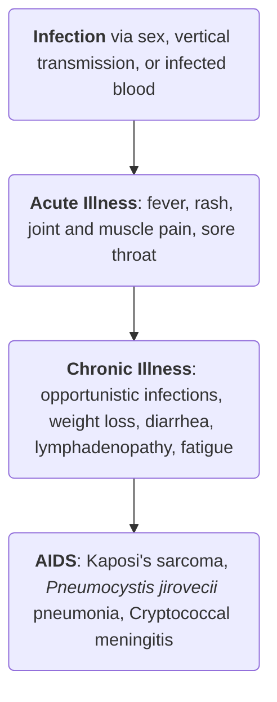

---
tags:
  - CD
title: "Chapter 06: Sexually Transmitted Infections"
date: 2024-10-28
draft: true
description: Sexually transmitted infections (STIs) are also called sexually transmitted diseases, or STDs. These infections are predominantly transfmitted by sexual contaact, including vaginal, anal, and oral sex. Some are contracted through non-sexual means such as through blood or blood products.
---
**Sexually transmitted infections** (STIs) are also called **sexually transmitted diseases**, or STDs. These infections are predominantly transmitted by sexual contact, including vaginal, anal, and oral sex. Some are contracted through non-sexual means such as through blood, blood products, sharing needles, and breastfeeding. Many STIs including chlamydia, gonorrhea, hepatitis B, HIV, and syphilis, can also pass from mother to child during pregnancy and childbirth. These diseases have a profound impact on sexual and reproductive health worldwide. Over 30 pathogens are transmitted through sexual contact, and **eight** in particular are linked to the greatest incidence of STIs. Of the eight, **four are curable**:
1. **Syphilis**
2. **Gonorrhea**
3. **Chlamydia**
4. **Trichomoniasis**

 and the remaining four may be considered "*incurable*"; only modifiable or reducible.
 1. **Hepatitis B**
 2. **Herpes Simplex Type B Virus** (HSV; Herpes)
 3. **Human Immunodeficiency Virus** (HIV)
 4. **Human Papillomavirus** (HPV)
>[!WARNING] Stigma surrounds these sexually transmitted diseases, and they pose a threat to emotional relationships. Individuals with STDs may be hesitant to seek health care assistance.

___
# Acquired Immunodeficiency Syndrome
**Acquired Immunodeficiency Syndrome**, commonly referred to as AIDS, is the *clinical manifestation* of **human immunodeficiency virus** (HIV) infection. This gives way to secondary, opportunistic infections which may eventually lead to death. Individuals with AIDS present as (a) very infectious, (b) very ill, and (c) prone to aggressive opportunistic diseases.
1. **Etiologic Agent**: the **human immunodeficiency virus** is a retrovirus (*Lentivirus* genus, literally meaning slow) that slowly destroys the immune system, producing immune deficiency.
2. **Mode of Transmission**: (a) **sexual intercourse**, (b) **vertical** (perinatal, lactational, transplacental) **transmission**, and (c) **blood transfusion** through sharing infected syringes and needles
>[!ERROR] Infected Blood
>Contaminated blood can be direct or through a blood transfusion. To prevent this, all blood products are screened for any viral or bacterial contamination before use (CDC, 2019). Cases of infected blood can be found in:
>1. Blood transfusion
>2. Sharing unsterilized syringes and needles
>3. Organ donation
>4. Accidental exposure to blood/blood products in hospitals or clinics

3. **Pathophysiology**: 

## Stages of HIV Infection
1. **Primary Infection**: acute stage; the earliest stage that develops within two to four weeks after infection.
	- **Flu-like symptoms** (fever, headache, rash) as the virus disseminates throughout the body.
	- **High levels of HIV in the blood** greatly increases the risk of transmission. CD4 cells are attacked and destroyed.
	- **Lymphadenopathy**, and **muscle ache** appear by the third week.
	- **Symptoms abate** as the immune system begins to gain control over the virus.
2. **Asymptomatic HIV Infection**: clinical latency. HIV continues to replicate, but only in low levels. These people can spread HIV, even without HIV-related symptoms. Without treatment, chronic HIV infection advances to AIDS in ~10 or more years, though it may advance faster in some people.
3. **Acquired Immunodeficiency Syndrome** (AIDS) is the final and most severe stage of HIV infection. The body is unable to fight off opportunistic infections as the immune system is severely compromised. The specific damage done is to the **CD4**, reaching levels of less than 200 cells/mm3.
	- Once AIDS is diagnosed, people often have around three years of life expectancy.
## Clinical Manifestations
