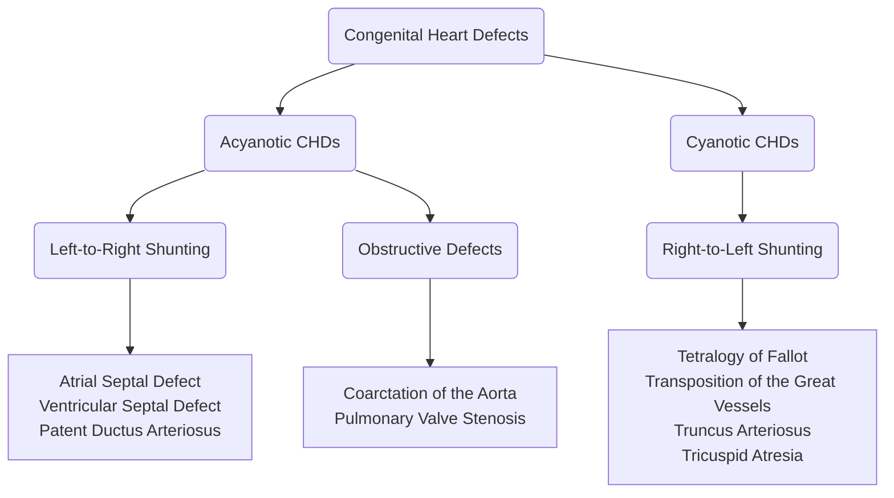

---
tags:
  - CMPA
  - A219
title: Pathologic Pediatrics
description: A discussion on the abnormalities found with the structure of a newborn's heart from persisting fetal circulatory structures (foramen ovale, ductus arteriosus) or defects with the formation of the heart.
date: 2024-11-21
---
This will be a collection of various topics that involve abnormalities in children from neonates to adolescents. Currently, this page covers:
1. [[A219/CHD|Congenital Heart Defects]] (Sir Vasquez, 11/21/2024)
2. [[#Acquired Heart Disorders]] (Prof. Melanie Cambel, 04/19/2024)
___
# Congenital Heart Defects
The main cause of CHDs is **unknown**. However, infants can be predisposed to CHDs in **alcoholism**, **maternal malnutrition**, **rubella**, **teratogenesis** (drugs, radiation), **advanced maternal age**, and **family history of CHD**s.

>[!WARNING] Rubella
>German measles is **highly teratogenic**, especially during the first trimester. Even a simple **exposure** is enough to cause damage, even if the mother does not experience any symptoms.
## Diagnostic Examination
1. History, Physical Examination
2. Chest X-ray
3. ECG
4. CBC, ABG
5. Angiogram
6. 2D Echo (Ultrasound of the heart)
7. Cardiac Catheterization
## Fetal Circulation
As a review, there are two external and three internal parts of fetal circulation that allows the fetus to oxygenate in-utero. These are the **placenta**, **umbilical cord**, **ductus arteriosus**, **ductus venosus**, and **foramen ovale**.
1. **Oxygenated blood from the placenta** is sent through the **umbilical vein** through the **ductus venosus** and directly into the **inferior vena cava**. This bypasses the normal adult circulation through the liver. A minute amount of blood is still passed through the liver for nourishment. The **inferior vena cava** (oxygenated) and **superior vena cava** (deoxygenated) deposit blood into the **right atrium**.
	- Blood coming in from the **inferior vena cava** will mostly pass through the **foramen ovale** into the **left atrium**, as it closes the superior vena cava and tricuspid valve. From the left atrium, blood is pumped to the **left ventricle** and through the **aorta**, which nourishes the brain.
	- Blood coming in from the **superior vena cava** will mostly pass through the **tricuspid valve** into the **right ventricle**, through the **pulmonary artery**, through the **ductus arteriosus**, and **to the descending aorta**.
2. **Deoxygenated blood** is sent back to the placenta through the **umbilical arteries** from two arteries past the bifurcation of the descending aorta.
3. The **ductus** ("ducts"; temporary connections between two vessels) shunts blood in fetal circulation. There are **three shunts** in a fetus:
	1. **Ductus venosus**: connects the umbilical vein and inferior vena cava, bypassing the immature liver.
	2. **Ductus arteriosus**: connects the pulmonary artery and aorta, allowing blood to shunt from right-to-left.
	3. **Foramen ovale**: connects the two atria, allowing blood to shunt left-to-right, bypassing the lungs.
4. **After clamping and cutting and at delivery**, fetal circulation begins to adapt and become alike to adult circulation.
	- The **umbilical vessels** (arteries and vein) will **shrink and close**.
	- The baby's **lungs expand**, which begin to receive more blood. This blood returns to the left atrium of the heart, increasing left-side pressure (and decreasing right-side pressure), and **closing the flap of the foramen ovale**. This occurs within 12 hours.
	- Decreasing **prostaglandin** will also result in the **closure of the ductus arteriosus** as **oxygen concentration increases, constricting the duct**. This occurs within 24 hours.
	- The **longest waiting time is 48 hours** for the foramen ovale and ductus arteriosus to close before pathology is suspected. In assessment, **these manifest as murmurs**.

![[cardiovascular-system_fetal-circulation.png]]

>[!TIP] Tip
>Absolutely do memorize the normal pathway of blood through the body and the heart. Visualization of how blood moves across each chamber and major vessel in each defect is very important in understanding the nature of the congenital heart defects:
>1. IVC, SVC, and Coronary Vessels deposit blood into the Right Atrium
>2. Right Atrium, Tricuspid Valve, Right Ventricle
>3. Right Ventricle, Pulmonary Valve, Pulmonary Artery, Lungs
>4. Lungs, Pulmonary Veins, Left Atrium
>5. Left Atrium, Mitral/Bicuspid Valve, Left Ventricle
>6. Left Ventricle, Aortic Valve, Aorta

>[!TIP] Diagrams
>I still don't like how much space images take, so I've merged them all into one image.
>![[congenital-heart-defects.png]]

## Acyanotic CHDs
Heart defects that **do not produce cyanosis**. These may be due to **obstructive lesions** such as stenoses and coarctation, or due to **left-to-right shunting**. These send oxygenated blood back into pulmonary circulation, which means no significant deoxygenation occurs.
### Valvular Stenosis
**Valvular Stenosis** (obstructive): restriction/narrowing of the pulmonary or aortic valve, limiting blood flow. This reduces cardiac output, but does not send deoxygenated blood into systemic circulation.
- Restricted blood flow will result in **ventricular hypertrophy**. Right-sided if pulmonic, and left-sided if aortic.
- **Pulmonary Valve Stenosis** will cause a backup of blood back into the right atrium and inferior vena cava. This is a form of **right-sided congestive heart failure**.
- **Aortic Valve Stenosis** will cause a backup of blood back into the left atrium and pulmonary circulation. This is a form of **left-sided congestive heart failure**.
- Correction will require **valvuloplasty** or **valve replacement**.
### Coarctation of the Aorta
**Coarctation of the Aorta** (obstructive): the descending aorta is narrow, limiting blood flow to the lower extremities. The primary presenting manifestation of this disorder is **hypertension of the upper extremities**, and hypotension of the lower extremities. Pulse, temperature, and color also differ between the upper and lower extremities.
- **Resection and end-to-end anastomosis** is used to remove the section of the aorta that is narrowed. A bypass is used while the aorta is being repaired.
- **Constipation** must be avoided to prevent straining, to avoid damage to the suture.
### Patent Ductus Arteriosus
**Patent Ductus Arteriosus** (LTR shunt): a duct connecting the aorta and pulmonary artery allows oxygenated blood to enter pulmonic circulation. This normally closes within 24 hours as prostaglandin levels go down, but may remain open. **Indomethacin** can be given to stimulate the closure of the duct, and **prostaglandin** may be used to keep it open. If ineffective, **surgery**: **ligation and cauterization** may be used.
- The murmur produced by a PDA is a **machinery-like murmur**.
### Atrial Septal Defect
**Atrial Septal Defect**  (LTR shunt): the septal wall of the atria is open, allowing blood to flow from the left atrium to the right atrium. Oxygenated blood pumps back into the lungs, increasing pulmonary flow. Congestion of the right atrium may also result in right-sided CHF.
- A **Dacron/Telfon Septal Patch** is placed via open heart surgery to correct the defect.
### Ventricular Septal Defect
**Ventricular Septal Defect** (LTR shunt): the septal wall of the ventricles is open, allowing blood to flow from the left ventricle to the right ventricle. This is the most common congenital heart defect. Oxygenated blood is pumped back into the lungs, increasing pulmonary flow. Congestion of the right ventricle may also result in right-sided ventricular hypertrophy.
- In compensating for the congestion, the right ventricle may overpower the left ventricle, and **reverse the shunt from LTR to RTL**.
- The murmur produced by a VSD is an **abnormally loud murmur**.
- A **Dacron/Teflon Septal Patch** is placed via open heart surgery to correct the defect.

>[!ERROR] Combination!
>**Atrioventriculocanal Defect** (LTR shunt): the presence of both atrial and ventricular septal defects, combined into one large opening, or two separate openings. This further increases right-sided congestion. **Patching** is still the method for correction.

## Cyanotic CHDs
The only type of CHDs that appear **cyanotic** are those with **right-to-left shunting** where deoxygenated blood flows into systemic circulation and pulmonary circulation is decreased. (These all start with `T`)
### Tetralogy of Fallot
**Tetralogy of Fallot** (TOF): a combination of **four defects** (mn. **PROVe**) that appears as the most common cyanotic heart defect:
1. **Pulmonary Valve Stenosis** restricts pulmonary blood flow.
2. **Right Ventricular Hypertrophy** is caused by the ventricular septal defect and pulmonary stenosis. This increases the contractility of the right ventricle, which may reverse flow to right-to-left shunting as it overpowers the left ventricle, accessing the aorta. This creates the **==boot-shaped heart==** observed during a 2D ECHO.
3. The **Overriding of the aorta** is where the aorta is set between the articles and as such is accessible by both the left and right ventricle; it receives blood from both ventricles.
4. A **Ventricular Septal Defect** allows for blood to flow from the right ventricle into the aorta.

**Pathophysiology**: hypoxia results in tachycardia, tachypnea, polycythemia (hemoconcentration, increased coagulability), small-for-gestational-age, and prematurity.
- Failure to oxygenate properly will impair feeding. The infant will instinctively attempt to breathe when feeding, and this may result in **aspiration**. Keep the infant upright during feedings.
- **CHDs generally increase the risk for infection**: **Pneumonia**, **otitis media**, and **infective endocarditis** are common complications, particularly from *S. aureus* and GAHBS.

**Management**: the presence of chronic hypoxia will result in **clubbing**, and **crying or feeding may result in a Tet. spell**, a hypercyanotic or "choking" spell/state. The **==Squatting/Knee-chest Position==** will improve oxygenation, and may be observed or used after exertion.
- The **formula** used for feeding the infant will be **Lonalac**, a **low-sodium formula** to reduce fluid retention (edema) from congestive heart failure secondary to TOF.
- **To prevent developmental delays, allow the child to moderate their activities and exertion** after educating both the child and parents in how to manage cyanotic spells.

**Treatment**:
- Palliative care uses a **Blalock-Taussig Shunt**. This procedure connects the two subclavian arteries to the two pulmonary arteries to increase pulmonary blood flow and oxygenation.
- **Pharmacologic**: an **inotrope**, Digitalis (Lanoxin), is used to improve heart contractility in congestive heart failure. Always check for bradycardia (<100 in infants) before administration as inotropes have a negative chronotropic (lowers heart rate) effect.
- **Correction**: relieving pulmonary stenosis through valvuloplasty or valve replacement, the overriding of the aorta, then the ventricular septal defect. These procedures are done with three open heart surgeries done in stages.
### Transposition of the Great Vessels
**Transposition of the Great Arteries/Vessels**: **swapping** of the connections of the pulmonary artery and aorta. This shuts off pulmonary circulation from systemic circulation as the right ventricle sends blood into systemic circulation and the left ventricle sends blood into the lungs. Survival rates for TOGV are very poor.
- The only way a newborn can survive with this defect is with the presence of a shunt that allows blood to mix. This may be a **foramen ovale**, a **patent ductus arteriosus**, or a **ventricular septal defect**.
- This defect is visible in a **3D ECHO**.
- **Treatment**:
	- **Palliative**: **Prostaglandin** is used to **keep the ductus arteriosus open** and the **Rashkind procedure** is used to **create an atrial septal opening**.
	- **Corrective**: the **Mustard procedure** is used to redirect blood flow. The atrial septal opening is also closed.
### Truncus Arteriosus
**Truncus Arteriosus**: the aorta and pulmonary artery fail to separate, and create one large vessel that takes in blood from both the left and right ventricles through a large ventricular septal defect.
- **Treatment**: **Complete cardiac repair**: division of the conjoined pulmonary artery and aorta, and closure of the large ventricular septal defect.
### Tricuspid Atresia
**Tricuspid Atresia**: failure of the tricuspid valve to form. This isolates the right ventricle from the right atrium. The only method by which a newborn is able to survive with this defect is with the presence of the **foramen ovale or an atrial septal defect** and a **ventricular septal defect**, allowing the blood to move from the right atrium to the left atrium, to the left ventricle, then into the right ventricle to send blood into the lungs.
- **Palliative Treatment**: **Blalock-Taussig Shunt** (see Tetralogy of Fallot) and a **Waterston Shunt**, an anastomosis of the ascending aorta and right pulmonary artery to increase pulmonary blood flow.
- **Corrective Treatment**: the **Fontan Procedure** that consists of (1) placement of a conduit with a **valve between the right atrium and pulmonary artery**, (2) **closure of the ASD**, and (3) **ligation just above the pulmonary valve** of the main pulmonary artery, as this is no longer the entry point used. The VSD may also be closed.
## Summary

| Congenital Heart Defect                | Description                                                                                                                             | Treatment                                                                        |
| -------------------------------------- | --------------------------------------------------------------------------------------------------------------------------------------- | -------------------------------------------------------------------------------- |
| **Patent Ductus Arteriosus**           | The ductus arteriosus fails to close within 48 hours (normally 12 hours)                                                                | Indomethacin or Ligation if ineffective                                          |
| **Atrial Septal Defect**               | An opening between the atria                                                                                                            | Patching                                                                         |
| **Ventricular Septal Defect**          | An opening between the ventricles                                                                                                       | Patching                                                                         |
| **Atrioventriculocanal Defect**        | A combination of ASD and VSD                                                                                                            | Patching                                                                         |
| **Pulmonary Valve Stenosis**           | Narrowing of the pulmonary valve                                                                                                        | Valvuloplasty/Valve Replacement                                                  |
| **Aortic Valve Stenosis**              | Narrowing of the aortic valve                                                                                                           | Valvuloplasty/Valve Replacement                                                  |
| **Coarctation of the Aorta**           | Narrowing of the aorta                                                                                                                  | Resection and end-to-end anastomosis, balloon angioplasty                        |
| **Tetralogy of Fallot**                | Pulmonary valve stenosis, right-sided ventricular hypertrophy, overriding of the aorta, and a ventricular septal defect                 | Blalock-Taussig; Correction of stenosis, then overriding, then the septal defect |
| **Transposition of the Great Vessels** | Swapping of the pulmonary artery and aorta, separating pulmonic circulation from systemic circulation                                   | Prostaglandin, Rashkind Mustard                                               |
| **Truncus Arteriosus**                 | Conjoining of the pulmonary artery and aorta with a large ventricular septal defect                                                     | Complete cardiac repair                                                          |
| **Tricuspid Atresia**                  | Failure of the tricuspid valve to form or open, requiring an atrial septal defect and ventricular septal defect to maintain circulation | Blalock-Taussig, Waterston Fontan                                             |
___
# Acquired Heart Disorders
## Congestive Heart Failure
1. **Impaired Myocardial Function**: tachycardia, fatigue, weakness, restlessness, pale, cool extremities, hypotension, decreased urine output (renal perfusion)
2. **Pulmonary Congestion**: tachypnea, dyspnea, respiratory distress, exercise intolerance, cyanosis, wheezing
3. **Systemic Venous Congestion**
	1. **Peripheral and Periorbital Edema**: weight gain, ascites, hepatomegaly, neck vein distention

Quite directly, the main goal of therapy is to **improve cardiac function**. This is achieved with:
1. **Digoxin Therapy** (Digitalis) increases cardiac output by improving contractility (positive inotropic effect). In children, **Lanoxin** is the type of digoxin used, given orally or intravenously with a loading dose and maintenance dose twice a day.
2. **ACE Inhibitors** (Capoten/Enalapril): inhibition of the RAAS mechanism of the kidney by blocking the conversion of angiotensin I to angiotensin II. This mechanism naturally increases fluid volume when it detects hypotension, but this only causes further problems when in heart failure.
3. **Diuretics** for the removal of excess fluid and sodium from the body. This is a mainstay of treatment of CHF.
4. **Ferrous supplementation** and **blood transfusion** is used in cases of anemia.
5. **Respiratory infection** can occur and worsen hypoxemia. Pulmonary hygiene, CPT, antibiotics, and oxygen therapy are all methods for prevention or intervention.
## Rheumatic Fever
An **autoimmune disease** involving the heart, CNS, joints, subcutaneous tissue, and the skin triggered by **Group A Beta-Hemolytic Streptococcus** (GABHS).
- Risk Factors: **children with dental caries** (adhere to a check-up once every 6 months), those who have had **recent or recurrent strep throat**, and those who are **immunocompromised**.
### JONES Criteria
For a diagnosis of **rheumatic fever**, the child must present with **two major manifestations** or with **one major and two minor manifestations**. This is a clinical diagnosis concerning the following signs and symptoms:
1. **Major**: carditis, chorea, polyarthritis, subcutaneous nodules, and erythema marginatum.
3. **Minor**: fever, history of streptococcal infection (ask for history of sore/strep throat), elevated laboratory findings (anti-streptolysin O titer \[ASOT]), and arthralgia (joint pain).

>[!EXAMPLE] Laboratory Findings
>- **ASOT** Lab Findings:
>	- 150 to 250: Normal
>	- \>250 to <500: Dormant RF
>	- \>500 to <5000:  Active RF
>	- \>5000: Rheumatic Heart Disease
>- **ESR**, increased during hyperemia.
>- **CRP**, produced by the liver in response to inflammation and tissue damage. This is used to determine both the presence of inflammation and **response to treatment**.
### Pathophysiology
1. Spread of GABHS to the pulmonary system, through pulmonary circulation, to the **mitral valve** (proliferation) of the heart results in the major manifestations:
	- **Carditis**
	- **CNS Chorea**
	- **Polyarthritis**: inflammation
	- **Subcutaneous Nodules**
	- **Erythematous Marginatum**
2. **Mitral Valve Stenosis**: damage to the mitral valve from GAHBS. Left ventricular hypertrophy occurs for compensation. This backs up to the left atrium and pulmonary circulation, resulting in LSCHF. Crackles and moist coughing occurs from pulmonary edema.
	- **Lanoxin** (Digitalis) increases heart contraction, while decreasing heart rate. This results in bradycardia. **Do not administer Lanoxin if heart rate is experiencing bradycardia**. Decreased cerebral perfusion alters LOC.
### Nursing Management
1. **Fever**, **Pain** (polyarthritis), **Inflammation**, **Thrombotic Formation**
	- **Aspirin** fulfills all of these problems within a child (antipyretic, analgesic, antiinflammatory effect, thrombolytic effect). The main purpose is for its antiinflammatory effect on polyarthritis.
2. **Diet**: high calorie, high fiber, low sodium, and soft diet. If polyarthritis affects the temporomandibular joint, NGT/OF may be required.
3. **Polyarthritis**: pain may be produced even by thin linens. A **bed cradle is created and formed as a tent**, to maintain thermoregulation without placing weight on the patient directly.
	- Fractured TSB may be required to reduce discomfort. Avoid the joints, and only pat the patient. Place a moist towel on the forehead, torso, and axillary areas.
### Treatment
**Penicillin** is the drug of choice, combined with erythromycin and benzanthin penicillin.
2. **Oral**: Erythromycin with Penicillin
3. **Monthly injection of 1 gram benzathine penicillin** (twice a month, 500 mg per dose).

>[!TIP] PARAFI
>The **PARAFI** mnemonic denotes the interventions for a child with rheumatic fever:
>1. **Pain Control**
>2. **Antibiotics** for an active infection by GABHS
>3. **Rest**
>4. **Aspirin** as an antiinflammatory and as an antithrombotic
>5. **Follow-up Care** is necessary to detect progression or complication of the disease.
>6. **Infection**, specifically **respiratory infection** is prevented and immediately managed to prevent flareups of rheumatic fever.

## Kawasaki Disease
A **mucocutaneous lymph node syndrome** that causes **acute systemic vasculitis**. This occurs most commonly in children below 5 years old, peaking in toddlerhood. Its cause is unknown.
1. **Signs and Symptoms**: (mn. **CRASH**) **conjunctivitis** (pink eye), **rash**, **arthritis**, **strawberry tongue**, and **hands** (desquamation, late sign).
	- An early manifestation and **hallmark** of Kawasaki disease is **irritability** (lasts for ~2 weeks), followed by a fever, then the CRASH manifestations.
2. **Diagnostic Evaluation**: there is no diagnosis for Kawasaki disease. The diagnosis is made based on clinical presentation.
3. **Most serious complication**: **coronary artery aneurysm**
### Treatment
