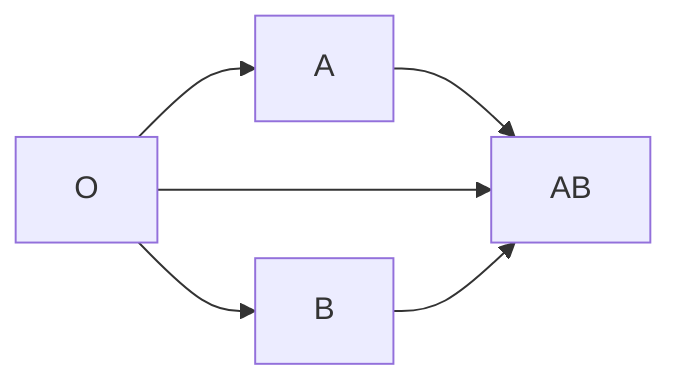

---
tags:
  - CMPA
  - A113
title: Fundamentals of Nursing (Notario)
date: 2024-11-24
description: A compilation of Madame Toni M. Notario's lectures on Bowel Elimination and Infusion Procedures (06/23/2024), Medication Administration (10/13/2024) and Oxygenation (11/24/2024).
---
(c) **Madame Toni**
1. **Bowel Elimination** (06/23/2024)
2. **Infusion Procedures** (06/23/2024)
3. **Medication Administration** (10/13/2024)
4. **Concept of Oxygenation** (11/24/2024)
___
# Medication Administration
The administration of medication is a **dependent nursing action**. Doctor's orders are required for any medications given.
>[!IMPORTANT] Fundamental Rule: **never administer an unfamiliar medication**.

## Rights of Medication
The first six rights of medication listed are most important, but otherwise not in any particular order:
1. **Right Patient**: identify the patient with at least two identifiers. For this specific right, take into consideration that there are two categories of patients: conscious and unconscious.
	- **Conscious**: alert, coherent, and aware patients. For these clients, you may **ask the client to state their name**
	- **Unconscious**: comatose. For these clients, you may **check the ID bracelet/band/label**
2. **Right Drug**: there are four elements in checking the validity of the drug being given:
	- **Expiration**: check the date of expiration of the medication.
	- **Color**: changes in color can indicate errors or invalidity.
	- **Spelling**: in written prescriptions, the spelling of medication names should be double-checked. Some drugs can go as far as to differ by one syllable.
	- **Label**: checked thrice; once when receiving the order, second when opening or dispensing, and third when administering the medication.
3. **Right Dose**: **double-checking** is always imperative for giving drugs. No excess or deficit against the prescribed amount should be administered. This is done especially for (a) **multiple drugs**, (b) **sudden changes of orders**, (c) **available stock dose does not match order**. The relevant formulae used for calculating the required dose includes:
	- **Pediatric Doses**:
		- **Clark's Rule**: `Weight (pounds) / 150 * Adult Dose`
		- **Fried's Rule** (12 months and below): `Age (months) / 150 * Adult Dose`
		- **Young's Rule**: `Age (years) / (Age (years) + 12) * Adult Dose`
	- **Adult Doses**: `Dose / Stock * Quantity`
	- **IV Calculation**: `Total Volume / Hrs. to Infuse * Drop Factor / 60 Minutes` DF may be defined as macro (20) or micro (60).
4. **Right Frequency**: the usage of correct intervals between dosages. This is written on the order, with standardized abbreviations. Depending on the institution, the timings of non-specific frequencies can vary.

| Notation         | Meaning                                   | Example (depending on institution) |
| ---------------- | ----------------------------------------- | ---------------------------------- |
| od               | Once a day                                | 8 AM                               |
| bid              | Twice a day                               | 8 AM, 6 PM                         |
| tid              | Three times a day                         | 8 AM, 1 PM, 6 PM                   |
| qid              | Four times a day                          | 8 AM, 12 NN, 4 PM, 8 PM            |
| hs               | Hours of sleep; at bed-time               | 9 PM                               |
| q                | "Every", as in "Every four hours" for q4. | Done around the clock              |
| qod              | Every other day                           |                                    |
| qh               | Every hour                                |                                    |
| ac               | Before meals                              |                                    |
| pc, postprandial | After meals                               |                                    |
| prn              | As necessary                              |                                    |
| stat             | Now; Immediately                          |                                    |
| c̄               | c̄ stands for *cum*, as in "with".        | "c̄ pillow" → "with pillow"        |
| s̄               | s̄ stands for *sine*, as in "without".    | "s̄ pillow" → "without pillow"     |
5. **Right Route**: the administration of drugs through the correct medium and passageway

| Notation          | Meaning                                                                                                                                                                                                                                   |
| ----------------- | ----------------------------------------------------------------------------------------------------------------------------------------------------------------------------------------------------------------------------------------- |
| per orem (p.o.)   | Mouth; the safest route.                                                                                                                                                                                                                  |
| otic              | Ears                                                                                                                                                                                                                                      |
| optic             | Eyes                                                                                                                                                                                                                                      |
| os                | Left eye                                                                                                                                                                                                                                  |
| od                | Right eye                                                                                                                                                                                                                                 |
| parenteral        | Syringe-based administration. An invasive procedure that can be classified as ID, SC, IM, or IV. Because of its nature, it is considered as the most dangerous and the fastest method of administration. Apply **universal precautions**. |
| ID                | Intradermal                                                                                                                                                                                                                               |
| SQ/SC             | Subcutaneous                                                                                                                                                                                                                              |
| IM                | Intramuscular                                                                                                                                                                                                                             |
| IV                | Intravenous                                                                                                                                                                                                                               |
| inhalation (i.h.) | Inhaled                                                                                                                                                                                                                                   |
| synovial          | Joints                                                                                                                                                                                                                                    |
| Intrathecal       | Spinal canal                                                                                                                                                                                                                              |
| Topical           | Absorption through the skin (or eyes and ears)                                                                                                                                                                                            |
| Suppository       | Medications instilled rectally or vaginally. Easily expelled.                                                                                                                                                                             |
6. **Right Documentation**: correct recording of medications given immediately after administration. Requisite documentation characteristics include comprehensiveness, brevity, and legibility.
	- Done **after the procedure**
	- Free of **erasures**; use strike-through for errors and append initials and a signature.
	- Free of **superimposition**
	- No blank spaces
	- Utilizes universal abbreviation
7. **Right Client Education**
8. **Right Assessment**
9. **Right Evaluation**
10. **Right to Refuse**
>[!DRUG] Medication Order (MO) vs. Telephone Order (TO).
>A **medication order** contains the name of the patient, the name of the drug, its dose, frequency, and route; the first five rights listed, along with the signature of the prescribing physician. All elements must be present for the validity of a prescription.
>
>A **telephone order** can provide the statement of the previously stated elements, except for the presence of a **signature**.
>- However, the prescribing physician should **countersign the order** based on institutional policies, within 24 hours, or by the next shift.
>- It may also be accepted for **emergency cases**.
>- Additionally, a **registered nurse** must be present to serve as a witness and for verification of the drug. Any unclear info provided should be inquired upon, such as the spelling of an uncommon drug.
## Parenteral Administration
Syringe-based administration. An invasive procedure that can be classified as ID, SC, IM, or IV. Because of its nature, it is considered as the most dangerous and the fastest method of administration. Apply **universal precautions**.
>[!ERROR] Universal Precaution
>1. **Handwashing**. Standard duration is 20 seconds, but cleaning of contaminated skin must be at least 60 seconds with increased friction. Handrubs are also now accepted, as long as the solution used is 70% or greater.
>2. **Never recap needles after use**. They are disposed of immediately, or at least should be recapped with the fishing technique.
>3. **Dispose sharps in a sharps container**.

| Parameter | Intradermal | Subcutaneous | Intramuscular                    |
| --------- | ----------- | ------------ | -------------------------------- |
| **Length**    | 3/8 – 5/8"  | 5/8 – 1/2"   | 1/2 – 1 1/2"                     |
| **Gauge**     | 26 – 27     | 25 – 26      | Child: 24 – 25 Adult: 23 – 24 |
| **Angle**     | 10° – 15°   | 45°          | 90°                              |

Administration through parenteral means, given its potential risks, should following these principles:
1. **ID**: **Bevel Up**. The bevel of the needle should be facing up, away from the skin. This facilitates the formation of a **wheal** or **bleb**. **No red ink** when marking the site. No massaging.
4. **SC**: **Rotate the site of injection**. This is to prevent lipodystrophy or lipoatrophy. This is the breakdown of subcutaneous fat from repeated administration. The interval between site is at least four weeks.
5. **IM**: **Aspirate** to check if a blood vessel has been punctured, before releasing the medication.
___
# Oxygenation
**Oxygen therapy** is used to **reverse hypoxia**, **hypoxemia**, or **anoxia**; to increase oxygen levels in tissues/cells. Importantly, the following are considered:
1. **Positioning**: the patient is placed on a **High Fowler's**/sitting/elevated head of bed/high back rest position to enhance lung expansion, improving the reception of oxygen. This position is used in patients experiencing **DOB**, **SOB**, or **Orthopnea** (alternatively, the orthopneic position)
>[!TIP] In pregnancy
>The position of comfort in pregnancy is a **left-side lying position**. This is a common answer in any question related to positioning a pregnant client.

2. **Precautions/Contraindications**: oxygen is one of the main elements of the fire triad. As such, **alcohol**, **oil**, **smoking**, and other potentially **flammable** and volatile materials or activities are prohibited.
	- An important nursing action is to **place a No Smoking sign** near the bed, tank, or door of the room. This must be placed in prominent places of the room.
	- Additionally, **cotton clothing** is used because other fabrics (nylon, synthetic, cashmere, etc.) can generate **static friction**, which is another potential source of fire.
	- In **pediatric wards**, **battery-operated toys** are also contraindicated.
3. **Diet**: **small frequent meals** (preferred for nasal cannula) or **NPO** (preferred for face mask). These are used to **decrease oxygen demand** by reducing metabolic activity.
4. **Devices Used in Oxygenation**: oxygenation can be assessed with:
	1. **Pulse Oximetry** (SpO₂): a device that measures oxygen saturation. This is a transcutaneous measurement. Ensure avoidance of erroneous results— **reduce light exposure** of the area being used for oximetry. In order of preference, this can be used on the finger, the toes, earlobe, forehead, and nose bridge.
	2. **Incentive Spirometer**: a pulmonary rehabilitation tool used to **increase alveolar expansion** and train inspiratory muscles.
	3. **Humidifier**: increases moisture of delivered air to prevent drying.
## Delivery Systems
1. **Low Flow**: entry level oxygenation, potentially even usable as an independent nursing intervention in emergencies. This uses a nasal cannula or face masks (simple, partial rebreather, non-rebreather).

>[!WARNING] Refractory Hypoxia in COPD/CAL (Chronic Airflow Limitation)
>The use of high flow oxygen is **not done for patients with COPD**. The flow used is **only 2–3 L/min**. These patients do not require the SpO₂ of a normal individual. Their breathing reflex may mainly depend on oxygen levels rather than carbon dioxide levels; a high oxygen flow can deplete this **hypoxic drive**, inhibiting the patient's breathing.

2. **High Flow**: venturi mask; additionally with the use of CPAP, CPEP, and BiPAP

| Delivery                         | Rate        |
| -------------------------------- | ----------- |
| **Nasal Cannula**                | 2–6 L/min   |
| **Face Mask**                    | 4–8 L/min   |
| **Partial Rebreather Face Mask** | 8–12 L/min  |
| **Non-Rebreather Face Mask**     | 10–15 L/min |
| **Venturi Mask** (high flow)     | -           |
## Wall-Outlet Supplemental Therapy

| Color             | Content                      |
| ----------------- | ---------------------------- |
| **Green Outlet**  | Oxygen                       |
| **Blue Outlet**   | Nitrous Oxide (Laughing Gas) |
| **Yellow Outlet** | Medical Air; Compressed Air  |
| **White Outlet**  | Suction/Vacuum               |

![[equipment_medical-gas-outlets.png]]

## Suctioning
**Suctioning** is used to **remove pulmonary secretions** to improve gas exchange. A primary consideration is to **==prevent hypoxia==**. It utilizes a **sterile technique** as the nurse maneuvers a suction catheter into the airways to remove any buildup of secretions.

| Age Group  | Catheter Size | Portable Suction Pressure | Wall-Type Suction Pressure                     |
| ---------- | ------------- | ---------------------------- | ------------------------------------------------- |
| **Adult**  | Fr. 12 – 18   | 10 – 15 mm Hg                | 100 – 120 mm Hg (for thick, tenacious secretions) |
| **Child**  | Fr. 8 – 10    | 5 – 10 mm Hg                 | 95 – 110 mm Hg                                    |
| **Infant** | Fr. 5 – 8     | 3 – 5 mm Hg                  | 50 – 95 mm Hg                                     |

The application of suction is done while the patient is in a **semi-fowlers** if conscious and **side-lying** if unconscious position. **Prior to and after every period of suctioning, the patient is hyperoxygenated to prevent hypoxia**. While maintaining sterile technique with the hand manipulating the suction catheter, **suction is intermittently applied during withdrawal** as to **avoid damaging tissue** (trauma). In general, the shorter the period of suctioning, the less hypoxia occurs. If asked in the board exam, the best duration is 5 seconds.

|                             | Oral         | Nasal        | Tracheal (stoma)   |
| ----------------------- | ------------ | ------------ | ------------------ |
| **Suction Duration**        | 10 – 15 sec. | 10 – 15 sec. | 5 – 10 sec.        |
| **Rest Period**             | 20 – 30 sec. | 20 – 30 sec. | 2 – 3 min.         |
| **Length of Tip Insertion** | 3 – 5 in.    | 3 – 5 in.    | 2 – 3 in.          |
| **Lubricant Used**          | Clean Water  | KY Jelly     | NSS; Sterile Water |
- The length of tip insertion is often based on **anatomical landmarks**: **from the tip of the nose to the earlobe**.
## Chest Physiotherapy
A series of techniques applied to facilitate the removal of secretions from the airways.
1. **Precautions**:
	- CPT is done **before meals** to prevent aspiration. If not possible, wait 2 to 3 hours after meals before proceeding.
	- Percussion should not be done over **bony prominences** or **breast tissue**.
2. **Contraindications**: PTB, MI, Angina, other disorders of the lungs, trauma, etc.

CPT is composed of three main techniques:
1. **Percussion**: a rhythmic tapping of the back to mechanically dislodge secretions. The nurse performs tapotement on the back with cupped hands in such a way that a popping sound is produced.
2. **Vibration**: a fine, shaking motion applied during exhalation to move secretions.
3. **Postural Drainage**: the use of gravity to move secretions for easier expectoration. Depending on the auscultated areas where secretions are found, the posture used changes. They generally follow a contralateral approach:
	- **Apex of the lungs**: upright, leaning forward
	- **Base of the lungs**: modified Trendelenburg
	- **Right lung**: left-side lying
	- **Left lung**: right-side lying
___
# Bowel Elimination
## Colostomy
Handling the colostomy requires a **clean technique**.
%%The most common topic for Funda last board exam.%%
1. **Stoma**: the stoma of a colostomy is normally pinkish, moist, and shiny. If post-op, it is expected to also be blood-streaked, painful, and slightly edematous. Refer if persistent. A **bluish discoloration** points to cyanosis, **black discoloration** points to necrosis, and a **pale color** points to anemia.
2. **Contraindicated Foods**: follow a low-fiber diet for colostomies, and no-seed diet for ileostomy.
	- Avoid **gas-forming** foods to avoid abdominal distention.
		- **Cruciferous Vegetables**: Broccoli, Cauliflower, Cabbage, Lettuce, etc.
		- **Root Crops**: Sweet Potato, Carrots, Turnips, Radish
	- **Controlling Odor**: (mn. CYAM) Charcoal, Yogurt (best choice), A Green Leafy Vegetable, Milk
3. **Skin Protection**
	- **Karaya**, in the form of paste or powder placed around the stoma.
	- **Skin films** or **adhesive films** placed on the skin around the stoma.
4. There are no **activity restrictions** except for: **contact sports** and **heavy-weight lifting**.
5. **Double-Barreled Colostomy**: e.g. for Hirschsprung Disease (Aganglionic Megacolon). Placed across the transverse colon, with two stoma: **proximal** and **distal**. Proximal drainage contains feces, while distal drainage contains mucus.
## Enema
Primarily used for pre-colonoscopy or pre-operative stages. It is a procedure that requires clean technique.
1. **Cleansing Enema**, also known as "*Non-retention Enema*" is used to (1) stimulate peristalsis, (2) prepare for diagnostic (e.g. Colonoscopy) and surgical procedures (e.g. Hemorrhoidectomy). Example solutions used for this type include:
	- **Hypertonic Solutions**
	- **Isotonic Solutions**
	- **NSS + Soap Sud**, sometimes *Medicated* enema
	- **Fleet Enema**, commercially available enema
	- **Clean-water Enema** has been used, but is no longer used because of the high potential for electrolyte imbalance.
2. **Retention Enema**, also known as *Oil-based Enema*:
	- **Stool Lubrication**: Mineral oil; cotton seed oil. Olive oil may be used.
	- **Stimulate Peristalsis**: Castor oil
3. **Carminative Enema** used to expel flatus. This enema is composed of:
	- Magnesium sulfate (30 ml)
	- Glycerin (60 ml)
	- H2O (90 ml)
### Principles of Enema
1. **Positioning**: position the patient in a Sim's Left Lateral or Side-Lying position.
2. **Volume**: depends on the age of the patient, generally divided between:
	- **Adults**: 750 to 1000 mL
	- **Children**: 500 to 700 mL
	- **Infant**: 100 to 200 mL
3. **Temperature**: the solution must be warm (100 to 105F, maximum of 100F for children to prevent rectal discomfort).
4. **Length and Size of Rectal Tube**: also depends on age. Avoid rectal discomfort; never exceed limitations on length. Insertion requires KY (water-based) Jelly. Use a generous amount.
	- **Adults**: 3" to 4", Fr. 22-32
	- **Children**: 2" to 3", Fr. 14-18
	- **Infant**: 1" to 1.5", Fr. 12
5. **Types and Differences**:

| Characteristics | Non-Retention  |              Retention               |
| --------------- | :------------: | :----------------------------------: |
| Height          |      18"       |                 12"                  |
| Duration        | 10 to 15 mins. | 1 to 3 hours (based on manufacturer) |
6. **Complications**:
	- During transfusion, **cramps and pain may occur**. Stop the transfusion and notify the physician.
	- For children, avoid separation anxiety. Have a parent or caretaker stay with the child during transfusion.
___
# Infusion Procedures
## Blood Transfusion
Blood transfusions are sterile procedures.
1. **Information**: name of the patient, blood type, blood product, and cross-matching for any products with RBC.
2. **Blood Types**: A, B, AB (universal recipient), and O (universal donor).
3. **Blood Products**: whole blood and packed RBC has a maximum infusion time of 4 hours. Platelets clot easily, and is only infused for 30 minutes.
	- Whole Blood
	- Packed RBC
	- Platelets
4. **Gauge**: the best gauge is 18 (green). Maximum is 20 (pink)
5. **Solution**: the only adjust solution to blood is NSS.
6. **Reactions**: when any reactions occur, (a) stop the BT line, (b) then continue the NSS line. (c) Measure vital signs then refer to the physician.
	- **Allergic/Anaphylactic Reaction**: hives, rashes, urticaria, pruritus; Diphenhydramine or Benadryl are regularly used to counteract these manifestations.
	- **Febrile Reaction**: fever
	- **Hemolytic Reaction**: low back pain; flank pain
	- **Fluid Overload**: distended neck vein
	- **Cardiogenic Reaction**: difficulty of breathing
7. **Cross-Matching Technique**: O is the universal donor, while AB is the universal recipient. The following diagram shows the flowchart of who is able to donate to who; all blood types can donate to their own blood type. O receives from O; A receives from O and A; B receives from O and B; and AB receives from O, A, B, and AB.

## Total Parenteral Nutrition (TPN)
Also known as IV Hyperalimentation Feeding. This is used for cases like severe malnutrition and post-GI surgeries.
1. **Components**:
	- Carbohydrates (CHO): glucose makes up 60% to 70% of the bag.
	- Proteins (CHON): amino acids (amino acids are complete in egg whites)
	- Fats: lipids. Unsaturated fats are good; high-density lipoproteins. Examples include salmon, tuna, anchovies, avocado, sardines (not canned), catfish.
	- **Vitamins and Minerals**
		- Vitamin C helps with wound healing.
	- **Fluids** and **Electrolytes**
2. **Access Point**: (a) Subclavian Vein (safer; more common) and (b) Internal Jugular Vein
3. **Complications**:
	- **Hyperglycemia**, one of the early manifestations. Keep regular insulin by bedside as antidote.
	- **Infection** or **Sepsis**, usually appearing after 2 to 4 weeks. Treated with broad-spectrum antibiotics.
4. **Nursing Considerations**:
	- Vital Signs q4hr. The most important sign to watch out for is temperature (36.5C to 37.5C), as it indicates infection.
	- **Blood Glucose Monitoring** (BGM) q6hr. Normal values range from 80 to 120 mg/dL. For Filipinos, values range from 70 to 110 mg/dL.
	- Don't stop TPN abruptly; taper gradually to **prevent rebound hypoglycemia**.
	- Observe absolute sterile technique due to the risk of infection. Glucose is highly nourishing for bacteria.
	- Timeline: change solutions in 24 hours.