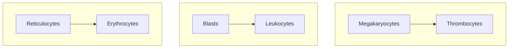

---
tags:
  - CMPA
  - MS
title: Medical-Surgical Nursing by Dr. Ferrer (Part 1)
description: A compilation of Dr. Ferrer's coverage of the first module for Medical-Surgical Nursing, covering cardiologic, respiratory, and hematologic disorders.
date: 2024-10-13
---
A compilation of **Dr. Ferrer**'s coverage of the first module for Medical-Surgical Nursing I, covering cardiologic, respiratory, and hematologic disorders. Individual notes on these subjects can be found here:
1. [[10-07-2024 MS|10-07-2024 Cardiovascular Disorders]]
2. [[10-07-2024 MS|10-8-2024 Respiratory Disorders]]
3. [[10-09-2024 MS|10-09-2024 Hematologic Disorders]]

These notes are based on live lectures, and no accompanying presentations or slides were provided for them. One [video lecture](https://www.youtube.com/watch?v=5KZV7EtrgTQ) on cardiovascular disorders was recorded.
___
# Cardiovascular Disorders
## Review of Anatomy and Physiology
The **heart** is the major circulatory organ of the body. It roughly weighs 300 grams and is divided between two general systems:
1. **Left Side**: the part of the heart that pumps blood into systemic circulation.
2. **Right Side**: the part of the heart that pumps blood into pulmonic circulation.

The heart is composed of four chambers and four valves:
1. **Right Atrium**: receives blood from the superior and inferior vena cavae, being the terminal point of systemic circulation. Blood from this chamber passes through the tricuspid valve to move to the right ventricle.
2. **Tricuspid Valve**
3. **Right Ventricle**: receives blood from the right atrium, and sends blood into pulmonic circulation through the pulmonic valve.
4. **Pulmonic Valve**
5. **Left Atrium**: receives freshly oxygenated blood from the pulmonic arteries, and sends blood into the left ventricular
6. **Mitral Valve**
7. **Left Ventricle**: the most muscular chamber, as it is the chamber responsible for pumping blood out into systemic circulation.
8. **Aortic Valve**
## Blood Pressure
**Blood pressure** is the total pressure used to circulate blood throughout the body. It is calculated with $\text{CO}\times\text{TPR}$ (total peripheral resistance).
- **Cardiac output** is the total volume of blood pumped by the heart within one minute. The normal CO is 4 to 8 liters/min. It is the product of **heart rate** (number of strokes in a minute) and **stroke volume** (amount of blood pumped with one stroke).
- **Stroke Volume** has three principal components: (a) **Preload**, the amount of blood filling the blood during relaxation, i.e., the amount it **stretches**; (b) **Afterload**, the amount of blood left in the heart after contraction, which increases as **resistance** increases; and (c) **contractility**, the ability of the heart to contract.
- These volumes are all connected. In cases of vasoconstriction, total peripheral resistance increases. In cases of vasodilation, blood pressure, cardiac output, and resistance all decrease.
>[!ERROR] Abnormalities
>1. **Hypertension** is the elevation of blood pressure. Treatment uses **vasodilators**, which decrease cardiac output, preload, afterload, contractility, and total peripheral resistance.
>2. **Shock** results in decreased tissue perfusion from decreased blood flow. Treatment uses **vasopressors**/**vasoconstrictors** to raise cardiac output. Examples of this includes dopamine, dobutamine, livufed.

Blood pressure is measured as **systolic** over **diastolic** pressure. Systolic pressure is denoted by the first Korotkoff sound, produced by contraction of the ventricles. Diastolic pressure is the remaining pressure once the heart becomes relaxed and the ventricles refill.
## Heart Sounds
The heart sounds are auscultated with a stethoscope. The diaphragm of the stethoscope is best for detecting S1 and S2, and the bell is best for S3, S4, and Murmurs.
1. **S1** (Systole): the sound created by the closure of the atrioventricular valves (Tricuspid, Mitral).
2. **S2** (Diastolic): the sound created by  the closure of the semilunar valves (Pulmonic, Aortic).
3. **S3** (Ventricular Gallop): an abnormal heart sound heard in heart failure.
4. **S4** (Atrial Gallop)
5. **Murmurs**: the sound blood makes when flow becomes turbulent, such as in valvular heart disease (VHD).
## Valvular Heart Diseases & Endocarditis
Valvular heart disease is any disease in which the valves of the heart become damaged, resulting in the inability of valves to close (**regurgitation**) where blood can flow backwards and impair circulation. This may also result in **stenosis**, where valves fail to open completely, limiting throughput. Both of these cause turbulent blood flow, which can be detected as **murmurs** auscultated with the bell of the stethoscope.
>[!INFO] Murmur Types
>Murmurs caused by **mitral stenosis** (rumbling) or **aortic regurgitation** (blowing) are **diastolic murmurs**— murmurs heard during diastole. Those caused by **mitral regurgitation** (blowing) or **aortic stenosis** (harsh) are **systolic murmurs**— murmurs heard during systole. Additionally, a **systolic click** is found in mitral valve prolapse (MVP).
%%>- Once systole finishes, the ventricles need to be refilled. In the case of mitral stenosis, the restricted flow from the right atrium to refill the right ventricle produces murmurs. Similarly, blood can regurgitate from the aorta back into the left ventricle, producing murmurs. Once systole starts, the ventricles pump blood through the aorta. If stenosis is present, murmurs can be heard. In mitral regurgitation, the pressure produced by the right ventricle pushes blood back into the right atrium. %%

- Monitor heart sounds, cardiac output, and signs of endocarditis. A **2D ECHO** can be used to monitor the heart's valvular structures and its contractions (ejection fraction)
- **Surgical valve replacement** may be done. Afterwards, anticoagulants are used to prevent thrombus formation.
>[!DRUG] Anticoagulants
>This is a class of drugs that prevent the formation of blood clots. These include common examples such as **heparin**, **warfarin**, and **enoxaparin**. Antidotes are used for bleeding related to anticoagulant use. **Protamine sulfate** for heparin (monitor PTT) and **Vitamin K** for warfarin (monitor PT and INR). More types of anticoagulants include:
>- Oral antithrombin inhibitors (Dabigatran)
>- Novel (new) oral anticoagulants (NOACs) include Apixaban, Edoxaban, Rivaroxaban

A common complication of VHDs is **endocarditis**. This is regularly caused by *streptococcus viridans* (normal gingival flora) and *staphylococcus aureus*. If endocarditis occurs, **Penicillin G** is the drug of choice as an antibiotic.
- As *S. viridans* is a major cause of native valve endocarditis, the patient teaching prioritized is to **avoid vigorous brushing** and to utilize an electric toothbrush rather than a manual one.
- As with all infection-prone diseases, **maintain aseptic technique**, especially when handling highly invasive contraptions such as central lines.
- Valvular heart disease is **highly embolic**. Among its severe complications are **cerebral embolisms**. Other visible manifestations such as **Roth spots**, **Janeway lesions**, and **Osler nodes** are all due to emboli. The patient should wear anti-embolic stockings if possible. Potential emboli are not massaged  or manipulated to avoid dislodging them. A free-roaming embolus may become an pulmonary embolism or worse.
## Pericarditis
An inflammation of the pericardial sac, a covering of the heart.
1. **Etiology**: viral infection, Dressler's syndrome (post-MI), neoplasms, renal failure, radiation, and connective tissue diseases.
2. **Clinical Findings**: pain aggravated by inspiration is the most common symptom, and relieved with sitting or leaning forward. Infection results in leukocytosis, fever, and malaise.
	- A characteristic sign of pericarditis is a **pericardial friction rub** upon auscultation.
	- ECG shows ST elevation.
3. **Nursing Diagnosis**:
	- **Pain**
	- Risk of Decreased Cardiac Output
	- Risk of Ineffective Breathing related to Pain
4. **Management**: treat the cause of the pericarditis.
	- **Pain**: NSAIDs, analgesics
	- Monitoring for **cardiac tamponade**: diminished heart sounds, **jugular venous distention**, pulsus paradoxus, narrowed pulse pressure
5. **Medical Treatment**: **pericardiocentesis**, aspiration of the pericardial contents if pericardial effusion occurs; **dialysis** is renal failure is the cause of pericarditis (uremia)
## Pericardial Effusion
The pericardial sac normally only contains ~20 mL of fluid. In cases of inflammation, infection, or other disease processes, this fluid can accumulate and cause pericardial effusion. In severe cases, large volumes of fluid can cause **cardiac tamponade**. Heart sounds can become diminished, but a pericardial friction rub  may be heard.
## Heart Failure
**Heart  failure** is the loss of function of the heart, being unable to pump blood out into pulmonic (right-sided) or systemic circulation (left-sided).
1. **Etiology**: myocardial infarction, incompetent valves, cardiomyopathy (or any other disorders that affect the muscular layer of the heart).
2. **Right-Sided Heart Failure** (RSHF) features a **distended neck vein** (backing up of the SVC), **edema** (congestion of systemic circulation), **hepatomegaly** (backing up of the IVC), and **jaundice**.
	- **Diet**: low Na+, fluid limitation
3. **Left-Sided Heart Failure** (LSHF) features **pink frothy sputum**, crackles, orthopnea (positional dyspnea), and paroxysmal nocturnal dyspnea from congestion of pulmonic circulation.
4. **Diagnostic Evaluation**:
	- **CXR** to visualize cardiomegaly
	- **2D ECHO** to evaluate **decrease in ejection fraction** (proportion of blood volume pumped out of the heart with each stroke) and **increased CVP** (for RSHF)
5. **Management**: mn. 3Ds
	- **Diuretics** to reduce pulmonary congestion. These include loop diuretics (Furosemide, Bumetanide) which lower serum potassium. Determine potential potassium imbalance in patients taking diuretics. The same caution is applied with potassium-sparing diuretics, which can result in hyperkalemia instead.
	- **Vasodilators** reduce total systemic resistance, allowing the heart to pump better by reducing the preload.
	- **Digoxin**, an inotropic, improves the contractility of the heart.
>[!WARNING] Digoxin
>The therapeutic window of Digoxin is narrow, making it prone to toxicity. In normal use, it should remain between **0.5 to 2.0 ng/mL**. Potassium is also a consideration for digoxin therapy— the receptors for digoxin are also receptors for potassium. If the patient has **low potassium**, the amount of open receptors for digoxin is greater, and poses a higher risk for toxicity than in normal patients.
>
>Its **signs of toxicity** include:
>- Anorexia, Nausea and Vomiting
>- Blurred vision, green halos
>- Bradycardia

6. **Nursing Management**: monitor the client's **weight daily**. A sign of failing circulation is the onset of edema, which results in sudden weight gain.
	- Decrease the heart's workload; provide periods of rest with any activity.
	- Position the client in a semi-fowler's or orthopneic position to facilitate breathing and circulation.
## Coronary Artery Diseases
The aorta branches off into the **right coronary artery** and **left coronary artery**. The main problem involved with coronary artery diseases is **atherosclerosis**. It is the hardening or stenosis of vasculatures as a result of the build-up of plaque, and results in decreased perfusion. An imbalance between oxygen demand and supply produces **ischemia**, which can be visualized as ST depression in an ECG, which can eventually result in **myocardial infarction**, which can be visualized as ST elevation in an ECG.

>[!INFO] Read more about ECGs and their leads: [[B418/ECG|Electrocardiography]]
### Angina Pectoris
**Angina pectoris** is chest pain caused by hypoxia of the cardiac muscles. The pain is a substernal pain radiating to the left arm. There are different types of angina:
1. **Stable Angina**: angina produced by **exertion**, and relieved by rest or the use of nitrates (nitroglycerin). The pain is **predictable** and **consistent**.
2. **Unstable Angina**: angina that cannot be relieved by rest and nitrates, and **progresses** in severity and frequency. It is also known as a *pre-infarction angina*.
3. **Variant/Prinzmetal's Angina**: angina that appears most frequently during rest, caused by **vasospasm**.
>[!DRUG] Medications for Angina
>1. **Nitrates**: a vasodilator that reduces preload and afterload— commonly **nitroglycerin**. It is given at most three times every five minutes. It is delivered sublingually via spray or transdermally via patch. Nitroglycerin is photosensitive (place them in an amber container) and expire within six months.
>2. **Beta-Blockers** (-olols) (produces wheezing; given in caution to patients with COPD and asthma)
>3. **Calcium Channel Blockers** (-dipines, Verapamil, Diltiazem) (produces edema)
>4. **Antiplatelets** inhibit the aggregation of platelets. This is primarily **aspirin**, but can also be clopidogrel (Plavix) or dipyrimadole. Because of its nature, monitor the patient for bleeding.
>5. **Anticoagulants** as discussed earlier. Bleeding is also managed.
>6. **Analgesics** are used due to the pain experienced by the client. In myocardial infarction, **morphine** is used.

### Myocardial Infarction
The death of the myocardial layer of the heart, most commonly caused by coronary artery disease. This is known as a **heart attack**.
1. **Risk Factors**: non-modifiables such as race, age, gender; and modifiables (mn. SAHOD) smoking, (a) high chlosterol, hypertension, obesity, diabetes mellitus
	- **Dyslipidemia** is an abnormal level of lipids in the blood. Normally, total cholesterol should remain under 200 mg/dL, triglycerides should remain under 150 mg/dL, and LDLs should remain under 100 mg/dL. HDLs, the "*good cholesterol*", should be above 40 mg/dL.
2. **Clinical Manifestations**: the main manifestation is **crushing, substernal pain** that may radiate to the jaw, neck, or left arm, which cannot be relieved by rest or nitroglycerine. Impaired perfusion results in **cold, clammy skin**; **anxiety** and **a sense of impending doom**; **restlessness**; and **diaphoresis**.
3. **Diagnostic Examination**:
	- **ECG**: an **ST Elevation** in an ECG reading is characteristic of myocardial infarction. Prior to injury, **ischemia** produces **T-wave inversion** and after injury, **necrosis** produces **abnormal Q waves**.
	- **Blood Tests**: **Troponin T, I** (MI-specific), **CKMB**, **Myoglobin** (earliest), and **Lactate Dehydrogenase** (LDH; late to appear).

![[st_elevation.png]]
4. **Management**: the **MONA** mnemonic (Morphine, Oxygen, Nitroglycerine, Aspirin) is [apparently outdated](https://onlinecjc.ca/article/S0828-282X(15)01566-4/fulltext), with only **aspirin** as remaining relevant and clearly beneficial for treatment. Aspirin is part of the **reperfusion therapy** necessary for recovering homeostasis in the coronary arteries. These include **thrombolytics** such as **streptokinase**. As usual, monitor for bleeding when using medications that reduce the clotting ability of the blood.
	- If using morphine, **Naloxone** (Narcan) should be prepared in case of oversedation.
	- The nurse assists in **percutaneous transluminal coronary angioplasty** (PTCA), where a balloon or stent opens up an occluded blood vessel and **coronary artery bypass graft** (CABG) surgery where an extra blood vessel (either saphenous vein, internal mammary artery, or radial artery) is used to bypass the occluded artery
>[!INFO] Patient Teaching
>Preoperatively, teach the client about the importance of avoiding **vigorous coughing**, performing **leg exercises** (embolus prophylaxis), and exercising **incentive spirometry** to maintain lung function. Postoperatively, monitor the client for signs of infection.

5. **Complications**:
	- **Cardiogenic shock**
	- **Arrhythmia**: ventricular tachycardia, ventricular fibrillation— treated with defibrillation, except for ventricular tachycardia with pulse.
	- **Recurrent chest discomfort**
___
# Respiratory Disorders
The **respiratory process** begins with the nose down to the trachea (upper respiratory tract), and to the bronchi, bronchioles, and alveolar sacs (lower respiratory tract). It is responsible for the intake of oxygen to sustain life, and for the removal of carbon dioxide as waste. Alterations in its function, whether restrictive or obstructive, can become life-threatening if unmanaged.
## Monitoring

| Normal Breath Sound  | Description                  | Found At                              |
| -------------------- | ---------------------------- | ------------------------------------- |
| **Tracheal**         | Harsh breath sounds          | Level of the trachea                  |
| **Bronchial**        | High-pitched breath sounds   | Level of the bronchi                  |
| **Bronchovesicular** | Medium-pitched breath sounds | Level of the scapula (mid-lung field) |
| **Vesicular**        | Low-pitched breath sounds    | Level of the lower lobes of the lung  |

| Abnormal Breath Sound | Description                                                                                                              | Found In                                     |
| --------------------- | ------------------------------------------------------------------------------------------------------------------------ | -------------------------------------------- |
| **Rales**             | Discrete, non-continuous breath sounds produced by moisture of the tracheobronchial tree. Heart best during inspiration. |                                              |
| **Crackles**          | A coarse form of rales, indicating the presence of fluid in the lungs                                                    | Pulmonary edema Pneumonia Inflammation |
| **Ronchi**            | "Popping" breath sounds produced by secretions obstructing the airway                                                    |                                              |
| **Wheezes**           | Continuous, musical breath sounds - Wheezes on inspiration: **stridor** - Wheezes on expiration: **asthma**        | Asthma Bronchoconstriction                |
| **Friction Rub**      | Crackling, grating sounds originating from inflamed pleura.                                                              | Pericarditis Pleurisy                     |

> [!TIP] Review: Reading ABGs
> Find the **type of acid-base imbalance**, and its **classification**:
> 1. **pH**: 7.35 - 7.45. Lower than normal is acidosis, higher is alkalosis.
> 2. **CO₂**: 35 - 45. Lower than normal is alkalosis, higher is acidosis.
> 3. **HCO₃-**: 22 - 26. Lower than normal is acidosis, higher is alkalosis.
> 4. Whichever of the **CO₂** (respiratory) and **HCO₃-** (metabolic) readings **agree with the pH deviation** is the result. If both agree, it is **combined** or **mixed**.
>
>Find the **level of compensation achieved**: 
> 1. **Fully Compensated**: read the pH. If it is **normal**, full compensation is achieved. Identify which region the pH is closer to even in the normal range. Determine the match from CO2 or HCO3 to differentiate respiratory from metabolic pH imbalance.
> 2. **Partially Compensated**: read the pH. If **none of the values are normal**, compensation is partial. Same rules as before are observed.
> 3. **Uncompensated**: if **one of CO₂ or HCO₃- is normal**, but **the pH is abnormal**, no compensation has been achieved.

## Pneumonia
The inflammation of the lungs. Most commonly caused by *Streptococcus pneumoniae* in adults. In children aged 6 months to 6 years old, the most common cause is *Haemophilus influenzae serotype B*.
1. **Etiological/Risk Factors**: smoking, air pollution, immunocompromisation (e.g., AIDS, chemotherapy, dialysis patients).
2. **Clinical Manifestations**: green to **rusty sputum** (pathognomonic), dyspnea, fever, pleuritic chest pain (pain upon coughing/breathing), rales, crackles.
3. **Diagnostic Evaluation**: **CXR** (confirmatory), CBC (elevated WBC), Sputum GS/CS
4. **Management**: oxygen therapy, force fluids (liquefy secretions), nebulize, suctioning as necessary
	- Drug of choice: **amoxicillin**; alternatively, azithromycin
5. **Nursing Interventions**: positioning, deep breathing and coughing exercises, CPT
### Types of Pneumonia
1. **Community Acquired Pneumonia** (CAP)
2. **Hospital Acquired Pneumonia** (HAP)
3. **Ventilator Acquired Pneumonia** (VAP)
## Pulmonary Tuberculosis
Discovered by **Robert Koch**, giving it the name "**Koch's disease**". It is caused by *Mycobacterium tuberculosis*
1. **Risk Factors**: (mn. MOAI, as in this guy 👉 🗿)
	- **Malnutrition**
	- **Overcrowding**
	- **Alcoholism**
	- **Immunocompromised** or **Ingestion of Infected Unpasteurized Bovine Milk**
2. **Clinical Manifestations**: (mn. PLAN)
	- **Productive Cough**
	- **Low Grade Afternoon Fever**, the **pathognomonic** sign of TB.
	- **Anorexia**, **Weight Loss**
	- **Night Sweats**
3. **Diagnostic Examination**:
	- **Screening**: **Mantoux Test**, a PPD sample injected intradermally (skin test). A positive result indicates exposure.
		- Healthy individuals test positive if the skin test returns an induration of **10 mm or more**.
		- Immunocompromised individuals test positive with only **5 mm or more**.
	- **Confirmatory**: **Sputum Culture**, or **GeneXpert** (uses sputum sample, faster)
	- **Determine Extent of Lesions**: **CXR** (mild, moderately advanced, far advanced)
4. **Medical Management**: (mn. **RIPES**) used for 6 months.
	1. **Rifampicin**: red-orange secretions
		- **Contact lenses** can be stained if worn by the patients. Recommend the use of eyeglasses.
	2. **Isoniazin**: results in numbness/paresthesia. Requires **Pyridoxine** (Vitamin B6) to offset numbness.
	3. **Pyrazinamide**: increases uric acid— avoided for patients with gouty arthritis.
	4. **Ethambutol**: causes optic neuritis; blurring vision. Color discrimination (red-green) is affected.
	5. **Streptomycin**: **IM ANST**; (mn. SON) **sensorineural hearing loss**. The drug is **ototoxic** and **nephrotoxic** (check creatinine).
## COPD
>[!TIP] Patient Teaching
>1. The two universal risk factors for COPD is **smoking** and **air pollution**. This is applicable to both chronic bronchitis and emphysema. Let the patient make lifestyle changes to avoid these risk factors.
>2. Always teach the patient about **pursed lip breathing**, which prevents air trapping. In this type of breathing, **exhalation lasts longer than inhalation**.
### Chronic Bronchitis
***Blue boater***; problems with the **constriction of airway due to inflammation**, which also increases mucus production due to mucus gland growth.
1. **Clinical Manifestations**: **chronic coughing**— more than **three months** in **two consecutive years**.
2. **ABG**: respiratory acidosis
3. **Nursing Management**:
	- **Low inflow O2** (less than 6) to prevent the **loss of hypoxic drive**.
4. **Management**: (mn. CAMB)
	- **Corticosteroids** (as an antiinflammatory)
	- **Antimicrobials** (if pneumonia occurs)
	- **Mucolytics/Expectorants**
	- **Bronchodilators**: Salbutamol, Ventril; avoid **stimulants** because of palpitation as a side effect.
### Emphysema
***Pink puffer***; problems with (mn. IBA) **inelasticity of alveoli**, **barrel chest** (increased anteroposterior chest diameter due to air trapping), and **air trapping**. Highly related to smoking.
1. **Risk Factors**: smoking, alpha-1 antitypsin deficiency, air pollution
2. **Clinical Manifestations**:
	- **Productive Cough**
	- **Dyspnea** at  rest
	- **Rales, Crackles, Rhonchi**
	- **Barrel Chest** d/t **Air Trapping**
3. **Diagnostic Examination**: **ABG**, also respiratory acidosis; **CXR** (overinflation)
4. **Management**: (mn. FLA, CAMB) (i have no idea how this )
	1. **Force Fluids**
	2. **Low Inflow O2** (prevent loss of hypoxic drive)
	3. **Administer medications** as ordered
	4. **Corticosteroids**
	5. **Antibiotics**: if pneumonia occurs
	6. **Mucolytics**/**Expectorants**
	7. **Bronchodilators**
## Bronchial Asthma
(*not discussed*) A **reversible inflammatory lung condition** due to hypersensitivity to allergens. Bronchoconstriction occurs, restricting breathing.
1. **Risk Factors**: **Family History**
2. **Clinical Manifestations**: (*triad for asthma*)
	- **Cough**
	- **Dyspnea**
	- **Wheezing on Expiration**
3. **Management**:
	1. **High Fowler's Positioning** or Tripod during dyspnea
	2. **Enforce complete bed rest**
	3. **Administer medications as ordered**: bronchodilators (causes palpitation, avoid stimulants e.g. caffeine), steroids (increases (mn. BNG) BP, Na, Glucose, and decreases Potassium. Feed the patient with banana or avocado)
	4. **Metered Dose Inhaler** (MDI) with a maintenance drug used to prevent exacerbation.
## Pneumothorax
Pneumothorax is the **accumulation of air in the pleural space**. The normally negative pressure present in the space becomes positive and acts on the lungs, preventing it from expanding.
1. **Etiology**:
	- **Spontaneous pneumothorax**
	- **COPD** (Secondary pneumothorax)
	- **Catamenial pneumothorax**
2. **Clinical Manifestations**:
	- **Dyspnea**
	- **Dullness**
	- **Decreased chest expansion**
	- **Diminished breath sounds**
	- **Tracheal Deviation** (pathognomonic) towards the unaffected side found in tension pneumothorax.
	- **Tension Pneumothorax**, where a hole is punctured by a mechanical ventilator into the pleural space.
3. **Diagnostic Examination**: **CXR** reveals inflation of the pleura. **ABG** reveals respiratory acidosis.
4. **Management**:
	1. **Thoracentesis** may be the primary form of management if mild.
	2. If moderate to severe, a **CTT** (chest tube thoracostomy) may be required.
		- **Nursing Management**: if a CTT is attached to a water-sealed drainage, monitor fluctuations (should fluctuate, otherwise obstruction or re-expansion of the lungs may have occurred) and bubbling (should be intermittent, otherwise an air leak may be present).
## Chest Injuries
(*not covered*)
1. **Rib Fractures** resulting from direct blunt chest trauma, often from vehicular accident victims. The pathognomonic sign of rib fractures is **pain on the site of injury exacerbated upon inspiration**.
	- Management: **surgery is not required**. Ribs unite spontaneously.
	- **Maintain high fowler's** and monitor for **respiratory depression**.
2. **Flail Chest** resulting from direct blunt chest trauma that damages **two or more ribs**. The pathognomonic sign is **paradoxical breathing**, where inhalation reduces chest size and vice versa.
___
# Hematologic Disorders
**Blood** is a specialized organ that exists in a fluid state. It is composed of **plasma and blood cells**. It makes up 7% to 10% of the human body (~5 to 6 L). It is created in the **red bone marrow** (hematopoiesis). One of the vital functions of blood is for **oxygenation** as it carries oxygen into the body, and carbon dioxide out of it. It also contains nutrients, foreign bodies, and various cells that all function to aid the human body.
## Blood Cells and Indices
1. **Red Blood Cells** are the primary carriers of oxygen into the body and carbon dioxide out of the body. They have a normal lifespan of 120 days. These give the blood its distinct color, and make up a large percent of the composition of blood (see Hematocrit below). The red blood cells are analyzed and "*indexed*" with RBC indices. These values include:
	- **Hematocrit**: the ratio between blood volume and RBC volume. Normally 30% to 40%. Increase in Hct indicates FVD, decrease in Hct indicates FVE.
	- **Mean Corpuscular Volume**: the **size** of the RBC. This value determines the presence of microcytic, normocytic, or macrocytic RBC.
		- Normocytic Anemia occurs in **CKD/RF Anemia**.
		- Microcytic Anemia occurs in **Iron Deficiency Anemia**.
		- Macrocytic Anemia occurs in **Megaloblastic Anemia**.
	- **Hemoglobin** is found within RBCs. Lowered Hgb is called **anemia**, and elevated Hgb is called **polycythemia** (found in smokers). Anemia patients display **pallor, fatigue, and palpitations**.
		- **Normal Female Volume**: 12 to 14 grams/deciliter
		- **Normal Male Volume**: 14 to 16 grams/deciliter
2. **White Blood Cells**: forefront immunologic agents.
	- **Normal**: 5,000 to 10,000
	- Decreased WBC is termed as **leukopenia**.
		- **Avoid crowded places**, limit visitors, and observe hand hygiene and the use of personal protective equipment.
		- Diet for patients with leukopenia: **low-residue low-fiber high-protein diet**.
		- **Reverse isolation** for patients.
	- Increased WBC is termed as **leukocytosis**. This suggests an **active bacterial infection**.
3. **Platelets**: platelets are important for **clotting**. They have a normal lifespan of 10 days.
	- **Normal**: 150,000 to 450,000.
	- **Thrombocytopenia** poses a risk for bleeding as the body is unable to clot wounds.
	- **Thrombocytosis** produces a risk of excessive clotting.

>[!WARNING] Blasts
>Erythrocytes carry more oxygen than reticulocytes, and thrombocytes are able to clot better than megakaryocytes. Similarly, **blasts** are unable to match leukocytes in immunologic ability. However, these are exactly the cells that are produced excessively in **leukemia**, which then "*drown out*" other cells. In such a case, despite a high white blood cell count, the immune system is impaired.

%%
## Leukocytes
1. **Granulocytes**: Neutrophils, Eosinophils, and Basophils
	- Neutrophils increase in bacterial infection. It is the most abundant white blood cell.
	- **Eosinophils** increase in allergic reactions.
	- **Basophils** are the least abundant.
2. **Agranulocytes**: Lymphocytes, Monocytes
	- Monocytes, when they mature, are macrophages. They consume foreign bodies and organisms through phagocytosis.
	- **Lymphocytes** produce antibodies. The major producer of antibodies is the spleen with its high number of lymphocytes. Other organs include the tonsils and appendix. %%
## Nutritional Anemias
1. **Iron-Deficiency Anemia** (IDA) is produced by a decrease in iron supply.
	- Causes: bleeding, nutritional deficiencies
	- Diet High in Iron: Meat, Seafoods, Eggs, Liver, Fish (Meat SELF), and Dark Green Leafy Vegetables. Iron is best absorbed with Vitamin C. Ferrous sulfate is best taken with an empty stomach. Stool may appear dark green or black.
	- **Diagnostics**: microcytic hypochromic anemia and decreased serum ferritin. Pathognomonic sign: **koilonychia**; spoon-shaped nails.
	- **Administration of Iron Supplements**: 300 – 325 mg TID oral 1 hour before meal. For liquid form, use straw; deep IM, use Z-track. Include Vitamin C to facilitate absorption.
2. **Megaloblastic Anemia**, further divided into Vitamin B9 (FADA) and Vitamin B12 (Pernicious Anemia) deficiency. These vitamins are important in the production of DNA in RBCs.
	- **Diagnostics**: Macrocytic Anemia. Pathognomonic Sign of **Beefy Red Tongue**; Glossitis. Decreased hemoglobin, decreased DNA synthesis, but increased MCV.
	- **FADA**: those at risk for Vitamin B9 deficiency are alcoholics and those in pregnancy or dialysis. Some drugs (e.g. Methotrexate) may also cause FADA.
	- **Pernicious Anemia**: those at risk for Vitamin B12 deficiency are those who had a Billroth I or II procedure (it removes the IF necessary to absorb Vitamin B12).
		- **Diagnostic Picture**: Glossitis/Beefy Red Tongue, and **Paresthesia**. 24-hour urine for Schilling Test.
		- These patients require a life-long monthly administration of Vitamin B12.
		- Diet for B12: eggs, meat, poultry, shellfish, milk, and milk products, citrus, legumes
## Non-Nutritional Anemia
1. **Anemia of Renal Failure**: decreased blood oxygen signals to the kidneys to produce erythropoietin, a hormone that stimulates the red bone marrow to produce red blood cells. However, in renal failure, **erythropoietin is insufficient**, decreasing RBC production. This results in **Normocytic Anemia**.
	- Management: **Epogen**, a synthetic erythropoietin, is given to patients with RF to manage anemia. It is given thrice a week subcutaneously. If severe, **blood transfusion** may be necessary.
2. **Sickle Cell Anemia**: triggered by hypoxia and the HbS gene is inherited in the African Race.
	- Avoid high altitudes and cold environments. Encourage hydration.
	- **Definitive Diagnosis**: **hemoglobin electrophoresis**
	- **Pain** is the most important nursing diagnosis, especially as a symptom of crisis. An opioid (morphine) may be required.
	- mn. **SICKLE**: Jaundi(s)ce, Avoid (i)nfection (triggers crisis), (C)rescent-shaped RBC, (K)Crisis and Pain, (Lahi) Hereditary, (E)ncourage hydration (3L/day to avoid clotting)
	- mn. **HOPIA**: Hypoxia, high altitudes, opioid (morphine), pain, infection, adequate hydration
	- **Complications**: pulmonary hypertension, priapism, impotence, infection, strike, acute chest syndrome

>[!ERROR] Jaundice
>**Hemoglobin** is released when the RBC is lysed, and releases **Heme**, which converts to bilirubin, which leads to the jaundiced presentation of patients with hemolytic anemia (e.g. sickle cell anemia, malaria).

3. **Aplastic Anemia**: an idiopathic disorder resulting in insufficient production of blood cells.
	- If determined as autoimmune, this is treated by removing antibodies (**splenectomy**) or immunosuppression (**steroids**). If necessary, replacement of damaged bone marrow tissue with a **bone marrow transplant** may be done.
	- **Diagnostic Picture**: **pancytopenia**; risk for infection, bleeding, and the 3 Ps of anemia.
	- **Nursing Interventions**: provide rest for fatigue, avoid caffeine, prevent infection, prevent bleeding (avoid rigorous activities, NSAIDs, Aspirin, etc.)