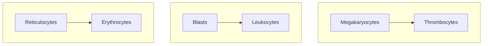

---
tags:
  - CMPA
  - MS
title: Medical-Surgical Nursing (Dr. Ferrer)
description: A compilation of Dr. Ferrer's coverage of the first module for Medical-Surgical Nursing, covering cardiologic, respiratory, hematologic, musculoskeletal, sensory, and oncologic disorders.
date: 2024-11-03
---
A compilation of **Dr. Ferrer**'s lessons on medical-surgical nursing, ~~communicable diseases~~, and ~~emergency and disaster nursing~~. Individual notes on these subjects can be found here:
1. [[10-07-2024 MS|10-07-2024 Cardiovascular Disorders]]
2. [[10-08-2024 MS|10-08-2024 Respiratory Disorders]]
3. [[10-09-2024 MS|10-09-2024 Hematologic Disorders]]
4. [[10-18-2024 MS|10-18-2024 Musculoskeletal Disorders]]
5. [[04-02-2024 MS|04-02-2024 Sensory Disorders]]
6. [[10-21-2024 MS|10-21-2024 Oncologic Disorders]]

These notes are based on live lectures, and no accompanying presentations or slides were provided for them. Here are some video lectures made available:
1. [Cardiovascular Disorders by Dr. Ferrer](https://drive.google.com/file/d/1atm_J4EBGDDWwkdj622zG0X7oJpya6ju/view?usp=drive_link)
2. [Oncologic Disorders by Dr. Ferrer](https://drive.google.com/file/d/1O98UV_HzgZxjWiNgWvxqaIlukP0OG4e-/view?usp=drive_link)
___
# Cardiovascular Disorders
## Review of Anatomy and Physiology
The **heart** is the major circulatory organ of the body. It roughly weighs 300 grams and is divided between two general systems:
1. **Left Side**: the part of the heart that pumps blood into systemic circulation.
2. **Right Side**: the part of the heart that pumps blood into pulmonic circulation.

The heart is composed of four chambers and four valves:
1. **Right Atrium**: receives blood from the superior and inferior vena cavae, being the terminal point of systemic circulation. Blood from this chamber passes through the tricuspid valve to move to the right ventricle.
2. **Tricuspid Valve**
3. **Right Ventricle**: receives blood from the right atrium, and sends blood into pulmonic circulation through the pulmonic valve.
4. **Pulmonic Valve**
5. **Left Atrium**: receives freshly oxygenated blood from the pulmonic arteries, and sends blood into the left ventricular
6. **Mitral Valve**
7. **Left Ventricle**: the most muscular chamber, as it is the chamber responsible for pumping blood out into systemic circulation.
8. **Aortic Valve**
## Blood Pressure
**Blood pressure** is the total pressure used to circulate blood throughout the body. It is calculated with $\text{CO}\times\text{TPR}$ (total peripheral resistance).
- **Cardiac output** is the total volume of blood pumped by the heart within one minute. The normal CO is 4 to 8 liters/min. It is the product of **heart rate** (number of strokes in a minute) and **stroke volume** (amount of blood pumped with one stroke).
- **Stroke Volume** has three principal components: (a) **Preload**, the amount of blood filling the blood during relaxation, i.e., the amount it **stretches**; (b) **Afterload**, the amount of blood left in the heart after contraction, which increases as **resistance** increases; and (c) **contractility**, the ability of the heart to contract.
- These volumes are all connected. In cases of vasoconstriction, total peripheral resistance increases. In cases of vasodilation, blood pressure, cardiac output, and resistance all decrease.
>[!ERROR] Abnormalities
>1. **Hypertension** is the elevation of blood pressure. Treatment uses **vasodilators**, which decrease cardiac output, preload, afterload, contractility, and total peripheral resistance.
>2. **Shock** results in decreased tissue perfusion from decreased blood flow. Treatment uses **vasopressors**/**vasoconstrictors** to raise cardiac output. Examples of this includes dopamine, dobutamine, livufed.

Blood pressure is measured as **systolic** over **diastolic** pressure. Systolic pressure is denoted by the first Korotkoff sound, produced by contraction of the ventricles. Diastolic pressure is the remaining pressure once the heart becomes relaxed and the ventricles refill.
## Heart Sounds
The heart sounds are auscultated with a stethoscope. The diaphragm of the stethoscope is best for detecting S1 and S2, and the bell is best for S3, S4, and Murmurs.
1. **S1** (Systole): the sound created by the closure of the atrioventricular valves (Tricuspid, Mitral).
2. **S2** (Diastole): the sound created by the closure of the semilunar valves (Pulmonic, Aortic).
3. **S3** (Ventricular Gallop): an abnormal heart sound heard in heart failure.
4. **S4** (Atrial Gallop)
5. **Murmurs**: the sound blood makes when flow becomes turbulent, such as in valvular heart disease (VHD).
## Valvular Heart Diseases & Endocarditis
Valvular heart disease is any disease in which the valves of the heart become damaged, resulting in the inability of valves to close (**regurgitation**) where blood can flow backwards and impair circulation. This may also result in **stenosis**, where valves fail to open completely, limiting throughput. Both of these cause turbulent blood flow, which can be detected as **murmurs** auscultated with the bell of the stethoscope.
>[!INFO] Murmur Types
>Murmurs caused by **mitral stenosis** (rumbling) or **aortic regurgitation** (blowing) are **diastolic murmurs**— murmurs heard during diastole. Those caused by **mitral regurgitation** (blowing) or **aortic stenosis** (harsh) are **systolic murmurs**— murmurs heard during systole. Additionally, a **systolic click** is found in mitral valve prolapse (MVP).
%%>- Once systole finishes, the ventricles need to be refilled. In the case of mitral stenosis, the restricted flow from the right atrium to refill the right ventricle produces murmurs. Similarly, blood can regurgitate from the aorta back into the left ventricle, producing murmurs. Once systole starts, the ventricles pump blood through the aorta. If stenosis is present, murmurs can be heard. In mitral regurgitation, the pressure produced by the right ventricle pushes blood back into the right atrium. %%

- Monitor heart sounds, cardiac output, and signs of endocarditis. A **2D ECHO** can be used to monitor the heart's valvular structures and its contractions (ejection fraction)
- **Surgical valve replacement** may be done. Afterwards, anticoagulants are used to prevent thrombus formation.
>[!DRUG] Anticoagulants
>This is a class of drugs that prevent the formation of blood clots. These include common examples such as **heparin**, **warfarin**, and **enoxaparin**. Antidotes are used for bleeding related to anticoagulant use. **Protamine sulfate** for heparin (monitor PTT) and **Vitamin K** for warfarin (monitor PT and INR). More types of anticoagulants include:
>- Oral antithrombin inhibitors (Dabigatran)
>- Novel (new) oral anticoagulants (NOACs) include Apixaban, Edoxaban, Rivaroxaban

A common complication of VHDs is **endocarditis**. This is regularly caused by *streptococcus viridans* (normal gingival flora) and *staphylococcus aureus*. If endocarditis occurs, **Penicillin G** is the drug of choice as an antibiotic.
- As *S. viridans* is a major cause of native valve endocarditis, the patient teaching prioritized is to **avoid vigorous brushing** and to utilize an electric toothbrush rather than a manual one.
- As with all infection-prone diseases, **maintain aseptic technique**, especially when handling highly invasive contraptions such as central lines.
- Valvular heart disease is **highly embolic**. Among its severe complications are **cerebral embolisms**. Other visible manifestations such as **Roth spots**, **Janeway lesions**, and **Osler nodes** are all due to emboli. The patient should wear anti-embolic stockings if possible. Potential emboli are not massaged  or manipulated to avoid dislodging them. A free-roaming embolus may become an pulmonary embolism or worse.
## Pericarditis
An inflammation of the pericardial sac, a covering of the heart.
1. **Etiology**: viral infection, Dressler's syndrome (post-MI), neoplasms, renal failure, radiation, and connective tissue diseases.
2. **Clinical Findings**: pain aggravated by inspiration is the most common symptom, and relieved with sitting or leaning forward. Infection results in leukocytosis, fever, and malaise.
	- A characteristic sign of pericarditis is a **pericardial friction rub** upon auscultation.
	- ECG shows ST elevation.
3. **Nursing Diagnosis**:
	- **Pain**
	- Risk of Decreased Cardiac Output
	- Risk of Ineffective Breathing related to Pain
4. **Management**: treat the cause of the pericarditis.
	- **Pain**: NSAIDs, analgesics
	- Monitoring for **cardiac tamponade**: diminished heart sounds, **jugular venous distention**, pulsus paradoxus, narrowed pulse pressure
5. **Medical Treatment**: **pericardiocentesis**, aspiration of the pericardial contents if pericardial effusion occurs; **dialysis** is renal failure is the cause of pericarditis (uremia)
## Pericardial Effusion
The pericardial sac normally only contains ~20 mL of fluid. In cases of inflammation, infection, or other disease processes, this fluid can accumulate and cause pericardial effusion. In severe cases, large volumes of fluid can cause **cardiac tamponade**. Heart sounds can become diminished, but a pericardial friction rub  may be heard.
## Heart Failure
**Heart  failure** is the loss of function of the heart, being unable to pump blood out into pulmonic (right-sided) or systemic circulation (left-sided).
1. **Etiology**: myocardial infarction, incompetent valves, cardiomyopathy (or any other disorders that affect the muscular layer of the heart).
2. **Right-Sided Heart Failure** (RSHF) features a **distended neck vein** (backing up of the SVC), **edema** (congestion of systemic circulation), **hepatomegaly** (backing up of the IVC), and **jaundice**.
	- **Diet**: low Na+, fluid limitation
3. **Left-Sided Heart Failure** (LSHF) features **pink frothy sputum**, crackles, orthopnea (positional dyspnea), and paroxysmal nocturnal dyspnea from congestion of pulmonic circulation.
4. **Diagnostic Evaluation**:
	- **CXR** to visualize cardiomegaly
	- **2D ECHO** to evaluate **decrease in ejection fraction** (proportion of blood volume pumped out of the heart with each stroke) and **increased CVP** (for RSHF)
5. **Management**: mn. 3Ds
	- **Diuretics** to reduce pulmonary congestion. These include loop diuretics (Furosemide, Bumetanide) which lower serum potassium. Determine potential potassium imbalance in patients taking diuretics. The same caution is applied with potassium-sparing diuretics, which can result in hyperkalemia instead.
	- **Vasodilators** reduce total systemic resistance, allowing the heart to pump better by reducing the preload.
	- **Digoxin**, an inotropic, improves the contractility of the heart.
>[!WARNING] Digoxin
>The therapeutic window of Digoxin is narrow, making it prone to toxicity. In normal use, it should remain between **0.5 to 2.0 ng/mL**. Potassium is also a consideration for digoxin therapy— the receptors for digoxin are also receptors for potassium. If the patient has **low potassium**, the amount of open receptors for digoxin is greater, and poses a higher risk for toxicity than in normal patients.
>
>Its **signs of toxicity** include:
>- Anorexia, Nausea and Vomiting
>- Blurred vision, green halos
>- Bradycardia

6. **Nursing Management**: monitor the client's **weight daily**. A sign of failing circulation is the onset of edema, which results in sudden weight gain.
	- Decrease the heart's workload; provide periods of rest with any activity.
	- Position the client in a semi-fowler's or orthopneic position to facilitate breathing and circulation.
## Coronary Artery Diseases
The aorta branches off into the **right coronary artery** and **left coronary artery**. The main problem involved with coronary artery diseases is **atherosclerosis**. It is the hardening or stenosis of vasculatures as a result of the build-up of plaque, and results in decreased perfusion. An imbalance between oxygen demand and supply produces **ischemia**, which can be visualized as ST depression in an ECG, which can eventually result in **myocardial infarction**, which can be visualized as ST elevation in an ECG.

>[!INFO] Read more about ECGs and their leads: [[B418/ECG|Electrocardiography]]
### Angina Pectoris
**Angina pectoris** is chest pain caused by hypoxia of the cardiac muscles. The pain is a substernal pain radiating to the left arm. There are different types of angina:
1. **Stable Angina**: angina produced by **exertion**, and relieved by rest or the use of nitrates (nitroglycerin). The pain is **predictable** and **consistent**.
2. **Unstable Angina**: angina that cannot be relieved by rest and nitrates, and **progresses** in severity and frequency. It is also known as a *pre-infarction angina*.
3. **Variant/Prinzmetal's Angina**: angina that appears most frequently during rest, caused by **vasospasm**.
>[!DRUG] Medications for Angina
>1. **Nitrates**: a vasodilator that reduces preload and afterload— commonly **nitroglycerin**. It is given at most three times every five minutes. It is delivered sublingually via spray or transdermally via patch. Nitroglycerin is photosensitive (place them in an amber container) and expire within six months.
>2. **Beta-Blockers** (-olols) (produces wheezing; given in caution to patients with COPD and asthma)
>3. **Calcium Channel Blockers** (-dipines, Verapamil, Diltiazem) (produces edema)
>4. **Antiplatelets** inhibit the aggregation of platelets. This is primarily **aspirin**, but can also be clopidogrel (Plavix) or dipyrimadole. Because of its nature, monitor the patient for bleeding.
>5. **Anticoagulants** as discussed earlier. Bleeding is also managed.
>6. **Analgesics** are used due to the pain experienced by the client. In myocardial infarction, **morphine** is used.

### Myocardial Infarction
The death of the myocardial layer of the heart, most commonly caused by coronary artery disease. This is known as a **heart attack**.
1. **Risk Factors**: non-modifiables such as race, age, gender; and modifiables (mn. SAHOD) smoking, (a) high chlosterol, hypertension, obesity, diabetes mellitus
	- **Dyslipidemia** is an abnormal level of lipids in the blood. Normally, total cholesterol should remain under 200 mg/dL, triglycerides should remain under 150 mg/dL, and LDLs should remain under 100 mg/dL. HDLs, the "*good cholesterol*", should be above 40 mg/dL.
2. **Clinical Manifestations**: the main manifestation is **crushing, substernal pain** that may radiate to the jaw, neck, or left arm, which cannot be relieved by rest or nitroglycerine. Impaired perfusion results in **cold, clammy skin**; **anxiety** and **a sense of impending doom**; **restlessness**; and **diaphoresis**.
3. **Diagnostic Examination**:
	- **ECG**: an **ST Elevation** in an ECG reading is characteristic of myocardial infarction. Prior to injury, **ischemia** produces **T-wave inversion** and after injury, **necrosis** produces **abnormal Q waves**.
	- **Blood Tests**: **Troponin T, I** (MI-specific), **CKMB**, **Myoglobin** (earliest), and **Lactate Dehydrogenase** (LDH; late to appear).

![[st_elevation.png]]
4. **Management**: the **MONA** mnemonic (Morphine, Oxygen, Nitroglycerine, Aspirin) is [apparently outdated](https://onlinecjc.ca/article/S0828-282X(15)01566-4/fulltext), with only **aspirin** as remaining relevant and clearly beneficial for treatment. Aspirin is part of the **reperfusion therapy** necessary for recovering homeostasis in the coronary arteries. These include **thrombolytics** such as **streptokinase**. As usual, monitor for bleeding when using medications that reduce the clotting ability of the blood.
	- If using morphine, **Naloxone** (Narcan) should be prepared in case of oversedation.
	- The nurse assists in **percutaneous transluminal coronary angioplasty** (PTCA), where a balloon or stent opens up an occluded blood vessel and **coronary artery bypass graft** (CABG) surgery where an extra blood vessel (either saphenous vein, internal mammary artery, or radial artery) is used to bypass the occluded artery
>[!INFO] Patient Teaching
>Preoperatively, teach the client about the importance of avoiding **vigorous coughing**, performing **leg exercises** (embolus prophylaxis), and exercising **incentive spirometry** to maintain lung function. Postoperatively, monitor the client for signs of infection.

5. **Complications**:
	- **Cardiogenic shock**
	- **Arrhythmia**: ventricular tachycardia, ventricular fibrillation— treated with defibrillation, except for ventricular tachycardia with pulse.
	- **Recurrent chest discomfort**
___
# Respiratory Disorders
The **respiratory process** begins with the nose down to the trachea (upper respiratory tract), and to the bronchi, bronchioles, and alveolar sacs (lower respiratory tract). It is responsible for the intake of oxygen to sustain life, and for the removal of carbon dioxide as waste. Alterations in its function, whether restrictive or obstructive, can become life-threatening if unmanaged.
## Monitoring

| Normal Breath Sound  | Description                  | Found At                              |
| -------------------- | ---------------------------- | ------------------------------------- |
| **Tracheal**         | Harsh breath sounds          | Level of the trachea                  |
| **Bronchial**        | High-pitched breath sounds   | Level of the bronchi                  |
| **Bronchovesicular** | Medium-pitched breath sounds | Level of the scapula (mid-lung field) |
| **Vesicular**        | Low-pitched breath sounds    | Level of the lower lobes of the lung  |

| Abnormal Breath Sound | Description                                                                                                              | Found In                                     |
| --------------------- | ------------------------------------------------------------------------------------------------------------------------ | -------------------------------------------- |
| **Rales**             | Discrete, non-continuous breath sounds produced by moisture of the tracheobronchial tree. Heart best during inspiration. |                                              |
| **Crackles**          | A coarse form of rales, indicating the presence of fluid in the lungs                                                    | Pulmonary edema Pneumonia Inflammation |
| **Ronchi**            | "Popping" breath sounds produced by secretions obstructing the airway                                                    |                                              |
| **Wheezes**           | Continuous, musical breath sounds - Wheezes on inspiration: **stridor** - Wheezes on expiration: **asthma**        | Asthma Bronchoconstriction                |
| **Friction Rub**      | Crackling, grating sounds originating from inflamed pleura.                                                              | Pericarditis Pleurisy                     |

> [!TIP] Review: Reading ABGs
> Find the **type of acid-base imbalance**, and its **classification**:
> 1. **pH**: 7.35 - 7.45. Lower than normal is acidosis, higher is alkalosis.
> 2. **CO₂**: 35 - 45. Lower than normal is alkalosis, higher is acidosis.
> 3. **HCO₃-**: 22 - 26. Lower than normal is acidosis, higher is alkalosis.
> 4. Whichever of the **CO₂** (respiratory) and **HCO₃-** (metabolic) readings **agree with the pH deviation** is the result. If both agree, it is **combined** or **mixed**.
>
>Find the **level of compensation achieved**: 
> 1. **Fully Compensated**: read the pH. If it is **normal**, full compensation is achieved. Identify which region the pH is closer to even in the normal range. Determine the match from CO2 or HCO3 to differentiate respiratory from metabolic pH imbalance.
> 2. **Partially Compensated**: read the pH. If **none of the values are normal**, compensation is partial. Same rules as before are observed.
> 3. **Uncompensated**: if **one of CO₂ or HCO₃- is normal**, but **the pH is abnormal**, no compensation has been achieved.

## Pneumonia
The inflammation of the lungs. Most commonly caused by *Streptococcus pneumoniae* in adults. In children aged 6 months to 6 years old, the most common cause is *Haemophilus influenzae serotype B*.
1. **Etiological/Risk Factors**: smoking, air pollution, immunocompromisation (e.g., AIDS, chemotherapy, dialysis patients).
2. **Clinical Manifestations**: green to **rusty sputum** (pathognomonic), dyspnea, fever, pleuritic chest pain (pain upon coughing/breathing), rales, crackles.
3. **Diagnostic Evaluation**: **CXR** (confirmatory), CBC (elevated WBC), Sputum GS/CS
4. **Management**: oxygen therapy, force fluids (liquefy secretions), nebulize, suctioning as necessary
	- Drug of choice: **amoxicillin**; alternatively, azithromycin
5. **Nursing Interventions**: positioning, deep breathing and coughing exercises, CPT
### Types of Pneumonia
1. **Community Acquired Pneumonia** (CAP)
2. **Hospital Acquired Pneumonia** (HAP)
3. **Ventilator Acquired Pneumonia** (VAP)
## Pulmonary Tuberculosis
Discovered by **Robert Koch**, giving it the name "**Koch's disease**". It is caused by *Mycobacterium tuberculosis*
1. **Risk Factors**: (mn. MOAI, as in this guy 👉 🗿)
	- **Malnutrition**
	- **Overcrowding**
	- **Alcoholism**
	- **Immunocompromised** or **Ingestion of Infected Unpasteurized Bovine Milk**
2. **Clinical Manifestations**: (mn. PLAN)
	- **Productive Cough**
	- **Low Grade Afternoon Fever**, the **pathognomonic** sign of TB.
	- **Anorexia**, **Weight Loss**
	- **Night Sweats**
3. **Diagnostic Examination**:
	- **Screening**: **Mantoux Test**, a PPD sample injected intradermally (skin test). A positive result indicates exposure.
		- Healthy individuals test positive if the skin test returns an induration of **10 mm or more**.
		- Immunocompromised individuals test positive with only **5 mm or more**.
	- **Confirmatory**: **Sputum Culture**, or **GeneXpert** (uses sputum sample, faster)
	- **Determine Extent of Lesions**: **CXR** (mild, moderately advanced, far advanced)
4. **Medical Management**: (mn. **RIPES**) used for 6 months.
	1. **Rifampicin**: red-orange secretions
		- **Contact lenses** can be stained if worn by the patients. Recommend the use of eyeglasses.
	2. **Isoniazin**: results in numbness/paresthesia. Requires **Pyridoxine** (Vitamin B6) to offset numbness.
	3. **Pyrazinamide**: increases uric acid— avoided for patients with gouty arthritis.
	4. **Ethambutol**: causes optic neuritis; blurring vision. Color discrimination (red-green) is affected.
	5. **Streptomycin**: **IM ANST**; (mn. SON) **sensorineural hearing loss**. The drug is **ototoxic** and **nephrotoxic** (check creatinine).
## COPD
>[!TIP] Patient Teaching
>1. The two universal risk factors for COPD is **smoking** and **air pollution**. This is applicable to both chronic bronchitis and emphysema. Let the patient make lifestyle changes to avoid these risk factors.
>2. Always teach the patient about **pursed lip breathing**, which prevents air trapping. In this type of breathing, **exhalation lasts longer than inhalation**.
### Chronic Bronchitis
***Blue boater***; problems with the **constriction of airway due to inflammation**, which also increases mucus production due to mucus gland growth.
1. **Clinical Manifestations**: **chronic coughing**— more than **three months** in **two consecutive years**.
2. **ABG**: respiratory acidosis
3. **Nursing Management**:
	- **Low inflow O2** (less than 6) to prevent the **loss of hypoxic drive**.
4. **Management**: (mn. CAMB)
	- **Corticosteroids** (as an antiinflammatory)
	- **Antimicrobials** (if pneumonia occurs)
	- **Mucolytics/Expectorants**
	- **Bronchodilators**: Salbutamol, Ventril; avoid **stimulants** because of palpitation as a side effect.
### Emphysema
***Pink puffer***; problems with (mn. IBA) **inelasticity of alveoli**, **barrel chest** (increased anteroposterior chest diameter due to air trapping), and **air trapping**. Highly related to smoking.
1. **Risk Factors**: smoking, alpha-1 antitrypsin deficiency, air pollution
2. **Clinical Manifestations**:
	- **Productive Cough**
	- **Dyspnea** at rest
	- **Rales, Crackles, Rhonchi**
	- **Barrel Chest** d/t **Air Trapping**
3. **Diagnostic Examination**: **ABG**, also respiratory acidosis; **CXR** (overinflation)
4. **Management**: (mn. FLA, CAMB)
	1. **Force Fluids**
	2. **Low Inflow O2** (prevent loss of hypoxic drive)
	3. **Administer medications** as ordered
	4. **Corticosteroids**
	5. **Antibiotics**: if pneumonia occurs
	6. **Mucolytics**/**Expectorants**
	7. **Bronchodilators**
## Bronchial Asthma
(*not discussed*) A **reversible inflammatory lung condition** due to hypersensitivity to allergens. Bronchoconstriction occurs, restricting breathing.
1. **Risk Factors**: **Family History**
2. **Clinical Manifestations**: (*triad for asthma*)
	- **Cough**
	- **Dyspnea**
	- **Wheezing on Expiration**
3. **Management**:
	1. **High Fowler's Positioning** or Tripod during dyspnea
	2. **Enforce complete bed rest**
	3. **Administer medications as ordered**: bronchodilators (causes palpitation, avoid stimulants e.g. caffeine), steroids (increases (mn. BNG) BP, Na, Glucose, and decreases Potassium. Feed the patient with banana or avocado)
	4. **Metered Dose Inhaler** (MDI) with a maintenance drug used to prevent exacerbation.
## Pneumothorax
Pneumothorax is the **accumulation of air in the pleural space**. The normally negative pressure present in the space becomes positive and acts on the lungs, preventing it from expanding.
1. **Etiology**:
	- **Spontaneous pneumothorax**
	- **COPD** (Secondary pneumothorax)
	- **Catamenial pneumothorax**
2. **Clinical Manifestations**:
	- **Dyspnea**
	- **Dullness**
	- **Decreased chest expansion**
	- **Diminished breath sounds**
	- **Tracheal Deviation** (pathognomonic) towards the unaffected side found in tension pneumothorax.
	- **Tension Pneumothorax**, where a hole is punctured by a mechanical ventilator into the pleural space.
3. **Diagnostic Examination**: **CXR** reveals inflation of the pleura. **ABG** reveals respiratory acidosis.
4. **Management**:
	1. **Thoracentesis** may be the primary form of management if mild.
	2. If moderate to severe, a **CTT** (chest tube thoracostomy) may be required.
		- **Nursing Management**: if a CTT is attached to a water-sealed drainage, monitor fluctuations (should fluctuate, otherwise obstruction or re-expansion of the lungs may have occurred) and bubbling (should be intermittent, otherwise an air leak may be present).
## Chest Injuries
(*not covered*)
1. **Rib Fractures** resulting from direct blunt chest trauma, often from vehicular accident victims. The pathognomonic sign of rib fractures is **pain on the site of injury exacerbated upon inspiration**.
	- Management: **surgery is not required**. Ribs unite spontaneously.
	- **Maintain high fowler's** and monitor for **respiratory depression**.
2. **Flail Chest** resulting from direct blunt chest trauma that damages **two or more ribs**. The pathognomonic sign is **paradoxical breathing**, where inhalation reduces chest size and vice versa.
___
# Hematologic Disorders
**Blood** is a specialized organ that exists in a fluid state. It is composed of **plasma and blood cells**. It makes up 7% to 10% of the human body (~5 to 6 L). It is created in the **red bone marrow** (hematopoiesis). One of the vital functions of blood is for **oxygenation** as it carries oxygen into the body, and carbon dioxide out of it. It also contains nutrients, foreign bodies, and various cells that all function to aid the human body.
## Blood Cells and Indices
1. **Red Blood Cells** are the primary carriers of oxygen into the body and carbon dioxide out of the body. They have a normal lifespan of 120 days. These give the blood its distinct color, and make up a large percent of the composition of blood (see Hematocrit below). The red blood cells are analyzed and "*indexed*" with RBC indices. These values include:
	- **Hematocrit**: the ratio between blood volume and RBC volume. Normally 30% to 40%. Increase in Hct indicates FVD, decrease in Hct indicates FVE.
	- **Mean Corpuscular Volume**: the **size** of the RBC. This value determines the presence of microcytic, normocytic, or macrocytic RBC.
		- Normocytic Anemia occurs in **CKD/RF Anemia**.
		- Microcytic Anemia occurs in **Iron Deficiency Anemia**.
		- Macrocytic Anemia occurs in **Megaloblastic Anemia**.
	- **Hemoglobin** is found within RBCs. Lowered Hgb is called **anemia**, and elevated Hgb is called **polycythemia** (found in smokers). Anemia patients display **pallor, fatigue, and palpitations**.
		- **Normal Female Volume**: 12 to 14 grams/deciliter
		- **Normal Male Volume**: 14 to 16 grams/deciliter
2. **White Blood Cells**: forefront immunologic agents.
	- **Normal**: 5,000 to 10,000
	- Decreased WBC is termed as **leukopenia**.
		- **Avoid crowded places**, limit visitors, and observe hand hygiene and the use of personal protective equipment.
		- Diet for patients with leukopenia: **low-residue low-fiber high-protein diet**.
		- **Reverse isolation** for patients.
	- Increased WBC is termed as **leukocytosis**. This suggests an **active bacterial infection**.
3. **Platelets**: platelets are important for **clotting**. They have a normal lifespan of 10 days.
	- **Normal**: 150,000 to 450,000.
	- **Thrombocytopenia** poses a risk for bleeding as the body is unable to clot wounds.
	- **Thrombocytosis** produces a risk of excessive clotting.

>[!WARNING] Blasts
>Erythrocytes carry more oxygen than reticulocytes, and thrombocytes are able to clot better than megakaryocytes. Similarly, **blasts** are unable to match leukocytes in immunologic ability. However, these are exactly the cells that are produced excessively in **leukemia**, which then "*drown out*" other cells. In such a case, despite a high white blood cell count, the immune system is impaired.

%%
## Leukocytes
1. **Granulocytes**: Neutrophils, Eosinophils, and Basophils
	- Neutrophils increase in bacterial infection. It is the most abundant white blood cell.
	- **Eosinophils** increase in allergic reactions.
	- **Basophils** are the least abundant.
2. **Agranulocytes**: Lymphocytes, Monocytes
	- Monocytes, when they mature, are macrophages. They consume foreign bodies and organisms through phagocytosis.
	- **Lymphocytes** produce antibodies. The major producer of antibodies is the spleen with its high number of lymphocytes. Other organs include the tonsils and appendix. %%
## Nutritional Anemias
1. **Iron-Deficiency Anemia** (IDA) is produced by a decrease in iron supply.
	- Causes: bleeding, nutritional deficiencies
	- Diet High in Iron: Meat, Seafoods, Eggs, Liver, Fish (Meat SELF), and Dark Green Leafy Vegetables. Iron is best absorbed with Vitamin C. Ferrous sulfate is best taken with an empty stomach. Stool may appear dark green or black.
	- **Diagnostics**: microcytic hypochromic anemia and decreased serum ferritin. Pathognomonic sign: **koilonychia**; spoon-shaped nails.
	- **Administration of Iron Supplements**: 300 – 325 mg TID oral 1 hour before meal. For liquid form, use straw; deep IM, use Z-track. Include Vitamin C to facilitate absorption.
2. **Megaloblastic Anemia**, further divided into Vitamin B9 (FADA) and Vitamin B12 (Pernicious Anemia) deficiency. These vitamins are important in the production of DNA in RBCs.
	- **Diagnostics**: Macrocytic Anemia. Pathognomonic Sign of **Beefy Red Tongue**; Glossitis. Decreased hemoglobin, decreased DNA synthesis, but increased MCV.
	- **FADA**: those at risk for Vitamin B9 deficiency are alcoholics and those in pregnancy or dialysis. Some drugs (e.g. Methotrexate) may also cause FADA.
	- **Pernicious Anemia**: those at risk for Vitamin B12 deficiency are those who had a Billroth I or II procedure (it removes the IF necessary to absorb Vitamin B12).
		- **Diagnostic Picture**: Glossitis/Beefy Red Tongue, and **Paresthesia**. 24-hour urine for Schilling Test.
		- These patients require a life-long monthly administration of Vitamin B12.
		- Diet for B12: eggs, meat, poultry, shellfish, milk, and milk products, citrus, legumes
## Non-Nutritional Anemia
1. **Anemia of Renal Failure**: decreased blood oxygen signals to the kidneys to produce erythropoietin, a hormone that stimulates the red bone marrow to produce red blood cells. However, in renal failure, **erythropoietin is insufficient**, decreasing RBC production. This results in **Normocytic Anemia**.
	- Management: **Epogen**, a synthetic erythropoietin, is given to patients with RF to manage anemia. It is given thrice a week subcutaneously. If severe, **blood transfusion** may be necessary.
2. **Sickle Cell Anemia**: triggered by hypoxia and the HbS gene is inherited in the African Race.
	- Avoid high altitudes and cold environments. Encourage hydration.
	- **Definitive Diagnosis**: **hemoglobin electrophoresis**
	- **Pain** is the most important nursing diagnosis, especially as a symptom of crisis. An opioid (morphine) may be required.
	- mn. **SICKLE**: Jaundi(s)ce, Avoid (i)nfection (triggers crisis), (C)rescent-shaped RBC, (K)Crisis and Pain, (Lahi) Hereditary, (E)ncourage hydration (3L/day to avoid clotting)
	- mn. **HOPIA**: Hypoxia, high altitudes, opioid (morphine), pain, infection, adequate hydration
	- **Complications**: pulmonary hypertension, priapism, impotence, infection, stroke, acute chest syndrome

>[!ERROR] Jaundice
>**Hemoglobin** is released when the RBC is lysed, and releases **Heme**, which converts to bilirubin, which leads to the jaundiced presentation of patients with hemolytic anemia (e.g. sickle cell anemia, malaria).

3. **Aplastic Anemia**: an idiopathic disorder resulting in insufficient production of blood cells.
	- If determined as autoimmune, this is treated by removing antibodies (**splenectomy**) or immunosuppression (**steroids**). If necessary, replacement of damaged bone marrow tissue with a **bone marrow transplant** may be done.
	- **Diagnostic Picture**: **pancytopenia**; risk for infection, bleeding, and the 3 Ps of anemia.
	- **Nursing Interventions**: provide rest for fatigue, avoid caffeine, prevent infection, prevent bleeding (avoid rigorous activities, NSAIDs, Aspirin, etc.)
___
# Musculoskeletal Disorders
## Common Musculoskeletal Injuries
1. **Sprains and Strains**: **Ligaments** are  supporting tissue that connect bones to other bones. A **sprain** occurs when ligaments are stretched or torn. **Tendons** are supporting tissue that connects bones to muscles. A **strain** occurs when muscles or tendons are stretched or torn.
	- **Management**: **RICE** for mild to moderate sprains/strains
		1. **Rest**
		2. **Ice** (Intermittently)
		3. **Compression Bandage**
		4. **Elevation**
		5. In severe sprains/strains, **surgery** may be required.
2. **Dislocations**: **joints** are the areas of articulation where two or more bones connect. In any occurrence of malposition (non-approximation) of the joints, they are **dislocated**. This may be complete or partial (AKA *subluxation*).
3. **Arthritis**: **joints** contain tissue that may become inflamed; this is termed as **arthritis**.
4. **Fractures**: a discontinuity of the bone produced pathologically or by trauma.
5. **Osteomyelitis**: an inflammation of the bone
6. **Osteoporosis**: "*porous bone*"; a decreased density rating of the bone, commonly caused by a lack of calcium in the bone.
## Neurovascular Status Impairment
One of the most important aspects of care for patients with musculoskeletal injuries. These are regularly assessed in patients, especially in those with casts and traction.
(*mn. 6 Ps*)
1. **Pain**: often the initial complaint
2. **Paresthesia**: a tingling sensation of the extremities
3. **Pulselessness**: a lack of peripheral pulses
4. **Pallor**: pale discoloration of the skin
5. **Poikilathermia**: a cool feeling of the skin
6. **Paralysis**: often the last complaint
## Arthritis
An **inflammation** of the joints, causing **pain**.
1. **Management**: antiinflammatory medications
	- First line: **NSAIDs** (MIND; mefenamic acid, ibuprofen, naproxen, diplofenac). This may result in ulceration (GI irritants) and nephrotoxicity in long-term use. Second line is **steroids**

>[!DRUG] COX-2 Inhibitor NSAIDs
>These are a recent form of NSAIDs that do not produce gastric irritation. Among its forms, Etoricoxib (**Arcoxia**) is common manifestation

2. **Types**:
	1. **Osteoarthritis**: common in **obese** and **old** patients, where **the major weight-bearing joints** (cervical spine, lumbar spine, knees) **degenerate through wear-and-tear**.
		- **Management**: (1) rest, (2) weight loss in obese patients via low carb/low fat diet, (3) pain management (NSAIDs, steroids \[-*sones*], paracetamol, liniments)
		- **Signs and Symptoms**:
			- **Characteristic Pain Pattern**: morning pain less than 30 minutes. It is localized, asymmetrical, and non-systematic.
			- **Manifestations**: Heberden's (distal metacarpal joint) and Bouchard's (proximal metacarpal joint) nodes
		- **Diagnostic Examination**: x-ray (visualization of osteophytes/spur formation), bone density measurement
	2. **Rheumatoid Arthritis**: a **chronic, autoimmune** disorder that goes into remission and exacerbations. RA is common in **women**.
		- **Management**: pain management (NSAIDs, steroids \[-*sones*], paracetamol, liniments), and the **standard treatment of methotrexate**. Nursing interventions include: 
			- **Splints** can immobilize the affected extremities.
			- **Cold Packs** can help with acute exacerbations of pain.
			- **Heat Application** can help reduce inflammation.
			- **Provide regular activities** to reduce pain levels. Rest increases the stiffness and pain of RA.
		- **Signs and Symptoms**: **fever**, weight loss (painful to chew)
			- **Characteristic Pain Pattern**: stiffness that occurs for more than 30 minutes that appears systemically (all joints), symmetrically, and bilaterally
			- **Manifestations**: Subcutaneous nodules, Raynaud's phenomenon
				- In late rheumatoid arthritis, deformities of the hand occurs. From proximal to distal, these are the Boutonniere deformity of the thumb, ulnar deviation of metacarpophalangeal joints, and swan-neck deformity of fingers.
		- **Diagnostic Examination**: elevated ESR, positive Rheumatoid factors (immunologic markers)
	3. **Gouty Arthritis**: the result of a **metabolic** disorder in purine metabolism, increasing levels of uric acid, resulting in the crystallization of gout (**tophi**) in the synovial spaces, causing pain and inflammation.
		- **Management**: **colchicine** is the first line used for acute gout attacks that **reduces pain and inflammation**. Next, NSAIDs then steroids can be used.
			- **Allopurinol** is used to **lower uric acid** by blocking the enzyme for metabolizing purine to uric acid (xanthene oxidase). Colchicine does not does this. In recent development, **Febuxostat** may be a preference in lowering uric acid.
			- **Diet** should avoid purine. Avoid **alcohol**, anchovies, shellfish, oysters, clams, and **organ meats**. Increase fluid intake to prevent nephrolithiasis.
		- **Signs and Symptoms**: pain. A **kidney stone** may also form from uric acid crystals.
			- **Characteristic Pain Pattern**: **monoarticular**; only one joint is affected, compared to OA and RA, which are **polyarticular**.
			- **Manifestations**: erythematous first metatarsophalangeal joint; **podagra**; a great toe.
		- **Diagnostic Evaluation**: serum uric acid

>[!WARNING] Pyrazinamide
>Pyrazinamide, a TB medication, can increase uric acid. This is avoided in patients with gout.

## Fractures
A discontinuity in a bone.
1. **Signs and Symptoms**:
	- **Crepitus**: a grating sound between the discontinued bones
	- **Loss of function**
	- **Obvious deformity** such as misalignment and shortening of the joint.
	- **Pain**
2. **Diagnosis**: **x-ray** reveals fractured fragments
3. **Management**:
	- In an emergency, **immobilize** (external, splint, traction, cast; internal, tongs, wires, pins) **any suspected fracture**.
4. **Complications**:
	1. **Shock**: hypovolemia from hemorrhage.
	2. **Fat Embolism Syndrome**: the transmission of fat as emboli in circulation from leakage of fat from yellow bone marrow into blood vessels, commonly from femoral or pelvic fractures as large bones of the body. The immediate problem with FES is a **pulmonary embolism** manifested by dyspnea, which can result in respiratory failure. Hypotension, tachycardia, and tachypnea all appear as sequelae. The emboli also produces **petechial rashes** on the chest.
	3. **Infection** as manifested by fever, foul-smelling discharge, erythema
	4. **Compartment Syndrome**: a syndrome characterized by **unrelenting pain** (even with opioids) as an extremity experiences pressure such as in internal bleeding (limited by fascia; relieved via **fasciotomy**) or an external covering (a cast) is set too tight. The core problem of compartment syndrome is of [[#Neurovascular Status Impairment]].
	5. **Deep Vein Thrombosis** as exemplified in Homan's sign (pain upon dorsiflexion of the foot)
### Traction
The use of a traction weight and countertraction to immobilize and reduce fractures to assist in healing. There are various types:
1. **Skin Traction**: traction applied over the skin, indirectly to the bone. This utilizes elastic bandages or adhesives.
	1. **Buck's Traction**: lower extremity traction. This is not used with weights more than eight pounds.
	2. **Russel's Traction**: stabilizes fractured femur
	3. **Cervical Traction**: for neck affliction
	4. **Pelvic Traction**: for back pain
2. **Skeletal Traction**: traction applied directly into the bone via pin, wire, or tongs. This invasive placement may result in infection. As such, the nurse **assesses for infection** and cleans pin sites.
>[!TIP] Traction Management
>Never remove weights unless prescribed by the doctors. The weights should hang freely, be free of friction, and free of knots.

Nursing management includes management of the traction system, **neurovascular status** (6 Ps), infection, and complications of immobilization.

| Complication of Immobilization | Management                                                       |
| ------------------------------ | ---------------------------------------------------------------- |
| **Pneumonia**                  | Teach the patient breathing exercises (deep breathing, coughing) |
| **Constipation**               | Increase fluids and fiber (high residue)                         |
| **Urinary Tract Infection**    | Increase fluids                                                  |
| **Pressure Ulcers**            | Assess skin integrity regularly                                  |
| **Contractures**               | Utilize positioning and ROM exercises                            |
| **Deep Vein Thrombosis**       | Checked with Homan's sign                                        |
>[!INFO] Casting
These are hard bindings of affected extremities to immobilize and promote healing. This may use two types of materials:
>1. **Plaster of Paris**, a slow-drying cast material. White.
>2. **Fiberglass**, a fast-drying cast material, but is more expensive. This comes in more colors, too.

## Osteoporosis
"*Porous bones*" manifested by decreased bone mass density (BMD). This may occur in patients whose osteoclastic activity (bone resorption) is greater than osteoblastic activity (bone deposition).
1. **Risk Factors**:
	- Being underweight
	- Smoking
	- Alcoholism
	- Sedentary lifestyles
	- Age
	- Diet (caffeine, alcohol, low calcium): should include ~1,200 mg of Calcium per day.
	- Post-menopausal (decreased estrogen)
	- Immobility

>[!WARNING] Surgically-Induced Osteoporosis
>The removal of ovaries (oophorectomy) or testes (orchidectomy) are considered as essentially causative of osteoporosis. The resulting osteoporosis is considered "surgically-induced".

2. **Diagnostic Examination**: **DEXA Scan** to measure bone mass density and **x-ray studies** for pathologic fractures
3. **Management**: Calcitonin, Bisphosphonates, Alendronic acid; all prevent bone resorption (breakdown). The patients are kept upright right after consumption, and are given on an empty stomach.
	- **Diet**: **dairy products**, dark green leafy vegetables.
	- **Lifestyle**: exercise, as exercise increases bone density. In immobilized patients, isometric exercises may be used.
___
# Sensory Disorders
## Eye Disorders
Also read: [[ANPH/15-1|Anatomy of the eyes]]
### Anatomy of the Eyes
The eye is made up of various layers:
1. Outer:
	1. **Sclera**
	2. **Cornea** (avascular)
2. Middle
	1. **Uvea**
	2. **Iris**, the pigmented ring of accommodating tissue that controls the amount of light to enter the eyes; these cause pupillary constriction (miosis) in the presence of light, and cause pupillary dilation (medriasis) in the presence of darkness. The examination of the pupil with a penlight to detect these constrictions or dilatations assesses the function of **CN III** (oculomotor nerve).
		- Drugs that induce miosis are called **miotics**. Drugs that induce medriasis are called **medriatics**.
	3. **Ciliary Body**: the producer of aqueous humor that occupies that fills the eye. This is implicated in glaucoma when overproduction results in an increase in IOP.
	4. **Choroid**
3. Inner
	1. **Retina**: contains retinal vessels and is the sensory unit of the eyes. These function with **CN II** (optic nerve), assessed with **Snellen's chart** (visual acuity).

>[!TIP] Cranial Nerve V: The Trigeminal Nerve
>The nerve that innervates the cornea via the ophthalmic branch, maxillary branch, and mandibular branch. The reflex tested for the eye is the **corneal reflex**, which causes the individual to blink when a cotton wisp is used to stimulate the cornea.
### Inflammation of the Eyes
1. **Scleritis**: inflammation of the sclera
2. **Iritis**: inflammation of the iris
3. **Retinitis**: inflammation of the retina
4. **Keratitis**: inflammation of the cornea, especially after corneal abrasion e.g. due to contact lenses.
5. **Blepharitis**: inflammation of the eyelidg
### Errors of Refraction
1. **Myopia**: near-sightedness, treated with concave lenses.
2. **Hyperopia**: far-sightedness, treated with convex lenses.
3. **Astigmatism**: irregular curvature of the cornea, treated with cylindrical lenses.
4. **Presbyopia**: far-sightedness that occurs with aging.
### Ocular Medications
1. **Eye drops**: therapeutic fluid administered at the lower conjunctiva.

>[!WARNING] Close the inner punctum of the eye:
>Place pressure on the area between the corner of the eye and the side of the nose to prevent systemic absorption of the drug (approx. 7% gets absorbed).

2. **Eye ointment**
### Cataracts
An increase in the **opacity of the lens** of the eyes. A **progressive, painless loss of vision** is the main characteristic of cataracts.
1. **Risk Factors**: *mn. CARDS*
	- Corticosteroids
	- **Aging**
	- Retinal Detachment
	- Diabetes Mellitus, Down Syndrome
	- **Smoking**
2. **Symptoms**
	- **Painless** blurring of vision
	- **White-colored** or cloudy lens/pupil
3. **Treatment**: cataracts are done primarily through **lens removal** (**phacoemulsification**). This may be done with ultrasound vibrations that breaks the lens into fragments. Patients without lens are **aphakic** (has aphakia). Surgical management is through **lens replacement**, which uses **lens implants** or **corrective lenses**.
4. **Nursing Intervention**
	- Post-op: monitor vital signs, level of consciousness, and dressings.
	- Elevate the **head of the bed**.
	- Lie on the **unaffected side**.
	- **Eyeglasses** will be given for the patient when discharged to reduce glare. At night, an **eye shield** is used to prevent trauma such as scratching.
	- Avoid activities that elevate the IOP: sneezing, coughing, straining or using the valsalva maneuver (utilize a papaya + high residue/fiber diet) to prevent constipation, **laxatives** may be given. **Antiemetics** may be given for vomiting patients. Increased IOP may cause hemorrhaging and pain.
	- Priority after surgery: **safety**. Set siderails.
### Glaucoma
**Increased IOP** (normal: 10 to 21 mmHg) due to an imbalance in the **production and drainage of aqueous humor**. This results in nerve damage to the optic nerve (CN II).
1. **Signs and Symptoms**: 
	1. **Open Angle Glaucoma**: loss of **peripheral** vision (tunnel vision), where halos are seen when around lights.
	2. **Closed Angle Glaucoma**: headache and eye pain present due to higher IOP compared to open angle.
2. **Risk Factors**
	1. **Smoking**, **Steroids**
	2. **Aging**, **Family History**, **High Myopia**
	3. **Diabetes Mellitus**
3. **Diagnostic Examination**
	1. **History**
	2. **Tonometry** through a tonometer, which measures IOP
4. **Nursing Intervention**
	1. Priority Nursing Diagnosis: **risk for injury** due to sensory impairment; ensure safety.
	2. **Keep lights open** to promote pupil constriction. Dark environments allow for dilation, increasing IOP.
	3. Avoid all activities that increase IOP; sneezing, coughing, vomiting, straining, valsalva maneuver
5. **Treatment**: decrease production, increase outflow; the main goal is to reduce IOP to prevent CN II damage, which can result in irreversible blindness
	1. **Miotics**: drugs that constrict the pupil e.g. **Pilocarpine** and **Carbachol**. The constriction allows for outflow to be faster, draining the eye.
	2. **Topical Beta-Blockers** instilled at the lower conjunctiva; **betaxolol**, **timolol**. These decrease humor production Always monitor heart rate to check for bradycardia. Trivia: only 7% of eye drops enter systemic circulation.
	3. **Diuretics**: to reduce pressure by reducing fluid content; acetazolamide (diamox)
	4. **Prostaglandin Analogs/Agonist**: **travoprost**, **latanoprost**; these facilitate humor drainage.
	5. **Surgical Management**: iridectomy, iridotomy used to facilitate aqueous drainage.
### Retinal Detachment
The separation of the **choroid from the retina**, forming a retinal pigment epithelium (RPE) detached from the sensory layer.
1. **Causes**
	1. Diabetic retinopathy
	2. Aphakia
	3. Tumor of the eye
	4. Inflammation of the eye: uvitis (middle layer inflammation)
	5. High myopia
2. **Symptoms**:
	1. **Flashes** of light and sight of **floaters** (light spots on the foreground of one's sight)
	2. Sense of a **curtain** being drawn over the eye.
	3. **Painless blurring** of vision.
3. **Treatment**
	1. **Scleral buckle**, which promote reattachment of the choroid to the sensory retina.
	2. **Pneumatic retinopexy**, where the retinal pigment epithelium (RPE) is pushed into the retina via the administration of gas bubbles or silicone oil into the vitreous cavity.
		- Importantly, position the patient **PRONE** after surgery to position the gas bubble properly in pushing the RPE to the retina.
		- Avoid activities that increases IOP: sneezing, coughing, straining/valsalva, vomiting (use antiemetics), constipation (use high fiber/high residue + papaya diet, or laxatives as ordered)
## Ear Disorders
1. **External Ear**: ear canal
	- Erythematous ear canal; **otitis externa**, inflammation of the ear canal.
	- The ear canal is normally skin colored. If inflamed, it is erythematous.
	- Aural tenderness occurs, where manipulation of the pinna, oracle, or canal causes pain.
	- Treatment: **analgesics** (otic drops)
2. **Middle Ear**: tympanic membrane, eustachian tube (connects the ear to the nasopharynx), malleus, indus, stapes (ossicles).
	- Problems with the external or middle ear that results in hearing loss is **conductive hearing loss**
	- In **otitis media**, the tympanic membrane bulges and becomes erythematous (normally pearly grey).
	- A consequence of **URTIs** travelling through the eustachian tube.
3. **Inner Ear**: a.k.a. labyrinth; vestibule (semicircular canal), and cochlea
	- **Labyrinthitis**.
	- Problems with the inner ear or labyrinth that results in hearing loss is **sensorineural hearing loss**. Often caused by (mn. LMP) **labyrinthitis**, **Meniere's syndrome**, and **presbycusis**.

>[!INFO] Hearing Loss
>Hearing loss may be **conductive** from the affectation of the conducting system of the ears, **sensorineural** from the affectation of the sensory organ or the nervous system, or **functional** from psychological or emotional blocking-out of stimulus.

### Otitis Externa
Containing the ear canal and other external ear structures, otitis externa is the **inflammation of the ear canal**. Because it commonly occurs after swimming, it is called "*swimmer's ear*"
1. **Symptoms**
	1. Erythematous ear canal
	2. Aural Tenderness
2. **Treatment**
	1. **Antibiotics** for infection
	2. **Analgesia** with otic drugs (ear drops) for pain
### Otitis Media
Associated with URTIs (cough or cold). This features a **tympanic membrane that bulges and becomes erythematous**. Hearing loss associated with this condition is **conductive hearing loss**. If untreated, this may also cause **mastoiditis**.
1. **Symptoms**
	1. **Fever**
	2. **Ear Pain** (Otalgia), a classic symptom of otitis media.
	3. **Ear Pressure**
	4. **Bulging Eardrum**
	5. **Ear Discharge**
2. **Treatment**
	1. **Antibiotics** and **analgesia**
	2. **Tympanotomy** or **Myringotomy**: a surgical perforation of the tympanic membrane used to relieve otalgia by decreasing pressure by facilitate drainage. A repair (tympanoplasty, myringoplasty)
### Mastoiditis
A complication of **otitis media**.
1. **Symptoms**: the tympanic membrane is described as (mn. DIRT) dull, immobile, red, and thick.
2. **Treatment**: surgery to remove infected mastoid ear cells: **mastoidectomy**.
	- If unsuccessful in removing infected cells, meningitis, dizziness, and damage to CN 6 (abducens) and 7 (facial).
### Otosclerosis
Abnormal bone growth at the level of the **stapes**, common in **pregnant women**.
1. **Symptoms**
	1. Conductive hearing loss
	2. Normal tympanic membrane (pearly grey)
	3. Often occurs in pregnant patients.
2. **Treatment**
	1. **Stapedectomy**: removal of the stapes and abnormal bone growths.
	2. Application of **hearing aids**
	3. **Sodium fluoride** may prevent otosclerosis.
### Presbycusis
A form of sensorineural hearing loss related to aging. Hearing is lost due to age because of degenerative changes (atrophy) of the cochlea. Irreversible.
### Meniere's Disease
An inner ear (labyrinth) disorder, where there is an **increased fluid** (endolymphatic fluid) **in the membranous labyrinth**. It is primarily **idiopathic**.
1. **Symptoms**
	- **Tinnitus**, ringing within the ears.
	- **Sensorineural Hearing Loss**
	- **Vertigo** (most common and troublesome due to affectation of the cochlea)
2. **Management**
	1. **Risk for falls or injury** due to impaired vestibular function; **ensure safety**.
	2. **Low sodium diet** as episodes may be related to high sodium consumption, which further increase fluid volume.
	3. **Diuretics** to reduce fluid volume if prescribed.
	4. **Endolymphatic drainage**
	5. **Vestibular nerve resection** to remove vertigo.
	6. **Labyrinthectomy**, removal of the inner ear. Permanent deafness.
___
# Oncologic Disorders
**Cancer** is a disease of **mutated cells that proliferate abnormally**, creating pathology as a result of the abnormal cells' demands on the body or by their direct effect on the body organs implicated in their growth. Many factors affect the development of cancer, but the exact processes are not well understood in the current state of medicine:

>[!WARNING] Etiology
>**Age** is the single most important epidemiologic factor in the development of cancer. Most cancer occurs in people older than **65 years of age**.
>- Cancer is more common in **industrialized sectors**, and in **men**.
>- **Race** may also predispose some populations to some types of cancer.
>
>**Carcinogenesis** may also be induced by **viruses**, **bacteria**, **physical agents** (such as radiation), **chemical agents** (carcinogens), **genetic factors**, **dietary factors**, and **hormonal agents**.

| **Characteristic**         | Benign Neoplasm                                                                                                           | Malignant Neoplasm                                                                                               |
| -------------------------- | ------------------------------------------------------------------------------------------------------------------------- | ---------------------------------------------------------------------------------------------------------------- |
| **Cell Characteristics**   | **Well-differentiated** cells that resemble normal cells                                                                  | **Undifferentiated**; does not mimic its original tissue                                                         |
| **Mode of Growth**         | Tumor grows by expanding; **does not infiltrate surrounding tissues**. This **encapsulates** the tumor as one large mass. | Grows at its edges by sending out processes that **infiltrate and destroy surrounding tissues**                  |
| **Rate of Growth**         | Usually **slow**                                                                                                          | Variable; can be **fast**.                                                                                       |
| **Metastasis**             | **Does not spread by metastasis**                                                                                         | **Invasive**; **Metastasizes** through access to lymph nodes                                                     |
| **General Effects**        | Usually **localized**; does not produce generalized effects unless its location affects vital functions                   | Often causes **generalized** effects (anemia, weakness, weight loss)                                             |
| **Tissue Destruction**     | Does not usually cause tissue damage unless its location interferes with blood flow                                       | Extensive tissue damage either through overuse of blood supply or secretion of substances that cause cell damage |
| **Ability to cause death** | Usually does not result in death, unless the growth is located near vital functions                                       | Usually causes death unless growth is controlled                                                                 |
## Assessment
An assessment for the presence of **cancer** may be done through the determination of **signs and symptoms**, **palpable non-tender masses**, and (definitively), a **biopsy**. If present, **tumors are graded** according to their **size**, **lymph involvement**, and **metastatic status**.

>[!INFO] Tumor Markers
>Some types of tumors can be detected through **tumor markers** found in the blood, some examples of which include **Prostate-Specific Antigen** (PSA) and **Prostatic Acid Phosphatase** (PAP) can point towards the presence of prostatic cancer, one of the most common forms of cancer in men.

## Warning Signs of Cancer (CAUTION)
1. **C**hanges in bowel or bladder habits
2. **A** non-healing sore
3. **U**nusual bleeding or discharge
4. **T**hickening or lumps in the breast
5. **I**ndigestion or difficulty in swallowing
6. **O**bvious changes in warts or moles
7. **N**agging cough or hoarseness
## Cancer Prevention
1. **Primary Prevention**: lifestyle changes as health education for the clients:
	- Avoid **alcohol**
	- Avoid **smoking**
	- Avoid **fatty foods**
2. **Secondary Prevention**: early detection through:

| Cancer                  | Examination                    | Frequency                           |
| ----------------------- | ------------------------------ | ----------------------------------- |
| Breast (After menarche) | Breast Self-Examination        | Monthly (1 week after menstruation) |
| Testicle                | Testicular Self-Examiantion    | Monthly                             |
| Colorectal (50 y.o.+)   | Fecal Occult Blood Test        |                                     |
|                         | Digital Rectal Examination     | Every 5 years                       |
|                         | Flexible Sigmoidoscopy         | Every 5 years                       |
|                         | Colonoscopy with Barium Enema  | Every 10 years                      |
| Prostate                | Digital Rectal Examination     |                                     |
|                         | Prostate Specific Antigen Test |                                     |
## Cancer of the Breast
>[!WARNING] Etiology
>1. **Genetic Factor**: BRCA1 or BRCA2 (Family History)
>2. **Advanced Age**
>3. **Hormonal Exposure**: Estrogen 
>4. **Menstrual History**: Early Onset/Menarche, Late Menopause
>5. **Obstetric History**: childbirth in advanced maternal age (30+); nulliparity

**Breast cancer** may appear as a **hard, non-tender, irregular mass** that appears with **orange-peel skin and skin dimpling**. Depending on the tumor size and lymph node involvement, the following is the staging for breast cancer:
- **Stage 1**: a tumor size of less than 2 centimeters
- **Stage 2**: a tumor size of less than 5 centimeters
- **Stage 3**: a tumor size of more than 5 centimeters, with lymph node involvement (axillary)
- **Stage 4**: metastasis has occurred
### Management
1. **Surgery**: lumpectomy (lump; breast-conserving surgery), simply mastectomy (breast), modified radical mastectomy (breast, lymph nodes), radical mastectomy (breast, lymph nodes, pectoralis muscle)
	- **Preoperative Management**: **psychosocial support** and **arm exercises** (rope turning?)
	- **Postoperative**: place the patient on (a) **semi-fowlers**, (b) **monitor drainage**, and (c) **apply affected arm precautions** (avoid all sources of trauma to the affected side).
2. **Chemotherapy**
3. **Radiation Therapy**
>[!INFO] Nursing Interventions
>**Client Education**: breast self-examination

## Cancer of the Lungs
**Bronchogenic Cancer** includes cancer of the lungs. This is commonly brought upon by **smoking**, environmental hazards (air pollution, asbestos), and a familial history, among others. Its signs and symptoms include:
1. **Coughing**, often chronic; more than a month
2. **Chest Pain**
3. **Weight Loss**
4. **Anorexia**

Diagnostic examination of the lungs for determination of lung cancer include:
1. **X-ray**
2. **CT Scan**
3. **MRI**
4. **Bronchoscopy**: the use of an endoscope to directly visualize the airways
### Management
The primary intervention is through **surgery**: lobectomy (lobe), pneumonectomy (lung, unilateral or bilateral), wedge resection (piece of the lung), segmentectomy (segment of the lung). Positioning after surgery follows the "**LUPA**" mnemonic:
- Post-**Lobectomy**: place the client on the **unaffected side** to promote drainage.
- Post-**Pneumonectomy**: place the client on the **affected side** to promote lung expansion.
## Cancer of the Prostate
This is among the most common in the aged population of men. It has a considerable **familial link**, also increases with **age**, and may be caused by **heavy metal exposure**. It manifests as:
1. **Gross, Painless Hematuria**: urinating large amounts of blood without pain.
2. Difficulty in initiating urination and urinary retention from **obstruction** caused by the growth
3. **Bone pain**, usually as a sign of metastasis
### Management
1. **Radical Prostatectomy**, or **orchidectomy** (testosterone is used for cancer growth; this removes testosterone).
2. **Radiation Therapy**
3. **Pharmacologic Therpay**: GnRH Analogues (inhibits luteinizing hormone, which inhibits testosterone production)
## Multiple Myeloma
A malignant disease of the **plasma cell**. These result in the production of osteoclast-activating substances that destroy the bone.%% Its prognosis is based on **serum albumin** and **beta-2 microglobulin** (an indirect measure of tumor burden)%%
1. **Bone pain**, along the back or from the ribs; **the classic symptom** of multiple myeloma. This pain is chronic, and abates upon awakening but worsens during the day.
2. **Osteoclast activating factors** are substances secreted by plasma cells that stimulate osteoclasts. This stimulates the process of bone resorption and bone destruction, which can result in pathologic fractures (**osteoporosis**) and **hypercalcemia**.
3. **Hypercalcemia** produces excessive thirst, dehydration, constipation, and altered sensorium. The deposition of calcium in the kidney can also result in **renal failure** and kidney stones.
### Management
There is **no cure** for multiple myeloma. However, **chemotherapy** and **radiation** can control symptoms and improve quality of life.
## Chemotherapy
The administration of **cytotoxic medication** to promote **tumor cell death**, even if at the cost of normal cell death. It is preferably administered through **IV**, but this poses the risk of **extravasation**; the leakage of the chemotherapeutic agents into tissue, producing a deep chemical burn. Other methods of administration include:
1. Topical
2. Intrathecal: passage of chemotherapeutic medication through cerebrospinal fluid (CSF); through a lumbar puncture into the ommaya reservoir.
3. Intracavitary: the introduction of chemotherapeutic medication into the peritoneum or other cavities of the body
4. Intravesical: direct introduction of chemotherapeutic medication into targeted organs.

| Chemotherapeutic Agent                                          | Method of Action                 | Side Effects                                              |
| --------------------------------------------------------------- | -------------------------------- | --------------------------------------------------------- |
| **Alkylating Agents**: Busulfan, **Cyclophosphamide** (Cytoxan) | Interferes with DNA Replication  | Cytoxan: cystitis                                         |
| **Antimetabolites**: 5-Fluorouracil, **Methotrexate**           | Interferes with metabolites      | Methotrexate: megaloblastosis                             |
| **Cytotoxic Antibiotics**: Bleomycin, Doxorubicin               | Inhibits DNA and RNA synthesis   | Doxorubicin: cardiotoxic (cardiac monitoring; WOF angina) |
| **Plant Alkaloids**: Vincristine, Vinblastine                   | Inhibits cell division (M phase) | Neurotoxic, producing paresthesia                         |
### Side Effects
1. **Alopecia**: hair loss occurring during chemotherapy; hair will return after chemotherapy ceases. Take note that hair is only washed three times a week, and not more frequently.
2. **Bone Marrow Suppression** (Pancytopenia): reduction in WBC (immunosuppression), RBC (anemia), and platelet count (thrombocytopenia).
3. **Nausea and Vomiting**: antiemetics (Omdansetron) are used 30 minutes prior to the administration of chemotherapy.
4. **Diarrhea**: low fiber dieting
5. **Mucositis, Stomatitis**: soft-bristled, electric toothbrush; avoid mouthwash containing alcohol. Additionally, smoking and alcohol are restricted.
## Radiation Therapy
The use of physical radiation waves to **reduce tumor size and kill tumor cells**, which **relieves obstruction** and **decreases pain**. There are two modes of delivery for radiation therapy: **external radiation** or *teletherapy*, and **internal radiation** or *brachytherapy*

**External radiation** or "teletherapy" is the delivery of radiation externally to targeted areas.
1. **Side Effects**: this may result in **diarrhea**, **tissue damage**, **fatigue**, and **radiation pneumonia**.
2. **Benefits**: **no risk for radiation exposure to others**.
3. **Client instructions** mainly intervene with the client's skin over the treatment site to maintain its integrity:
	- Protect the skin from **sun exposure**
	- Avoid **rubbing** the treatment site
	- **Wash** marked skin with **plain water** only; **do not use powders, lotions, or soap**.
	- Wear **loose-fitting clothing** over the treatment area.

**Internal radiation** or "brachytherapy" is the use of **implants** (sealed; administered through beads, seeds, or needles) or **systemic radiation** (unsealed; administered orally or through IV) to deliver radiation to the relevant body systems.
1. **Side effects** are similar to those in teletherapy.
2. An issue
3. **Client instructions** are related to **potential unintended exposure** to radiation. In unsealed internal radiation, excreted body fluids may be radioactive. Urine should be flushed thrice in order to reduce risks of contamination.
>[!WARNING] Safety Precautions
Patients on brachytherapy require a **private room** to avoid unintended exposure. For staff taking care of the patient, those who are **pregnant** are restricted, due to potential teratogenic effects of radiation on the fetus. Additionally, the following are instated to protect from radiation exposure:
>1. Exposure to the radioactive agents or patient is **limited to 30 minutes over an 8 hour shift**.
>2. **Maintain a distance of 6 feet or more** as much as possible. Limit close proximity to necessary procedures only.
>3. When providing care, a **lead-lined shield** is used to protect against radioactivity.
## Oncologic Emergencies
1. **Superior Vena Cava Syndrome**: the obstruction of the SVC by a growing tumor, which restricts venous return from the upper extremities and head. This produces (a) **periorbital edema**, (b) **jugular vein distention**, and (c) **edema of the neck, arms, and hands**. This may also result in **seizures**.
>[!SUCCESS] Treatment
>**Radiation** is used to reduce tumor size, and **seizure precautions** are put in place in order to promote safety in the case of a potential seizure.

2. **Tumor Lysis Syndrome**: the result of **tumor cell destruction from treatment**, which releases cell contents such as **calcium** and **uric acid**.
>[!SUCCESS] Treatment
>1. **Hydration** is used to offset the increased circulating substances (hemodilution).
>2. In the case of **uric acid**, **medication such as allopurinol or febuxostat** or **dialysis** may be required.

3. **Spinal Cord Compression**: another complication produced by physical compression from tumor growth. This can result in **back pain**, **leg pain**, and **paresthesias of the lower extremity** as spinal function or mobility becomes impaired.
>[!SUCCESS] Treatment
>Similar to SVC syndrome, the **tumor size is surgically reduced**.
4. **Disseminated Intravascular Coagulation** (DIC): a **bleeding disorder** resulting from **clot factor depletion** due to prior clot formation secondary to sepsis. The main issue faced is blood loss.
>[!SUCCESS] Treatment
>The main issue of blood loss is managed with **blood transfusion**, particularly with FFP to restore the clotting factors.

