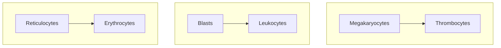

---
tags:
  - CMPA
  - MS
title: 10-09-2024 Hematology
date: 2024-10-09
---
**Blood** is a specialized organ that exists in a fluid state. It is composed of **plasma and blood cells**. It makes up 7% to 10% of the human body (~5 to 6 L). It is created in the **red bone marrow** (hematopoiesis). One of the vital functions of blood is for **oxygenation** as it carries oxygen into the body, and carbon dioxide out of it. It also contains nutrients, foreign bodies, and various cells that all function to aid the human body.
___
# CBC Values
1. **Red Blood Cells** are the primary carriers of oxygen into the body and carbon dioxide out of the body. They have a normal lifespan of 120 days. These give the blood its distinct color, and make up a large percent of the composition of blood (see Hematocrit below). The red blood cells are analyzed and "*indexed*" with RBC indices. These values include:
	- **Hematocrit**: the ratio between blood volume and RBC volume. Normally 30% to 40%. Increase in Hct indicates FVD, decrease in Hct indicates FVE.
	- **Mean Corpuscular Volume**: the **size** of the RBC. This value determines the presence of microcytic, normocytic, or macrocytic RBC.
		- Normocytic Anemia occurs in **CKD/RF Anemia**.
		- Microcytic Anemia occurs in **Iron Deficiency Anemia**.
		- Macrocytic Anemia occurs in **Megaloblastic Anemia**.
	- **Hemoglobin** is found within RBCs. Lowered Hgb is called **anemia**, and elevated Hgb is called **polycythemia** (found in smokers). Anemia patients display **pallor, fatigue, and palpitations**.
		- **Normal Female Volume**: 12 to 14 grams/deciliter
		- **Normal Male Volume**: 14 to 16 grams/deciliter
2. **White Blood Cells**: forefront immunologic agents.
	- **Normal**: 5,000 to 10,000
	- Decreased WBC is termed as **leukopenia**.
		- **Avoid crowded places**, limit visitors, and observe hand hygiene and the use of personal protective equipment.
		- Diet for patients with leukopenia: **low-residue low-fiber high-protein diet**.
		- **Reverse isolation** for patients.
	- Increased WBC is termed as **leukocytosis**. This suggests an **active bacterial infection**.
3. **Platelets**: platelets are important for **clotting**. They have a normal lifespan of 10 days.
	- **Normal**: 150,000 to 450,000.
	- **Thrombocytopenia** poses a risk for bleeding as the body is unable to clot wounds.
	- **Thrombocytosis** produces a risk of excessive clotting.

>[!WARNING] Blasts
>Erythrocytes carry more oxygen than reticulocytes, and thrombocytes are able to clot better than megakaryocytes. Similarly, **blasts** are unable to match leukocytes in immunologic ability. However, these are exactly the cells that are produced excessively in **leukemia**, which then "*drown out*" other cells. In such a case, despite a high white blood cell count, the immune system is impaired.

%% ___
# Leukocytes
1. **Granulocytes**: Neutrophils, Eosinophils, and Basophils
	- Neutrophils increase in bacterial infection. It is the most abundant white blood cell.
	- **Eosinophils** increase in allergic reactions.
	- **Basophils** are the least abundant.
2. **Agranulocytes**: Lymphocytes, Monocytes
	- Monocytes, when they mature, are macrophages. They consume foreign bodies and organisms through phagocytosis.
	- **Lymphocytes** produce antibodies. The major producer of antibodies is the spleen with its high number of lymphocytes. Other organs include the tonsils and appendix. %%
___
# Nutritional Anemias
1. **Iron-Deficiency Anemia** (IDA) is produced by a decrease in iron supply.
	- Causes: bleeding, nutritional deficiencies
	- Diet High in Iron: Meat, Seafoods, Eggs, Liver, Fish (Meat SELF), and Dark Green Leafy Vegetables. Iron is best absorbed with Vitamin C. Ferrous sulfate is best taken with an empty stomach. Stool may appear dark green or black.
	- **Diagnostics**: microcytic hypochromic anemia and decreased serum ferritin. Pathognomonic sign: **koilonychia**; spoon-shaped nails.
	- **Administration of Iron Supplements**: 300 – 325 mg TID oral 1 hour before meal. For liquid form, use straw; deep IM, use Z-track. Include Vitamin C to facilitate absorption.
2. **Megaloblastic Anemia**, further divided into Vitamin B9 (FADA) and Vitamin B12 (Pernicious Anemia) deficiency. These vitamins are important in the production of DNA in RBCs.
	- **Diagnostics**: Macrocytic Anemia. Pathognomonic Sign of **Beefy Red Tongue**; Glossitis. Decreased hemoglobin, decreased DNA synthesis, but increased MCV.
	- **FADA**: those at risk for Vitamin B9 deficiency are alcoholics and those in pregnancy or dialysis. Some drugs (e.g. Methotrexate) may also cause FADA.
	- **Pernicious Anemia**: those at risk for Vitamin B12 deficiency are those who had a Billroth I or II procedure (it removes the IF necessary to absorb Vitamin B12).
		- **Diagnostic Picture**: Glossitis/Beefy Red Tongue, and **Paresthesia**. 24-hour urine for Schilling Test.
		- These patients require a life-long monthly administration of Vitamin B12.
		- Diet for B12: eggs, meat, poultry, shellfish, milk, and milk products, citrus, legumes
___
# Non-Nutritional Anemia
1. **Anemia of Renal Failure**: decreased blood oxygen signals to the kidneys to produce erythropoietin, a hormone that stimulates the red bone marrow to produce red blood cells. However, in renal failure, **erythropoietin is insufficient**, decreasing RBC production. This results in **Normocytic Anemia**.
	- Management: **Epogen**, a synthetic erythropoietin, is given to patients with RF to manage anemia. It is given thrice a week subcutaneously. If severe, **blood transfusion** may be necessary.
2. **Sickle Cell Anemia**: triggered by hypoxia and the HbS gene is inherited in the African Race.
	- Avoid high altitudes and cold environments. Encourage hydration.
	- **Definitive Diagnosis**: **hemoglobin electrophoresis**
	- **Pain** is the most important nursing diagnosis, especially as a symptom of crisis. An opioid (morphine) may be required.
	- mn. **SICKLE**: Jaundi(s)ce, Avoid (i)nfection (triggers crisis), (C)rescent-shaped RBC, (K)Crisis and Pain, (Lahi) Hereditary, (E)ncourage hydration (3L/day to avoid clotting)
	- mn. **HOPIA**: Hypoxia, high altitudes, opioid (morphine), pain, infection, adequate hydration
	- **Complications**: pulmonary hypertension, priapism, impotence, infection, strike, acute chest syndrome

>[!ERROR] Jaundice
>**Hemoglobin** is released when the RBC is lysed, and releases **Heme**, which converts to bilirubin, which leads to the jaundiced presentation of patients with hemolytic anemia (e.g. sickle cell anemia, malaria).

3. **Aplastic Anemia**: an idiopathic disorder resulting in insufficient production of blood cells.
	- If determined as autoimmune, this is treated by removing antibodies (**splenectomy**) or immunosuppression (**steroids**). If necessary, replacement of damaged bone marrow tissue with a **bone marrow transplant** may be done.
	- **Diagnostic Picture**: **pancytopenia**; risk for infection, bleeding, and the 3 Ps of anemia.
	- **Nursing Interventions**: provide rest for fatigue, avoid caffeine, prevent infection, prevent bleeding (avoid rigorous activities, NSAIDs, Aspirin, etc.)