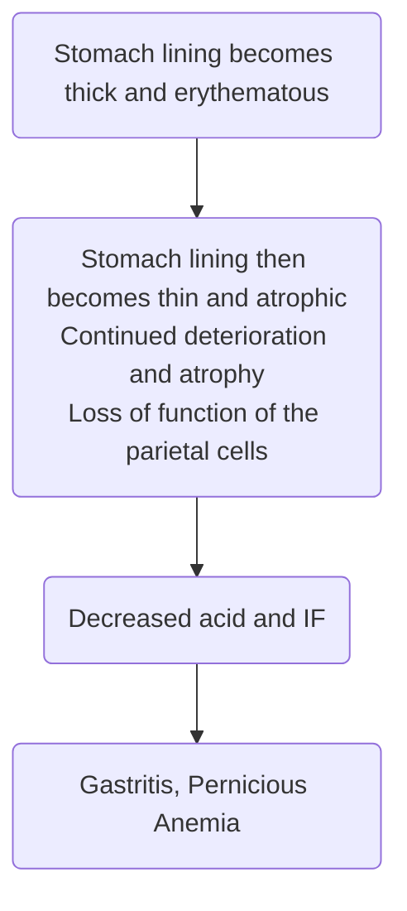

Inflammation of the **gastric mucosa**. This is classified as either acute or chronic. It occurs most commonly in the fifth and sixth decades of life, more commonly in men than women, and for heavy drinkers and smokers.
# Acute Gastritis
Lasting several hours to a few days and often stems from **ingestion of corrosive, erosive, or infectious substances**. It may also be caused by:
- **NSAIDs** (e.g. Aspirin), **chemotherapeutic drugs**, and **steroids**.
- **Acute alcoholism**
- **Food poisoning** (commonly of the genus *Staphyloccocus*).
- Food substances including excessive amounts of **tea**, **carbonated drinks**, and **pepper**.
- Food with **rough textures** or are **very hot**.
- May also be the first sign of an acute systemic infection.
## Pathophysiology
The mucosal lining of the stomach, normally protecting from acid, is composed of **prostaglandins**. When, for any reason, this **protection is penetrated**, gastric juice comes into contact with the mucosa and causes **injury, including to the small vessels of the stomach**. This leads to **edema**, **hemorrhaging**, and **potential ulcer formation**.

## Assessment Findings
- **Epigastric Discomfort**
- Feeling of fullness or **early satiety**
- **Cramping**
- **Belching** and **flatulence**
- **Severe nausea and vomiting**
- **Hematemesis**, the presence of blood in vomitus d/t internal bleeding
- **GI Bleeding**, which sometimes may be the only manifestation
- **Diarrhea** as a concurrent effect of **gastritis associated with contaminated food**.
## Diagnostic Examination
- A detailed history of **food intake**, **medications taken**, and **disorders potentially related to gastritis**.
- **Gastroscopy**
## Nursing Interventions
### Diet Therapy
- **NPO** until nausea and vomiting subside.
- Once tolerated, a [[A215/Bland Diet|bland diet]] may be given e.g. **Decaffeinated Tea**, **Gelatin**, **Toast**. Avoid spicy foods, caffeine, and large, heavy meals.
- Wean the client into a normal diet as tolerated.
## Medical Interventions
- **Antiemetics**: Perinorm (injection), Domperidone (tablet) may be used to inhibit vomiting.
- **Antacids**, **Histamine** (H2) **Blockers**: Cimetidine, Ranitidine, or Famotidine may be used to reduce pain.
- **Prostaglandin E1** (PGE1) may be used as an analog to protect the stomach mucosa and inhibit gastric acid secretion if the use of [[A216/NSAIDs|NSAIDs]] is a problem.
# Chronic Gastritis
This may take form in three ways:
- **Superficial Gastritis**: creates a reddened, edematous mucosa with small erosions and hemorrhages.
- **Atrophic Gastritis**: present in all layers of the stomach, often in association with gastric ulcers, cancer, and invariably with [[MS/Pernicious Anemia|pernicious anemia]]. This is characterized by a decrease in the number of [[ANPH/13#Stomach|chief and parietal cells]].
- **Hypertrophic Gastritis**: the rugae of the stomach becomes irregular, thick, or nodular because of the accumulation of inflammatory cells in the mucosa of the stomach. Hemorrhages occur frequently.
## Etiologic Factors
- Infection with **[[MICP/Helicobacter pylori|Helicobacter pylori]]** (atrophic) or **gastric surgery**.
- **Gastric resection** with a gastrojejunostomy, **bile and bile acids may reflux** into the remaining stomach, causing gastritis.
- **Age**
## Pathophysiology
The stomach lining becomes **thickened and erythematous**, subsequently becoming **thin and atrophic**. This deterioration and atrophy continues, leading to the loss of function of the [[ANPH/13#Stomach|parietal cells]]. Acid secretion and intrinsic factor production decreases, leading to the inability for **Vitamin B12 absorption**. This results in [[MS/Pernicious Anemia|pernicious anemia]].

## Assessment Findings
- **Anorexia**
- **Fullness**, **Dyspepsia** (indigestion)
- **Belching**
- **Vague Epigastric Pain**
- **Nausea** and **Vomiting**
- **Intolerance of spicy and fatty foods**
## Complications
- Hemorrhaging, Pernicious Anemia, Gastric Cancer (chronic inflammation may create pre-malignant conditions)
## Nursing Management (Diagnosis)
1. Acute pain related to irritated stomach mucosa
2. Imbalanced nutrition, less than body requirements, related to inadequate intake
3. Risk for imbalanced fluid volume related to insufficient fluid intake and excessive fluid loss secondary to vomiting
4. Anxiety related to treatment
5. Deficient knowledge about dietary management and disease process
## Medical Management
- **Antacids**, **Histamine** (H2) **Receptor Antagonists**, **Proton Pump Inhibitors**
- Diet: bland, avoid precipitating foods.
- **Antibiotics** and other medications if caused by [[MICP/Helicobacter pylori|H. pylori]]. This may be repeated for two weeks.
- **IM Vitamin B12** administration if [[MS/Pernicious Anemia|pernicious anemia]] develops. This may be weekly then repeated monthly for life. 
