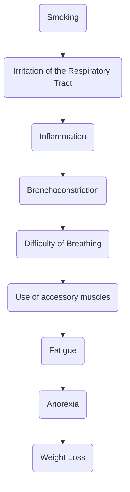
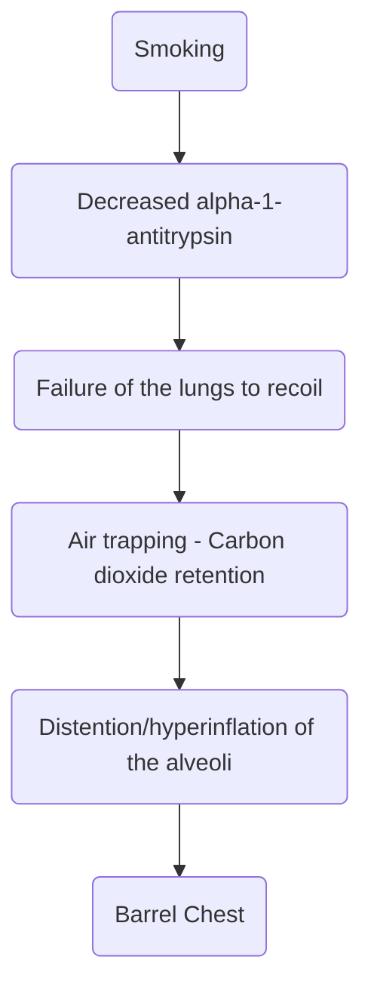
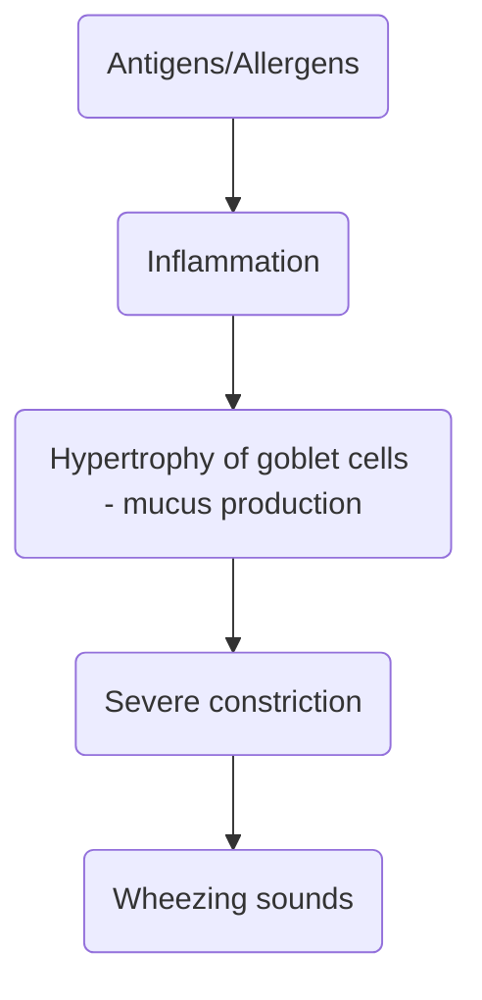

---
tags:
  - CMPA
  - XTRN
title: PPRE Finals Review
description: A review held by the PPRE Review Center in collaboration with our university to review topics included in the finals examinations of the irregular batches for CA2. This covers Medical-Surgical Nursing (Cardio, Respi), Community Health Nursing (EPI, PHC), Normal Obstetrics, and Pediatrics (G&D)
date: 2024-12-15
draft: false
---
# Arterial Blood Gas Analysis
## Simple ABGs
1. **pH**: **7.35 - 7.45**. Lower than normal is acidosis, higher is alkalosis.
2. **CO₂**: **35 - 45**. Lower than normal is alkalosis, higher is acidosis.
3. **HCO₃**: **22 - 26**. Lower than normal is acidosis, higher is alkalosis.
4. Whichever of the **CO₂** (respiratory) and **HCO₃** (metabolic) readings **agree with the pH** is the result. If both agree, it is **combined** or **mixed**.

>[!TIP] **Mnemonics**
>The **ROME** mnemonic may be used to remember which value corresponds to metabolic and respiratory imbalances: **Respiratory-Opposite, Metabolic-Equal**.
>- In **respiratory** pH disorders, pH and PaCO₂ go in **opposite** directions. As pH goes down, PaCO₂ goes up, and vice versa.
>- In **metabolic** pH disorders, pH and HCO₃ go in **equal** directions. As pH goes down, HCO₃ also goes down, and vice versa.
## Compensation
1. **Fully Compensated**/**Compensated**: Read the pH. If it is normal, full compensation is achieved. Identify which region the pH is closer to even in the normal range. Determine the match from CO₂ or HCO₃ to differentiate respiratory from metabolic pH imbalance.
2. **Partially Compensated**: Read the pH. If none of the values are normal, compensation is partial. Same rules as before are observed.
3. **Uncompensated**: If one of CO₂ or HCO₃ is normal, but the pH is abnormal, no compensation has been achieved.
## Sample Questions
These are pulled from [SurviveNursing](http://survivenursing.com/abg/). Try to answer each item. 🌚Old site, so security is slightly outdated (HTTP protocol).🌚

|  pH  | CO₂ | HCO₃ |                      Answer                       |
| :--: | :-: | :--: | :-----------------------------------------------: |
| 7.44 | 49  |  31  |    👁️Fully Compensated Metabolic Alkalosis👁️    |
| 7.76 | 26  |  20  | 👁️Partially Compensated Respiratory Alkalosis👁️ |
| 7.21 | 48  |  27  | 👁️Partially Compensated Respiratory Acidosis👁️  |
| 7.50 | 32  |  15  | 👁️Partially Compensated Respiratory Alkalosis👁️ |
| 7.20 | 34  |  37  | 👁️Partially Compensated Respiratory Acidosis👁️  |
| 7.22 | 30  |  19  |  👁️Partially Compensated Metabolic Acidosis👁️   |
| 7.22 | 26  |  19  |  👁️Partially Compensated Metabolic Acidosis👁️   |
| 7.23 | 35  |  18  |      👁️Uncompensated Metabolic Acidosis👁️       |
| 7.81 | 54  |  37  |  👁️Partially Compensated Metabolic Alkalosis👁️  |
| 7.37 | 48  |  36  |   👁️Fully Compensated Respiratory Acidosis👁️    |
___
# Chest Tubes
The **three-way bottle system** used for cases of infiltration of the pleural space (air, fluid/effusion, blood).
1. **Bottle 1**: (nearest) drainage collection bottle
2. **Bottle 2**: water-seal
3. **Bottle 3**: (farthest) suction bottle

Principles and considerations for chest tube use include:
1. All the fluids used in each bottle is NSS and **sterile**. This prevent contamination from vertical movement of the bottle contents.
2. A normal drainage rate is **less than 100 mL per hour**. More than this and the physician must be informed as this may indicate an irregularity.
3. **Bubbles** are **continuous in the third bottle** and **intermittent in the second bottle**
4. **Dislodging** of the tube from the patient requires **immediate** covering of the stoma with a **gauze with Vaseline** (petroleum; oil-based). If it is removed from the bottle, the tube is **immersed in sterile water or reconnected**.
5. **Ineffective tube function** (or normalized lung function) will be reflected by the absence of **fluctuations** (tidal, oscillation, vacillation) in the drainage bottle.
	1. Kinking or coiling of the tube
	2. Obstructed tubes
	3. Dislodged tubes
6. **Removal** of the tube may be indicated by the re-expansion of the lungs. During the removal of the tube, the patient is instructed to **perform a valsalva maneuver** to increase intrathoracic pressure. This involves **inhalation then bearing down**.

>[!TIP] Thorax Infiltration
>In pneumothorax, hemothorax, or pleural effusion, the lungs cannot expand and will be miniscule upon imaging, and will exhibit **diminished breath sounds**.

___
# Primary Health Care
A system of healthcare delivery launched in **1978** first declared in Alma, Atta, USSR. Its theme focuses around "**Health for all by year 2000**". In the Philippines, this was declared by President Ferdinand Marcos through **Letter of Instruction 949** with the theme of "**Health in the hands of the people by year 2020**". The program is primarily managed by the **Department of Health** (DOH). 🌚PhilHealth is also an attached agency to the DOH.🌚
1. **PHC must be affordable and cost-effective**: all individuals must have access to basic health services
2. **PHC must be accessible**: geographically located
3. **PHC must be acceptable/appropriate**: culturally sensitive services
4. **PHC must be available**: services are provided adequately

## Cornerstones of the Primary Health Care
1. **Active Community Participation**: members of the community must engage and utilize the health services offered and available; **empowerment** of the people to take health into their hands.
2. **Inter- and Intrasectoral Linkages**
3. **Support Mechanisms Made Available**
4. **Use of Appropriate Technology**: maximizing the technological resources.
## Elements of Primary Health Care
mn. ELEMENTS
1. [[#Expanded Program on Immunization]]
2. **Locally Endemic Diseases**
3. **Essential Drugs**
4. **Maternal and Child Health**
5. **Education for Health**
6. **Nutrition**
7. **Treatment of Communicable and Non-Communicable Diseases**
8. **Safe Water and Sanitation**
## Health Workers
1. **Intermediate Health Workers**: those to graduate and are licensed. These are physicians, nurses, midwives, and sanitary engineers. These workers are on a payroll.
2. **Barangay Health Workers** (BHWs): These are workers who assist in the implementation of health programs. These include trained *hilot* workers, auxiliary personnel, healers, etc. These workers are on allowance from the municipal. Despite this, they are the very first line (grassroots) of implementing primary health care.
	- These workers are only allowed to provide health teachings for **basic knowledge**.
## Levels of Prevention
1. **Primary Prevention**: health promotion and disease prevention. This is the main focus of PHC.
2. **Secondary Prevention**: early detection and prompt treatment. Any examination or laboratory test with the ultimate goal of detecting disease is part of this type of prevention. Many screening programs are also in place for this.
3. **Tertiary Prevention**: rehabilitation for those at the end stage or recovering from a disease. This also includes those who experience chronic illness or disability.
## Levels of Healthcare Referral Systems
1. **Primary**: the first line of healthcare to receive most individuals seeking care. These are able to provide **basic health services** and also engage in health promotion and disease prevention. Care is provided on an outpatient basis. This includes barangay health stations/units, rural health units, and clinics.
2. **Secondary**: institutions able to provide advanced care on an inpatient and outpatient basis. This includes district-level, city-level, and provincial hospitals. Distinctly, this is where surgeries are done.
3. **Tertiary**: general hospitals, medical hospitals, centers, training hospitals, regional hospitals, and hospitals with specializations. This is where highly complicated disorders are handled.
___
# Expanded Program on Immunization
**Immunization** is the process of introducing vaccines into the body before infection sets in as a primary method of prevention of disease. In the Philippines, this is done every Wednesday (immunization day). This is legally based on:
1. **P.D. 996**: the goal is to reduce morbidity and mortality in children from preventable/immunizable diseases.
## Elements of EPI
mn. SICAT
1. **Surveillance**
2. **Information and Education**
3. **Cold Chain**: maintenance of vaccine potency/viability by maintaining ideal temperatures for storage and transport.
4. **Assessment**
5. **Target Setting**: "mass in approach", with the goal to **reach every barangay**.
## Cold Chain
The transport vehicle used for the cold chain method is the **COLD DOG**.

| Viability | Level of Storage              |
| --------- | ----------------------------- |
| 6 months  | Regional Level                |
| 3 months  | Provincial Level              |
| 1 month   | Municipal Health Center       |
| 5 days    | BHS/RHU without refrigeration |
| 3 days    | BHS/RHU without refrigeration |
## Components of EPI

| Vaccine                                                           | Schedule                          | Diseases                                                                      | Dosage                                             | Site                                                            | Route |
| ----------------------------------------------------------------- | --------------------------------- | ----------------------------------------------------------------------------- | -------------------------------------------------- | --------------------------------------------------------------- | ----- |
| **Bacille-Calmette Guerin (BCG)**                                 | at birth and upon school entrance | Pulmonary Tuberculosis; Leprosy; Primary Complex                              | 0.05 mL at birth  0.1 mL for school entrants | Right Deltoid at birth  Left Deltoid upon school entrance | ID    |
| **Hepatitis B Vaccine (HBV)**                                     | at birth                          | Hepatitis B                                                                   | 0.5 mL                                             | Deltoid                                                         | IM    |
| **Diphtheria-Pertussis-Tetanus-Hep. B-Hib (Pentavalent Vaccine)** | 6, 10, 14 weeks                   | Diphtheria Pertussis Tetanus Hepatitis B Haemophilus influenzae B | 0.5 mL                                             | Deltoid                                                         | IM    |
| **Oral Polio Vaccine (OPV)**                                      | 6, 10, 14 weeks                   | Poliomyelitis                                                                 | 0.5 mL; 2-3 drops                                  | Mouth                                                           | Oral  |
| **Inactivated Polio Vaccine (IPV)**                               | 14 weeks                          | Poliomyelitis                                                                 | 0.5 mL                                             | Deltoid                                                         | IM    |
| **Pneumococcal Conjugated Vaccine (PCV)**                         | 6, 10, 14 weeks                   | Pneumonia                                                                     | 0.5 mL                                             | Deltoid                                                         | IM    |
| **Measles Mumps Rubella (MMR)**                                   | 9 months, 12-15 months            | Myxovirus; measles, mumps, rubella Prevent Measles Syndrome in children    | 0.5 mL                                             | Upper arm                                                       | SC    |

Principles of EPI are necessary for atypical cases:
1. **It is safe to administer vaccines on the same day** with **different routes**. If using the same site, administration should be spaced by at least one to two inches.
2. **Fever (up to 38.5C)**, **Malnutrition**, and **N&V** are **NOT CONTRAINDICATIONS FOR VACCINATION** except if these are indications for **hospitalization**. Vaccinations are still given, but **not counted towards completion of the dosages**.
3. **Boosters are given from 8 to 12 months** for vaccines given on the 2nd, 4th, and 6th month (6, 10, 14 weeks).
4. **BCG and MMR**, live vaccines, are **not given to immunocompromised patients**.
5. **Discontinue Pentavalent Vaccines** for patients with **neurological problems**, such as those experiencing convulsions and seizures. This is because the pertussis vaccine can cause convulsions, which can further exacerbate the problem. Instead, the DT vaccine is used.
6. The most **heat sensitive** vaccines are OPV and MMR. These are stored in -2°C to -8°C temperatures in the freezer. The rest of the vaccines are stored in the body, stored from 15°C to 25⁠°C.
___
# Chronic Obstructive Pulmonary Disease
Otherwise known as **Chronic Airway/Airflow Limitation** (CAL). There are four landmarks in COPD:
1. **The main cause of COPD is smoking**. This is a reason why asthma is no longer part of COPD; it is caused by allergy rather than smoking or air pollution.
2. **The effect of smoking is constriction; obstruction**.
3. Oxygenation is decreased because of such an obstruction. Carbon Dioxide is increased in COPD.
## Chronic Bronchitis
**Blue Bloaters** is another term for this disease. The definition of chronic bronchitis is a **productive cough for three months in a year for two consecutive years**.
1. **Causes**: smoking
2. **Pathophysiology**:

### Management
1. **Oxygen supplementation** may be required to reduce hypoxia.
	- Oxygen is conducive to **combustion**. A **NO SMOKING SIGN** must be placed in a prominent area, particularly the door to the room (best), the head of the bed, and the tank itself.
	- Oxygen is a **dry gas**. This requires humidification before being delivered to the patient.
	- **Contraindicated objects**: wool blankets and metal objects that may cause static electricity and sparking, which may initiate combustion.
2. **Pharmacologic management**: (mn. SAX)
	- **Bronchodilators** (mn. SAX)
		1. **Sympathomimetics**
		2. **Aminophylline**
		3. **Xanthine Derivates**
	- **Mucolytics**:
		1. **Carbocistine**
	- **Expectorant**:
		1. **Guiafenesin**
3. **Force Fluids**: increase oral fluid intake to liquefy secretions
4. **Chest Physiotherapy** (CPT): used to mobilize secretions for patients who have difficulty in expectorating the secretions. For those who are fully unable to expectorate secretions, suctioning is done instead.
	- CPT is **done upon awakening**.
	- CPT is deemed effective upon the auscultation of **clear breath sounds**.
	- A **chest x-ray** is the best way to locate mucus. However, the most common method is to use **auscultation** to find the location of the mucus.
	- **In order**, CPT utilizes
		1. **Percussion** (Clapping): the mechanical breakdown of mucus with the use of rhythmically applied strikes at the location of the mucus with **cupped hands during expiration**.
		2. **Vibration**: mobilization of secretions using the vibrations applied by **flat hands during expiration**.
		3. **Postural Drainage**: the utilization of positioning and gravity to move the secretions. Each position is held for 15 to 30 minutes and chosen according to the location of the secretion
## Emphysema
**Pink Puffers** are the other term for this disease. The definition of emphysema is a **hyperinflation of the alveoli** wherein the alveoli become inelastic and distended. In such a disease process, no recoiling occurs due to the loss of elasticity, which results in **air trapping**.
1. **Cause**: smoking (primary), alpha-1-antitrypsin deficiency
2. **Pathophysiology**:

3. **Signs and Symptoms**:
	- **Barrel chest**, an increased anteroposterior diameter of the chest.
	- **Coughing** is **not a common symptom** as mucus production is not elevated in this disease.
	- **Hemoptysis** is a **late sign** of emphysema once the alveoli start to **rupture**, releasing blood into the airways.
	- **Frothy sputum** is produced by air trapping.
	- **Hyperresonance** upon percussion due to high distention of the alveoli.
	- **Increased residual volume** upon expiration.
### Management
1. **Avoid smoking**
2. **Diet**: provide a high calorie diet.
	- Lower carbohydrates to reduce carbon dioxide formation
	- Increase protein to aid in the alveolar repair
3. **Positioning**: orthopneic position, otherwise known as the **tripod position**.
4. **Pursed Lip Breathing**: extending exhalation longer than inhalation to promote reduction of residual volume and to reduce air trapping. This is the style of breathing that gives its name "puffer"
## Bronchial Asthma
A treatable, reversible inflammation of the bronchi as a hypersensitivity reaction to allergens. This disease is not curable and requires 
1. **Causes**: primarily unknown; hereditary, secondarily caused by allergens (antigen).
2. **Pathophysiology**:

3. **Signs and Symptoms**: 
### Management
1. **Avoid allergens**
2. **Pharmacologic management**:
	1. **Bronchodilators**
	2. **Mucolytic**
	3. **Expectorant**
	4. **Steroids**: delivered using a metered dose inhaler to reduce the inflammatory response of the body
3. **Oxygen supplementation** given **after** the attack.
4. **Brown Paper Bag** given **during** the attack.

>[!TIP] The Medulla (Respiratory Center)
>The medulla is stimulated during the attack using the brown paper bag by increasing carbon dioxide levels in the blood. If oxygen is given during the attack, the drive to breathe is lost, and may result in arrest.

### Complications
1. **Status Asthmaticus**: a continuous ang prolonged induction of the hypersensitivity reaction, leading to a continued state of asthma that does not respond to standard medications.
___
# Myocardial Infarction
Colloquially known as a Heart Attack, this begins with myocardial injury, myocardial ischemia, then myocardial infarction. This involves a **total obstruction** of the coronary arteries.
1. **Signs and Symptoms**:
	- **Crushing chest pain** from ischemia producing lactic acid. This **radiates** to the **jaw and neck**, possible to the left arm. In angina, it radiates to the shoulders and hands.
	- **Fever** is among the most unusual sign and symptom of M.I.
	- **Anxiety**
	- **Diaphoresis**
2. **Diagnostic Exam**:
	- **Cardiac catheterization** is the **goal standard** for cardiac disorders. This is used to check for the presence of an obstruction. This may be inserted through the **brachial artery** or **femoral artery**.
		- Pre-procedure, the patient is **checked for allergies to iodine** for use as a contrast medium. If the contrast is administered and an allergy occurs, anaphylactic shock may occur.
			1. **Epinephrine** is prepared in case a reaction occurs, even with the procedure being continued. The benefits outweigh cancellation when the reaction is manageable.
			2. Additionally, a **kidney function test** (BUN, Creatinine) is done because contrast is nephrotoxic.
		- Post-procedure,
			1. **Oral fluid intake is increased** to facilitate the removal of the contrast.
			2. **Pressure is applied to the insertion point** to prevent bleeding.
			3. **Complete bed rest** is applied for 4 to 6 hours.
	- **Cardiac Enzymes**:
		- **Myoglobin**: the earliest appearing cardiac enzyme, but is not adequately specific
		- **Troponin I**: found in progressing disease
		- **CPK-MB**: the most sensitive cardiac enzyme; this is indicative of M.I.
	- **Electrocardiogram**: a visual reading of the electrical activity of the heart.
		- **Myocardial Injury**: ST Elevation (angina)
		- **Myocardial Ischemia**: T wave Inversion
		- **Myocardial Infarction**: Pathologic Q-wave
## Medical Management
mn. MONAS
1. **Morphine Sulfate**: a narcotic analgesic; the priority during M.I. is pain. Pain is also correlated to the degree of injury. This acts on the medulla, and can cause **respiratory depression**; check respiratory rate regularly. The antidote used for morphine overdose is **Naloxone** (Narcan)
2. **Oxygen**: pain is caused by the demand-supply imbalance of oxygen to the heart. Oxygen is the first intervention given for a patient with M.I. as this also reduces pain.
3. **No to Nitroglycerin**: previously established as the main intervention for M.I. Current practice is to administer NTG if the condition is undecided between AP and MI, otherwise do not administer nitroglycerin if M.I. is confirmed.
	-  **Sublingual**: the sublingual administration is considered effective if there is a **burning sensation** underneath the tongue.
		- Nitroglycerin is given **at most three times** with an interval of **five minutes between doses**. If pain continues after three doses, the disorder is likely M.I. rather than A.P.
		- **Expiration**: the bottle hits a limit of three months of use once opened, otherwise the expiration written on the bottle is followed in unopened containers.
		- **Side Effect**: headache due to vasodilation producing hypotension.
	- **Oral**
	- **Intravenous**
	- **Patch**: placed on the skin, on a **hairless area** of the body. This is considered effective if there is an **absence of chest pain**.
4. **Aspirin**: an antiplatelet medication used to prevent calcification of plaque formed on the blood vessel walls. This is given **within six hours of a heart attack**.
	- Observe: **platelets**
	- **Side Effect**: **Tinnitus** may occur. The medication is discontinued and the physician is informed. The antidote for aspirin is **sodium bicarbonate**.
5. **Streptokinase**: a thrombolytic medication used to break down formed clots.
	- Observe: **PTT**
	- **Side Effect**: **Bleeding** may occur. The antidote for aspirin is **aminocaproic acid** (amicar)
## Nursing Management
mn. CHEST PAIN
1. **Comfort**, specifically for pain relief
2. **Hemodynamically Stable**: the most critical period after an M.I. is 24 to 48 hours. The most common complication that compromises hemodynamic instability is **premature ventricular contractions** (PVCs).
3. **Extreme Cold is Avoided** to reduce vasoconstriction
4. **Sedate the Patient** to reduce anxiety. The drug of choice is **Diazepam**.
5. **Take Time for Nutrition**: while the patient is placed on NPO initially. Eating will shunt blood flow from the body to the GI tract, which will further exacerbate the problem.
	- Progress from Clear Liquid Diet (all except milk), Soft Diet, then Salt-Restricted Diet
6. **Prevent Constipation** and avoid enemas, as these will activate the valsalva maneuver (vagus nerve), which slows down blood flow and blood pressure.
7. **Assess Sexual Behavior**: sex and masturbation is only allowed **four to six weeks after an attack**. Alternatively, ability may be established by the patient's ability to **traverse two flights of stairs** without exhaustion.
8. **Institute Cardiac Rehabilitation**:
	- Within the first two days (critical period), the patient is placed on **complete bed rest without bathroom privileges**
	- On the third day, **the patient is allowed to dangle their feet**, seated at the edge of the bed.
	- On the fourth day, **the patient is allowed to transfer to the sofa** (or chair).
	- On the fifth day, **ambulate around the room**.
	- On the sixth day, **ambulate around the corridor** or hallway.
	- On the seventh day, the patient **may go home**.
9. **Note for Complications**:
	1. **CHF** is a common complication of M.I.
	2. **Cardiac Tamponade** may result post-infarction known as Dressler's Syndrome.
___
# Growth and Development
**Growth** is an increase in size, while **Development** is an improvement in functionality.
## Infancy

| Month  | Milestones                                                                                                                                                                                                                               |
| :----: | ---------------------------------------------------------------------------------------------------------------------------------------------------------------------------------------------------------------------------------------- |
| **1**  | - **Midline Vision**: the infant is only able to see midline. - **Head Lag**: prominent; neck muscles are unable to carry the weight of the head.                                                                                     |
| **2**  | - **Social Smile**: the infant smiles back to other people. - **Cooing**: begins, as the infant attempts to vocalize.                                                                                                                 |
| **3**  | - **Palmomental Reflex**: the head-to-mouth reflex, with the infant bringing objects to his mouth. - **Peripheral Vision**: vision continues to develop. - **Babbling**: vocalization continues, with the infant begins to babble. |
| **4**  | - **Reaching**: the infant learns to reach for objects. - **Lifting the Head**: the infant is able to lift the head.                                                                                                                  |
| **5**  | - **Smiles at reflection**. - **Roll Over**: the infant is able to roll over.                                                                                                                                                         |
| **6**  | - **Sits with support** - **Palmar Grasp** is developed; the infant is able to hold their bottle with two hands.                                                                                                                      |
| **7**  | - **Able to transfer from one hand to another**; the infant can move objects from one hand to another.                                                                                                                                   |
| **8**  | - **Sits without support**. - **Able to follow commands**, commonly with the "close, open, close, open" commands.                                                                                                                     |
| **9**  | - **Pincer Grasp**: the infant is able to grab objects with their opposable thumbs. - **Creep and Crawl**                                                                                                                             |
| **10** | - **Stands with support** - **Object Permanence** becomes developed                                                                                                                                                                   |
| **11** | - **Cruising**: the infant is able to travel by holding onto a wall or the rails of a crib, attempting to walk.                                                                                                                          |
| **12** | - **Walking with support**, often while being handheld or with a walker. - **Able to hold a cup**, as progression from the bottle in six months.                                                                                      |
>[!CITE] Cheat Sheet
>The remaining parts of this lecture was deferred to self-study using [Mr. Wong's cheat sheet](https://docs.google.com/document/d/1-35I0MaYEJ6OSijSuHYJ-U2UD8GZMr9TAgN3TnAVWXo/edit?tab=t.0).