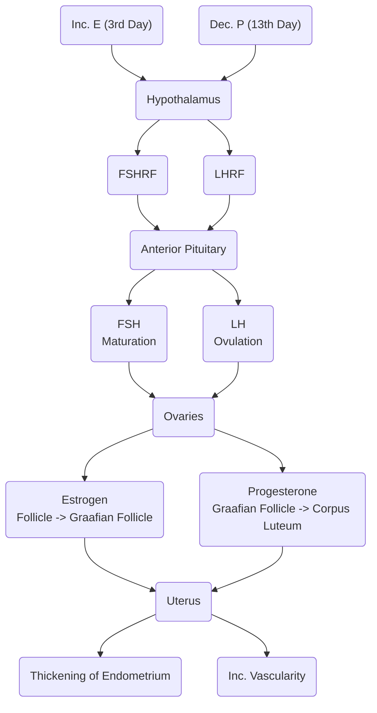

**Menstruation** is bleeding associated with the shedding of the endometrium the uterus thickens to prepare for fertilization after ovulation. From **30 to 80 cc of blood is normally lost**, containing 12 to 29 mg of iron.
- The **Menstrual Period** lasts for 3 to 5 days, with a maximum of 7 days.
- The **Menstrual Cycle** is the duration between menstruations, with an average of 28 days per cycle, ranging from 23 to 35 days, with a maximum of 40 days. It may be **regular or irregular**, depending on the stability of the interval between cycles.
- The **onset of menstruation** often occurs at the age of 12 during puberty, ranging from 9 to 17 years old. The **first menstrual period is termed as the Menarche**.
___
# Fertility Awareness Methods
**Ovulation occurs 14 days before the onset of menstruation**. Also read: [[Family Planning]]
1. **Calendar Method (Regular)**: $\text{Fertility}=5 \text{ days}\leftarrow\text{Ovulation}\rightarrow3\text{ days}$
	- The fertile window begins five days before the date of ovulation (lifespan of sperm) and three days after the date of ovulation (lifespan of ovum + 1)
2. **Calendar Method (Irregular)**: $\text{Fertility} = \text{Shortest Cycle}-18\text{ days}$ to $\text{Longest Cycle}-11\text{ days}$
3. **Cervical Mucus Test** (CMT): also known as Billing's Test, Spinnbarkeit, or Creighton's Test. This test examines the **physical characteristics of the cervical mucus** to determine if the woman is fertile; if the cervical mucus is **abundant, watery, thin, elastic, clear, and slippery**, it is likely the woman is fertile.
	- This requires the woman to obtain and **examine her cervical mucus in the morning** after getting out of bed. If the woman is against touching herself, the alternative 2-day method may be used.
	- Rub the mucus between the thumb and finger, then attempt to stretch it out. **If the mucus does not break after 5 to 10 cm**, it is likely the woman is fertile.
4. **2-day Method**: observation of whether or not the cervical mucus feels "*dry*" or "*wet*". **If any day in the past two days has felt wet**, then presume it is a fertile day i.e. only two days of consecutive dryness is presume to be safe.
___
# Hormonal and Structural Control
1. The **hypothalamus** initiates the menstrual cycle. It produces the **Gonadotrophic Releasing Hormones** (GnRH) **FSHRF** and **LHRF**. These stimulate the release of FSH and LH from the anterior pituitary gland.
	- **Follicle Stimulating Hormone Releasing Factor**
	- **Luteinizing Hormone Releasing Factor**
2. **Anterior Pituitary Gland**
	- **Follicle Stimulating Hormone**: facilitates the maturation of the oocytes (immature egg cells).
	- **Luteinizing Hormone**: facilitates ovulation.
3. **Ovaries**:
	- **Estrogen**, the dominant hormone during the first half of the menstrual cycle.
		- **Converts the follicle of the ovary into a Graafian follicle**
	- **Progesterone**, the dominant hormone during the second half of the menstrual cycle.
4. **Uterus**:
	- Estrogen thickens the endometrium and myometrium.
	- Progesterone stimulates capillary growth; increased vascularity thus providing nourishment.

1. **Estrogen is low** after menstruation, thus **stimulating the hypothalamus to initiate a new cycle**.
	- The hypothalamus releases FSHRF, stimulating the APG to release FSH
2. **Follicle Stimulating Hormone** acts to (1) **facilitate the maturation of oocytes** and (2) **stimulate the ovaries to release estrogen/**.
3. **Estrogen** acts to **thicken the myometrium and endometrium** and **converting the ovary follicles** (storage of egg cells) into **Graafian follicles**
	- The **Graafian follicles contains and produces high levels of estrogen**.
4. Elevation of estrogen informs the APG to stop producing FSH. At this point, on the 13th day, **progesterone is low**, which **stimulates the hypothalamus to produce LHRF**. This signals for the production of **LH from the APG**
	- **Luteinizing Hormone** (1) facilitates **ovulation**, and (2) **stimulates the ovaries to produce progesterone**.
5. **High levels of progesterone** (1) converts to **Graafian follicle** into the **Corpus Luteum**, a yellowish collection of cells that **facilitate the growth of a fetus**, and (2) stimulates the uterus to **increase its vascularity**.
	- The **Corpus Luteum** starts to **predominantly produces progesterone along with estrogen**. It has a lifespan of 14 days (hence why ovulation is calculated to be 14 days before the end of a cycle).
6. **High vascularity of the endometrium** increases its oxygen, water, glucose, and amino acid supply; "*Progesterone, the hormone of pregnancy, provides nourishment.*".
7. **Once the corpus luteum degenerates**, its estrogen and progesterone production decreases. Uterine contractions increase, and **the temporary capillaries** in the endometrium **rupture**, leading to **menstrual discharge**.
## In Case of Pregnancy
If ovulation is met with fertilization,
1. The **Corpus Luteum** lifespan extends from 2 weeks to 2 months. After two months, it degenerates, being replaced by the placenta, also producing progesterone.
2. The **Placenta** lasts until the 9th month of pregnancy, after which, it begins to age and degenerate. Its progesterone production then decreases. The ability of progesterone to prevent contractions diminish, and labor begins.