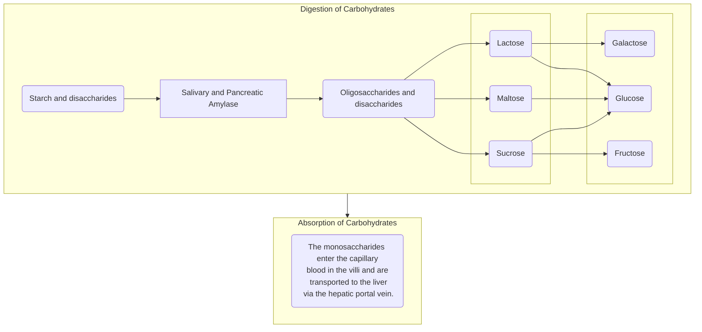
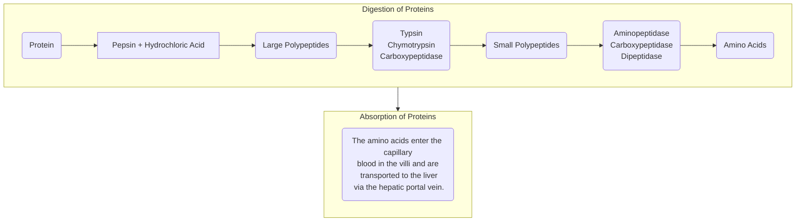
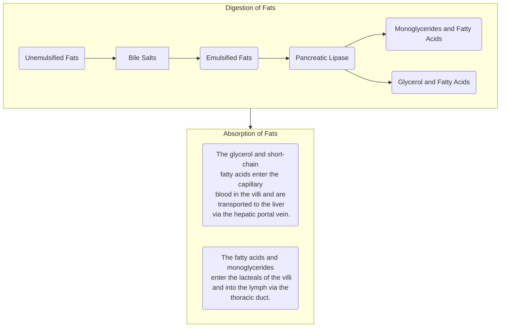

# Overview
## Functions of the GIT
- **Ingestion**: taking in food.
- **Digestion**: breaking food down into nutrient molecules
- **Absorption**: the movement of nutrients from the food into the bloodstream
- **Defecation**: the excretion of indigestible wastes from ingested food
## The Alimentary Canal
The alimentary canal and organs are a part of the gastrointestinal system, which consists of all body parts which make up the hollow tube that starts from the mouth to the anus.
### Mouth
**Ingestion** and **digestion** begins with the mouth, where **mastication** (chewing) of food starts, which converts food into **bolus** by mixing **chewed food with saliva**. The tongue allows for **swallowing**, and is covered by **taste buds**, which allow for taste.
- **Mouth**
- **Lips**
- **Cheeks**
- **Hard Palate**
- **Soft Palate**
- **Uvula**
- **Vestibule**
- **Oral Cavity Proper**
- **Tongue**
- **Tonsils**: divided into the palatine and lingual tonsils.
### Pharynx
A passageway for food, fluid, and air into the esophagus or to the trachea. For food transportation, it moves from the mouth posteriorly into the **oropharynx**, then inferiorly into the **laryngopharynx**, which then continues into the esophagus. Superior to the oropharynx is the **nasopharynx**, which is connected to the nasal cavity. "Swallowing" occurs in the pharynx.
- Food is propelled into the esophagus from the pharynx by two muscles moving in a peristaltic manner: the **longitudinal outer layer** and the **circular inner layer**
### Esophagus
A ~10 inch long **pipe-like structure** that **transports food from the pharynx to the stomach**. It utilizes *slow, rhythmic movements* of the esophageal muscles in order to move food into the stomach. This is known as **peristalsis**.
### Layers of Tissue in the Alimentary Canal Organs
#### Mucosa
The innermost layer, moist membrane made up of:
- Surface epithelium, mostly made of simple columnar epithelium (except for the esophagus, which is made of stratified squamous epithelium) (Also read: [[ANPH/03|Body Tissues]])
- Small amounts of connective tissue (*lamina propria*) and a scanty smooth muscle layer. This lines the cavity (hollow part) of the alimentary canal, known as the **lumen**.
#### Submucosa
Just under the mucosa, it is made up of **soft connective tissue** that contains the blood vessels, nerve endings, mucosa-associated lymphoid tissue (MALT), and lymphatic vessels.
#### Muscularis Externa
Made up of smooth muscle with an **inner circular layer** and an **outer longitudinal layer**, which work together for peristalsis.
#### Serosa
The outermost layer of the wall; this contains fluid-producing cells. Divided into the **visceral** and **parietal** peritoneum.
### Alimentary Canal Nerve Plexuses
There are two intrinsic nerve plexuses that serve as a part of the [[ANPH/07|autonomic nervous system]]. They act to **regulate the mobility and secretory activity of the GIT organs**:
- **Submucosal Nerve Plexus**
- **Myenteric Nerve Plexus**
### Stomach
The **stomach** is a C-shaped organ on the left side of the abdominal cavity. It serves as a temporary storage tank for food, and where carbohydrate digestion continues. **Protein digestion also begins**. The stomach converts **bolus** into **chyme**, taking in food from the cardioesophageal sphincter and releasing it into the small intestines through the pyloric sphincter.
- **Cardial** (*cardia*): named because of its proximity to the heart.
- **Fundus**: the expanded portion lateral to the cardiac region.
- **Body**: the middle portion.
- **Greater Curvature**: the **convex lateral surface** of the stomach.
- **Lesser Curvature**: the **concave medial surface** of the stomach.
- **Pylorus**: the funnel-shaped terminal end of the stomach.
- **Rugae**: folds of the stomach, which allow for expansion of the stomach. The stomach can expand to hold around a gallon (4L) of food when full.
- **Omenta**: fused peritoneal folds that connect the stomach and duodenum with other abdominal organs. There are two omentum that attach to the stomach:
	- **Lesser Omentum**: the double-layer of the peritoneum, which extends from the liver to the lesser curvature of the stomach.
	- **Greater Omentum**: another extension of the peritoneum; a cover for the abdominal organs, with fat for insulation, cushioning, and protection. Connects the stomach and the transverse colon.
- **Stomach Mucosa**: the simple columnar epithelium composed almost entirely of mucous cells. The mucous cells produce bicarbonate-rich alkaline mucus.
	- **Gastric Pits** contain gastric glands that secrete gastric juice. This juice includes intrinsic factor (IF) that allows for the **absorption of Vitamin B12** (Cobalamin).
	- **Chief Cells** produce protein-digesting enzymes (pepsinogens)
	- **Parietal Cells** produce hydrochloric acid that activates enzymes.
	- **Mucous Neck Cells** produce thin acidic mucus (separate from the mucosal alkaline mucus)
	- **Enteroendocrine Cells** produce local hormones such as ***gastrin***.
![[stomach.png]]
![[stomach_mucosa.png]]
### Small Intestines
The small intestines serve as **the main digestive and absorptive organ**. It is the longest by far, spanning from **2 to 4 meters in length** (up to 1.5 times in length after death). It **connects the pyloric sphincter and the small ileocecal valve** (beginning of the colon; large intestines). It is suspended from the posterior abdominal wall by the mesentery. **Enzymes break down chyme into its smallest form**, where it can be absorbed into the bloodstream. Enzymes are transported into the small intestines through:
- **Hepatopancreatic ampulla** is the location where the main **pancreatic duct** and **bile ducts** join.
- **Pancreatic Ducts**: intestinal cells and pancreas enzymes are carried to the duodenum.
- **Bile Duct**: bile, formed by the liver, into the duodenum.
![[duodenum_enzymes.png]]
#### Subdivisions of the Small Intestines
1. **Duodenum**, the starting C-shaped portion of the small intestines continuous with the pylorus (~30 cm long), which is where **enzymes are deposited from the liver and pancreas**. Carbohydrates and proteins are mainly absorbed in here and the jejunum.
2. **Jejunum**, the main site of lipid absorption.
3. **Ileum**, the largest portion of the small intestines, taking up the last ~3/5ths of the small intestines where it ends in the ileocecal canal, the beginning of the large intestines. It absorbs Vitamin B12 (Cobalamin), bile salts, and other undigested products. All segments work to absorb water and electrolytes.
#### Structural Modifications
- The small intestines have an increased surface area for food absorption. This is achieved with the **villus**, **microvillus** structures and **plicae circulares** (circular folds). These are numerous at the start of the small intestines but decrease in number by the end small intestine.
	- **Villi** (finger-like projections) increase the absorptive capabilities (surface area) of the intestines. **Microvilli** are smaller projections of the plasma membrane on the villi.
	- **Plicae Circulares** (circular folds) are the deep folds of the mucosa and submucosa, also for increasing the surface area of the intestines.
- **Peyer's Patches** are lymphatic tissues located in the submucosa that increase in number as you reach the end of the small intestine. These serve as part of the [[ANPH/17|lymphatic system]]. The increase in number can be attributed to the **increased prevalence of bacteria in the residue** reaching this part of the small intestine.
![[small_intestine_structure.png]]
### Large Intestines
Starting from the cecum to the anus, it is shorter than the small intestines at ~1.5m long, but is larger in diameter. The large intestines are also held in place by the mesentery. The large intestines are responsible for **fluid and electrolyte absorption**, **vitamin production and absorption**, and **excretion**.
#### Cecum
The **sac-like beginning of the large intestine**. Hanging inferior to the cecum is the **appendix** (commonly referred to as a vestigial organ), which is an accumulation of lymphoid tissue that sometimes becomes inflamed (appendicitis).
#### Colon
The main body of the large intestines; subdivided into three (main) parts, which ends in the sigmoid colon, rectum, anal canal, and anus:
- **Ascending Colon**: travels up the right side of the abdomen and makes a turn at the right colic (hepatic) flexure.
- **Transverse Colon**: travels horizontally across the abdominal cavity and turns at the left colic (splenic) flexure.
- **Descending Colon**: travels down the left side of the abdomen.
- **Sigmoid Colon**: named because of its shape, it is an S-shaped region of the large intestines that enters the pelvis, connecting to the rectum.
- **Rectum**, **Anal Canal**: located in the pelvis, where feces are stored for excretion.
- **Anus**: the colon's stoma, where feces passes through for excretion. It is normally closed with various muscles and sphincters
	- **External Anal Sphincter**: formed by skeletal muscle and can be **controlled voluntarily**.
	- **Internal Anal Sphincter**: formed by smooth muscle and moves **involuntarily**.
- **Goblet Cells** are found along the entirety of the small and large intestines, which produce alkaline mucus to serve as lubrication for passing substances.
- **Teniae Coli**: the [[ANPH/13#muscularis externa layer|muscularis externa layer]] of the colon (made of three bands of muscle). These are what give the colon its sac-like appearance, the **haustra**.
![[large_intestine.png]]
___
## Accessory Digestive Organs
### Teeth
These are used for mastication (and speech) of food into smaller fragments, beginning its conversion into bolus.
- **Deciduous Teeth**: also known as "baby" or "milk" teeth, these are the first set of teeth that grow in children. By age 2, a child will have 20 teeth, starting from the lower central incisors that grow by 6 months of age. These will start to shed by 6 years to 12 years of age.
- **Permanent Teeth**: replacing the deciduous teeth from 6 to 12 years of age, with 32 total teeth if all wisdom teeth are present.
![[teeth.png]]
Teeth are classified according to shape and function:
- **Incisor Teeth**: are chisel-like, and are used for cutting.
- **Canines** (eyeteeth): are pointed; they are used for tearing and piercing.
- **Premolars** (bicuspids) and **Molars**: have flat surfaces, and are used for grinding.
#### Regions of Teeth
1. **Crown**: the exposed part of the tooth appearing out from the gingiva (gums).
2. **Enamel**: the material covering the crown; superficial layer of the crown.
3. **Dentin**: deep material of the tooth, forming bulk of the tooth. It covers the pulp cavity of the tooth.
4. **Pulp Cavity**: the part of the tooth containing nerve endings, blood vessels, and nerve fibers, called the pulp.
5. **Neck**: a transitional region between the crown and the root.
6. **Root Canal**: the connecting part from the pulp cavity to the root of the tooth.
7. **Root**: the part of the teeth that extends into the gingiva (gums).
8. **Cement**: the superficial layer of the root. It is a ligament that attaches the root to the periodontal membrane.
![[tooth.png]]
### Salivary Glands
**Saliva** is a mixture of mucus and serous fluids. These moisten and bind food together into bolus. It contains **salivary amylase** which begins starch digestion, and lysozymes and antibodies that protect against bacteria.
There are **three pairs** of salivary glands:
- **Parotid Glands**: anterior to the ears. These are affected by mumps.
- **Submandibular Glands**: posterior and inferior to the sublingual glands.
- **Sublingual Glands**: situated just under the tongue. Both these and the submandibular glands empty saliva onto the floor of the mouth through small ducts.
### Pancreas
A soft, pink, and triangular gland found posterior to the parietal peritoneum (mostly retroperitoneal). It extends from the spleen to the duodenum. This produces a wide spectrum of digestive enzymes that break down **all categories** of food. These enzymes are sent into the duodenum, the beginning section of the small intestines. Alkaline fluids introduced with enzymes neutralizes the acidic chyme from the stomach. The pancreas also produce hormones:
- **Insulin**: used for moving glucose into cells.
- **Glucagon**: counteracts the action of insulin by increasing hepatic glucose production.
### Liver
The **largest gland in the body**, located on the right side of the body under the diaphragm. It consists of **four lobes** suspended from the diaphragm and abdominal wall by the **falciform ligament**.
- In the digestive context, its function is to **produce bile**. Bile leaves the liver through the **hepatic duct** and enters the duodenum through the **bile duct**.
- **Bile**: is a yellow-green, watery solution containing bile salts, pigments (mostly bilirubin), cholesterol, phospholipids, and electrolytes. **Bile is used to emulsify fats**.
### Gallbladder
The gallbladder is a **green sac** found in a shallow fossa in the interior surface of the liver. It serves as **storage for bile** if no digestion is occurring, with bile backing up the **cystic duct**. When in the gallbladder, bile loses its water content, and becomes more concentrated. Once fats enter the duodenum again, it is released for digestion.
![[duodenum_related-organs.png]]
___
## Functions of the Digestive System
1. **Propulsion**: movement of food from one region of the digestive system to another
	- **Peristalsis**: wave-like contractions of the GIT to move food.
	- **Segmentation**: movement of food back and forth to foster mixing in the small intestine.
2. **Mechanical Breakdown**: food breakdown through mastication, churning of the stomach, and segmentation in the small intestine. This prepares food for further degradation by enzymes.
3. **Digestion**: chemical breakdown of food by enzymes. Carbohydrates are broken down into monosaccharides, proteins are broken down into amino acids, and lipids are broken down into fatty acids and glycerol.
4. **Absorption**: the end products of digestion are absorbed into the blood or lymph. For this, the food products must enter into mucosal cells before moving into the blood or lymph capillaries.
5. **Defecation**: any undigested or remaining products are eliminated in the form of feces.
## Digestion Processes
### Carbohydrates
Carbohydrates that come in the form of starch, polysaccharides, and disaccharides are broken down into smaller forms via the mouth's **salivary amylase**, the pancreas' **pancreatic amylase**, and various brush border enzymes in the small intestines (**Dextrinase**, **Glucoamylase**, **Lactase**, **Maltase**, **Sucrase**).

### Protein
Protein is broken down starting from the stomach, where **pepsin** is produced by chief cells, breaking protein down into large polypeptides. The pancreas further contribute **trypsin**, **chymotrypsin**, and **carboxypeptidase** to break down large poly peptides to smaller polypeptides. These are finally converted into amino acids (and some di/tripeptides) in the small intestine by various enzymes (**aminopeptidase**, **carboxypeptidase**, **dipeptidase**).

### Lipids/Fats
Fats are **emulsified** by the detergent action of **bile salts** from the liver, which allows them to be acted upon by **pancreatic lipase**. This converts fats into **monoglycerides**, **glycerol**, and **fatty acids**.
- **Fatty acids** and **monoglycerides** enter the **lacteals** of the villi and then enter systemic circulation via the lymph in the **thoracic duct**.
- **Glycerol** and **short-chain fatty acids** are absorbed into the capillary blood in the villi and are transported to the liver via the **hepatic portal vein**.

___
# Terminology
| Terminology | Definition |
| ---- | ---- |
| **Amylase** | Enzyme contained in saliva that breaks down starch. |
| **Appendix** | Tubular organ attached to the lower end of the cecum; serves as a source for immune cells. |
| **Bile** | Yellow-green fluid secreted by the liver that aids in digestion. |
| **Cecum** | Blind pouch that serves as the beginning of the large intestine. |
| **Chief cells** | Cells in the gastric mucosa that secrete digestive enzymes. |
| **Chyme** | Semi-fluid mixture consisting of particles of food mixed with digestive juices. |
| **Dentin** | Firm, yellowish tissue forming the bulk of a tooth. |
| **Duodenum** | The first 10 inches of small intestine; the portion of intestine that performs most digestive processes. |
| **Enteric nervous system** | Network of nerves innervating the digestive system. |
| **Enteroendocrine cells** | Cells in the gastric mucosa that secrete the hormone ghrelin. |
| **Esophagus** | Muscular tube connecting the pharynx to the stomach. |
| **Gallbladder** | Sac attached to the liver that stores and concentrates bile. |
| **Gastric pits** | Depressions within the gastric mucosa containing glands that secretecomponents of gastric juice. |
| **Gingiva** | Tissue surrounding the necks of teeth; the gums. |
| **Hard palate** | Bony structure that separates the mouth from the nasal cavity. |
| **Haustra** | Pouches along the length of the large intestine. |
| **Ileum** | The third and last portion of the small intestine. |
| **Jejunum** | The second portion of the small intestine; location where many nutrients are absorbed. |
| **Lacteal** | Lymph vessel found inside the villi of the small intestine. |
| **Lipase** | Enzyme that digests fat. |
| **Mastication** | Process of chewing, which begins the digestion of food. |
| **Mesentery** | Sheet of connective tissue that suspends the digestive organs within the abdominal cavity. |
| **Parotid gland** | Salivary gland located just underneath the skin anterior to the ear. |
| **Peristalsis** | Wave-like muscular contractions that propel food along the digestive tract. |
| **Proteases** | Enzymes working in the stomach and small intestine to break peptide bonds. |
| **Rugae** | Folds of mucosa and submucosa in the stomach. |
| **Salivary Glands** | Glands in the oral cavity that secrete saliva. |
| **Segmentation** | Type of contraction in the small intestine that involves ring-like constrictions. |
| **Soft palate** | Structure consisting mostly of skeletal muscle that forms an arch between the mouth and nasopharynx. |
