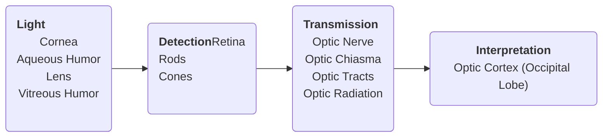

The eyes are used for vision and contain ~70% of an individual's sensory receptors used to detect light (photoreception). Each eye has over 1 million nerve fibers carrying information directly to the visual cortex of the brain through the optic nerve and allows us to observe and experience the world around us.
___
# External/Accessory Structures
## Eyelids
These are the flaps of skin covering the eye, being the thinnest portion of skin in the body.
- Along the rims (tarsal plate) of the eyelids are the **meibomian glands** (AKA *tarsal glands*). These secrete oil (sebaceous glands) called *meibum* that lubricates the eye.
- Along the margin of the eyelids are the **ciliary glands** (AKA *glands of Moll*), producing *aqueous humor* (modified apocrine sweat glands) to add to the tear film, retarding evaporation.
- **Palpebral Fissure**: the gap between the eyelids; the opening of the eye.
- **Canthus**: AKA *commissure*; the corners of the eye. Lateral and medial.
## Eyelashes
The eyelashes are a part of the integumentary system; keeps out debris from the eye.
## Conjunctiva
This is the membrane that lines the eyelids and eyeball. Also produces mucus for lubrication.
## Lacrimal Apparatus
Commonly known as the tear gland and ducts. They are located superiorly and laterally to each eye. The tears are produced by the **lacrimal gland** and exit across the eye, then drain into the inferior and superior **lacrimal puncta**, through the **lacrimal canaliculi** into the **lacrimal sac**, then into the **nasolacrimal duct**, which exits into the **nasal cavity**.
	- Tear contents: mildly salty, mucus, antibodies, lysozymes (enzymes that destroy i.e. *lyse* bacteria)
___
# Extrinsic Eye Muscles
Gross eye movements are produced by six muscles connecting to the outer surface of the eye.

|Name|Action|Associated Cranial Nerve|
|-|-|-|
|Lateral rectus|Moves eye laterally|VI (abducens)|
|Medial rectus|Moves eye medially|III (oculomotor)|
|Superior rectus|Elevates eye and turns it medially|III (oculomotor)|
|Inferior rectus|Depresses eye and turns it medially|III (oculomotor)|
|Inferior oblique|Elevates eye and turns it laterally|III (oculomotor)|
|Superior oblique|Depresses eye and turns it laterally|IV (trochlear)|
___
# Internal Structures of the Eye
## **Walls of the Eyeball**
The walls of the eyeball are composed of the fibrous layer (outside), vascular layer (middle), and the sensory layer (inside)
- **Fibrous Layer**: made up of the **Sclera** white part of the eye (connective tissue) and the **Cornea**, the transparent central anterior portion of the eye. It repairs itself easily and is the only transplantable part with no risk for rejection.
- **Vascular Layer**: contains the **Choroid**, a blood-rich, nutritive, pigmented layer. %%(prevents light from scattering)%% It has two smooth muscle structures: the **ciliary body** that works for production of aqueous humor and lens accommodation, and the **iris** (also pigmented; determines eye color) which regulates the amount of light that enters the eye. The opening within the iris is the **pupil**.
- **Sensory Layer**: contains the retina, which subdivides into two layers, an outer pigmented layer to absorb and prevent light from scattering, and an inner neural layer that houses the receptor cells (*photoreceptors*) of which there are two types: rods and cones. **Rods** are responsible for light and only see shades of gray. %%They're the primary photoreceptor when trying to see in a dark setting.%% **Cones** are responsible for color and cluster most densely near the center of the retina. The densest cluster of cones, known as the *fovea centralis* (this spot of the eye is depressed, so it's called "*small central pit*") because it's situated near the center of the eye, just lateral to the optic disc. %%It's also known as the yellow spot of the eye.%%
	- Signals are created when light hits *ganglion cells*, moving through the *bipolar cells* and into the rods and cones of the eye. These transmit signals through the optic nerve directly to the brain.
	- The *cones* function in RGB%%we are nature's gamers%%.
		- Blue Cones: peaks at 420nm
		- Green Cones: peaks at 530nm
		- Red Cones: peaks at 560nm. %%still green at this point, but it extends farther into red than green cones do%%
	- A *blind spot* is created where the optic nerve is situated, as no photoreceptors are present there. It's called the *optic disc*.

## Humors of the Eye
The interior of the eyeball is filled with fluids called "*humor*". Both types **maintain intraocular pressure** to keep the eye from collapsing or swelling.
- **Vitreous Humor** (gel-like) is in the posterior chamber of the eye.
- **Aqueous Humor** (watery, clear) is in the anterior chamber of the eye. It is similar to blood plasma, it carries nutrients, and is produced by the *ciliary body* and is reabsorbed through the **scleral venous sinus** or the **canal of Schlemm**.
## Lens
The **Lens** of the eye is held in place by a suspensory ligaments called **ciliary zonules**, connecting to the ciliary body in the vascular layer of the eye. It divides the body of the eye into *anterior* and *posterior* chambers.
___
# Physiology of Vision
## Visual Pathway
1. The light enters through and is bent by the **Cornea**, **Aqueous Humor**, **Lens** (mostly), and **Vitreous Humor**. The **lens** are manipulated by the **ciliary muscle** for **accommodation**, changing of the shape of the lens to focus between near and distant objects. This change in the shape of the lens is often *around 20 feet* (if the person has 20/20 vision)
2. During refraction, the "image" of the light that enters the eye is *flipped upside down and mirrored*. This is corrected by the brain.
3. Light is focused and stimulates the two-neuron chain **ganglion cells**, sending signals through the **bipolar cells** to the **photoreceptors** of the retina.
4. The retina outputs signals from the photoreceptors to the **optic nerves**, which cross at the **optic chiasma**, through the **optic tract**, then the **optic radiations**, into the **visual/optic cortex** in the **occipital lobe** of the brain, where it is processed.

- *Binocular* vision (having two eyes) with differing visual fields is used for depth perception (three-dimensional vision) despite the two-dimensional input for each eye.
## Eye Reflexes
1. **Convergence**: the eyes converge to a point when focusing on a nearby object.
2. **Photopupillary Reflex**: the pupil reflexively constricts when a light is shone upon it.
3. **Accommodation Pupillary Reflex**: the pupils also constrict when viewing nearby objects.
___
# Clinical Correlation
## Alterations in Normal Vision
- **Emmetropia**: normal vision
- **Myopia**: nearsightedness, occuring with an elongated eyeball.
- **Hyperopia**: farsightedness, occuring with a shortened eyeball or a "lazy lens".
- **Astigmatism**: vision is blurry as a result of focus *lines* rather than points on the retina due to unequal curvatures of the cornea or lens.
## Assessment of the Eye
Also read: HAS for the eye (to-do)
### Ophthalmoscope
An instrument used to illuminate the interior of the eyeball and the fundus (the back of the eye). It can be used to detect diabetes, arteriosclerosis, and degeneration of the optic nerve and retina.