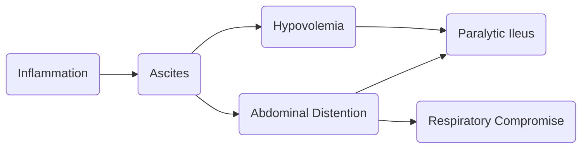

# Pathology
The initial response to inflammation is **edema**, **vascular congestion**, **bowel hypermotility**, an outpouring of plasma-like fluid from the extracellular, vascular, and interstitial compartments into the peritoneal space (**ascites**). This is later followed by **abdominal distention**, which causes **respiratory compromise**, and **hypovolemia** from the fluid shift. **Intestinal motility** shifts from **decreased** to **paralytic**.

# Etiology
- **Trauma**, either penetrating or blunt.
- **Inflammatory Conditions** e.g. [[B316/03-1|Inflammatory bowel diseases]]
- [[B316/03-5|Diverticulitis]], **Pelvic Inflammatory Disease**
- **Ischemia**
- **Ruptured Appendix**
- **Perforated** [[B316/02-3|Peptic Ulcer]]
- **Urinary Tract Infection**
- [[B316/03-2|Obstructive disorders]], **volvulus**
- **Bacterial Invasion**
- [[B312RLE/Peritoneal Dialysis|Peritoneal Dialysis]]
# Assessment Findings
- Severe **abdominal pain**, **rebound tenderness**, **muscle rigidity** (guarding?), **abdominal distention**, 
- **Anorexia**, **nausea and vomiting**.
- **Shallow respirations**, **decreased urinary output**, **weak, raid pulse**, **fever**
- **Shock** and associated signs:
	- **Tachycardia**, **tachypnea** (both compensatory)
	- **Oliguria**, **weakness**, **pallor** (decreased perfusion)
	- **Restlessness**, **diaphoresis**
# Diagnostic Examination
- **WBC Count** is **elevated** (≥20k/mm³)
- **Hematocrit is elevated** in cases of **hemoconcentration** (secondary to *hypovolemia*).
# Nursing Intervention
- Assess for **respiratory distress** (due to respiratory compromise)
- Assess and monitor **abdominal pain**.
- Monitor for signs of **septic shock**.
- Maintain **fluid and electrolyte balance**.
- Maintain patency of **nasogastric** and **intestinal tubes**.
- Encourage **deep breathing exercises**.
- Utilize a **Fowler's position to localize peritoneal contents**.
# Medical Management
- **NPO** with **Fluid Replacement**
- **NGT** for relief of abdominal distention
- **Peritoneal lavage** with warm saline
- Peritoneal **Drainage Tubes**
- **Fluid, Electrolyte, and Colloid Replacement** e.g. albumin, dextran, TPN
# Surgical Management
1. **Laparotomy**: an opening is made through the abdominal wall into the peritoneal cavity as an exploratory/diagnostic procedure.
2. **Bowel Resection** may be necessary depending on the cause.