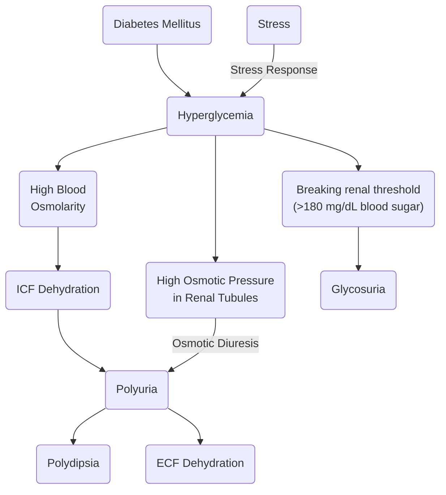
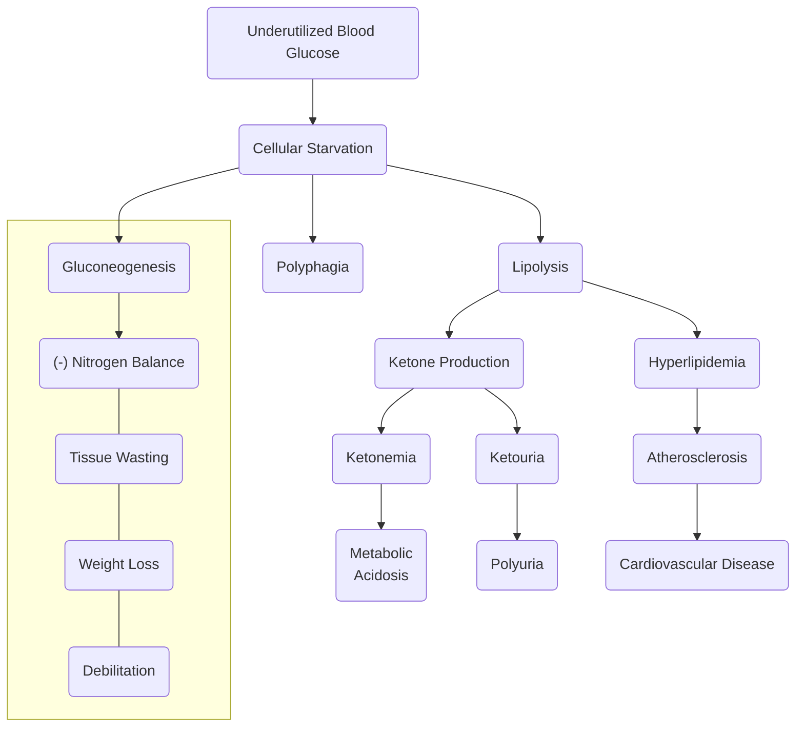
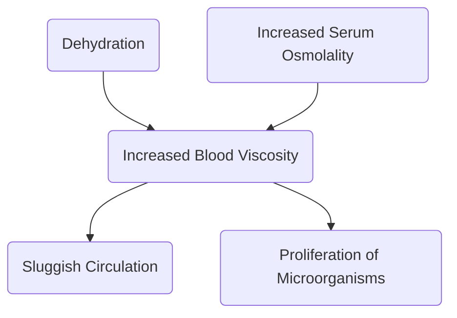

**Read Also**: [[ANPH/13#Pancreas|Pancreas]], [[B316/07-2|Hypoglycemia]], [[B316/07-3|Hyperglycemia]], [[B316/07-4|Diabetic Ketoacidosis]], [[B316/07-5|Hyperglycemic Hyperosmolar Nonketotic Syndrome]]
___
Various metabolic disorders resulting in a characteristic **hyperglycemia** subsequent to **deficiency and/or dysfunction of insulin** may result in diabetes mellitus (DM).
___
# Type 1 Diabetes (Insulin-Dependent)
**Type 1** comprises approximately 5% to 10% of all diabetes cases. It is characterized by the **destruction of pancreatic beta-cells** due to genetic, immunologic, or even environmental factors. The primary intervention is **insulin therapy**. Its onset and development is rapid, often occuring before the age of 30.
# Type 2 Diabetes (Non-Insulin-Dependent)
**Type 2** comprises the remaining 90% to 95% of diabetes cases. It is a result of decreased sensitivity to insulin (**insulin resistance**) or **decreased insulin production**. Interventions start with **dieting and exercise**, then with **hypoglycemic agents** as necessary. It often occurs in obese patients, usually after the age of 30.
# Gestational Diabetes Mellitus
Glucose intolerance develops **during pregnancy** (often in the second or third trimester). Risk factors include **obesity**, **history** of gestational diabetes, **glycosuria**, family history, and **ethnicity** (hispanic, american, native american, asian american, african american, pacific islanders). This often contributes to the **hypertensive disorders of pregnancy**.
>[!INFO] Secondary Diabetes Mellitus
>DM may also be a result of other conditions or syndromes e.g. pancreatic disease, Cushing's syndrome, drug use (steroids, thiazide diuretics, oral contraceptions)

___
# Assessment Findings
- **Polyuria** (osmotic diuresis), **Polydipsia** (secondary to polyuria), **Polyphagia** (due to ineffective utilization of glucose stores); the hallmark signs (3 Ps) of diabetes mellitus.
- **Fatigue and weakness** (ineffective utilization of glucose), **sudden vision changes** (diabetic retinopathy), **tingling or numbness in hands or feet** (peripheral neuropathy), **dry skin** (fluid shift d/t hyperglycemia), skin lesions (including **diabetic ulcers**) or wounds that heal slowly, recurrent infections.
- Onset of **Type 1 Diabetes**: **sudden weight loss or nausea**, vomiting, or stomach pains.
- **Type 2 Diabetes**: **progressive glucose intolerance**, which may result in eye disease, peripheral neuropathy, peripheral vascular disease) if undetected and unmanaged.
- **Diabetic Ketoacidosis**: abdominal pain, nausea, vomiting, hyperventilation, and a fruity breath odor. This may develop to include **altered level of consciousness**, **coma**, and **death**.
# Diagnostic Examination
- **Fasting Blood Sugar**: after 8 hours of fasting; two tests resulting in 126 mg/dL or greater (**normally 70 to 100 mg/dL**). In between 100 and 126 is considered the **prediabetic** range.
- **Random Blood Sugar**: 200 mg/dL or greater combined with symptoms is suggestive of DM.
- **Postprandial Blood Sugar**: 2 hours after a high carbohydrate meal; **200** mg/dL or greater; **<200 and >140** mg/dL is **prediabetic**, **70 to 140** mg/dL is **normal**.
- **Oral Glucose Tolerance Test** (OGTT)
	1. Three days of a high carbohydrate diet is followed by an 8 hour fasting
	2. A baseline blood sample and urine specimen is collected.
	3. The client takes an oral glucose solution
	4. Blood is drawn 30 minutes, 1 hour, 2 hours, and 3 hours after ingestion.
	5. Urine is collected.
	6. If blood glucose levels return to normal slowly and urine is positive for glucose, DM is suggested.
- **Glycosylated Hemoglobin** (**HbA1c**): a sample of venous blood is drawn, and HbA1c, **the form hemoglobin takes when combined with glucose**, is elevated at **above 7%** in patients with undetected, untreated, or inadequately treated DM (or they are non-compliant to therapy).
- **Evaluation for complications**
# Prevention
- For **obese** patients (especially those with Type 2 DM), **weight loss** is key to treatment. It is also **the major preventive factor for the development of diabetes**.
___
# Complications
There are **three major acute complications** of DM:
- [[B316/07-2|Hypoglycemia]]
- [[B316/07-2|Diabetic Ketoacidosis]] (DKA) as a result of compensatory protein and fat breakdown in lieu of inadequate glucose utilization. Commonly found in Type 1 DM.
- [[B316/07-5|Hyperglycemic Hyperosmotic Nonketotic Syndrome]] (HHNS), a syndrome that results in high blood prressure. Commonly found in Type 2 DM.

**Long term complications** include:
- **Microangiopathy**
	- **Renal failure** from nephropathy
	- **Cataract formation** due to retinopathy
- **Macroangiopathy**
	- [[B312/02#Coronary Artery Disease|CADs]] like MI, CVAs, and Peripheral Vascular Disease
- **Neuropathy**
	- **Spinal cord**, **ANS**
	- **Peripheral Neuropathy**: damage to the PNS, affecting movement, sensation, and bodily functions; paresthesia
	- **Gastroparesis**: delaying of gastric emptying.
	- **Neurogenic Bladder**: inappropriate emptying of the bladder.
	- **Decreased Libido** and **Impotence**
___
## Gerontologic Considerations
Blood glucose levels **normally elevate** with advancing age. **Elderly adults should be advised that physical activity that is consistent and realistic is beneficial to those with diabetes**. Consider physical impairment from other chronic diseases when planning exercise regimens for elderly patients with diabetes.
___
# Medical Management
The main goal is to **normalize insulin activity** and to maintain normal **blood glucose levels**, reducing resultant vascular and neuropathic complications. There are five components in therapy: nutrition, exercise, monitoring, pharmacology, and education.
- **Type 1**: insulin replacement
- **Type 2**: weight reduction
- **General**: diet and exercise improves insulin sensitivity; if still unmanageable, oral hypoglycemic agents are used. Insulin injections may be used in acute situations.
	- Exercise should be done 1 to 2 hours after eating to prevent hypoglycemia.
	- Exercise should be done with a schedule; non-sporadically.
## Insulin Therapy
Insulin may be sourced from **pork**, **beef**, and **human** sources. **Human insulin** has the lowest incidence of hypersensitivity reactions. As such, it is recommended for all newly diagnosed Type 1 diabetics, short-term insulin therapy for Type 2 Diabetics, pregnant clients, and diabetic clients with hypersensitivity or severe insulin resistance.

|Insulin|Onset|Peak|Duration|
|---|---|---|---|
|Rapid Acting (Clear): Lispro (Humalog), Aspart (Novalog)|5 mins|30 to 60 mins|2 to 4 hours|
|Short Acting (Clear): Regular (Humulin R, Novolin R, Iletin II regular)|30 to 60 mins| to 4 hours|6 to 8 hours|
|Intermediate (Cloudy): NPH|1 to 2 hours|6 to 12 hours|18 to 24 hours|
|Intermediate (Cloudy): Humulin N Lente|1 to 2 hours|8 to 12 hours|18 to 24 hours|
|Intermediate (Cloudy): Humulin L|1 to 2 hours|8 to 12 hours|18 to 28 hours|
|Long Acting: Ultralente Glargine (Lantus)|5 to 8 hours|14 to 20 hours|30 to 36 hours|
![[diabetes-mellitus-insulin-types.png]]
## Oral Hypoglycemia Agents
Often used for Type 2 Diabetics, these are generally divided between:
- **Sulfonylureas**: "insulin releasers" that stimulate **beta cells** to secrete more insulin. It also increases the ability of insulin receptors to bind to insulin.
	- **Side Effects**: weight gain, hypoglycemia, **pancreatic failure due to overstimulation**
	- Tolbutamide (Orinase), Acetohexamide (Dymelor), Tolazamide (Tolinase), Chlorpropamide (Diabenese), Glipizide (Glucotrol), Glyburide (Micronase, Glynase), Glimepiride (Amaryl)
>[!WARNING] Alcohol Intake with Sulfonylureas can cause hyperemesis!
- **Nonsulfonylureas**
	- **Biguanides**
		- **Metformin** (**Glucophage**): helps tissues use available insulin more efficiently; insulin (receptor) sensitizers.
			- **Side Effects**: upset stomach, flatulence, diarrhea
	- **Alpha-glucosidase inhibitors**
		- **Miglitol** (**Glyset**), **Acarbose** (**Precose**): glucose formation from digestion is inhibited. Taken 15 minutes **before meals** to decrease duodenal absorption of glucose.
	- **Thiazolidinediones**
		- **Rosiglitazone** (**Avandia**), **Pioglitazone** (**Actos**): same as biguanides
			- **Side Effects**: weight gain, edema, liver damage (monitor SGPT)
	- **Meglitinides**
		- **Repaglinide** (**Prandin**): an insulin releaser
			- **Side Effects**: same as sulfonylureas
# Nutritional Management
- **Low caloric diet** for obese patients with 50-20-30 CPF ratios. CHO should be complex, and fiber should be high; this inhibits glucose absorption in the intestines.
- Maintain **blood sugar**
- Maintain **blood pressure**
- Maintain **blood lipids** and lipoproteins
- Maintain the **pleasure of eating**; consider preferences, lifestyle, schedule, and culture.
- **Slow the progression of chronic complications**
# Nursing Management
- **Client education** should involve **adherence**, importance of **consistent healthy eating habits**, **nature of the disease**, and **dietary management skills** (reading food labels, creating and adjusting meal plans, exercise, etc.), and **insulin therapy**
- **Monitor urine sugar and acetone**.
- **Monitor blood glucose**
- Provide **skin** and **oral care**. Perform **good oral hygiene**.
- **Regular check-up every 3 months**, regular **dental exams**, regular **eye exams**
- Maintain **I&O**, **weigh daily**
- Observe for **chronic complications**
## Nursing Responsibility: Insulin Therapy
- Insulin is normally **administered subcutaneously** (90° for thin patients, 45° for obese clients). This route is less painful and facilitates slower absorption of the administered dose. **No need to aspirate**, **do not massage**.
- **Intravenous** Insulin may be used for emergency cases such as in **DKA**.
- Insulin should be administered **at room temperature**. The **vial of insulin being used** should be kept at room temperate. It can be kept like so for a month. **Other vials not currently being used** should be refrigerated.
	- **Cold** insulin results in **lipodystrophy**; **lipoatrophy** often from animal insulin or **lipohypertrophy** (fibrofatty masses) from repeated use of a site. This also prevents proper absorption of insulin. Prevent **lipohypertrophy** by **rotating sites of administration**.
- **Roll the vial of insulin between the palms** to redistribute insulin particles, but do not shake it. Bubbles cause difficulty in aspirating exact amounts.
- **Observe for Side Effects**:
	- **Local**: induration, redness, swelling, lesion formation, lipodystrophy
	- **Generalized**: **edema formation** (acute resolution of hyperglycemia results in ECF shift), **hypoglycemia** (rebound), **somogyi phenomenon** (rebound morning hyperglycemia from late-night hypoglycemia)
- Insulin may also be delivered via an **Insulin Pump**. A computer manages a continuous dosage throughout the day, closely mimicking pancreatic function. It administers subcutaneously via a needle or teflon catheter connected to a 42-inch narrow lumen tube containing 3 ml of **regular** insulin. It is usually placed on the abdomen and attached to a belt or pocket.
	- **Basal rate**: often 0.5 to 2 units per hour
	- **Bolus dose**: administered before meals
___
# Pathophysiology
## Polyuria, Polydipsia

## Polyphagia, DKA, CVD, Wasting

## Decreased Blood Viscosity

**Microorganism proliferation** results in **infections**, periodontal disease, UTI, vasculitis, cellulitis, vaginitis, furuncles, carbuncles, and **retarded wound healing**. Feet must be inspected and cleaned daily to prevent a **diabetic foot**.
___