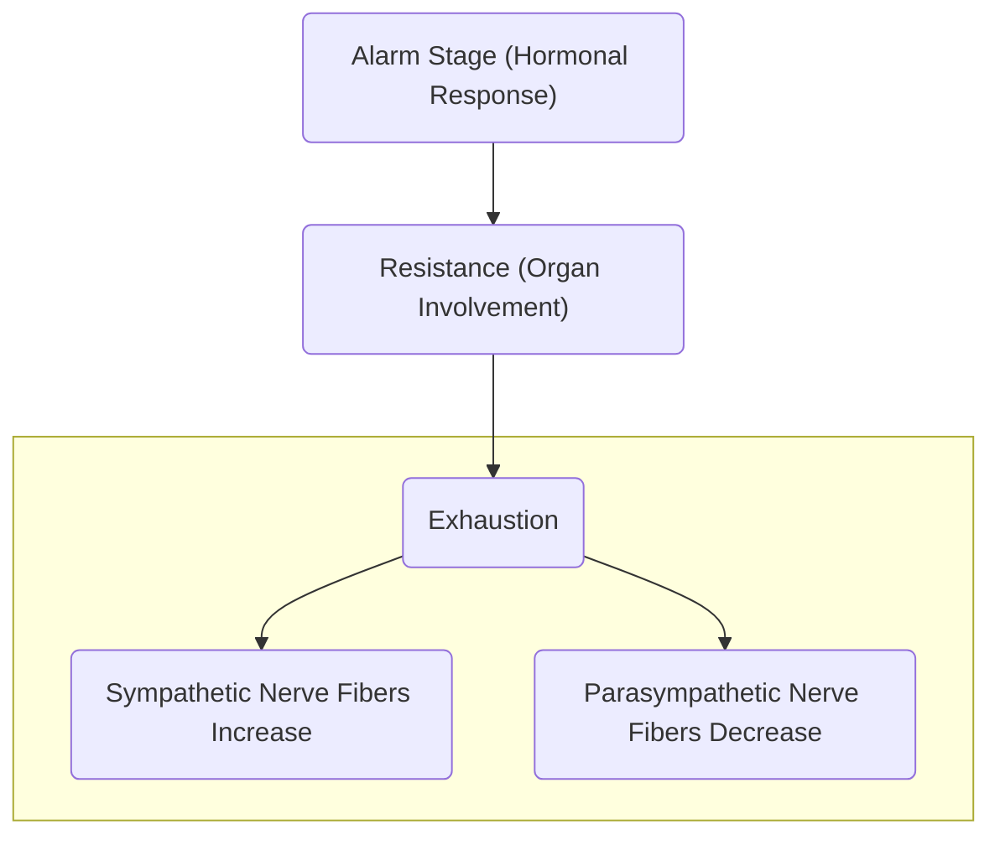

# Psychodynamic Theories
These theories attempt to explain the **emotional and mental forces** (developing processes), especially in early childhood and **their effects on behavior and mental states**. Many relevant models in psychiatric nursing began with the Austrian physician **Sigmund Freud**. His theories have, over time, been improved by interpersonal and humanist models. They lacked in their initial purpose of etiologic explanation of mental illness, but became important in **the development of therapeutic relationships, techniques, and interventions**.
___
## Personality Components Theory (Freud, S.)
1. **Id**: the unconscious level of awareness which is concerned with **pleasure principles**.
2. **Ego**: primarily conscious, but functions on all levels of awareness. Concerned with **reality principles**.
3. **Superego**: primarily subconscious, but functions on all levels of awareness. Concerned with **moral principles**. Split between the **conscience** and **ego ideal**.
## Psychosexual Stages of Development (Freud, S.)
1. **Oral Stage**: 1 to 1 ½ years old
	- **Erogenous Zone**: mouth; tension is relieved by sucking and fixation may be caused by insecurity in parting with the breast or bottle.
	- **Satisfaction**: sucking, biting, crying
	- **Greatest Need**: security
	- **Greatest Fear**: separation anxiety
2. **Anal Stage**: 1 ½ to 3 years old
	- **Erogenous Zone**: anus
	- **Satisfaction**: defecation; critical for toilet training.
		- **Bladder Control**: 18 months
		- **Daytime Bladder Control**: 2 ½ year old
		- **Nighttime Bladder Control**: 3 year old
3. **Phallic Phase**: 3 to 6 years old
	- **Erogenous Zone**: genital; sexual curiosity, consensual validation, castration anxiety/penis envy, oedipal/electra complex.
	- **Satisfaction**: masturbation; provide privacy but attempt to distract when possible.
4. **Latency Phase**: 6 to 12 years old
	- **Erogenous Zone**: genital, but dormant/inactive.
	- **Satisfaction**: acquiring knowledge, social skills, development of competence (in school and activities), achievements
5. **Genital Phase**: 12 to 18+ years old
	- **Erogenous Zone**: genitals
	- **Satisfaction**: genitals; development of heterosexual relationships.
## Interpersonal Stages of Development (Sullivan)
Sullivan proposed that the **"health" or "sickness" of one's personality is determined by the characteristic ways in which one dealt with other people**. He also posited that **childhood experiences largely determines adult personality**, with **many problems in adulthood stemming from confusions of adolescence**.

|Stage (Epoch)|Age |Significant Relationships|
|---|---|---|
|**Infancy**|0 to 1 1/2|Mother/Primary Caretaker|
|**Toddler**|to 3|Parents|
|**Preschooler**|to 6|Siblings, Relatives, Playmates, Teachers|
|**Juvenile**|to 9|Friends (group formation)|
|**Preadolescence**|10 to 12|Close friends ("chum" formation)|
|**Adolescence**|to 21|Peers|
|**Late Adolescence**|21+|Partners, Loved ones, Colleagues|
## Interpersonal Relationships in Nursing (Peplau)
One of the early nursing theories published in 1952. Peplau devised four stages of the nurse-patient relationship where the nurse plays various roles. The nurse-patient relationship is influenced by various psychobiological experiences which require dynamism to be dealt with. Nurses have **a special maturational strength for civilization** because Peplau believes nurses are **able to fulfill incomplete psychological tasks** e.g. relying on others, showing satisfaction, self-identifying, sharing, etc. for patients.
1. **Orientation**
2. **Identification**
3. **Development**
4. **Conclusion**
## Psychosocial Stages of Development (Erikson)
Also known as the **Eight Ages of Man**, Erikson devised the various age groups and each one's developmental tasks or goals and associated virtues.

|Stage|Age|Task|Virtue|
|---|---|---|---|
|**Infancy**|0 to 1 1/2|Trust vs. Mistrust|Hope and Faith|
|**Toddler**|to 3|Autonomy vs Shame and Doubt|Will and Determination|
|**Preschooler**|to 6|Initiative vs Guilt|Purpose and Courage|
|**School-Aged**|to 12|Industry vs Inferiority|Competence|
|**Adolescence**|to 21|Identity vs Role Confusion|Fidelity and Loyalty|
|**Young Adult**|to 35|Intimacy vs Isolation|Love|
|**Adult**|to 60|Generativity vs Stagnation|Care|
|**Elderly**|60+|Integrity vs Despair|Wisdom|
___
# Cognitive Theories
## Cognitive Development Theory (Piaget)
Four stages of cognitive development in understanding the world, as posited by Jean Piaget; **organization and adaptation** allow us to make sense of the world.

| Stage | Age (years) | World View |
| ---- | ---- | ---- |
| **Sensorimotor Stage** | 0 to 2 | The child is only aware of what is in front of them. |
| **Preoperational Stage** | 2 to 7 | The child is able to think symbolically. |
| **Concrete Operational Stage** | 7 to 11 | The child is aware of their surroundings, and is less self-centered. |
| **Formal Operational Stage** | 11 to 15 | The child is able to think in abstract and logical ways. |
## Social Relationships Theory (Vygotsky)
Culture and **social interaction lead cognitive development**. He claimed that we are born with four "elementary mental functions": **Attention**, **Sensation**, **Perception**, and **Memory**. Our environment (social and cultural) allow us to use these functions and to develop, leading to the development of higher mental functions. **Development** ideally occurs within the **Zone of Proximal Development**, where one is able to perform tasks with the aid of others ("**The More Knowledgeable Other**"), which eventually allows the individual to perform it on their own. 
## Information-Processing Theory
The mind is a system that processes information.
___
# Stress Theories
## Stress Response (Selye)
Also known as the **General Adaptation Syndrome** (GAS) **Theory of Stress**

1. **Alarm Stage**: a stressor stimulates the hypothalamus to send messages to the adrenal gland for the secretion of adrenaline and norepinephrine (stress hormones). These stimulate the conversion of glycogen to glucose in the liver.
2. **Resistance**: more organs are involved; the lungs take in more oxygen, the heart beats faster and stronger, and the digestive system reduces in function to delegate blood to other body systems. If the stressor is adequately resolved or adapted to, stress responses abate.
3. **Exhaustion**: if adaptation does not occur and anxiety or stress remains, body stores are depleted, emotional components are unresolved, and arousal of the physiologic responses continue with a small reserve capacity.
	- The [[autonomic nervous system]] is responsible for involuntary responses in self-preservation.
## Transactional Model of Stress and Coping (Lazarus)
Stress is defined as a "**particular relationships between the person and environment** that is appraised by the person as **taxing or exceeding his or her resources** and **endangering his or her wellbeing**". The effects stress has on a person is based on the person's feelings of threat, vulnerability, and ability to cope.
1. **Primary Appraisal**: Is the threat **significant**, **negative**, and **harmful or challenging**? Anger, disgust, disappointment, worry, anxiety, fear responses, anticipation, illness, or even injury may occur if a threat is passes the primary appraisal.
2. **Secondary Appraisal**: What are the **resources available** for the individual to cope with the stressor? These may involve internal (willpower, fortitude) and external options (peers, support groups)
3. **Problem-Based Coping**: when the individual believes they **have control** over the situation i.e. they are able to manage the problem, they take steps to resolve it:
	- Define the problem at hand
	- Generate potential solutions
	- Learn new skills to dealing with stressors
	- Reappraise and find new standards of behavior.
## Psychoneuroimmunology
A branch of psychology that explores the interactions between behavior, neural, endocrinal function, and immunologic processes. It posits that early lift stress, both psychological and physiological, affects PNI functioning.
