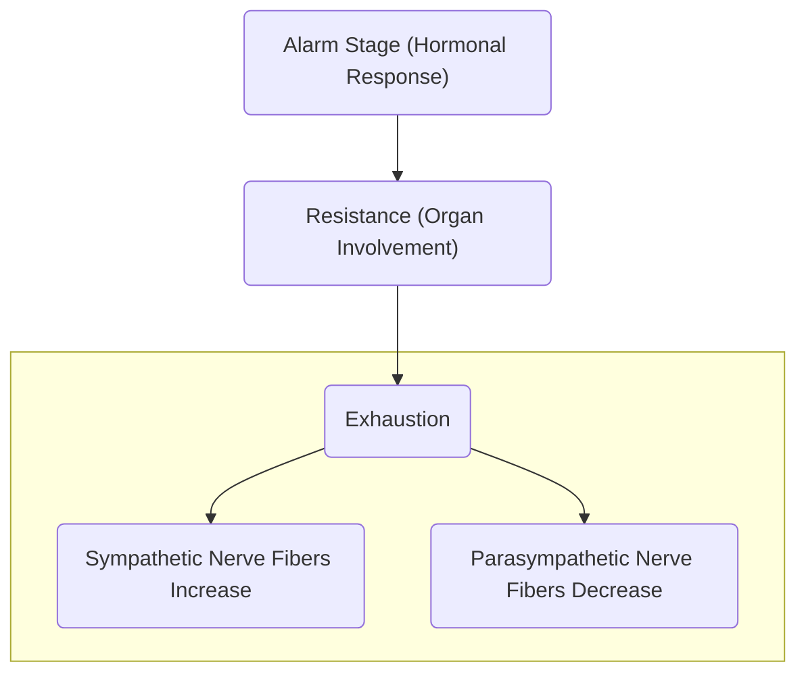

# Psychodynamic Theories
These theories attempt to explain the **emotional and mental forces** (developing processes), especially in early childhood and **their effects on behavior and mental states**. Many relevant models in psychiatric nursing began with the Austrian physician **Sigmund Freud**. His theories have, over time, been improved by interpersonal and humanist models. They lacked in their initial purpose of etiologic explanation of mental illness, but became important in **the development of therapeutic relationships, techniques, and interventions**.
## Psychoanalytic Models
### **Sigmund Freud**
The **founder of psychoanalysis**. "The **unconscious** can be accessed **through dreams and free association**". A **personality theory** and a **theory of infantile sexuality was also developed**. One of his greatest contributions was "**talk therapy**", which stated that simply talking about their problems can help alleviate them.
- **Application**: It is used as an **individual therapy approach for the enhancement of personal maturity and personal growth**.
- **Major Concepts**: [[#Personality Components|Id, Ego, Superego]]; [[#Psychosexual Stages of Development]]; Anxiety and Defense Mechanisms; Free Associations, Transference, and Countertransference
### Anna Freud
Sigmund Freud's youngest child. "The **application of ego and psychology** to **psychoanalytic treatment** and **child analysis** with emphasis on the **adaptive functions of defense mechanisms**"
- **Application**: individual therapy, child analysis
- **Major Concepts**: refinement of concepts of **anxiety and defense mechanisms**.

## Neo-Freudian Models
### Alfred Adler
Founder of the **school of individual psychology**.
- **Application**: understanding of **human motivation**.
- **Major Concepts**: Inferiority
### Carl Gustav Jung
Founded the **school of psychoanalytic psychology**. Developed new therapeutic approaches.
- **Application**: assessment via the introversion and extroversion dimensions.
- **Major Concepts**: redefined libido, introversion, extroversion, persona
### Otto Rank
Introduced the idea of **primary trauma of birth**, **active techniques** in therapy including more nurturing (compared to Freud). **Emphasized the feeling aspect of analytic processes**.
- **Application**: recognition of the importance of feelings in psychoanalysis.
- **Major Concepts**: Birth Trauma, Will
### Erich Fromm
Emphasized the **relationship of the individual to their society**.
- **Application**: individual desires are formed by society.
- **Major Concepts**: the individual and their society are not separate entities.
## Interpersonal Relationship Models
### Harry Stack Sullivan

- **Application**: framework for introduction of interpersonal theories into nursing.
- **Major Concepts**: Participant observer, Parataxic distortion, Consensual validation
## Humanist Theories
### Abraham Maslow
Focused on the **healthy rather than the sick**. He utilized a holistic, dynamic viewpoint in approaching individuals.
- **Application**: a model to understand how people are motivated and their needs that should be met.
- **Major Concepts**: Needs, Motivation
### Frederick S. Perl
Focused on the tenet that **awareness of emotion**, **physical state**, and **repressed needs** would enhance the **ability to deal with emotional problems**.
- **Application**: used as a therapeutic approach to **resolve current life problems** that are **influenced by old, unresolved emotional problems** (incomplete Gestalts).
- **Major Concepts**: Reality, "Here and Now" focus
### Carl Rogers
He based his theories on **the view of human potential for goodness**, used "client" instead of "patient", and stressed the **relationship between therapist and client**.
- **Application**: individual therapy approach should involve **never giving advice**, and **always clarifying the client's feelings**
- **Major Concepts**: Empathy, Positive Regard
___
# Psychoanalytic Theory (Freud, S.)
The personality is made up of various levels of awareness:
- **Consciousness**: **feelings, thoughts, and beliefs that the individual is aware of**, concerned with the "**here and now**". It functions when the individual is **awake**.
- **Preconscious**: not aware at present, but may be recalled at will.
- **Unconscious**: aspects of the person that they are not aware of.
## Free Association
A tool used in psychoanalysis, aiming to **deepen self-understanding** by **looking at whatever thoughts, words, or images come freely to mind**. The therapist may ask the patient to **share anything that is in on their mind such as memories, words, images, or daydreams**. This may also be done with the therapist mentioning a single word, and asking what the first thought that comes to mind is for the patient.
## Dream Interpretation
Originally used in psychoanalysis and spreading to other psychotherapies, the **contents of dreams are interpreted to reveal underlying motivations or symbolic meanings and representations**. Freud believed that dreams represent **disguised fulfillment of repressed wishes**, and that studying them provided the easiest road to understanding the unconscious activities of the mind.
## Hypnosis
Guided relaxation, intense concentration, and focused attention to achieve a **trance**, considered as an aid to psychotherapy because of **a "hypnotic state" that allows people to explore painful thoughts, feelings, and memories they might have repressed**.
- For reducing emotional distress, treatment of phobias, anxiety disorders, pain management, weight loss, smoking cessation, and other conditions.
___
# Personality Components (Freud, S.)
Freud divided the human psyche into three components.
1. **Id**: the unconscious level of awareness which is concerned with **pleasure principles** (biological), being primitive, uncivilized, and immoral. It demands immediate gratification of needs.
	- Present at birth
	- Overdevelopment: narcissism, lawless, antisocial, irresponsible manipulative, liar, rebellious, revengeful
2. **Ego**: "self"; primarily conscious, but functions on all levels of awareness. Concerned with **reality principles** (psychological). It controls or delays the demands of the Id through **delayed gratification**.
3. **Superego**: primarily subconscious, but functions on all levels of awareness. Concerned with **moral principles** (social), it is the ethical component of the personality split between the **conscience** and **ego ideal**:
	- **Conscience**: what is primarily or basically wrong.
	- **Ego Ideal**: what is primarily or basically right.
	- Overdevelopment: guilt-ridden, inhibited, withdrawn/isolated, shy, lack of self-confidence, depression, obsessive-compulsive, anxious, seeking to reach expectations of others.
___
# Psychosexual Stages of Development (Freud, S.)
1. **Oral Stage**: 1 to 1 ½ years old; regular feeding is very important
	- **Erogenous Zone**: mouth; tension is relieved by sucking and fixation may be caused by insecurity in parting with the breast or bottle.
	- **Satisfaction**: sucking, biting, crying; results in development of trust in later years
	- **Greatest Need**: security
	- **Greatest Fear**: separation anxiety
2. **Anal Stage**: 1 ½ to 3 years old
	- **Erogenous Zone**: anus
	- **Satisfaction**: control over defecation and urination; critical period for toilet training.
		- **Anal-Retentive Personality**: the child "lets go" of control. Results in a stingy, stubborn, compulsive need for orderliness; **punctual and respectful to authority**. May also include schizoid, schizotypal, and [[#Personality Components (Freud, S.)|Superego]] personalities.
		- **Anal-Expulsive Personality**: the mother "lets go" of control. Results in a messy, careless, disorganized, and prone to emotional outbursts; **inconsiderate to others**. May include an [[#Personality Components (Freud, S.)|Id]] personality.
	- **Greatest Need**: power and control; development of [[#Personality Components (Freud, S.)|Ego and Superego]] occurs due to introduction of the **reality principle**.
		- **Toilet Training** can be started once ready; the child should be able to stand alone, walk steadily, keep themselves dry (bladder control) in at least two hour intervals, demonstrate awareness of needing to defecate and void and the use of words and gestures to show it, and are desirous to please the caregivers.
			- **Bladder Control**: 18 months
			- **Daytime Bladder Control**: 2 ½ year old
			- **Nighttime Bladder Control**: 3 year old
3. **Phallic Phase**: 3 to 6 years old; the first period of realization of gender. **Identification** also occurs, where children incorporate the values of their parent of the same sex into their superego.
	- **Erogenous Zone**: genital; sexual curiosity, consensual validation, castration anxiety/penis envy, oedipal/electra complex.
	- **Satisfaction**: masturbation; provide privacy but attempt to distract when possible. Fixation results in narcissistic, vain, and proud personalities, fear or incapability in close love, and homosexuality.
4. **Latency Phase**: 6 to 12 years old
	- **Erogenous Zone**: genital, but dormant/inactive.
	- **Satisfaction**: acquiring knowledge, social skills (peer development), development of competence (in school and activities), character formation, achievements. Fixation results to immature behavior and less competence.
5. **Genital Phase**: 12 to 18+ years old
	- **Erogenous Zone**: genitals
	- **Satisfaction**: genitals; development of heterosexual relationships. Interest in the welfare of others develops during this stage.
___
# Interpersonal Stages of Development (Sullivan)
Sullivan proposed that the **"health" or "sickness" of one's personality is determined by the characteristic ways in which one dealt with other people**. He also posited that **childhood experiences largely determines adult personality**, with **many problems in adulthood stemming from confusions of adolescence**.
1. **Infancy**: a self-concept is developed. Mothering role is achieved by a self-concept of "**Good Me**" (interpersonal behaviors evoke minimal anxiety, and should be done). Inadequacy results in a "**Bad Me**" self-concept (interpersonal behaviors evoke moderate anxiety and highly devalued).
	- **Satisfaction**: self-concept of a worthwhile individual
	- **Deprivation**: a "**Not Me**" attitude develops, excluding interpersonal behaviors from awareness; maximal anxiety is evoked.
	- **Type of Play**: solitary play
2. **Toddler**: a sense of power is developed as children attempt to control themselves and others.
	- **Type of Play**: parallel play (playing with someone side-by-side and conversing/watching, but not playing together)
	- **Behavioral Traits**: **negativistic**, active, mobile, curious (accident prone), and **throws temper tantrums**.
3. **Pre-school Age**: characterized by **consensual validation**, the use of language which can be consensually validated by others.
	- **Type of Play**: associative or cooperative play
	- **Behavioral Traits**: imitates adults, loves offensive languages, very creative and curious ("**Why?**"; questions about sex should be answered honestly at an appropriate conceptual level), very imaginative (**imaginary playmates** are common), and **lies about fantasies** to impress others.
4. **School Aged (Juveline)**: the age of **gang formation** and turning away from parents as the most significant people and to **same-sex peers**. The child acquires **the ability to compete and compromise**.
5. **School Aged (Preadolescence)**: the age of developing **intimacy**. Children find "**chums**", same-sex friends they perceive to be very similar to themselves with which they develop intense love relationships. They learn to **put aside their needs for others**. 
6. **Adolescence**: developments of **heterosexual relationships**, where **sexual urges** ("*lust*") **may be felt**.
7. **Late Adolescence**: the "**age of majority**", where **achieving independence** is the focus, **creating an adult self-concept**. Develops **capacity for mature emotional intimacy**, while maintaining familial ties.

|Stage (Epoch)|Age (years)|Significant Relationships|
|---|---|---|
|**Infancy**|0 to 1 1/2|Mother/Primary Caretaker|
|**Toddler**|to 3|Parents|
|**Preschooler**|to 6|Siblings, Relatives, Playmates, Teachers|
|**Juvenile**|to 9|Friends (gang/group formation)|
|**Preadolescence**|10 to 12|Close friends ("chum" formation)|
|**Adolescence**|to 21|Peers|
|**Late Adolescence**|21+|Partners, Loved ones, Colleagues|
___
# Interpersonal Relationships in Nursing (Peplau)
One of the early nursing theories published in 1952. Peplau devised four stages of the nurse-patient relationship where the nurse plays various roles. The nurse-patient relationship is influenced by various psychobiological experiences which require dynamism to be dealt with. Nurses have **a special maturational strength for civilization** because Peplau believes nurses are **able to fulfill incomplete psychological tasks** e.g. relying on others, showing satisfaction, self-identifying, sharing, etc. for patients.
1. **Orientation**: the nurse directs the patients in treatment, providing explanations and information, and answering questions.
	- Problems and needs are clarified, questions are asked, routines and expectation of the institution are explained, and full participation is elicited.
2. **Identification**: the patient works interdependently with the nurse, expressing feelings.
	- The patient responds to persons they perceive as helpful, they feel stronger, and roles of both the client and nurse are clarified.
3. **Exploitation**: the full use of the patient by all services offered.
	- Goals such as "going home" and "returning to work" emerge. Patient behavior starts to fluctuate between dependence and independence.
4. **Resolution**: the patient no longer requires services, and gives up dependent behavior. The end of the relationship.
	- The patient assumes power to meet their own needs, set new goals, and so forth.

Peplau also described the various **roles nurses may take within a therapeutic relationship**. She clarifies that this is not limited, and that nurses can take on many other roles.
- **Stranger**: offering the patient the same acceptance and courtesy that the nurse would to any stranger.
- **Resource Person**: providing answers to the patient's questions
- **Teacher**: helping the patient learn informally or formally
- **Leader**: offering direction to the patient or group
- **Surrogate**: substituting for another individual such as a sibling or a parent
- **Counselor**: promoting health-promoting experiences e.g. the expression of feelings.
___
# Psychosocial Stages of Development (Erikson)
Also known as the **Eight Ages of Man**, Erikson devised the various age groups and each one's developmental tasks or goals and associated virtues.

| Stage           | Age        | Task                        | Virtue                                                                                                                            |
| --------------- | ---------- | --------------------------- | --------------------------------------------------------------------------------------------------------------------------------- |
| **Infancy**     | 0 to 1 1/2 | Trust vs. Mistrust          | Needs are met: trust develops. Hope and Faith                                                                                     |
| **Toddler**     | to 3       | Autonomy vs Shame and Doubt | Toilet training is successful: autonomy develops. Will and Determination                                                          |
| **Preschooler** | to 6       | Initiative vs Guilt         | Curiosity is supervised consistently: initiative and conscience develops. Management of conflict and anxiety. Purpose and Courage |
| **School-Aged** | to 12      | Industry vs Inferiority     | Efforts to learn are supported: industry develops. Competence, confidence, and pleasure in accomplishments                        |
| **Adolescence** | to 21      | Identity vs Role Confusion  | Sexual orientation, role performance, body image, and self-concept are well defined: identity develops. Fidelity and Loyalty      |
| **Young Adult** | to 35      | Intimacy vs Isolation       | Relationships are satisfying: intimacy develops. Love                                                                             |
| **Adult**       | to 60      | Generativity vs Stagnation  | Sense of usefulness to others: generativity develops. Involves establishing the next generation. Care                             |
| **Elderly**     | 60+        | Integrity vs Despair        | Satisfying past recollection: integrity develops. Wisdom                                                                          |
___
# Cognitive Theories
## Cognitive Development Theory (Piaget)
Four stages of cognitive development in understanding the world, as posited by Jean Piaget; **organization and adaptation** allow us to make sense of the world.

| Stage | Age (years) | World View |
| ---- | ---- | ---- |
| **Sensorimotor Stage** | 0 to 2 | The child is only aware of what is in front of them. |
| **Preoperational Stage** | 2 to 7 | The child is able to think symbolically. |
| **Concrete Operational Stage** | 7 to 11 | The child is aware of their surroundings, and is less self-centered. |
| **Formal Operational Stage** | 11 to 15 | The child is able to think in abstract and logical ways. |
## Social Relationships Theory (Vygotsky)
Culture and **social interaction lead cognitive development**. He claimed that we are born with four "elementary mental functions": **Attention**, **Sensation**, **Perception**, and **Memory**. Our environment (social and cultural) allow us to use these functions and to develop, leading to the development of higher mental functions. **Development** ideally occurs within the **Zone of Proximal Development**, where one is able to perform tasks with the aid of others ("**The More Knowledgeable Other**"), which eventually allows the individual to perform it on their own. 
## Information-Processing Theory
The mind is a system that processes information.
___
# Stress Theories
## Stress Response (Selye)
Also known as the **General Adaptation Syndrome** (GAS) **Theory of Stress**

1. **Alarm Stage**: a stressor stimulates the hypothalamus to send messages to the adrenal gland for the secretion of adrenaline and norepinephrine (stress hormones). These stimulate the conversion of glycogen to glucose in the liver.
2. **Resistance**: more organs are involved; the lungs take in more oxygen, the heart beats faster and stronger, and the digestive system reduces in function to delegate blood to other body systems. If the stressor is adequately resolved or adapted to, stress responses abate.
3. **Exhaustion**: if adaptation does not occur and anxiety or stress remains, body stores are depleted, emotional components are unresolved, and arousal of the physiologic responses continue with a small reserve capacity.
	- The [[autonomic nervous system]] is responsible for involuntary responses in self-preservation.
## Transactional Model of Stress and Coping (Lazarus)
Stress is defined as a "**particular relationships between the person and environment** that is appraised by the person as **taxing or exceeding his or her resources** and **endangering his or her wellbeing**". The effects stress has on a person is based on the person's feelings of threat, vulnerability, and ability to cope.
1. **Primary Appraisal**: Is the threat **significant**, **negative**, and **harmful or challenging**? Anger, disgust, disappointment, worry, anxiety, fear responses, anticipation, illness, or even injury may occur if a threat is passes the primary appraisal.
2. **Secondary Appraisal**: What are the **resources available** for the individual to cope with the stressor? These may involve internal (willpower, fortitude) and external options (peers, support groups)
3. **Problem-Based Coping**: when the individual believes they **have control** over the situation i.e. they are able to manage the problem, they take steps to resolve it:
	- Define the problem at hand
	- Generate potential solutions
	- Learn new skills to dealing with stressors
	- Reappraise and find new standards of behavior.
## Psychoneuroimmunology
A branch of psychology that explores the interactions between behavior, neural, endocrinal function, and immunologic processes. It posits that early lift stress, both psychological and physiological, affects PNI functioning.