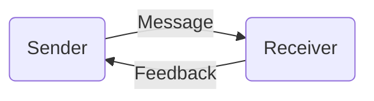

---
tags:
  - B317
title: Therapeutic Communication
description: The nurse's ability to establish effective communication in nursing is imperative to providing the best care and patient outcomes possible; to develop a helping relationship.
---
The nurse's ability to **establish effective communication** in nursing is **imperative to providing the best care and patient outcomes possible**; to develop **a helping relationship**. Communication may be helpful or unhelpful. It is **helpful** when it **encourages the transfer of information, thoughts, or feelings** between communicators, and unhelpful if otherwise. Helpful communication allows for better **assessment**, **intervention**, and **evaluation**. Therapeutic communication allows for:
- Assess the patient's **perception of the problem**
- Facilitate the client's **expression of emotions**
- Recognize the client's **needs**
- Implement **interventions**
- Guide the client towards **identifying a plan of action** to a satisfying and socially acceptable resolution of needs.
- Facilitating **personal growth and behavioral change**
- Teach the client and family necessary **self-care skills**
___
# Modes of Communication
1. **Verbal Communication**
2. **Non-Verbal Communication**
	- **Kinesics** (body, facial, and eye movements)
	- **Paralanguage**: voice-related behaviors e.g. pitch, tone, rate, volume
	- **Proxemics**
	- Autonomic physiologic response e.g. rate of breathing, pallor, sweating; general and physical appearance and characteristics
3. **Written Communication**
___
# Communication Process
1. **Sender**: the source and encoder who initiates communication to another. This involves choosing a mode of communication and the type of encoding used such as language, vocabulary, and gestures.
2. **Message**: the actual result of encoding.
3. **Receiver**: the one who perceives the message from the sender. All senses may be used to receive various modes of communication, even involuntarily such as subtle first impressions of a person's appearance.
4. **Feedback**: *response*; the returning message in response to the sender's first correspondence.

___
# In-Person Communication
1. **Pace** and **Intonation**: rate, rhythm, and tone of speech.
2. **Simplicity**: use of common words, brevity, and completeness.
3. **Clarity**: saying precisely what is meant.
4. **Timing** and **Relevance**: sensitivity to the client's needs and concerns
5. **Adaptability**: altering spoken messages in accordance with behavioral cues from the client.
6. **Credibility**: means worthiness of belief, trustworthiness, and reliability. It is fostered by being consistent, dependable, and honest.
7. **Humor**: may be powerful, but should be used with care. It may be able to allow clients to adjust to difficult and painful situations.
___
# Factors Affecting Communication
1. **Proxemics**: "personal space" used in communication, with varying levels of "closeness" depending on patient status.

|Space|Distance|Use Case|
|---|---|---|
|Intimate|0 to 1.5 ft.|Body contact; assisting in ambulation, positioning, etc.|
|Personal|1.5 to 4 ft.|Often used in nursing care e.g. administering medication, teaching, and various forms of therapeutic use of self|
|Social|4 to 12 ft.|Formal communication limited to seeing and hearing, group communication|
|Public|12 ft.+|Communication requires a loud and clear voice|
2. **Boundaries**: the defining limits of an individual. The nurse must maintain a **clear professional boundary** with the patient. **Keep the focus on the patient and avoid sharing personal information**. Gift exchanges, excessive time with the patient, and believing only the nurse understands the patient are all over-extensions beyond this boundary.
3. **Gender**: men and women communicate differently, and may decode identical messages differently.
4. **Values**: standards that influence behavior, and may result in differences in message decoding.
5. **Interpersonal Attitudes**: these convey beliefs, thoughts, and feelings about people and events.
6. **Attentive listening**: active listening; mindfulness and full use of the senses to what the client does, says, and feels. Behaviors for this use the mnemonic **SOLER**: **sit straight and squarely** with the patient; use an **open posture** (no crossed arms, etc.), **lean forward**, use **eye contact** appropriately, and use a **relaxed** attending attitude.
7. **Congruence**: the harmonization of the verbal and non-verbal aspects of communication.
8. **Touch**:  may be comforting and supportive, but may violate the intimate or personal space.
___
# Therapeutic Communication Techniques
## Open Ended
Allows the client to share their personal experiences.
1. **Giving Broad Openings**: these may stimulate hesitant patients to start talking.
	- "*Is there **something you'd like to talk about** today?*"
2. **Gentle Encouraging Descriptions of Perception**
	- "***Tell me***/***Share with me***/***Describe for me*** *something about your home life.*"
	- "***What happened?***"
	- "***What does the voice seem to be saying?***"
## Focused
Often used with resistant clients who often change topics. These questions are used to identify and stay on one topic of interest.
1. **Focusing**
	- "*Of all of the concerns you've mentioned, which is **the most troublesome**?*"
2. **Exploring**: examination of a topic by asking further questions
	- "*Can you **tell me what the voices are saying**?*"
3. **Qualitative Questions**: try to gain understanding of the patient's experience of a certain situation.
	- "***How's your appetite?***"
4. **Quantitative Questions**: attempt to discover cause and effect relationships, often through comparison.
	- "***How many times*** *were you visited this week?*"
## Statement of Inquiry
1. **Reflecting**/**Paraphrasing**: directing client actions, thoughts, and feelings back to the client.
	- P: "*My family always dotes on my mistakes.*"
	- N: "*Are you ***saying you are viewed as the bad guy in the family?***"
2. **Reflecting on Expressed Feelings**
	- P: "*No one wants to be around me*"
	- N: "*Do you* ***feel rejected?***"
3. **Clarifying Statements**
	- P: "*I'm crazy.*"
	- N: "***What do you mean by that?***"
4. **Validate Statements**
	- P: "*I can't sleep. I stay awake all night*."
	- N: "***I understand you're having difficulty sleeping***"
5. **Restate or Give Feedback**
	- P: "*Nurse,* ***am I crazy?***"
	- N: "***Do you think you're crazy?***"
## Empathetic Statements
1. **Sharing Perceptions**, responding in a way that the client feels like they are worthy and important.
	- "*It **sounds like** a troubling time for you.*"
## Faciliatory Statements
1. **Accepting**: indicates that the nurse has heard the patient, and that they are interested. Utilizes "accepting" application of facial expressions, paralanguage, etc.
	- "***Yes.***"
	- Head nodding
2. **Offering General Lead**: indicates that the nurse is following along with the client, without taking away the initiative from the patient.
	- "***Go on?***"
## Close Ended
Help obtain **important facts or specific details** and give information or explanations. These may also help **focus a wandering client**.
1. **Close Ended Questions**/**Seeking Information**
	- "***How long have you been hearing these voices?***"
## Other Useful Techniques
1. **Presenting Reality**: indicating what is real to the patient.
	- "***I see no one else in the room***."
	- P: "*Someone's trying to shoot me!*" N: "*That was a **car backfiring**.*"
2. **Encourage Expression of Feelings**
	- P: "*I want to kill myself.*"
	- N: "***What makes you feel that way?***"
3. **Offering Self**: making the self as an available resource for the patient.
	- "***I'll sit with you for a while.***"
4. **Consensual Validation**: words and phrases may contain differing meanings and may cause misunderstandings. These allow the patient and nurse to unite their understandings.
	- "***Tell me whether my understanding of it is the same as yours***"
5. **Encouraging Comparison**: comparing and contrasting differences of situations of circumstances.
	- "***Was it better when you were with your mother, or with your father?***"
	- "Have you had ***similar experiences***?"
6. **Giving Information**: informing the client about a topic (allows them to know what to expect), which also aids in building trust.
	- "***I'm here to***..."
	- "***Visiting hours are***..."
7. **Giving Recognition**: greeting the client by their **preferred name**, indicating awareness of **changes in their appearance or demeanor**, or **noting their efforts** allow the patient to feel recognized as an individual.
	- "*I see you've **finished your tasks** for today.*"
	- "*Your **hair looks nice** today. Did you style it?*"
8. **Formulating a Plan of Action**: creating definite plans to allow the client to cope effective in a similar situation in the future.
	- "*How can we **handle this better** next time it occurs?*"
9. **Making Observations**: **verbalizing the nurse's perceptions**. The patient may feel encouraged to talk or express themselves.
	- "*I noticed **you're biting your nails**. Are you uncomfortable?*"
10. **Silence**: may provide the patient with the time they need to **formulate answers, regain composure, or when to talk**. The nurse should be **aware of their nonverbal behaviors**. **Eye contact and conveyance of interest should be maintained**.
11. **Summarization**: reviewing main points and conclusions during the interaction. It provides a sense of closure and completion, and re-establishes the agreements the nurse and patient have created.
	- "*Let's see... **so far, we have talked about**...*"
12. **Translating Into Feelings**: verbalizing the patient's indirectly expressed behaviors or feelings. **Meaningless or unrealistic statements may have underlying meanings or motivations**.
	- P: "*I'm way out in the ocean.*"
	- N: "***Do you feel lonely or isolated?***"
13. **Voicing Doubt**: expressing uncertainty about the reality of the client's perceptions. It allows the patient to **recognize that other people's perceptions may differ from theirs, then to reevaluate their perceptions**.
	- "***Isn't that unusual?***"
	- "***I find that hard to believe.***"
___
# Non-Therapeutic Communication Techniques
Denoted by the mnemonic **COWARD**:
- **Changing Topics**, **Challenging**, Testing, and Defending
- Giving **Opinions**, **Advice**, **Value Judgement**, **False Reassurance**
- "**Why?**" Questions
- **Asking Yes or No Questions**
- **Refusing to Listen or Pay Attention**
- **Disapproving or Approving**
## Changing Topics
The nurse may **change topics** when they are unable to respond, has a topic in mind they want to discuss, or uncomfortable. They **attempt to introduce an unrelated topic** into the conversation.
- P: "*I'd like to die. Can you kill me with an overdose?*"
- N: "***Did you have any visitors last evening?***"
## Challenging
For the nurse to **demand proof** from or **present counterarguments** to the patient. This may result in those with altered perception to **defend their perceptions more strongly than before**.
- "*If you say you're dead, then **why is your heart still beating**?*"
## Defending
Attempting to **protect someone or something from verbal attacks** by the patient. This makes the patient feel like they have no right to express impressions, opinions, or feelings, which results in communication blockage.
- P: "*Is the doctor really trying to cure me?*"
- N: "*I'm sure **the doctor has your best interests in mind**.*"
## Testing
Appraisal of the client's degree of insight; **acknowledgement of the client's lack of insight is not helpful**.
- "***Do you know what kind of hospital this is?***"
## Opinions and Value Judgement
These are **opinionated or moral feedback** from the nurse that limit the patient's decision-making, thinking, analysis, and independence.
- "***That's unfair.***"
## Advising
Telling the client **what or how to do things**, which imply that only the nurse know the best for the client.
- "***I think you should***..."
- "***Why don't you***..."
## False Reassurance
Indication that there is **no reason for anxiety or other forms of discomfort** in an attempt to dispel the client's feelings, stating there is no sufficient reason for concern.
- "***Everything will be alright.***"
- "***You're coming along just fine.***"
## Requesting an Explanation
The use of "Why?" questions that ask the client for **reasons to their thoughts, feelings, behaviors, or events**. **This form of questioning is intimidating**, and the client likely does not have an answer. They may **become defensive trying to explain themselves**. There is a marked difference between asking the patient to describe perceptions than to explain them.
## Probing Questions
**Persistent questioning**, which causes feelings of being "used" or being invaded. **Patients have the right to withhold concerns or feelings, and probing will only encourage the client to close up**.
- "*Now tell me about your recent suicide attempt. **You know I have to find out**.*"
## Yes-No Questions
Due to its limited nature, questions that are answered only with yes or no are unable to provide an accurate look into the patient's ideas, thoughts, or feelings.
## Interpreting
Asking to make conscious that which is unconscious, and **telling the client about the meaning of their experiences**. The nurse cannot decipher the patient's feelings. Only the client can identify or confirm the presence of feelings.
- "*So **what you're really saying** is...*"
## Stereotyped Comments
The **use of cliché phrases** from social conversation with the patient provides little to no value. **Any "automatic" responses lack the nurse's consideration or thoughtfulness**.
- "***Keep your chin up.***"
- "***It's for your own good.***"
## Approving or Disapproving
**Sanctioning or denouncing the client's behaviors, thoughts, or ideas**. These imply that the nurse has the right to give judgement over the client's thoughts and actions, also creating an expectation that the client should please the nurse.
- "***I'd rather you wouldn't***..."
- "***That's good.***"
## Agreeing or Disagreeing
These **create the idea that the client is "right" or "wrong"**. If accepted, the client cannot change their mind without being "wrong". **Opinions and conclusions should only be from the client**. If rejected, the client may then **feel defensive about their points of view or ideas**.
## Rejecting or Denying
**Refusing to consider or even showing contempt for the client's ideas** or behaviors, or even **refusing to admit the existence of a concern** or problem. These **block exploration and deny the feelings** and seriousness of the client due to dismissal.
- "*Let's **not talk** about this.*"
- "*I **don't want to hear** about it.*"
- "***Don't be silly.***"
## Devaluation of Expression
**Belittling or minimizing the feelings** of the patients, or **giving literal responses to figurative comments** reduce the importance of the patient's concerns.
- P: "*I wish I was dead.*" N: "***Even I've felt that way before.***"
- P: "*They're looking in my head with a television camera.*" N: "***Oh yeah? What channel is it on?***"