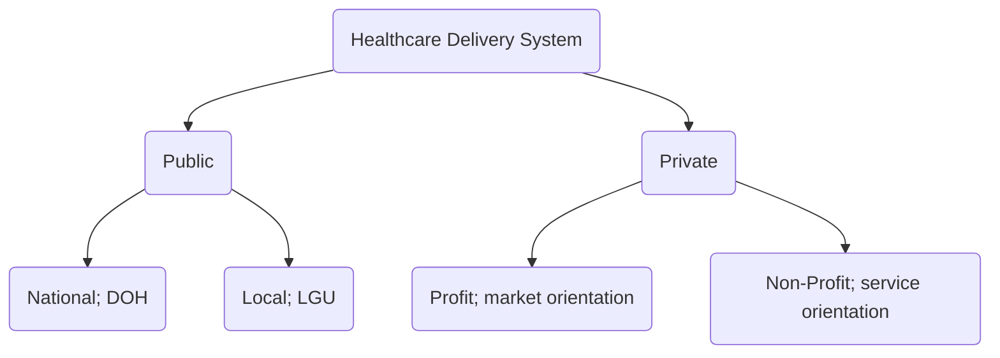

The Philippines is an archipelagic country composed over ~7,100 islands. Geographically, it is divided into three main islands: Luzon, Visayas, and Mindanao. Divided into 17 regions, 82 provinces, 135 cities, and 1,493 municipalities. The provision of health care for the country is divided into the private and public sectors.
- The **Private Sector** is responsible for the production and provision of health goods and services e.g. private clinics, hospitals, laboratories, drugstores, and other facilities.
- The **Public Sector** is a decentralized health care system managed by the Department of Health (DOH) and Local Government Units (LGUs).
	- Primarily funded by the government, private sources, and social health insurance. R.A. 7875 (The National Health Insurance Act) created PhilHealth, an insurance corporation exempt from tax attached to the DOH for policy coordination and guidance. PhilHealth aims for universal health coverage of all Filipinos.
	- An issue with funding remains prevalent. In 2018, the leading payment scheme remained **out-of-pocket** at around 40% to 50% of all health expenditures.
>[!INFO] RA 7160: The Local Government Code of 1991
>An act detailing the devolution and decentralization of primary and secondary health services to local government units.
>- **Municipal or City Government Units** are in charge of [[PHC|Primary Health Care]], with RHUs and BHSs that plan and implement basic health services.
>- **Provincial Government Units** can provide a provincial or district hospital.

In a local government, the health board is headed by the governor or mayor, assisted by health officers and a health board that governs the health office, which is in charge of all unit providers of care (RHUs, BHSs, Provincial/District Hospitals, etc.)

## Department of Health
The **Department of Health** (DOH) is the main governing body for public health. It is responsible for the management, coordination, and regulation of the public sector, the center of health development, and guidance/technical assistance to local government units.

The DOH has a central office, and 17 regional offices for each region in the Philippines. They also run retained and specialty hospitals.

>[!CITE] Vision and Mission
>**Vision**: Make Filipinos among the healthiest in Southeast Asia by 2022 and in Asia by 2040.
>
>**Mandate**: Lead the health sector towards assuming quality healthcare for all Filipinos.
>
>**Mission**: Lead the country in the development of a productive, resilient, equitable, and people-centered health system.
### Retained Hospitals
Retained hospitals refer to hospitals being run by the DOH. Specialty hospitals are corporate hospitals under the DOH.

|Retained Hospitals|Sites|
|-|-|
|**Specialty Hospital**|Lung Center of the Philippines, National Kidney and Transplant Institute, Philippine Children's Medical Center, Philippine Heart Center|
|**Metro Manila Hospitals**|Amang Rodrigues Memorial Medical Center, Dr. Jose Fabella Memorial Hospital, East Avenue Medical Center, Jose R. Reyes Memorial Medical Center, National Center for Mental Health, National Children's Hospital, Philippine Orthopedic Center, Quirino Memorial Medical Center, Research Institute for Tropical Medicine, Rizal Medical Center, San Lazaro Hospital, Tondo Medical Center|
|**Regional Hospitals**|Batanes General Hospital, Cagayan Valley Medical Center, Southern Isabela General Hospital, Region II Trauma and Medical Center, Dr. Jose N. Rodriquez Memorial Hospital, Las Pinas General Hospital and Satellite Trauma Center, San Lorenzo Ruiz General Hospital, Valenzuela Medical Center|

### Levels of Health Care Delivery Systems
Health care delivery systems are classified according to the service capacities and compliance of the system to standards for manpower, equipment, construction, and physical activities.
>[!INFO] RA4226: The Hospital Licensure Law
> Section 8 puts forth the minimum standards and construction of a hospital

### Levels of Health Care (Prevention)
%%Sourced from Gerontologic Nursing (p.133) 6th Ed.%%
1. **Primary Prevention**: activities that involve preventive measures against a given health care problem e.g. immunization for diseases, health-promotion education, counseling, home safety, etc.
2. **Secondary Prevention**: activities that involve the early detection of disease e.g. screening tests for cancer.
3. **Tertiary Prevention**: care provided after disease is established. This involves the minimization of damage and restoration of the individual to their best possible state.
4. **Quaternary Prevention**: the involvement of limiting disabilities caused by chronic symptoms. Efforts are made to maintain functional ability and adaptation to the condition. This also involves the prevention of any unnecessary medical treatment.
### Roles of the Government and DOH
- **Provincial Government**: responsible for the administration of provincial or district hospitals.
- **Municipal or City Government**: in charge of primary health care (rural health units/health centers) and the planning/implementation of basic health services.

Nationally, the **DOH** performs various roles and functions:
1. **Leadership in Health**: the DOH provides national policies and regulations; is a leader in the formulation, monitoring, and evaluation of national health policies. They advocate for the adoption of health policies. They serve as a technical authority in disease control and prevention and provides administration and technical leadership in healthcare financing and implementing the national health insurance law.
2. **Enabler and Capacity Builder**: the DOH innovates new strategies in health and provides oversight in functioning, monitoring, and evaluation of national health  They ensure the highest standard of care, as well as provides logistical support to LGUs, the private sector, and other agencies.
3. **Administrator of Specific Services**: management of selected national health facilities, administering direct services for emergent concerns, such as TB, and health emergency response services.
4. **Attached Agencies**: the DOH is made up of various central bureaus and services in the central office, centers for health development in every region, and DOH-retained hospitals.
5. **Professionalism**: upholding the highest ethical standards, principles of accountability, and full responsibility.
6. **Integrity**: upholding truth and pursuing honesty, accountability, and consistency in performing its functions.
7. **Excellence**: striving for innovation, effectiveness, efficacy, action, dynamism, and openness to change.
8. **Compassion & Respect for Human Dignity**: upholding the quality of life, working with sympathy and benevolence for people in need.
9. **Commitment**: determination to achieve the DOH vision for health and development of future generations.
10. **Teamwork**: a result-oriented mindset allows the DOH employees to work together.
11. **Stewardship of the Health of the People**: the department shall pursue sustainable development and care for the environment.
## Millennium Development Goals
The **Millennium Development Goals** (MDGs) are a set of eight goals created by the United Nations.
1. Eradicate Extreme **Poverty** and **Hunger**: 3/10 children are stunted. Poverty is highly linked to child mortality.
2. Achieve Universal Primary **Education**
3. Promote **Gender Equality** and Empower Women
4. Reduce **Child Mortality**: 25.7/1000 live births will die before the age of five. These deaths are highly linked to economic standing.
5. Improve **Maternal Health**: every year, ~2,600 mothers die due to pregnancy-related complications (2019).
6. **Combat** HIV/AIDS, Malaria, and Other **Diseases**
7. Ensure **Environmental Sustainability**
8. **Global Partnership** for Development
## Sustainable Development Goals
The **Sustainable Development Goals** (SDGs) are seventeen interlinked objectives serving as a blueprint for peace and prosperity of the people and the planet, especially for Goals 1, 2, 3, 6, 7, 11, 13, 16, which are set as goals for 2030.
1. **No Poverty**
2. **Zero Hunger**
3. **Good Health and Well-being**
4. **Quality Education**
5. **Gender Equality**
6. **Clean Water and Sanitation**
7. **Affordable and Clean Energy**
8. **Decent Work and Economic Growth**
9. **Industry, Innovation, and Infrastructure**
10. **Reduced Inequalities**
11. **Sustainable Cities and Communities**
12. **Responsible Consumption and Production**
13. **Climate Action**
14. (Preserve) **Life Below Water**
15. (Preserve) **Life on Land**
16. **Peace, Justice, and Strong Institutions**
17. **Partnerships for the Goals**

(mn. PEACE A(n)D JUSTICE FOR ALL GOOD PARTNERSHIPS) 1, 2, 3, 6, 4, 7, 8, 10, 9, 11, 12, 13, 14, 15, 16, 17

![[sdg_goals.jpeg]]
### Health Goals
**Health Sector Reform Agenda**: health financing, health regulation, local health system, public health programs and hospital system. Their tagline is "**Boosting Universal Health Care**". It's framework is dubbed the **FOURmula One for Health Plus**:
	- **Health Financing**: secure sustainable investments.
	- **Health Service Delivery**: ensure the accessibility of essential health services.
	- **Health Regulation**: ensure high quality and affordable health products and services.
	- **Good Governance**: strengthen leadership and management capacities, coordination, and support to ensure people-centered health systems.
- **Performance Accountability**: using management systems to drive better execution and policies and programs in the DOH while ensuring responsibility to all stakeholders. It uses evidence-based metrics and is used for the health care needs of Filipinos; **Ambisyon Natin 2040** (**Matatag, Maginhawa, at Pantag na Buhay**).

The national policy on **universal health care** espouses three strategic thrusts: better health outcomes, more responsive health systems, and more equitable health financing.
## World Health Organization (WHO)
A specialized agency of the United Nations (UN) that provides **global leadership** on health matters. The constitution for the WHO came into force on April 7, 1948 (World Health Day), with their headquarters in Geneva, Switzerland.. They serve five core functions:
- **Provide leadership** on matters critical to health and engage partnerships when joint actions are needed.
- **Shape research agenda**, **stimulate generation**, **translation**, **and dissemination of valuable knowledge**.
- **Setting norms**, **standards**, **promote and monitor implementation**.
- **Articulating ethical** and **evidence-based policy** options.
- **Provide technical support**, **catalyze change**, and **build sustainable institutional capacity**.