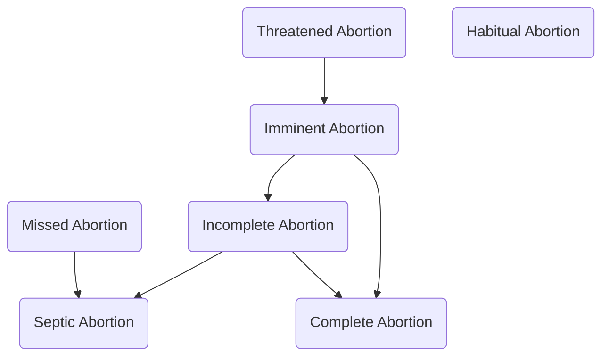
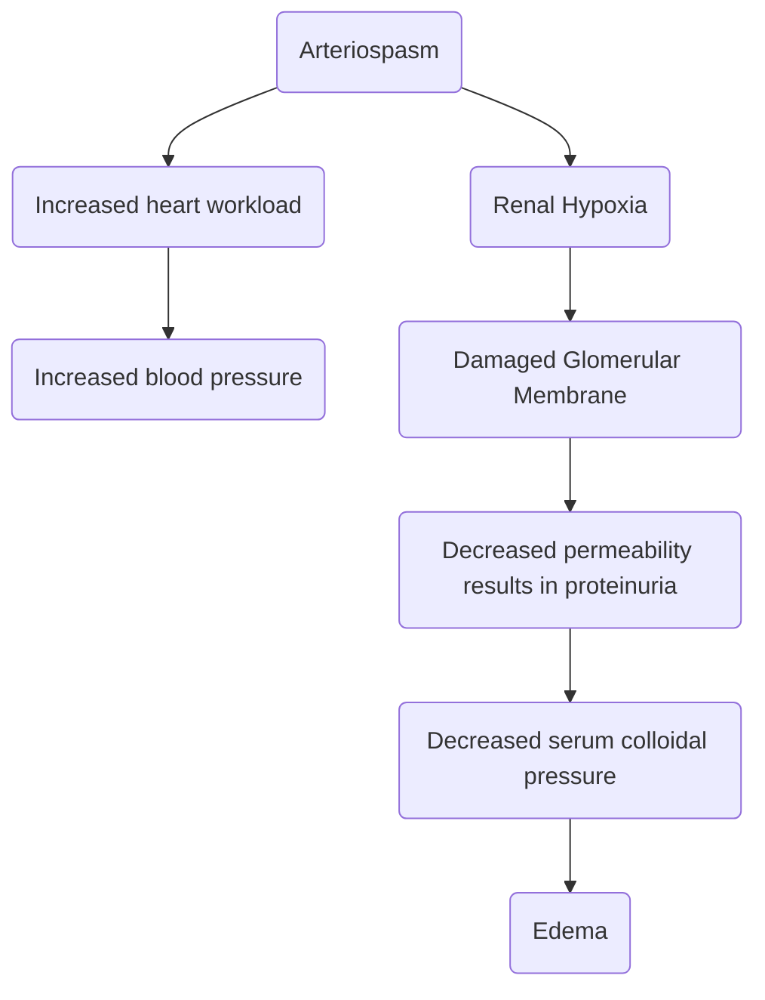
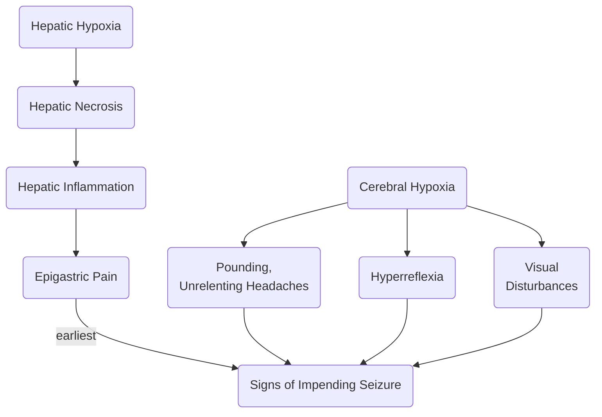
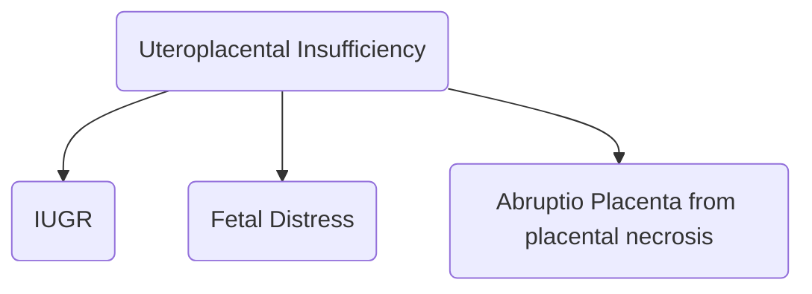

---
tags:
  - CMPA
---
# Bleeding Disorders of Pregnancy
- Bleeding at any time of pregnancy is a major sign except for **SHOW**, which is a sign of true labor.
- Possible causes based on trimester:
	- 1st: abortion, ectopic pregnancy
	- 2nd: abortion (only until the age of viability), incompetent cervix, hydatidiform mole
	- 3rd: abruptio placenta, placenta previa
## Abortion
Termination of the pregnancy before the age of viability (20 weeks)
### Induced Abortion
1. **Therapeutic Abortion**: AKA Legal Abortion, to save the life of the mother. This may be used in cases such as ectopic pregnancies, and gravido cardia.
2. **Non-Therapeutic Abortion**: AKA Criminal Abortion, to get rid of unwanted pregnancies.
		- Most commonly performed through "Hilot", midwives, doctors, and finally nurses (they suggest abortive drugs, usually cytotec, an antiulcer drug via an overdose or as a vaginal suppository).
			- When used as a vaginal suppository, cytotec change the pH balance of the vagina, leading to ascending infection, resulting in chorioamnionitis. The amniotic fluid becomes infected, which the fetus also contracts. The uterus contracts, separating the placenta from the body to prevent infection, resulting in abortion.
			- When used orally (overdose), it increases uterine contraction.
### Spontaneous Abortion (Miscarriage)
1. **Threatened Abortion**: the only form of abortion where the pregnancy may be saved. Most important signs: **==contractions== and ==spotting==**
	- Cervical Dilatation: **closed**
	- Bag of Water: **intact** (+)
	- Uterine Contraction/Bleeding: **mild** 
	- Tissues: **intact**
	- Management: **tocolytics**; **==no IE==** (for any bleeding during pregnancy, as it increases uterine contractions and therefore bleeding); **external fetal monitoring**; **no sex**.
	- Drugs: **tocolytics**, **sedation** (esp. if caused by emotions)
	- **==Nursing Management==**: complete bed rest, watchful waiting, save pads to monitor discharge.
2. **Imminent Abortion**: progression of threatened abortion to an unrecoverable state. This will result in a **complete or incomplete abortion**.
	- Cervical Dilatation: **open** (esp. >3 cm)
	- Bag of Water: **ruptured** (-)
	- Uterine Contraction/Bleeding: **mild to moderate**
	- Tissues: **intact**
	- Management: **admission**
3. **Complete Abortion**: complete expulsion of all the products of conception
	- Cervical Dilatation: **closes within four hours after expulsion of abortus**
	- Bag of Water: **ruptured** (-)
	- Uterine Contraction/Bleeding: **negative to mild**
	- Tissues: **negative**
	- Management: **oxytocin**, **antibiotics**, **analgesics**
4. **Incomplete Abortion**: a remnant of the products of conception is left in the uterus. May progress to septic abortion.
	- Cervical Dilatation: open
	- Bag of Water: ruptured (-)
	- Uterine Contraction/Bleeding: **moderate**
	- Tissues: fragments (+)
	- Management: **oxytocic**, **antibiotic**, **analgesic**, **antiinflammatory**
5. **Missed Abortion**: intrauterine fetal demise; the fetus may remain in the uterus for **4 to 6 weeks** without leading into complications. It is often found that there are **==no fetal movements==**; nurses auscultates **==no fetal heart tone==**. The best diagnostic examination is **==ultrasound==**. May also progress to septic abortion.
	- Cervical Dilatation: **closed** before infection
	- Bag of Water: **intact** (+) before infection
	- Uterine Contraction/Bleeding: (-)
	- Tissues: **intact**
	- Management: **oxytocin**, pushing out abortus, followed by **DNC**.
6. **Septic Abortion**: may result from incomplete or missed abortions. Discharge is foul and brown in color.
	- Cervical Dilatation: **open**
	- Bag of Water: **ruptured** (-)
	- Uterine Contractions/Bleeding: **moderate to strong**
	- Tissues: **either present or removed**
	- Management: **oxytocin** followed by **DNC**. **Antibiotics**, **analgesics**, **antiinflammatory**, **antipyretic**
7. **Habitual**/**Recurrent Abortion**: three or more consecutive spontaneous abortions. Most commonly caused by an incompetent cervical os (it should remain close as it carries the weight of the products of conception and amniotic fluids).
	- Management: **cerclage** (suturing technique used for incompetent cervices)
		- **McDonald's**: temporary suturing technique; NSD still possible with the suturing removed when the woman reaches term or at the onset of true labor (whichever comes first).
			- **VBAC** may still be possible after CS following a McDonald's cerclage, if the incision used is a low transverse incision. Myometrium muscles are cut when using classical or low vertical incisions, and the fundus is affected for classical incisions.
		- **Shirodkar Procedure**: permanent suturing technique; CS delivery is required.
**Coumb's Testing** is done postpartum (day 1, day 2); negative isoimmunization, Rhogam is given to the mother within seven days to suppress antibody production. Rhogam is not permanent.

## Ectopic Pregnancy
The two leading predisposing factors for this is **PID** and **IUD**. PID can affect the cervix, ovaries, and fallopian tubes. The IUD commonly only affect the fallopian tubes (e.g. salphingitis).
- Scar formation post-infection/inflammation results in obstruction of egg motility. Stuck at the ampulla or other parts of the fallopian tube, it may become an extrauterine pregnancy.
- IUDs, most commonly the Copper-T variant, which attracts sperm until they die. If displaced, sperm may enter the fallopian tube, but the formed zygote will not be able to exit. This results in an interstitial ectopic pregnancy
### Tubal Ectopic Pregnancy
Most common form. The fallopian tubes rupture by 10 to 12 weeks.
1. **Ampulla**: only the fallopian tube is damaged.
2. **Interstitial**: more dangerous form, narrowest portion and is directly connected to the uterus. The uterus is also partially damaged.
### Ovarian Ectopic Pregnancy

### Abdominal Ectopic Pregnancy
Most dangerous form
### Cervical Ectopic Pregnancy
Rarely occurs; management is through administration of methotrexate. DNC is not viable as the cervix is **friable**.
### Signs of Rupture
1. **Kehr's Sign** is the earliest sign of rupture, a sharp stabbing pain from the lower quadrant of the abdomen to the shoulder on the same side.
2. **Cullen's Sign** is the following sign of rupture, a bluish discoloration of the periumbilical area.
3. **Signs and Symptoms of Shock**: cold clammy skin, tachycardia, tachypnea, hypovolemia, hypotension, hypothermia
### Diagnostic Examination
1. **Ultrasound** on the **first trimester of pregnancy**.
	- **Confirm** pregnancy
	- **Locate** pregnancy
	- **Locate placenta**
### Management
1. If detected early, **elective surgery**
___
## Hydatidiform Mole
AKA **==Gestational Tropoblastic Disease==** (GTD)
- Normal HCG hormone: 50,000 to 400,000 IU
- Elevated HCG: 1,000,000 - 2,000,000 IU
- Common predisposing factors:
	- **Faulty fertilization**, one of each sex cells are required e.g. two sperms fertilize one egg
	- **Low socio-economic standing**
	- **Protein deficiency**: the building blocks of tissues; poor protein content results in the death of the blastocele, which, if not removed, will multiply and create fluid filled vesicles rapidly.
	- The vesicles rupture from the 16th to 20th week of pregnancy. The resulting discharge is foul and brown.
	- **Diagnostic**: **ultrasound** results in (+) snowstorm
### Classical Signs
1. **Bigger-than-date uterus** due to rapid proliferation of blastocele
2. **HCG is abnormally high**: 1,000,000 to 2,000,000 IU
3. **Absence of fetal signs**: outline, heart rate, movement
4. **Passage of vesicles**: confirmatory sign for H. mole
### Management
**Best**: **DNC** done with a curette then ovum forceps followed by **suction curetage** (large-bore catheter with low-force suction machine.
- Afterwards, HCG titer is done to see if remnants were left (if HCG remains high).
- Pregnancy should be avoided for at least one year to prevent another H. Mole pregnancy, as this may also result in choriocarcinoma (also treated with methotrexate).
## Third Trimester Bleeding Disorders
1. **Placenta Previa**
	- Abdomen: soft
	- Pain: absent (**painless bleeding**)
	- Blood: dark red bleeding; overt
	- Engagement: not engaged
	- Predisposing Factors: **high parity** (for an unknown reason)
1. **Abruptio Placenta**
	- Abdomen: rigid, **board-like**
	- Pain: present (**painful bleeding**)
	- Blood: fresh red breeding; either overt/covert based on type of separation-- Duncan separation results in overt bleeding, Schultz separation results in covert bleeding.
	- Engagement: either
	- Predisposing Factors:
		- **short umbilical cord** (normally 50 to 55 cm, leads to tugging of the placenta during delivery.)
		- **double-cord coil** (shortens the cord)
		- **trauma during pregnancy**
		- **PIH**
		- **unwise use of oxytocin**
Management for both:
- No IE; external fetal monitoring
- Watchful Waiting
- CS; AP may result in fetal distress faster than PP.
- Coumb's Testing
### Types of PP
\* abdominal UTZ for checking for PP; transvaginal is used for typing of PP.
1. **Low-lying PP**: the placenta is on the lower uterus, but does not touch the cervical os.
2. **Marginal PP**: the placenta is touching the cervical os.
3. **Partial PP**: the placenta covers a portion of the cervical os.
4. **Total PP**: the placenta covers the cervical os entirely.

\* May result in subacute IUGR due to late compression of the placenta from positioning, reducing nourishment; the body is smaller than the head.

\* Fetal distress, marked by fetal heart rate, amniotic fluid color, and fetal movement, may occur from the compression of the placenta.
___
# Gestational Diabetes Mellitus
Most diabetogenic hormone of pregnancy is **Human Placental Lactogen** (HPL) from the placenta. HPL production in pregnant women start to increase by **the sixth month of pregnancy**, the best time for screening for GDM.
- **GCT** (glucose challenge test): screening
	- No special preparations required.
	- 50 grams of glucose solution is administered.
	- Only requires one blood extraction: 1 hour after
	- Result should be <140 mg/dL
- **OGTT** (oral glucose tolerance test):
	- Confirmatory Test
	- CHO intake should be increase 2 to 3 days before test.
	- NPO is required past midnight.
	- 100 grams of glucose solution is administered.
	- Four blood extractions:
		- FBS: <90 mg/dL
		- 1 hour after glucose solution: <180 mg/dL
		- 2 hours after glucose solution: <155 mg/dL
		- 3 hours after glucose solution: <140 mg/dL
		- If two of the four results are abnormal, GDM is diagnosed.

- **Classical Signs**: Polyhydramnios, polyphagia, polydipsia, polyuria.
	- Insulin function is blocked by HPL. The hyperglycemia results in fluid shifting
	- Polyuria results from increased kidney perfusion
	- Shrinkage of the cells (cellular dehydration) results in polydipsia
	- Cellular starvation results in polyphagia, which may result in further hyperglycemia.
	- Cellular starvation leads to initiation of gluconeogenesis, which produces ketone bodies (that accumulate in the brain, resulting in decreased level of consciousness, and urine), resulting in diabetic ketoacidosis, then diabetic coma.
	- Ketones may also cross the placenta, absorbed by the fetal blood then body and brain (fetal acidosis), causing permanent cognitive impairment.
	- Hyperglycemia results in fetal pancreatic hyperinsulinemia and a macrosomic fetus (>4000 grams) that experiences neonatal hypoglycemia (indicated by jitteriness)
		- Normal blood glucose at birth is 40 to 60 mg/dL.0
		- <40 to <35: assess neonatal **sucking ability**; if absent, prepare **IV Glucose Solution**, otherwise, provide **Oral Glucose Solution**
		- 35 mg/dL: **IV Glucose Solution**
	- Early pregnancy may be done for diabetic pregnant women with poor glycemic control. As early as 6 weeks (when surfactant production begins), dextramethasone or betamethasone may be given to improve surfactant production for birth.
	- Management: diet and exercise (walking for ~1 to 3), insulin
		- Insulin: two types may be added into one insulin syringe (orange hub).
			- Clear (regular): aspirated first to prevent contamination. Contamination of regular with intermediate results in changes in duration, while contamination of intermediate of regular results in changes in onset.
				- Onset: fast-acting; 30 minutes - 60 minutes
				- Peak: 2 to 4 hours
				- Duration: 5 to 8 hours; short-acting
			- Cloudy (intermediate)
				- Onset: slow-acting 1 to 2 hours (average 2 hours)
				- Peak: 6 hours
				- Duration: 12 to 18 hours; intermediate-lasting
			- Self-administration topics:
				- (most important) Asepsis
				- Sites of administration: subcutaneous; upper arm, abdomen, thigh, buttocks in 9 or 12 sites two fingerbreadths away from the umbilicus. avoid injection of insulin in the same site due to lipodystrophy.
## Gravido Cardiac
Heart disease during pregnancy, most common predisposing factor is rheumatic heart disease caused by rheumatic fever secondary to respiratory infection by Group A Beta-Hemolytic Streptococcus.
- The affected side of the heart is the left side, as oxygenated blood from pulmonary circulation returns to the left atrium, resulting in carditis. Adherence of some microorganisms to the mitral valve results in inflammation of the mitral valve, swelling occurs, resulting in mitral valve prolapse.
- The antibiotic drug of choice for GABHS is Penicillin. Late administration still cures the infection, but scarring may occur on the mitral valve. Hardening of the mitral valve leads to inability to close, resulting in continuous blood flow. This permanent damage leads to gravido cardiac in pregnant women.
- GABHS may also result from dental caries, which contain *Staphylococcus aureus* and *Streptococcus*. It may be transferred from men to women through oral contact as well. Oral care should be marked as important.

Blood volume increases by 30 to 50% in pregnancy. Due to the damage to the mitral valve, hypertrophy of the heart occurs, leading to weakening of the left ventricle (decreased pumping ability), resulting in left-sided congestive heart failure with pulmonary congestion (edema). Cardiac arrest may occur, resulting in death.

Four classifications of CHD:
1. **Type I Gravido Cardiac**
	- S/S: asymptomatic
	- Damage: very minimal
	- Exacerbations: N/A
	- Activity Limitations: N/A
	- Method of Delivery: normal
2. **Type II Gravido Cardiac**
	- S/S: symptomatic (DOB, palpitations, easy fatigueability, chest pain)
	- Damage: minimal
	- Exacerbations: heavy activities
	- Activity Limitations: slight limitations
	- Method of Delivery: normal/forcep
3. **Type III Gravido Cardiac**
	- S/S: symptomatic (DOB, palpitations, easy fatigueability, chest pain)
	- Damage: moderate
	- Exacerbations: light activities
	- Activity Limitations: marked limitation
	- Method of Delivery: forcep to therapeutic abortion
4. **Type IV Gravido Cardiac**
	- S/S: symptomatic (DOB, palpitations, easy fatigueability, chest pain)
	- Damage: severe
	- Exacerbations: at rest
	- Activity Limitations: complete bed rest
	- Method of Delivery: forcep to therapeutic abortion (usually results in t. abortion)
___
# Pregnancy-Induced Hypertension
The main problem involved is arteriospasm wcaused by the hormones of pregnancy. Classical signs: proteinuria, edema, hypertension.
## Types of PIH
1. Gestational Hypertension: just hypertension.
	- **BP**: 140/90
	- **Onset**: 5 months onwards
2. Preeclampsia: all classical signs; divided into mild and severe.
	- **Onset**: 5 months onwards
	- **Mild Preeclampsia**:
		- **BP**: 140/90 - 160/110
		- **Proteinuria**: +1/+2; >300 mg/d
		- **Edema**: mild to moderate
	- **Severe Preeclampsia**:
		- **BP**: >160/100 (same in eclampsia)
		- **Proteinuria**: +3/+4; >500 mg/d
		- **Edema**: severe or generalized edema (anasarca, where even the face is affected)
3. **Eclampsia**: has the same signs as severe preeclampsia, but with the addition of **seizures**.
4. **Chronic Hypertension**:
	- **Onset**: before 5 months due to preexisting hypertensive disorder.
## Predisposing Factors for PIH
1. **Primiparity** and **Young Maternal Age**
2. **Multiparity** and **Advanced Maternal Age**
	- Advanced age risk is related to **arteriosclerosis or atherosclerosis** in older women.
## Management
1. **Promote safety**
	- **Maternal Well Being**:  monitor **BP** and **Weight Gain** daily.
		- Monitor for **Edema**: check the ankles for pitting; **edema grading**: +, ++, +++, ++++ -> x2 mm for each level
	- **Fetal Well Being**: monitor **FHR** (100 - 160; tachycardia is an early sign of fetal distress) and **Kick Counts** (5 to 15, normal is 10; hyperactivity is an early sign of fetal distress), **UTZ** to check for IUGR.
2. **Pharmacology**
	- **Hydralazine** (Apresoline), a vasodilator, is the antihypertensive drug of choice
	- **Magnesium Sulfate**, an antihypertensive, decreases neuromuscular irritability. It is a CNS depressant.
		- **Toxicity**: **hyporeflexia** (earliest), **bradypnea** (<12), **oliguria** (<30 ml/hr).
		- **Loading Dose**: 6 to 10 grams, usually 6.
		- **Maintenance Dose**: 1 to 2 grams.
		- **Route**: Z-track IM (prevent drug leaking to subcutaneous layer)
		- **Site**: dorsogluteal (upper outer quadrant) injection to accommodate for the large dose.
		- **Monitor**: urine output; urine is the main excretion route of magnesium sulfate; decreased urine output contributes to hypermagnesemia.
		- **Antidote**: **Calcium Gluconate**
	- **Dexamethasone**: 6 mg x 4 q 12 hr (bid)
		- Cheaper
	- **Betamethasone** (Celestone): 12 mg x 2 q 24 hr (od)
		- Used for emergency cases due to higher dosage
3. **Diet Therapy**:
	- **Slightly increased protein**
	- **Decreased fat**
	- **Slightly decreased sodium**
## Pathophysiology
1. Arteriospasm
2.1. Increased heart workload
2.2. Increased blood pressure
3.1. Renal Hypoxia
3.2. Damaged Glomerular Membrane
3.3. Decreased permeability results in proteinuria
3.4. Decreased serum colloidal pressure
3.5. Edema
4.1. Hepatic Hypoxia
4.2. Hepatic Necrosis
4.3. Hepatic Inflammation
4.4. Epigastric Pain
5.1. Cerebral Hypoxia
5.1.1. Frequent Pounding, Unrelenting Headaches
5.1.2. Hyperreflexia
5.1.3. Visual Disturbances
6. Signs of Impending Seizure: 4.4 (earliest), 5.1.1-3
7.1. Uteroplacental Insufficiency
7.1.1. IUGR
7.1.2. Fetal Distress
7.1.3. Abruptio Placenta from placental necrosis

___
# Emergency CS Preparation
1. **ICF**
2. **NPO starting now**
3. **Shaving the abdomen**
4. **Removal**: nail polish, dentures, jewelries, contact lenses (if possible)
	- Endorse jewelries to the head, which they will endorse to the family member. Follow hospital protocol.
5. **Follow-up Lab Results**, esp. CBC for blood preparations, blood typing, cross-matching.
6. **General Anesthesia** may be used. Newborn APGAR score may be low and unconscious.
	- If **narcotic analgesics** are used, **Narcan** should be prepared.
## APGAR Scoring
Devised by Dr. Virginia Apgar for the extrauterine adaptation of the baby. Performed 1 minute after birth, 5 minutes after birth, and (if scoring of the previous two were less than 7) 10 minutes after birth.

|Parameter|Check for|2|1|0|
|---|---|---|---|---|
|**Appearance**|Color|Pink|Acrocyanosis|Central Cyanosis|
|**Pulse**|Heart rate|>100|<100|No pulse|
|**Grimace**|Reflex Irritability; stroke nose, rub back|Good Strong Crying, Sneezing|Grimaces|No reaction|
|**Activity**|Muscle Tone|Well flexed|Some flexion|Flaccid|
|**Respiration**|Respiratory Effort|Strong Cry|Weak Cry|No Cry|
* Flaccid babies may experience hypothermia
* The first IM injections at birth are given at the Vastus Lateralis.
* A child being able to climb the stairs with alternating feet is when the dorsogluteal muscle can be used.
* The pulse is the most important aspect of the APGAR score.
* Acrocyanosis is the most common reason for a 9/10 score.
* Scoring:
	* **Severely Depressed** (0 -3): Needs Immediate Resuscitation
	* **Moderately Depressed** (4 - 6): Guarded, close monitoring, requires frequent suctioning.
	* **Good Condition** (7 - 10)
___
# Postpartum Complications
## Postpartum Bleeding
The leading cause of maternal death. A blood loss of more than 500 ml after NSD, or more than 1000 ml after CS.
### **Early Postpartum Bleeding**
1. **Atony**: leading cause; inability to contract
	- Most commonly caused by an **over-distended uterus** during pregnancy e.g. from multiple pregnancy, macrosomia, LGA, polyhydramnios, transverse presentation
	- **High parity**
	- **Precipitate** (<3 hours) or **prolonged labor** (>24 hours).
		- **Precipitate labor** also results in lacerations. Panting is used rather than pushing.
		- **Prolonged labor** may result in exhaustion
	- **Operative Delivery** (from anesthesia)
	- **Forceps Delivery**
	- **Oxytocin**, massage, early ambulation (not if actively bleeding), bladder emptying, early breastfeeding, hysterectomy if necessary.
2. **Lacerations**:
	- **Precipitate Labor**
	- **Powerful Maternal Pushing**
	- **Forceps Delivery** (the blade lacerates the perineum)
	- **LGA**
	- **Breech Presentation**
	- **Suturing**, antibiotics, analgesics, antiinflammatory
3. **Retained placental fragments**: common in duncan and high-parity women
	- **D&C**, antibiotics, analgesics, antiinflammatory

|Condition|Uterus|Blood Color|Origin of Bleeding|
|---|---|---|---|
|Uterine Atony|Relaxed|Dark Red|Uterus|
|Lacerations|Contract|Bright Red|Vaginal Canal|
|Placental Fragments|Contracted then Relaxes|Dark Red|Uterus|

### Late Postpartum Bleeding
Bleeding occuring on the second day postpartum.
1. **Subinvolution** (especially puerperial sepsis/infection)
#### Puerperial Sepsis
**Puerperial Sepsis** an ascending infection is most commonly caused by *E. coli*, and by *Staphylococcus aureus*.
- **Fever** (38C)
- **Lochia** is brownish and foul smelling
- **Fundus** is high (may even be larger due to inflammation)
- **Abdominal tenderness**
- **Management**:
	- Positioning (fowler's to drain infected lochia)
	- Do not massage
	- Breast feeding, bladder emptying
	- Antibiotics, Analgesia, Antiinflammatory, Antipyretics
	- Pericare