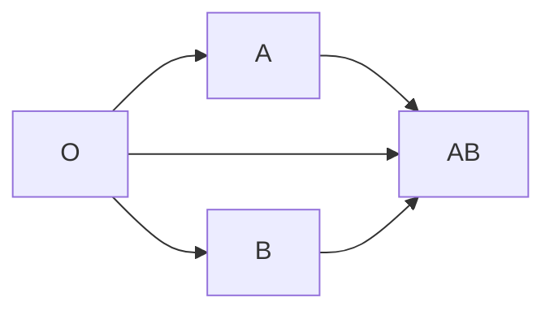

# Module 1: Bowel Elimination
## Colostomy
Handling the colostomy requires a clean technique.
%%The most common topic for Funda last board exam.%%
1. **Stoma**: the stoma of a colostomy is normally pinkish, moist, and shiny. If post-op, it is expected to also be blood-streaked, painful, and slightly edematous. Refer if persistent. A **bluish discoloration** points to cyanosis, **black discoloration** points to necrosis, and a **pale color** points to anemia.
2. **Contraindicated Foods**: follow a low-fiber diet for colostomies, and no-seed diet for ileostomy.
	- Avoid **gas-forming** foods to avoid abdominal distention.
		- **Cruciferous Vegetables**: Broccoli, Cauliflower, Cabbage, Lettuce, etc.
		- **Root Crops**: Sweet Potato, Carrots, Turnips, Radish
	- **Controlling Odor**: (mn. CYAM) Charcoal, Yogurt (best choice), A Green Leafy Vegetable, Milk
3. **Skin Protection**
	- **Karaya**, in the form of paste or powder placed around the stoma.
	- **Skin films** or **adhesive films** placed on the skin around the stoma.
4. There are no **activity restrictions** except for: **contact sports** and **heavy-weight lifting**.
5. **Double-Barreled Colostomy**: e.g. for Hirschsprung Disease (Aganglionic Megacolon). Placed across the transverse colon, with two stoma: **proximal** and **distal**. Proximal drainage contains feces, while distal drainage contains mucus.
## Enema
Primarily used for pre-colonoscopy or pre-operative stages. It is a procedure that requires clean technique.
1. **Cleansing Enema**, also known as "*Non-retention Enema*" is used to (1) stimulate peristalsis, (2) prepare for diagnostic (e.g. Colonoscopy) and surgical procedures (e.g. Hemorrhoidectomy). Example solutions used for this type include:
	- **Hypertonic Solutions**
	- **Isotonic Solutions**
	- **NSS + Soap Sud**, sometimes *Medicated* enema
	- **Fleet Enema**, commercially available enema
	- **Clean-water Enema** has been used, but is no longer used because of the high potential for electrolyte imbalance.
2. **Retention Enema**, also known as *Oil-based Enema*:
	- **Stool Lubrication**: Mineral oil; cotton seed oil. Olive oil may be used.
	- **Stimulate Peristalsis**: Castor oil
3. **Carminative Enema** used to expel flatus. This enema is composed of:
	- Magnesium sulfate (30 ml)
	- Glycerin (60 ml)
	- H2O (90 ml)
### Principles of Enema
1. **Positioning**: position the patient in a Sim's Left Lateral or Side-Lying position.
2. **Volume**: depends on the age of the patient, generally divided between:
	- **Adults**: 750 to 1000 mL
	- **Children**: 500 to 700 mL
	- Infant: 100 to 20 mL
3. **Temperature**: the solution must be warm (100 to 105F, maximum of 100F for children to prevent rectal discomfort).
4. **Length of Rectal Tube**: also depends on age. Avoid rectal discomfort; never exceed limitations on length. Insertion requires KY (water-based) Jelly. Use a generous amount.
	- Adults: 3" to 4"
	- Children: 2" to 3"
	- Infant: 1" to 1.5"
5. **Types and Differences**:

| Characteristics | Non-Retention  |              Retention               |
| --------------- | :------------: | :----------------------------------: |
| Height          |      18"       |                 12"                  |
| Duration        | 10 to 15 mins. | 1 to 3 hours (based on manufacturer) |
6. **Complications**:
	- During transfusion, **cramps and pain may occur**. Stop the transfusion and notify the physician.
	- For children, avoid separation anxiety. Have a parent or caretaker stay with the child during transfusion.
___
# Module 2: Infusion Procedures
## Blood Transfusion
Blood transfusions are sterile procedures.
1. **Information**: name of the patient, blood type, blood product, and cross-matching for any products with RBC.
2. **Blood Types**: A, B, AB (universal recipient), and O (universal donor).
3. **Blood Products**: whole blood and packed RBC has a maximum infusion time of 4 hours. Platelets clot easily, and is only infused for 30 minutes.
	- Whole Blood
	- Packed RBC
	- Platelets
4. Gauge: the best gauge is 18 (green). Maximum is 20 (pink)
5. **Solution**: the only adjust solution to blood is NSS.
6. **Reactions**: when any reactions occur, (a) stop the BT line, (b) then continue the NSS line. (c) Measure vital signs then refer to the physician.
	- **Allergic/Anaphylactic Reaction**: hives, rashes, urticaria, pruritus; Diphenhydramine or Benadryl are regularly used to counteract these manifestations.
	- **Febrile Reaction**: fever
	- **Hemolytic Reaction**: low back pain; flank pain
	- **Fluid Overload**: distended neck vein
	- **Cardiogenic Reaction**: difficulty of breathing
7. **Cross-Matching Technique**: O is the universal donor, while AB is the universal recipient. The following diagram shows the flowchart of who is able to donate to who; all blood types can donate to their own blood type. O receives from O; A receives from O and A; B receives from O and B; and AB receives from O, A, B, and AB.

## Total Parenteral Nutrition (TPN)
Also known as IV Hyperalimentation Feeding. This is used for cases like severe malnutrition and post-GI surgeries.
1. **Components**:
	- Carbohydrates (CHO): glucose makes up 60% to 70% of the bag.
	- Proteins (CHON): amino acids (amino acids are complete in egg whites)
	- Fats: lipids. Unsaturated fats are good; high-density lipoproteins. Examples include salmon, tuna, anchovies, avocado, sardines (not canned), catfish.
	- **Vitamins and Minerals**
		- Vitamin C helps with wound healing.
	- **Fluids** and **Electrolytes**
2. **Access Point**: (a) Subclavian Vein (safer; more common) and (b) Internal Jugular Vein
3. **Complications**:
	- **Hyperglycemia**, one of the early manifestations. Keep regular insulin by bedside as antidote.
	- **Infection** or **Sepsis**, usually appearing after 2 to 4 weeks. Treated with broad-spectrum antibiotics.
4. **Nursing Considerations**:
	- Vital Signs q4hr. The most important sign to watch out for is temperature (36.5C to 37.5C), as it indicates infection.
	- **Blood Glucose Monitoring** (BGM) q6hr. Normal values range from 80 to 120 mg/dL. For Filipinos, values range from 70 to 110 mg/dL.
	- Don't stop TPN abruptly; taper gradually to **prevent rebound hypoglycemia**.
	- Observe absolute sterile technique due to the risk of infection. Glucose is highly nourishing for bacteria.
	- Timeline: change solutions in 24 hours.