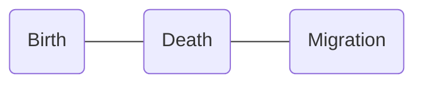

The following discussion is the complete summary of the following notes, based on the 2nd Philippine edition of *Nies* and *McEwen*'s [Community and Public Health Nursing](https://cebookshop.com/product/8043545) (*Famorca*) textbook.
1. [[CMPA/08-29-2024 CHN|CHN D1]]
2. [[CMPA/08-30-2024 CHN|CHN D2]] 

As discussed by **Ma'am Aida V. Garcia, RN, MAN** on 08-29-2024 and 08-30-2024.
___
# Traditional and Complementary Medicines
**Republic Act 8423**, titled the **Traditional and Alternative Medicine Act** (TAMA) authored by Senator Juan Flavier institutes the Philippine Institute of Traditional and Alternative Health Care (PITAHC) under the DOH to improve the quality and delivery of health care services to the Filipino people through **the development of traditional and alternative health care** and its integration into the national health care. Today, these methods are called **T&CM**, **Traditional and Complementary Medicine**.
## Herbal Medicines
Colloquially known as "*Botika sa Paso*" (literally "Pot Pharmacy"), it is defined as the use of plants or derivatives from plants for the treatment of specific conditions. In the Philippines, it is one of the most popular modalities of complementary medicine. Currently, the DOH recommends ten such medicines:
1. **Lagundi**:
	- Use: **Cold**, **cough**, **fever**, **asthma**, dysentery, pain, skin diseases, wounds
	- Preparation: **Decoction**, **Wash affected site with decoction**
2. **Yerba Buena**: *analgesic*
	- Use: **Headache**, **stomachache**, cough and colds, **rheumatism and arthritis**
	- Preparation: **Decoction**, **Infusion**, Massage Sap
3. **Sambong**:
	- Use: **Antiedema**, **antiurolithiasis**
	- Preparation: **Decoction**
4. **Tsaang Gubat**:
	- Use: **Diarrhea**, **Stomachache**
	- Preparation: **Decoction**
5. **Niyog-niyogan**:
	- Use: **Anthelminthic**; *not for children less than 4 years old*
	- Preparation: **Seeds are used**
6. **Bayabas**: *antiseptic, antiinflammatory*
	- Use: **Washing wounds**, **diarrhea**, gargle, **toothache**
	- Preparation: **Decoction**
7. **Akapulko**:
	- Use: **Antifungal**
	- Preparation: **Poultice**
8. **Ulasimang Bato** A.K.A. **Pansit-pansitan**:
	- Use: **Lowers blood uric acid** (**rheumatism and gout**)
	- Preparation: **Decoction**, **eaten raw**
9. **Bawang**:
	- Use: **Hypertension**, **lowers blood cholesterol**, **toothache**
	- Preparation: **Eaten raw or fried**, **applied on part** (for toothache)
10. **Ampalaya**:
	- Use: **Mild Diabetes Mellitus Type 2**, *increases insulin sensitivity*
	- Preparation: **Decoction or Steamed Baby Leaves**

| Preparation   | Procedure                                                                                                                                                 |
| ------------- | --------------------------------------------------------------------------------------------------------------------------------------------------------- |
| **Decoction** | The recommended part of the plant material is **boiled in water**. The recommended boiling time is **20 minutes** *at a maximum of 100°C, in a clay pot*. |
| **Infusion**  | The plant material is **soaked in hot water**, *much like making tea*. The recommended soaking time is **10 to 15 minutes**.                              |
| **Poultice**  | **Directly apply** (*pahid*) the recommended plant material or its essence on the part affected, usually used on bruises, wounds, or rashes.              |
| **Tincture**  | Mix the plant material in **alcohol**.                                                                                                                    |
## Other Traditional Alternative Healthcare
| Terminology                           | Definition                                                                                                                                                                                                                                                                                                          |
| ------------------------------------- | ------------------------------------------------------------------------------------------------------------------------------------------------------------------------------------------------------------------------------------------------------------------------------------------------------------------- |
| **Acupressure**                       | A method of healing and health promotion that uses the **application of pressure on acupunture points**.                                                                                                                                                                                                            |
| **Acupuncture**                       | A method of healing using **special needles to puncture and stimulate specific anatomical points on the body**.                                                                                                                                                                                                     |
| **Aromatherapy**                      | The art and science of the **sense of smell** whereby *essential aromatic oils* are combined and then applied to the body in some form of treatment.                                                                                                                                                                |
| **Chiropracty**                       | A discipline of the healing arts concerned with the pathogenesis, diagnosis, therapy, and prophylaxis of **functional disturbances, pathomechanical states, pain syndromes, and neurophysiological effects related to the static and dynamics of the locomotor system**, especially of the spine and pelvis.        |
| **Phytomedicine**/**Herbal Medicine** | Finished, labeled, medicinal products that contain as active ingredients aerial or underground parts of the plant or other materials or combination thereof, either in the crude state or as plant preparations.                                                                                                    |
| **Massage**                           | A method wherein the **superficial soft parts of the body are rubbed, stroked, kneaded, or tapped** for remedial, aesthetic, hygienic, or limited therapeutic purposes. *Massaging modalities include effleurage, petrissage, tapotement, and friction.*                                                            |
| **Nutritional Therpay**               | The use of **food as medicine** and to improve healthy by enhancing the nutritional value of food components that reduces the risk of a disease. It is synonymous with *nutritional healing*.                                                                                                                       |
| **Pranic Healing**                    | A *holistic approach* of healing that follows the **principle of balancing energy**.                                                                                                                                                                                                                                |
| **Reflexology**                       | The application of **therapeutic pressure** on the body's **reflex points** to enhance the body's natural healing mechanisms and balance body functions. It is based on the principle that internal glands and organs can be influenced by properly applying pressure to the corresponding reflex area on the body. |
___
# Expanded Program on Immunization
**Immunization** is an essential public health service and is commonly defined as the process of conferring artificial immunity to population groups. **Immunity** is described as resistance and protection from disease attributed to the presence of antibodies in the blood. The **National Immunization Program** (NIP) is committed to guaranteeing free immunization services and ensures that Filipinos, especially the poor, have access to routinely recommended vaccines. It further guarantees the immunization of **neonates**, **infants**, **children**, **adolescents**, **mothers**, and **elderly** populations as part of the comprehensive strategy for disease prevention and control following the life stage approach. Its goal is **to reduce morbidity and mortality** among infants and children caused by common childhood immunizable diseases. Specifically, the NIP has the following goals.
- To immunize **all** (*previously <100%*) infants against vaccine preventable diseases
- To sustain polio-free status of the Philippines
- To eliminate measles infections
- To eliminate maternal and neonatal tetanus
- To control Diphtheria, Pertussis, Hepatitis B infection and German Measles (Rubella)
- To prevent extrapulmonary tuberculosis among children

Related laws:
- **PD No. 996** of 1976: providing compulsory basic immunization for infants and children below 8 years old (*covers DPT, poliomyelitis, and measles*)
- **RA 7846** of 1994: inclusion of **Hepatitis B** immunization for infants and children below 8 years old
- **RA 10152** of 2011: Mandatory Infants and Children Health Immunization Act of 2011 for children up to 5 years of age and inclusion of new vaccines: **Hepatitis B**, **Mumps**, **Rubella**, and **Haemophilus Infuenza type B** (Hib). This repealed PD 996 and is considered the current legal basis of the NIP.
- **Presidential Proclamation No. 6** of 1996: Implementing a United Nations Goal on Universal Immunity by 1990; and **designating Wednesdays as Immunization day**.
## Vaccine Types
Immunization may be **active** (with the immune system) or **passive** (gained from someone else), and **natural** or **artificial**, depending on how it is obtained.

|    Type     | Natural                                    | Artificial                                                                                                       |
| :---------: | ------------------------------------------ | ---------------------------------------------------------------------------------------------------------------- |
| **Active**  | Exposure Carrier Sick of the disease | Antigens Attenuated (BCG, OPV, AMV, Rotavirus) Killed (Pertussis, HBV) Weakened Toxins (TT, Diphtheria) |
| **Passive** | Breastmilk (IgA) Placenta (IgG)         | Gamma globulin (6 months - 1 year) Antitoxin/antiserum/serum                                                  |
1. **Live Attenuated Vaccines** have weakened forms of a pathogen to stimulate the body to produce antibodies for the disease. This type of vaccine only requires one or two doses to provide life-long protection. Examples include BCG, OPV, AMV, and Rotavirus.
	- Because of its nature, **it is contraindicated in immunocompromised children**, as even a weakened pathogen may cause adverse effects.
2. **Inactivated (Killed) Vaccines** are dead pathogens that also stimulate the body to produce antibodies for the disease. A trade-off of its safety is less effectivity, typically requiring three doses for protection, and requiring booster doses over time. Examples include IPV and wP (Whole-cell Pertussis Vaccine).
3. **Toxoid Vaccines** are vaccines that contain an inactivated form of a pathogen's toxins. It is also safe, but also requires several doses with periodic boosters. Examples include TT and DT. 
4. **Conjugate/Subunit Vaccine**  include parts of the capsule of the pathogen. It operates similar to live attenuated vaccines, but are not as effective. Examples include Hib, PCV, HBV, and aP (Acellular Pertussis Vaccine).
## General Considerations for Implementation
1. Remind caregivers of children to comply with the prescribed schedule of routine immunization.
2. **Previous doses do not have to be repeated regardless of interval**.
3. The eligible age for **Pentavalent** vaccines is **up to 5 years old**.
4. Booster doses are not *really* necessary.
5. **Vaccines may be given on the same day, but in different sites**:
	- If through the same leg, space the site at least 2.5 to 5 centimeters (1 to 2 inches; at least two fingerbreadths).
	- **Start with OPV**, **then Rotavirus**, then the other vaccines.
6. Observe the "**First Expiry, First Out**" (FEFO) or "**First In, First Out**" (FIFO) principle in utilizing vaccine stocks.
7. Use **cotton** in cleaning the injection site. **If with alcohol, thoroughly dry before administrating the vaccine**.
8. **BCG, AMV, and MMR have special diluents**. After reconstitution, **these vaccines are only valid for 6 hours**. *This used to be 4 hours*
9. **Protect BCG from sunlight, and Rotavirus from light**. *This principle may be used in questions that ask which location is appropriate for vaccination*
10. Information caregivers of children for immunization about [[#Common Vaccination Side Effects and Management|common side effects]], and how to deal with it.
11. **Reusable vaccines** such as **OPV, Pentavalent, Hepatitis B, and Tetanus Toxoid** may last for a maximum of **4 weeks** as long as the vaccine has (a) not expired, (b) been maintained in appropriate cold chain conditions, (c) remained uncontaminated during aspiration, (d) a VVM that does not indicate discarding, and (e) the vaccine septum has not been submerged in water.

In cases of a **measles outbreak**, a **supplemental measles vaccine** is administered.
- For children **under 9 months old**, give **MR** (no vaccine for mumps) reconstituted with **two vials of special diluent** (6 mL total), giving 0.5 mL subcutaneously to the child.
- For children **9 months to 5 years old**, give **MMR**.

These are **NOT CONTRAINDICATIONS**:
1. **Fever up to 38.5°C** *"up to" means a fever of 38.5°C still permits vaccination.*
2. **Mild acute respiratory infection**
3. **Simple diarrhea**
4. **Malnutrition** *conversely, this is an indication; malnutrition poses greater risk for disease*
## Vaccines and Administration

| Vaccine                                  | Diseases                                                                     | Age                                      |       Dose        | Route | Site                    |
| ---------------------------------------- | ---------------------------------------------------------------------------- | ---------------------------------------- | :---------------: | :---: | ----------------------- |
| **Bacillus Calmette-Guerin** (BCG)       | Tuberculosis *Meningitis* *Leprosy*                                    | At birth                                 |      0.05 mL      |  ID   | Right upper arm/deltoid |
| **Hepatitis B Vaccine** (HBV)            | Hepatitis B *Liver Cancer*                                                | At birth                                 |      0.5 mL       |  IM   | Vastus Lateralis        |
| **Pentavalent** (DPT-HepB-Hib)           | Diphtheria Pertussis Tetanus Hepatitis B Pneumonia Meningitis | 6, 10, 14 weeks; *not given if >5 years* |      0.5 mL       |  IM   | Vastus Lateralis        |
| **Oral Polio Vaccine** (OPV)             | Poliomyelitis                                                                | 6, 10, 14 weeks                          | 0.5 mL; 2-3 drops |  PO   | Mouth                   |
| **Inactivated Polio** Vaccine (IPV)      | Poliomyelitis                                                                | 14 weeks, *9 months*                     |      0.5 mL       |  IM   | Vastus Lateralis        |
| **Pneumococcal Conjugate Vaccine** (PCV) | Pneumonia Meningitis                                                      | 6, 10, 14 weeks                          |      0.5 mL       |  IM   | Vastus Lateralis        |
| **Mumps Measles Rubella** (MMR)          | Mumps Measles Rubella                                                  | 9, 12-15 months                          |      0.5 mL       |  SC   | Outer arm               |
Appearances:
- Freeze-dried: AMV, MMR, BCG *freeze-dried vaccines have special diluents for reconstitution*
- Liquid and Clear: Pentavalent, OPV (pinkish), Rotavirus, TT (sometimes slightly turbid)
- Liquid and Cloudy: HBV
## Common Vaccination Side Effects and Management

| Vaccine      | Side Effect                                                                                                                                  | Management                                                                                                                                                                                                                                                            |
| ------------ | -------------------------------------------------------------------------------------------------------------------------------------------- | --------------------------------------------------------------------------------------------------------------------------------------------------------------------------------------------------------------------------------------------------------------------- |
| BCG          | **Wheal** for 30 minutes followed by **ulceration** for 2 weeks then **scar formation** within 12 weeks                                      | Normal Reaction                                                                                                                                                                                                                                                       |
| BCG          | **Koch's Phenomenon**: an acute inflammatory reaction within 2 to 4 days after vaccination usually due to previous exposure to tuberculosis. | No management is needed.                                                                                                                                                                                                                                              |
| BCG          | **Deep** (subcutaneous) **abscess** at vaccination site; almost invariable due to subcutaneous or deeper injection                           | Refer to the physician for **incision and drainage** (I&D).                                                                                                                                                                                                           |
| BCG          | **Indolent ulcer**: an ulcer which persists after 12 weeks from vaccination date                                                             | Treat with **Isoniazid** (INH) **powder**.                                                                                                                                                                                                                            |
| BCG          | **Glandular enlargement**: enlargement of the lymph glands draining the injection site                                                       | Treat as deep abscess (**I&D**) if suppuration occurs.                                                                                                                                                                                                                |
| HBV          | Local soreness at injection site                                                                                                             | No treatment necessary. Cold compress may be used.                                                                                                                                                                                                                    |
| DPT-HepB-Hib | Fever that usually last for only 1 day. A fever beyond 24 hours is not due to the vaccine.                                                   | Advise parents to give an **antipyretic**.                                                                                                                                                                                                                            |
| DPT-HepB-Hib | Local soreness at the injection site                                                                                                         | Reassure parents that soreness will disappear after 3 to 4 days. Paracetamol may be given for pain.                                                                                                                                                                   |
| DPT-HepB-Hib | Abscess after a week or more usually indicates that the injection was not deep enough or the needle was not sterile.                         | I&D may be necessary.                                                                                                                                                                                                                                                 |
| DPT-HepB-Hib | Convulsions, although very rare, may occur in children older than 3 months caused by the **pertussis** component.                            | Proper management of convulsion; may give DT next vaccination.                                                                                                                                                                                                        |
| OPV          | None                                                                                                                                         | - Nothing per orem for 30 minutes to prevent vomiting and to enhance absorption - If the child vomits, administer another dose. - If the child has simple diarrhea, the dose may be given, but it is not counted and another dose will be given the next visit. |
| IPV          | Local tenderness                                                                                                                             | Cold compress                                                                                                                                                                                                                                                         |
| MMR          | Local soreness, fever, irritability, and malaise in some children                                                                            | - Reassure parents and instruct parents to give an **antipyretic** to the child. - Give 200,000 IU of Vitamin A to promote epithelialization and increase immunity.                                                                                                |
## Cold Chain
The DOH provide recommendations for the cold chain principle of proper vaccine storage, handling, and transport of vaccines in the prescribed temperature. Methods for ensuring biological potency include the following:
1. **First Expiry, First Out** (FEFO) **Principle**: use the vaccines nearest to their expiration date.
2. **Vaccine Vial Monitor** (VVM): a round disc of heat-sensitive material to **register cumulative heat exposure**. The lower the temperature, the slower the color change and vice versa.
	- If the square is lighter than the circle, use the vaccine if not expired.
	- If the square matches or is darker than the circle, do not use the vaccine and inform the supervisor.
3. **Shake Test**: an approach to determine if a freeze-sensitive biological has been frozen then thawed, to determine it for use or for disposal.
	- If the vial is smooth and cloudy immediately after shaking, the biological can be used. If it appears granular and not smooth, it should be discarded.
	- If, after 30 minutes, the vial starts to clear but no sediment has formed, it is viable. Otherwise, an almost clear vial with thick sediment should be discarded.

Vaccines are often temperature sensitive, and therefore should be maintained in their respective temperatures during transport and storage. The **cold chain** is a system for ensuring vaccine potency. This system is managed by the *cold chain manager*, a role held by the **public health nurse**.
1. **Transport Boxes**: for transporting vaccines, with a viable duration of **five days**.
2. **Vaccine Carriers**: a smaller transport box used within the community, with a viable of **two days** (48 hours).
3. **Refrigerator**: a refrigerator used for vaccines is divided between the body (kept at 2°C to 8°C) and the freezer (-15°C to -25°C). The door of the refrigerator is never used due to it being subject to fluctuations in temperature. Vaccines may be stored in these for **30 days**; 1 month.
	- In a health unit, the temperature is **checked routinely at least twice a day** by the cold chain officer, usually upon opening and before closing.
	- Only OPV is kept in the freezer; freeze-dried vaccines do not require freezing. Their special diluents are kept on the refrigerator door or the lower compartment.

| Sensitivity                                    | Vaccines                    | Temperature    | Stability                      |
| ---------------------------------------------- | --------------------------- | -------------- | ------------------------------ |
| Most sensitive                                 | OPV                         | -15°C to -25°C | -                              |
| Least sensitive to heat/most sensitive to cold | Pentavalent, HBV, DT Toxoid | 2°C to 8°C     | 8 hours if in room temperature |
| Most sensitive to light                        | -                           | -              | 4 to 6 hours                   |

Recommended Duration of Storage for Biologicals (*only the 1 month limit was really mentioned during the discussion*)

| Institution                                | Duration    |
| ------------------------------------------ | ----------- |
| Regional Health Office                     | 6 months    |
| Provincial/District Health Office          | 3 month     |
| **Rural Health Unit**                      | **1 month** |
| Maximum Transport Period (with cold packs) | 5 days      |
## Documentation
1. **Fully Immunized Child** (FIC): the child has received all immunizations that should be given before reaching the first year of life (a dose of BCG, HBV, MMR, IPV; 3 doses of Pentavalent and OPV)
2. **Completely Immunized Child** (CIC): the child has received all immunizations scheduled at the age of 12 to 23 months.
3. **Child Protected At Birth** (CPAB): a child whose mother has received 2 doses of Diphtheria Tetanus (DT) toxoid during pregnancy provided that the 2nd dose was given at least a month prior to delivery or 3 doses of DT given any time prior to pregnancy with this child.
4. **Fully Immunized Mother** (FIM): a mother who has received the complete five (5) doses of diphtheria tetanus.

| Dose | Schedule                                                          | Protection | Duration |
| ---- | ----------------------------------------------------------------- | ---------- | -------- |
| 1    | ASAP during first pregnancy or nonpregnant childbearing age woman | N/A        | N/A      |
| 2    | 1 month after DT1                                                 | 80%        | 3 years  |
| 3    | 6 months after DT2                                                | 95%        | 5 years  |
| 4    | 1 year after DT3                                                  | 99%        | 10 years |
| 5    | 1 year after DT4                                                  | 99%        | Lifetime |
___
# Demography
This part is not sourced from the book, but is directly from a handout for CMPA by Ma'am Dang.  I believe this is a topic found in Maglaya's Community Nursing book, which I am not in possession of.

**Demography** is the study of the size, territorial distribution, and composition of population and the changes therein (Duncan & Hauser, 1972). Literally translated from Greek, it means "*description of the people*". A **Population** is defined as group of individuals of the same species living and interbreeding within a given area. There are several general parameters in studying the population:
1. **Population Size**: the number of people in a given place at a given time.
2. **Population Distribution**: the specific geographic location of the population.
3. **Population Composition**: the characteristics of population as to age, sex, occupation, or educational level.
4. **Population Projection**: a common demographic tool that provides a basis for other statistical projections. It helps governments with decision-making.

There are three components that affect population growth:

## Sources of Data
1. **Census**: conducted by a national government and attempts to enumerate every person in a country. It may be done in two ways:
	- **De Jure**: individuals are recorded based on legal residence
	- **De Facto**: individuals are recorded based on their location at a specific time.
2. **Sample Survey**: data gathered from a subset of the population proportionate to the general population.
3. **Registration System**: deals with recording of vital events such as birth, marriage, and death.
## Demography Statistics
1. **Natural Increase**: the difference between live births and deaths in a specified period of time.
$$\text{Natural Increase}=\text{\# of Births}-\text{\# of Deaths}$$
2. **Rate of Natural Increase**: the difference between live births and deaths in a specified period of time.
$$\text{Rate of Natural Increase}=\text{Crude Birth Rate}-\text{Crude Death Rate}$$
3. **Absolute Increase per Year**: the number of people that are added to the population per year. $Pt$ is the population size and $Po$ is the population size from $t$ years before.
$$\text{Absolute Increase per Year}=\frac{Pt-Po}{t}$$
4. **Relative Increase** (Population Growth Rate): the actual differences between the two census counts expressed in **percent** relative to the population size made during an earlier census. This percent is the average yearly percentage change over the same time frame.
$$\text{Relative Increase}=\frac{Pt-Po}{Po}$$
## Population Composition
1. **Sex Composition** (Sex Ratio): the ratio of males to females in a population, expressed as "number of males for every 100 females".
$$\text{Sex Ratio}=\frac{\text{\# of Males}}{\text{\# of Females}}\times100$$
2. **Age Composition** (or distribution): the proportionate number of persons in successive age categories in a given population. As an example, a population with persistently high fertility would exhibit a large proportion of children, and a small proportion of aged persons.
3. **Median Age**: the age that divides a population into two numerically equally sized groups, i.e., exactly half the population would be younger or older than the median age. It is a single age that summarizes the age distribution of a population.
4. **Dependency Ratio**: the age-population ratio of those typically not in the labor force and those typically in the labor force. This age group is between 15 years old and 64 years old. It is used to measure the pressure on the productive population to support the dependent population. It is expressed as a percent, e.g., "60% of the population is dependent on the remaining 40%"
$$\text{Dependency Ratio}=\frac{\text{People aged <14, and >65 years old}}{\text{People aged 15 to 65 years old}}\times 100$$
5. **Age and Sex Composition**: a population pyramid that depicts both age (vertical axis) and sex (horizontal axis). The shape of this pyramid can determine the pattern of population change. A normal pyramid (as illustrated below) shows rapid growth, a thin, almost columnar pyramid shows slow growth, and a top-heavy pyramid shows negative growth.
![[population_pyramid.png]]
## Population Distribution
The pattern of where people live. It denotes the spatial pattern: due to dispersal of population, formation of agglomeration (groups), and linear spread.
1. **Urban-Rural Distribution**: illustrates the proportion of the people living in urban areas compared to rural areas.
2. **Crowding Index**: an alternative measure of **household crowding**. It is defined as the number of usual residents in a dwelling divided by the number of rooms in the dwelling.
$$\text{Crowding Index}=\frac{\text{\# of Persons in a Household}}{\text{\# of Rooms used for Sleeping}}$$
3. **Population Density**: is calculated as population divided by total land area, expressed as number of people per square kilometer of land area.
$$\text{Population Density}=\frac{\text{\# of people}}{\text{Land area in km}^2}$$
___
# Field Health Services and Information System (FHSIS)
A **Health Information System** (HIS) has four primary functions: data generation, compilation, analysis & synthesis, and communication & use. This system collects data from the healthcare and other pertinent sectors; analyzes gathered data; ensures overall data quality, relevance, and timeliness; and, converts the data into information imperative for health-related decision-making (WHO, 2008b).

The **Field Health Services Information System** (FHSIS) is the HIS utilized in the Philippine context, serving as the official reporting and recording system of the Philippine Department of Health (DOH). It is a facility-based and data-generated system from the Barangay Health Stations (BHS) and Rural Health Units (RHU) to the national level. The current FHSIS (version 2012) primarily aims to:
1. Provide raw and summary data on **health service delivery and selected health program accomplishment indicators**;
2. Provide a standardized, facility-level data base for **program monitoring and evaluation purposes**.
3. Provide more evidence-based data for **research purposes, policy formation and basis for health system interventions**; and
4. **Minimize documentation burden** at the service delivery level in order to allow more time for patient care and health promotion activities.
## Components of the FHSIS
There are two primary types of tools utilized by the FHSIS:
1. **Recording Tools**: detailed, **day-to-day**, facility-based **documents on the health services rendered to patients/clients** in the rural health facilities.
2. **Reporting Tools/Forms**: summary data transmitted or submitted on a **monthly**, **quarterly**, and **annual basis** to higher organizational levels of the healthcare delivery system. These are based on the Summary Table (ST) and Monthly Consolidation Table (MCT) recording tools.
## Recording Tools
1. **Individual Treatment Record** (ITR): the **primary building block** of the FHSIS. This is a basic patient consultation record containing a date, name, address of the patient, height, weight, chief complaint, presenting signs and symptoms, diagnosis (if available), and treatment. Examples of ITRs include *immunization records* or *national tuberculosis program treatment record*.
2. **Target Client List** (TCL): the **secondary building block** of the FHSIS. This is a list of eligible clients for a particular **health program**. It facilitates the **monitoring and supervision of service delivery activities** and **determines the client's compliance to a particular program**. Health programs to  be maintained under FHSIS version 2012 are: **Prenatal Care**, **Post-Partum Care**, **Nutrition and Expanded Program for Immunization**, **Family Planning**, and **Sick Children**. This tool provides a clinic-level data for population-based research.
3. **Summary Table** (ST): a form with 12 columns for a monthly tally of the number of clients in the barangay health facility in terms of **health program accomplishments** (all TCL data) and **morbidity diseases**.
4. **Monthly Consolidation Table** (MCT): a form filled up by the Public Health Nurse (PHN) to collate data report by all midwives of the city or municipality. It is essentially the **output table of the RHU**, consisting of the **reported data per indicator** by each Barangay Health Station or public health midwife. This record will serve as *the source document for the public health nurse for the Quarterly Forms*.
## Reporting Forms
*It will be important to memorize each report's alias!*
1. **Monthly Forms**:
	- **Program Report** (M1) contains selected indicators categorized as maternal care, childcare, family planning, and disease control; the same indicators found in the TCL and ST. This is report is submitted by the **midwife**.
	- **Morbidity Report** (M2) contains a list of all diseases by age and sex. This report is submitted by the **midwife**.
2. **Quarterly Forms**:
	- **Program Report** (Q1)
	- **Morbidity Report** (Q2)
3. **Annual Forms**:
	- Report on demographic, environmental, natality, and mortality. (A1)
	- Report on all diseases according to age and sex. (A2)
	- Report on all mortality cases or deaths according to age and sex. (A3)

*Summary of Responsible Persons and Schedules for FHSIS Tools*

| Office    | Person                          | Recording Tools | Reporting Tools | Schedule                                                |
| --------- | ------------------------------- | --------------- | --------------- | ------------------------------------------------------- |
| BHS       | **Midwife**                     | ITR, TCL, ST    | M1, M2       | Every second week of the succeeding month            |
|           |                                 | -               | A-BRGY Form     | Every second week of January                            |
| RHLI      | **PHN**                         | ST, MCT         | Q1, Q2          | Every third week of first month of succeeding quarter   |
|           |                                 |                 | A1, A2, A3      | Every third week of January                             |
| *PHOi*CHO | **Prov/City FHSIS Coordinator** | -               | Q1, Q2          | Every fourth week of first month of succeeding quarter  |
|           |                                 |                 | A1, A2, A3      | Every fourth week of January                            |
| CHD       | **Regional FHSIS Coordinator**  | -               | Q1, Q2          | Every second week of second month of succeeding quarter |
|           |                                 |                 | A1, A2, A3      | Every second week of March                              |
|           |                                 |                 |                 |                                                         |
___
# Family
There are many definitions of the family:
1. The family is a group of persons usually living together and composed of the head and other persons related to the head by blood, marriage or adoption. It includes both the nuclear and extended family. (National Statistical Coordination Board)
2. A social unit interacting with the large society. (Johnson, sociologist)
3. A family is characterized by people together because of birth, marriage, adoption, or choice (Allen et al.).
4. The family is composed of two or more persons who are joined together by bonds of sharing and emotional closeness and who identify themselves as being part of the family. (Friedman et al.).

The family is considered as a "*unit of service*" for the following reasons:
1. The family is considered as the "*natural*" and fundamental **unit of society**.
2. The family as a group **generates**, **prevents**, **tolerates**, and **corrects health problems** within its membership; the family acts as the basic care provider.
3. The health problems of the family are interlocking. **Illness in one member affects the entire family and its functioning**.
4. The family is **the most frequent focus of health decisions and actions in personal care**.
5. The family is an **effective and available channel for nursing efforts**. Improved community health is realized only through improved family health.
## Family Structure

| Family Form   | Description                                                                                                                                                                                                                                                                              |
| ------------- | ---------------------------------------------------------------------------------------------------------------------------------------------------------------------------------------------------------------------------------------------------------------------------------------- |
| **Nuclear**       | "*Traditional*; *Family of marriage, parenthood, or procreation*". A husband, wife, and their children— natural, adopted, or both (Friedman et al.).                                                                                                                                     |
| **Dyad**          | "*Empty nesters*". A husband and wife with no children.                                                                                                                                                                                                                                  |
| **Extended**      | "*Multigenerational*". Three or more generations, which may include in-laws and grandparents.                                                                                                                                                                                            |
| **Blended**       | The union of two spouses who have had children from a previous marriage.                                                                                                                                                                                                                 |
| **Compound**      | A husband with multiple wives, primarily only permitted in Muslim culture (in the Philippines) by virtue of P.D. No. 1083 (Code of Muslim Personal Laws of the Philippines).                                                                                                             |
| **Cohabiting**    | "*Live-in*". An unmarried couple and their child or children, recognized through common-law marriage.                                                                                                                                                                                    |
| **Single Parent** | Resulting from death of a spouse, separation, or pregnancy outside of wedlock. These families are faced with greater risk associated with lesser social, emotional, and financial resources. Families who have one of the spouses working overseas effectively fall under this category. |
| **Homosexual**    | A cohabiting couple of the same sex in a sexual relationship. They may or may not have children. E.O. 209 (Family Code of the Philippines) expressly states that marriage is between a man and a woman, therefore disallowing same-sex marriage.                                         |
*The following are additional forms and classifications discussed but not included within the book.*

Based on **Authority**, where decision-making is delegated to either the father (**Patriarchal**) or mother (**Matriarchal**). A participative form of authority is termed **Patricentric**, **Matricentric** or **Egalitarian** (equal), eliminating the hierarchal nuance of previous terminology.

Based on **Marital Residence Pattern**, where the family moves closer to or at the father's residence (**Patrilocal**), moves closer to or at the mother's residence (**Matrilocal**), or independent of either spouse's location (**Neo-Local**)

Based on **Lineage**; the system of descent and inheritance where lineage, family name, and property are passed down the male line (**Patrilineal**) or the female line (**Matrilineal**)

Based on **Amount of Partners**, a family may be **Monogamous**, where one husband is bound to one wife; **Polygamous**, where a husband is with multiple wives (commonly found among Muslims in Saudi Arabia); or **Polyandrous**, where a wife is with multiple husbands (commonly found in the Todas of Southern India).
## Functions of the Family
1. **Procreation**: the universally accepted institution for reproductive function and child rearing.
2. **Socialization of Family Members**: the family creates the foundation for how its children becomes productive members of society. It involves the transmission of culture from the parents to their children.
3. **Physical Maintenance**: the provision of basic needs for its dependent members.
4. **Economic Function**: the family serves as a basic unit of economic production (rural families producing goods) or economic consumption (urban families earning salaries or wages)
5. **Welfare and Protection**: the family provides companionship and meets affective, sexual, socioeconomic needs, and emotional gratification. The family is a source of motivation and morale for its members.
6. **Status Placement**: the family confers its societal rank on the children. With social mobility, the family may shift between social classes.
## Family as a Client
The family unit is important to society. It meets individual needs, and supports spouses or partners by meeting affective, sexual, and socioeconomic needs. The family is also viewed as an important unit of health care with awareness that **the individual can be best understood within the social context of the family**. Observing and inquiring about family interaction enables the nurse in the community to assess the influence of family members on each other. Specifically, reasons to work with families are enumerated by Friedman et al.:
- "**The family is a critical resource**"; the family can improve individual members' health through health promotion and wellness activities.
- "**In a family unit, any dysfunction that affects one or more family members will affect the members and unit as a whole**"; this is also referred to as a "*ripple effect*".
- "**Case finding**"; while assessing an individual, the nurse may identify a health problem that necessitates identifying risks for the entire family.
- "**Improving nursing care**"; the nurse provides better and more holistic care by understanding the family and its members.
%% skipped the subchapter for "The family as a system"%%
>[!INFO] The family as a system
>The *General Systems Theory* explains how the family as a unit interacts with larger units outside the family. There are three subsystems of the family that are most important: **parent-child subsystem**, **marital subsystem**, and **sibling-sibling subsystem**. Each subsystem can reestablish balance if any disrupting force or imbalance occurs.
## Developmental Stages of the Family
Like with the growth and development of pediatrics for individuals, families also experience stages of development traversing from marriage to death. The nurse must comprehend these phases and the struggles that families experience while going through them. Developmental tasks exist for these stages, and are the resolution to each stage.
1. **Marriage** (joining of families): the formation of an identity as a couple, and inclusion of the spouse in realignment of relationships with extended families.
2. **Families with young children** (to age 12): problems arise with who is to take care of the children; the integration of children into the family unit, adjustment of tasks for child-reading, financial, and household; accommodation of new parenting and grandparenting roles.
3. **Families with adolescents**: development of increasing autonomy for adolescents; midlife reexamination of marital and career issues. This is the initial shift towards concern for the older generation.
4. **Families as launching centers**: establishment of independent identities for parents and grown children; renegotiation of marital relationship, readjustment of  relationships to include in-laws of older generations
5. **Aging families**: maintaining couple and individual functioning while adapting to the aging process, supporting role of the middle generation, supporting and autonomy of the older generation, and the preparation for their own death and dealing with the loss of spouse and/or siblings and other peers.
## Health Tasks and Characteristics of a Health Family
The family serves as an essential resource for its members by carrying out health tasks. An important responsibility of the community health nurse is to develop the family's capability in performing its health tasks (Freeman, Heinrich):
1. **Recognizing interruptions of health or development**: a requisite step to dealing with an unacceptable health condition.
2. **Seeking health care**: consultation with health workers if the health needs are beyond its capability.
3. **Managing health and non-health crises**: maturational (foreseeable) and incidental (unexpected) crises that require coping and adaptation.
4. **Providing nursing care to sick, disabled, or dependent members of the family**: many minor illnesses, chronic conditions, disabilities, and some age groups require home management by responsible family members.
5. **Maintaining a home environment conducive to good health and personal development**: a safe and healthful physical environment, and an atmosphere of security and comfort for psychosocial development.
6. **Maintaining a reciprocal relationship with the community and its health institutions**: just as the family utilizes community resources, the family also gets involved in community events.

Otto (1973) and Pratt (1976) characterized health families as "energized families" and provided descriptions of healthy families to guide in assessing strengths and coping. DeFrain (1999) and Montalvo (2004) helped to identify health families. They suggest the following traits of a healthy family:
1. Able to **communicate and listen repeatedly in many contexts**
2. Able to **establish priorities and family needs**
3. **Affirms, supports, and respects each other**
4. Members engage in **flexible role relationships**, share power, respond to change, support growth and autonomy, and decision-making
5. Teaches **family and societal values and beliefs**, sharing a spiritual core
6. Fostering **responsibility** and values **service to others**
7. Has **a sense of play and humor** and shares leisure time
8. Able to **cope with stress and crisis and grow from problems**