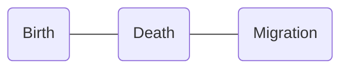

The following discussion is the complete summary of the following notes, based on the 2nd Philippine edition of *Nies* and *McEwen*'s [Community and Public Health Nursing](https://cebookshop.com/product/8043545) (*Famorca*) textbook.
1. [[08-29-2024 CHN|CHN D1]]
2. [[08-30-2024 CHN|CHN D2]] 

As discussed by **Ma'am Aida V. Garcia, RN, MAN** on 08-29-2024, 08-30-2024, and 09-22-2024. The following links are more comprehensive notes on the chapters of the book.
1. [[Expanded Program on Immunization]]
2. [[Family]] (added new Maglaya FNCP content)
3. [[Epidemiology]]
4. [[#Demography]]
5. [[IYCF|Infant and Young Child Feeding]]
6. [[MNCHN Services|Mother and Newborn Child Health Nursing]] (incomplete)
7. [[Philippine Health Care Delivery Systems]] (old)
8. [[Field Health Services Information System]]
9. [[Traditional and Complementary Medicines]]

09-22-2024 additions:
- Transcluded `Family > Family Assessment` into this note
___
# Traditional & Complementary Medicines
**Republic Act 8423**, titled the **Traditional and Alternative Medicine Act** (TAMA) authored by Senator Juan Flavier institutes the Philippine Institute of Traditional and Alternative Health Care (PITAHC) under the DOH to improve the quality and delivery of health care services to the Filipino people through **the development of traditional and alternative health care** and its integration into the national health care. Today, these methods are called **T&CM**, **Traditional and Complementary Medicine**.
## Herbal Medicines
Colloquially known as "*Botika sa Paso*" (literally "Pot Pharmacy"), it is defined as the use of plants or derivatives from plants for the treatment of specific conditions. In the Philippines, it is one of the most popular modalities of complementary medicine. Currently, the DOH recommends ten such medicines:
1. **Lagundi**:
	- Use: **Cold**, **cough**, **fever**, **asthma**, dysentery, pain, skin diseases, wounds
	- Preparation: **Decoction**, **Wash affected site with decoction**
2. **Yerba Buena**: *analgesic*
	- Use: **Headache**, **stomachache**, cough and colds, **rheumatism and arthritis**
	- Preparation: **Decoction**, **Infusion**, Massage Sap
3. **Sambong**:
	- Use: **Antiedema**, **antiurolithiasis**
	- Preparation: **Decoction**
4. **Tsaang Gubat**:
	- Use: **Diarrhea**, **Stomachache**
	- Preparation: **Decoction**
5. **Niyog-niyogan**:
	- Use: **Anthelminthic**; *not for children less than 4 years old*
	- Preparation: **Seeds are used**
6. **Bayabas**: *antiseptic, antiinflammatory*
	- Use: **Washing wounds**, **diarrhea**, gargle, **toothache**
	- Preparation: **Decoction**
7. **Akapulko**:
	- Use: **Antifungal**
	- Preparation: **Poultice**
8. **Ulasimang Bato** A.K.A. **Pansit-pansitan**:
	- Use: **Lowers blood uric acid** (**rheumatism and gout**)
	- Preparation: **Decoction**, **eaten raw**
9. **Bawang**:
	- Use: **Hypertension**, **lowers blood cholesterol**, **toothache**
	- Preparation: **Eaten raw or fried**, **applied on part** (for toothache)
10. **Ampalaya**:
	- Use: **Mild Diabetes Mellitus Type 2**, *increases insulin sensitivity*
	- Preparation: **Decoction or Steamed Baby Leaves**

| Preparation   | Procedure                                                                                                                                                 |
| ------------- | --------------------------------------------------------------------------------------------------------------------------------------------------------- |
| **Decoction** | The recommended part of the plant material is **boiled in water**. The recommended boiling time is **20 minutes** *at a maximum of 100°C, in a clay pot*. |
| **Infusion**  | The plant material is **soaked in hot water**, *much like making tea*. The recommended soaking time is **10 to 15 minutes**.                              |
| **Poultice**  | **Directly apply** (*pahid*) the recommended plant material or its essence on the part affected, usually used on bruises, wounds, or rashes.              |
| **Tincture**  | Mix the plant material in **alcohol**.                                                                                                                    |
## Other Traditional Alternative Healthcare
| Terminology                           | Definition                                                                                                                                                                                                                                                                                                          |
| ------------------------------------- | ------------------------------------------------------------------------------------------------------------------------------------------------------------------------------------------------------------------------------------------------------------------------------------------------------------------- |
| **Acupressure**                       | A method of healing and health promotion that uses the **application of pressure on acupunture points**.                                                                                                                                                                                                            |
| **Acupuncture**                       | A method of healing using **special needles to puncture and stimulate specific anatomical points on the body**.                                                                                                                                                                                                     |
| **Aromatherapy**                      | The art and science of the **sense of smell** whereby *essential aromatic oils* are combined and then applied to the body in some form of treatment.                                                                                                                                                                |
| **Chiropracty**                       | A discipline of the healing arts concerned with the pathogenesis, diagnosis, therapy, and prophylaxis of **functional disturbances, pathomechanical states, pain syndromes, and neurophysiological effects related to the static and dynamics of the locomotor system**, especially of the spine and pelvis.        |
| **Phytomedicine**/**Herbal Medicine** | Finished, labeled, medicinal products that contain as active ingredients aerial or underground parts of the plant or other materials or combination thereof, either in the crude state or as plant preparations.                                                                                                    |
| **Massage**                           | A method wherein the **superficial soft parts of the body are rubbed, stroked, kneaded, or tapped** for remedial, aesthetic, hygienic, or limited therapeutic purposes. *Massaging modalities include effleurage, petrissage, tapotement, and friction.*                                                            |
| **Nutritional Therpay**               | The use of **food as medicine** and to improve healthy by enhancing the nutritional value of food components that reduces the risk of a disease. It is synonymous with *nutritional healing*.                                                                                                                       |
| **Pranic Healing**                    | A *holistic approach* of healing that follows the **principle of balancing energy**.                                                                                                                                                                                                                                |
| **Reflexology**                       | The application of **therapeutic pressure** on the body's **reflex points** to enhance the body's natural healing mechanisms and balance body functions. It is based on the principle that internal glands and organs can be influenced by properly applying pressure to the corresponding reflex area on the body. |
___
# Expanded Program on Immunization
**Immunization** is an essential public health service and is commonly defined as the process of conferring artificial immunity to population groups. **Immunity** is described as resistance and protection from disease attributed to the presence of antibodies in the blood. The **National Immunization Program** (NIP) is committed to guaranteeing free immunization services and ensures that Filipinos, especially the poor, have access to routinely recommended vaccines. It further guarantees the immunization of **neonates**, **infants**, **children**, **adolescents**, **mothers**, and **elderly** populations as part of the comprehensive strategy for disease prevention and control following the life stage approach. Its goal is **to reduce morbidity and mortality** among infants and children caused by common childhood immunizable diseases. Specifically, the NIP has the following goals.
- To immunize **all** (*previously <100%*) infants against vaccine preventable diseases
- To sustain polio-free status of the Philippines
- To eliminate measles infections
- To eliminate maternal and neonatal tetanus
- To control Diphtheria, Pertussis, Hepatitis B infection and German Measles (Rubella)
- To prevent extrapulmonary tuberculosis among children

Related laws:
- **PD No. 996** of 1976: providing compulsory basic immunization for infants and children below 8 years old (*covers DPT, poliomyelitis, and measles*)
- **RA 7846** of 1994: inclusion of **Hepatitis B** immunization for infants and children below 8 years old
- **RA 10152** of 2011: Mandatory Infants and Children Health Immunization Act of 2011 for children up to 5 years of age and inclusion of new vaccines: **Hepatitis B**, **Mumps**, **Rubella**, and **Haemophilus Infuenza type B** (Hib). This repealed PD 996 and is considered the current legal basis of the NIP.
- **Presidential Proclamation No. 6** of 1996: Implementing a United Nations Goal on Universal Immunity by 1990; and **designating Wednesdays as Immunization day**.
## Vaccine Types
Immunization may be **active** (with the immune system) or **passive** (gained from someone else), and **natural** or **artificial**, depending on how it is obtained.

|    Type     | Natural                                    | Artificial                                                                                                       |
| :---------: | ------------------------------------------ | ---------------------------------------------------------------------------------------------------------------- |
| **Active**  | Exposure Carrier Sick of the disease | Antigens Attenuated (BCG, OPV, AMV, Rotavirus) Killed (Pertussis, HBV) Weakened Toxins (TT, Diphtheria) |
| **Passive** | Breastmilk (IgA) Placenta (IgG)         | Gamma globulin (6 months - 1 year) Antitoxin/antiserum/serum                                                  |
1. **Live Attenuated Vaccines** have weakened forms of a pathogen to stimulate the body to produce antibodies for the disease. This type of vaccine only requires one or two doses to provide life-long protection. Examples include BCG, OPV, AMV, and Rotavirus.
	- Because of its nature, **it is contraindicated in immunocompromised children**, as even a weakened pathogen may cause adverse effects.
2. **Inactivated (Killed) Vaccines** are dead pathogens that also stimulate the body to produce antibodies for the disease. A trade-off of its safety is less effectivity, typically requiring three doses for protection, and requiring booster doses over time. Examples include IPV and wP (Whole-cell Pertussis Vaccine).
3. **Toxoid Vaccines** are vaccines that contain an inactivated form of a pathogen's toxins. It is also safe, but also requires several doses with periodic boosters. Examples include TT and DT. 
4. **Conjugate/Subunit Vaccine**  include parts of the capsule of the pathogen. It operates similar to live attenuated vaccines, but are not as effective. Examples include Hib, PCV, HBV, and aP (Acellular Pertussis Vaccine).
## General Considerations for Implementation
1. Remind caregivers of children to comply with the prescribed schedule of routine immunization.
2. **Previous doses do not have to be repeated regardless of interval**.
3. The eligible age for **Pentavalent** vaccines is **up to 5 years old**.
4. Booster doses are not *really* necessary.
5. **Vaccines may be given on the same day, but in different sites**:
	- If through the same leg, space the site at least 2.5 to 5 centimeters (1 to 2 inches; at least two fingerbreadths).
	- **Start with OPV**, **then Rotavirus**, then the other vaccines.
6. Observe the "**First Expiry, First Out**" (FEFO) or "**First In, First Out**" (FIFO) principle in utilizing vaccine stocks.
7. Use **cotton** in cleaning the injection site. **If with alcohol, thoroughly dry before administrating the vaccine**.
8. **BCG, AMV, and MMR have special diluents**. After reconstitution, **these vaccines are only valid for 6 hours**. *This used to be 4 hours*
9. **Protect BCG from sunlight, and Rotavirus from light**. *This principle may be used in questions that ask which location is appropriate for vaccination*
10. Information caregivers of children for immunization about [[#Common Vaccination Side Effects and Management|common side effects]], and how to deal with it.
11. **Reusable vaccines** such as **OPV, Pentavalent, Hepatitis B, and Tetanus Toxoid** may last for a maximum of **4 weeks** as long as the vaccine has (a) not expired, (b) been maintained in appropriate cold chain conditions, (c) remained uncontaminated during aspiration, (d) a VVM that does not indicate discarding, and (e) the vaccine septum has not been submerged in water.

In cases of a **measles outbreak**, a **supplemental measles vaccine** is administered.
- For children **under 9 months old**, give **MR** (no vaccine for mumps) reconstituted with **two vials of special diluent** (6 mL total), giving 0.5 mL subcutaneously to the child.
- For children **9 months to 5 years old**, give **MMR**.

These are **NOT CONTRAINDICATIONS**:
1. **Fever up to 38.5°C** *"up to" means a fever of 38.5°C still permits vaccination.*
2. **Mild acute respiratory infection**
3. **Simple diarrhea**
4. **Malnutrition** *conversely, this is an indication; malnutrition poses greater risk for disease*
## Vaccines and Administration

| Vaccine                                  | Diseases                                                                     | Age                                      |       Dose        | Route | Site                    |
| ---------------------------------------- | ---------------------------------------------------------------------------- | ---------------------------------------- | :---------------: | :---: | ----------------------- |
| **Bacillus Calmette-Guerin** (BCG)       | Tuberculosis *Meningitis* *Leprosy*                                    | At birth                                 |      0.05 mL      |  ID   | Right upper arm/deltoid |
| **Hepatitis B Vaccine** (HBV)            | Hepatitis B *Liver Cancer*                                                | At birth                                 |      0.5 mL       |  IM   | Vastus Lateralis        |
| **Pentavalent** (DPT-HepB-Hib)           | Diphtheria Pertussis Tetanus Hepatitis B Pneumonia Meningitis | 6, 10, 14 weeks; *not given if >5 years* |      0.5 mL       |  IM   | Vastus Lateralis        |
| **Oral Polio Vaccine** (OPV)             | Poliomyelitis                                                                | 6, 10, 14 weeks                          | 0.5 mL; 2-3 drops |  PO   | Mouth                   |
| **Inactivated Polio** Vaccine (IPV)      | Poliomyelitis                                                                | 14 weeks, *9 months*                     |      0.5 mL       |  IM   | Vastus Lateralis        |
| **Pneumococcal Conjugate Vaccine** (PCV) | Pneumonia Meningitis                                                      | 6, 10, 14 weeks                          |      0.5 mL       |  IM   | Vastus Lateralis        |
| **Mumps Measles Rubella** (MMR)          | Mumps Measles Rubella                                                  | 9, 12-15 months                          |      0.5 mL       |  SC   | Outer arm               |
Appearances:
- Freeze-dried: AMV, MMR, BCG *freeze-dried vaccines have special diluents for reconstitution*
- Liquid and Clear: Pentavalent, OPV (pinkish), Rotavirus, TT (sometimes slightly turbid)
- Liquid and Cloudy: HBV
## Common Vaccination Side Effects and Management

| Vaccine      | Side Effect                                                                                                                                  | Management                                                                                                                                                                                                                                                            |
| ------------ | -------------------------------------------------------------------------------------------------------------------------------------------- | --------------------------------------------------------------------------------------------------------------------------------------------------------------------------------------------------------------------------------------------------------------------- |
| BCG          | **Wheal** for 30 minutes followed by **ulceration** for 2 weeks then **scar formation** within 12 weeks                                      | Normal Reaction                                                                                                                                                                                                                                                       |
| BCG          | **Koch's Phenomenon**: an acute inflammatory reaction within 2 to 4 days after vaccination usually due to previous exposure to tuberculosis. | No management is needed.                                                                                                                                                                                                                                              |
| BCG          | **Deep** (subcutaneous) **abscess** at vaccination site; almost invariable due to subcutaneous or deeper injection                           | Refer to the physician for **incision and drainage** (I&D).                                                                                                                                                                                                           |
| BCG          | **Indolent ulcer**: an ulcer which persists after 12 weeks from vaccination date                                                             | Treat with **Isoniazid** (INH) **powder**.                                                                                                                                                                                                                            |
| BCG          | **Glandular enlargement**: enlargement of the lymph glands draining the injection site                                                       | Treat as deep abscess (**I&D**) if suppuration occurs.                                                                                                                                                                                                                |
| HBV          | Local soreness at injection site                                                                                                             | No treatment necessary. Cold compress may be used.                                                                                                                                                                                                                    |
| DPT-HepB-Hib | Fever that usually last for only 1 day. A fever beyond 24 hours is not due to the vaccine.                                                   | Advise parents to give an **antipyretic**.                                                                                                                                                                                                                            |
| DPT-HepB-Hib | Local soreness at the injection site                                                                                                         | Reassure parents that soreness will disappear after 3 to 4 days. Paracetamol may be given for pain.                                                                                                                                                                   |
| DPT-HepB-Hib | Abscess after a week or more usually indicates that the injection was not deep enough or the needle was not sterile.                         | I&D may be necessary.                                                                                                                                                                                                                                                 |
| DPT-HepB-Hib | Convulsions, although very rare, may occur in children older than 3 months caused by the **pertussis** component.                            | Proper management of convulsion; may give DT next vaccination.                                                                                                                                                                                                        |
| OPV          | None                                                                                                                                         | - Nothing per orem for 30 minutes to prevent vomiting and to enhance absorption - If the child vomits, administer another dose. - If the child has simple diarrhea, the dose may be given, but it is not counted and another dose will be given the next visit. |
| IPV          | Local tenderness                                                                                                                             | Cold compress                                                                                                                                                                                                                                                         |
| MMR          | Local soreness, fever, irritability, and malaise in some children                                                                            | - Reassure parents and instruct parents to give an **antipyretic** to the child. - Give 200,000 IU of Vitamin A to promote epithelialization and increase immunity.                                                                                                |
## Cold Chain
The DOH provide recommendations for the cold chain principle of proper vaccine storage, handling, and transport of vaccines in the prescribed temperature. Methods for ensuring biological potency include the following:
1. **First Expiry, First Out** (FEFO) **Principle**: use the vaccines nearest to their expiration date.
2. **Vaccine Vial Monitor** (VVM): a round disc of heat-sensitive material to **register cumulative heat exposure**. The lower the temperature, the slower the color change and vice versa.
	- If the square is lighter than the circle, use the vaccine if not expired.
	- If the square matches or is darker than the circle, do not use the vaccine and inform the supervisor.
3. **Shake Test**: an approach to determine if a freeze-sensitive biological has been frozen then thawed, to determine it for use or for disposal.
	- If the vial is smooth and cloudy immediately after shaking, the biological can be used. If it appears granular and not smooth, it should be discarded.
	- If, after 30 minutes, the vial starts to clear but no sediment has formed, it is viable. Otherwise, an almost clear vial with thick sediment should be discarded.

Vaccines are often temperature sensitive, and therefore should be maintained in their respective temperatures during transport and storage. The **cold chain** is a system for ensuring vaccine potency. This system is managed by the *cold chain manager*, a role held by the **public health nurse**.
1. **Transport Boxes**: for transporting vaccines, with a viable duration of **five days**.
2. **Vaccine Carriers**: a smaller transport box used within the community, with a viable of **two days** (48 hours).
3. **Refrigerator**: a refrigerator used for vaccines is divided between the body (kept at 2°C to 8°C) and the freezer (-15°C to -25°C). The door of the refrigerator is never used due to it being subject to fluctuations in temperature. Vaccines may be stored in these for **30 days**; 1 month.
	- In a health unit, the temperature is **checked routinely at least twice a day** by the cold chain officer, usually upon opening and before closing.
	- Only OPV is kept in the freezer; freeze-dried vaccines do not require freezing. Their special diluents are kept on the refrigerator door or the lower compartment.

| Sensitivity                                    | Vaccines                    | Temperature    | Stability                      |
| ---------------------------------------------- | --------------------------- | -------------- | ------------------------------ |
| Most sensitive                                 | OPV                         | -15°C to -25°C | -                              |
| Least sensitive to heat/most sensitive to cold | Pentavalent, HBV, DT Toxoid | 2°C to 8°C     | 8 hours if in room temperature |
| Most sensitive to light                        | -                           | -              | 4 to 6 hours                   |

Recommended Duration of Storage for Biologicals (*only the 1 month limit was really mentioned during the discussion*)

| Institution                                | Duration    |
| ------------------------------------------ | ----------- |
| Regional Health Office                     | 6 months    |
| Provincial/District Health Office          | 3 month     |
| **Rural Health Unit**                      | **1 month** |
| Maximum Transport Period (with cold packs) | 5 days      |
## Documentation
1. **Fully Immunized Child** (FIC): the child has received all immunizations that should be given before reaching the first year of life (a dose of BCG, HBV, MMR, IPV; 3 doses of Pentavalent and OPV)
2. **Completely Immunized Child** (CIC): the child has received all immunizations scheduled at the age of 12 to 23 months.
3. **Child Protected At Birth** (CPAB): a child whose mother has received 2 doses of Diphtheria Tetanus (DT) toxoid during pregnancy provided that the 2nd dose was given at least a month prior to delivery or 3 doses of DT given any time prior to pregnancy with this child.
4. **Fully Immunized Mother** (FIM): a mother who has received the complete five (5) doses of diphtheria tetanus.

| Dose | Schedule                                                          | Protection | Duration |
| ---- | ----------------------------------------------------------------- | ---------- | -------- |
| 1    | ASAP during first pregnancy or nonpregnant childbearing age woman | N/A        | N/A      |
| 2    | 1 month after DT1                                                 | 80%        | 3 years  |
| 3    | 6 months after DT2                                                | 95%        | 5 years  |
| 4    | 1 year after DT3                                                  | 99%        | 10 years |
| 5    | 1 year after DT4                                                  | 99%        | Lifetime |
___
# Demography
This section is not sourced from the book, but is directly from a handout for CMPA by Ma'am Dang.  I believe this is a topic found in Maglaya's Community Nursing book, which I am not in possession of.

**Demography** is the study of the size, territorial distribution, and composition of population and the changes therein (Duncan & Hauser, 1972). Literally translated from Greek, it means "*description of the people*". A **Population** is defined as group of individuals of the same species living and interbreeding within a given area. There are several general parameters in studying the population:
1. **Population Size**: the number of people in a given place at a given time.
2. **Population Distribution**: the specific geographic location of the population.
3. **Population Composition**: the characteristics of population as to age, sex, occupation, or educational level.
4. **Population Projection**: a common demographic tool that provides a basis for other statistical projections. It helps governments with decision-making.

There are three components that affect population growth:

## Sources of Data
1. **Census**: conducted by a national government and attempts to enumerate every person in a country. It may be done in two ways:
	- **De Jure**: individuals are recorded based on legal residence
	- **De Facto**: individuals are recorded based on their location at a specific time.
2. **Sample Survey**: data gathered from a subset of the population proportionate to the general population.
3. **Registration System**: deals with recording of vital events such as birth, marriage, and death.
## Demography Statistics
1. **Natural Increase**: the difference between live births and deaths in a specified period of time.
$$\text{Natural Increase}=\text{\# of Births}-\text{\# of Deaths}$$
2. **Rate of Natural Increase**: the difference between live births and deaths in a specified period of time. Refer to [[Epidemiology#Vital Statistics|Epidemiology]] for the discussion on crude birth and death rates.
$$\text{Rate of Natural Increase}=\text{Crude Birth Rate}-\text{Crude Death Rate}$$
3. **Absolute Increase per Year**: the number of people that are added to the population per year. $Pt$ is the population size and $Po$ is the population size from $t$ years before.
$$\text{Absolute Increase per Year}=\frac{Pt-Po}{t}$$
4. **Relative Increase** (Population Growth Rate): the actual differences between the two census counts expressed in **percent** relative to the population size made during an earlier census. This percent is the average yearly percentage change over the same time frame.
$$\text{Relative Increase}=\frac{Pt-Po}{Po}$$
## Population Composition
1. **Sex Composition** (Sex Ratio): the ratio of males to females in a population, expressed as "number of males for every 100 females".
$$\text{Sex Ratio}=\frac{\text{\# of Males}}{\text{\# of Females}}\times100$$
2. **Age Composition** (or distribution): the proportionate number of persons in successive age categories in a given population. As an example, a population with persistently high fertility would exhibit a large proportion of children, and a small proportion of aged persons.
3. **Median Age**: the age that divides a population into two numerically equally sized groups, i.e., exactly half the population would be younger or older than the median age. It is a single age that summarizes the age distribution of a population.
4. **Dependency Ratio**: the age-population ratio of those typically not in the labor force and those typically in the labor force. This age group is between 15 years old and 64 years old. It is used to measure the pressure on the productive population to support the dependent population. It is expressed as a percent, e.g., "60% of the population is dependent on the remaining 40%"
$$\text{Dependency Ratio}=\frac{\text{People aged <14, and >65 years old}}{\text{People aged 15 to 65 years old}}\times 100$$
5. **Age and Sex Composition**: a population pyramid that depicts both age (vertical axis) and sex (horizontal axis). The shape of this pyramid can determine the pattern of population change. A normal pyramid (as illustrated below) shows rapid growth, a thin, almost columnar pyramid shows slow growth, and a top-heavy pyramid shows negative growth.
![[population_pyramid.png|500]]
## Population Distribution
The pattern of where people live. It denotes the spatial pattern: due to dispersal of population, formation of agglomeration (groups), and linear spread.
1. **Urban-Rural Distribution**: illustrates the proportion of the people living in urban areas compared to rural areas.
2. **Crowding Index**: an alternative measure of **household crowding**. It is defined as the number of usual residents in a dwelling divided by the number of rooms in the dwelling.
$$\text{Crowding Index}=\frac{\text{\# of Persons in a Household}}{\text{\# of Rooms used for Sleeping}}$$
3. **Population Density**: is calculated as population divided by total land area, expressed as number of people per square kilometer of land area.
$$\text{Population Density}=\frac{\text{\# of people}}{\text{Land area in km}^2}$$
___
# Field Health Services and Information System (FHSIS)
A **Health Information System** (HIS) has four primary functions: data generation, compilation, analysis & synthesis, and communication & use. This system collects data from the healthcare and other pertinent sectors; analyzes gathered data; ensures overall data quality, relevance, and timeliness; and, converts the data into information imperative for health-related decision-making (WHO, 2008b).

The **Field Health Services Information System** (FHSIS) is the HIS utilized in the Philippine context, serving as the official reporting and recording system of the Philippine Department of Health (DOH). It is a facility-based and data-generated system from the Barangay Health Stations (BHS) and Rural Health Units (RHU) to the national level. The current FHSIS (version 2012) primarily aims to:
1. Provide raw and summary data on **health service delivery and selected health program accomplishment indicators**;
2. Provide a standardized, facility-level data base for **program monitoring and evaluation purposes**.
3. Provide more evidence-based data for **research purposes, policy formation and basis for health system interventions**; and
4. **Minimize documentation burden** at the service delivery level in order to allow more time for patient care and health promotion activities.
## Components of the FHSIS
There are two primary types of tools utilized by the FHSIS:
1. **Recording Tools**: detailed, **day-to-day**, facility-based **documents on the health services rendered to patients/clients** in the rural health facilities.
2. **Reporting Tools/Forms**: summary data transmitted or submitted on a **monthly**, **quarterly**, and **annual basis** to higher organizational levels of the healthcare delivery system. These are based on the Summary Table (ST) and Monthly Consolidation Table (MCT) recording tools.
## Recording Tools
1. **Individual Treatment Record** (ITR): the **primary building block** of the FHSIS. This is a basic patient consultation record containing a date, name, address of the patient, height, weight, chief complaint, presenting signs and symptoms, diagnosis (if available), and treatment. Examples of ITRs include *immunization records* or *national tuberculosis program treatment record*.
2. **Target Client List** (TCL): the **secondary building block** of the FHSIS. This is a list of eligible clients for a particular **health program**. It facilitates the **monitoring and supervision of service delivery activities** and **determines the client's compliance to a particular program**. Health programs to  be maintained under FHSIS version 2012 are: **Prenatal Care**, **Post-Partum Care**, **Nutrition and Expanded Program for Immunization**, **Family Planning**, and **Sick Children**. This tool provides a clinic-level data for population-based research.
3. **Summary Table** (ST): a form with 12 columns for a monthly tally of the number of clients in the barangay health facility in terms of **health program accomplishments** (all TCL data) and **morbidity diseases**.
4. **Monthly Consolidation Table** (MCT): a form filled up by the Public Health Nurse (PHN) to collate data report by all midwives of the city or municipality. It is essentially the **output table of the RHU**, consisting of the **reported data per indicator** by each Barangay Health Station or public health midwife. This record will serve as *the source document for the public health nurse for the Quarterly Forms*.
## Reporting Forms
*It will be important to memorize each report's alias!*
1. **Monthly Forms**:
	- **Program Report** (M1) contains selected indicators categorized as maternal care, childcare, family planning, and disease control; the same indicators found in the TCL and ST. This is report is submitted by the **midwife**.
	- **Morbidity Report** (M2) contains a list of all diseases by age and sex. This report is submitted by the **midwife**.
2. **Quarterly Forms**:
	- **Program Report** (Q1)
	- **Morbidity Report** (Q2)
3. **Annual Forms**:
	- Report on demographic, environmental, natality, and mortality. (A1)
	- Report on all diseases according to age and sex. (A2)
	- Report on all mortality cases or deaths according to age and sex. (A3)

*Summary of Responsible Persons and Schedules for FHSIS Tools*

| Office    | Person                          | Recording Tools | Reporting Tools | Schedule                                                |
| --------- | ------------------------------- | --------------- | --------------- | ------------------------------------------------------- |
| BHS       | **Midwife**                     | ITR, TCL, ST    | M1, M2       | Every second week of the succeeding month            |
|           |                                 | -               | A-BRGY Form     | Every second week of January                            |
| RHLI      | **PHN**                         | ST, MCT         | Q1, Q2          | Every third week of first month of succeeding quarter   |
|           |                                 |                 | A1, A2, A3      | Every third week of January                             |
| *PHOi*CHO | **Prov/City FHSIS Coordinator** | -               | Q1, Q2          | Every fourth week of first month of succeeding quarter  |
|           |                                 |                 | A1, A2, A3      | Every fourth week of January                            |
| CHD       | **Regional FHSIS Coordinator**  | -               | Q1, Q2          | Every second week of second month of succeeding quarter |
|           |                                 |                 | A1, A2, A3      | Every second week of March                              |
|           |                                 |                 |                 |                                                         |
___
# Family
>[!CITE] Reference
>Nies, M., McEwen, M. (2020). The individual and the family as clients in community and public health nursing. In *Community and Public Health Nursing* (2nd Philippine ed., pp. 81-106). C&E Publishing, Inc.

Additionally, the [[#Family Nursing and the Nursing Process (Maglaya)]] covering FNCPs has also been included.
___
There are four levels of clientele in community health nursing:
1. The **individual**, a biopsychosocial and spiritual being. The person is **the unit of care**, the focus of care is usually on the person's health or medical problem. The family may or may not be involved. They may also be an "entry point" in working with the individual.
2. A **family**, from a systems perspective, is defined as **a collection of people who are integrated, interactive, and interdependent**. Each member affects the other. The family as a whole is responsible for the health of all members. In the family level, the nurse provides care to two or more individuals in a single household. Because most people belong to a family and their health is strongly influenced by the home situation, **the family is considered the basic unit of care in community health nursing**.
3. **Population groups** refer to people who share common **characteristics**, **developmental stage**, and **common exposure to common health problems**. Some of these groups are children, women, farmers, factory workers, and elderly. The nurse responds to **the needs of a group or aggregate**, while maintaining recognition of each individual's situation and circumstance.
4. A **community** is defined as a collection of families having **common values**, **beliefs**, **common interests**, **goals** and **objectives within a specific social system**. This social system includes health system, family system, economic system, educational system, religious system, welfare system, political system, recreational system, legal system and communication system. Each community is unique to its own specific sociocultural, political, economic, and environmental context and vary in terms of community dynamics.
## The Family as a Unit of Service
There are many definitions of the family:
1. The family is a group of persons usually living together and composed of the head and other persons related to the head by blood, marriage or adoption. It includes both the nuclear and extended family. (National Statistical Coordination Board)
2. A social unit interacting with the large society. (Johnson, sociologist)
3. A family is characterized by people together because of birth, marriage, adoption, or choice (Allen et al.).
4. The family is composed of two or more persons who are joined together by bonds of sharing and emotional closeness and who identify themselves as being part of the family. (Friedman et al.).

The family is considered as a "*unit of service*" for the following reasons:
1. The family is considered as the "*natural*" and fundamental **unit of society**.
2. The family as a group **generates**, **prevents**, **tolerates**, and **corrects health problems** within its membership; the family acts as the basic care provider.
3. The health problems of the family are interlocking. **Illness in one member affects the entire family and its functioning**.
4. The family is **the most frequent focus of health decisions and actions in personal care**.
5. The family is an **effective and available channel for nursing efforts**. Improved community health is realized only through improved family health.
### Family Structure
| Family Form   | Description                                                                                                                                                                                                                                                                              |
| ------------- | ---------------------------------------------------------------------------------------------------------------------------------------------------------------------------------------------------------------------------------------------------------------------------------------- |
| Nuclear       | "*Traditional*; *Family of marriage, parenthood, or procreation*". A husband, wife, and their children— natural, adopted, or both (Friedman et al.).                                                                                                                                     |
| Dyad          | "*Empty nesters*". A husband and wife with no children.                                                                                                                                                                                                                                  |
| Extended      | "*Multigenerational*". Three or more generations, which may include in-laws and grandparents.                                                                                                                                                                                            |
| Blended       | The union of two spouses who have had children from a previous marriage.                                                                                                                                                                                                                 |
| Compound      | A husband with multiple wives, primarily only permitted in Muslim culture (in the Philippines) by virtue of P.D. No. 1083 (Code of Muslim Personal Laws of the Philippines).                                                                                                             |
| Cohabiting    | "*Live-in*". An unmarried couple and their child or children, recognized through common-law marriage.                                                                                                                                                                                    |
| Single Parent | Resulting from death of a spouse, separation, or pregnancy outside of wedlock. These families are faced with greater risk associated with lesser social, emotional, and financial resources. Families who have one of the spouses working overseas effectively fall under this category. |
| Homosexual    | A cohabiting couple of the same sex in a sexual relationship. They may or may not have children. E.O. 209 (Family Code of the Philippines) expressly states that marriage is between a man and a woman, therefore disallowing same-sex marriage.                                         |

*The following are additional forms and classifications discussed but not included within the book.*

Based on **Authority**, where decision-making is delegated to either the father (**Patriarchal**) or mother (**Matriarchal**). A participative form of authority is termed **Patricentric**, **Matricentric** or **Egalitarian** (equal), eliminating the hierarchal nuance of previous terminology.

Based on **Marital Residence Pattern**, where the family moves closer to or at the father's residence (**Patrilocal**), moves closer to or at the mother's residence (**Matrilocal**), or independent of either spouse's location (**Neo-Local**)

Based on **Lineage**; the system of descent and inheritance where lineage, family name, and property are passed down the male line (**Patrilineal**) or the female line (**Matrilineal**)

Based on **Amount of Partners**, a family may be **Monogamous**, where one husband is bound to one wife; **Polygamous**, where a husband is with multiple wives (commonly found among Muslims in Saudi Arabia); or **Polyandrous**, where a wife is with multiple husbands (commonly found in the Todas of Southern India).
### Functions of the Family
1. **Procreation**: the universally accepted institution for reproductive function and child rearing.
2. **Socialization of Family Members**: the family creates the foundation for how its children becomes productive members of society. It involves the transmission of culture from the parents to their children.
3. **Physical Maintenance**: the provision of basic needs for its dependent members.
4. **Economic Function**: the family serves as a basic unit of economic production (rural families producing goods) or economic consumption (urban families earning salaries or wages)
5. **Welfare and Protection**: the family provides companionship and meets affective, sexual, socioeconomic needs, and emotional gratification. The family is a source of motivation and morale for its members.
6. **Status Placement**: the family confers its societal rank on the children. With social mobility, the family may shift between social classes.
### Family as a Client
The family unit is important to society. It meets individual needs, and supports spouses or partners by meeting affective, sexual, and socioeconomic needs. The family is also viewed as an important unit of health care with awareness that **the individual can be best understood within the social context of the family**. Observing and inquiring about family interaction enables the nurse in the community to assess the influence of family members on each other. Specifically, reasons to work with families are enumerated by Friedman et al.:
- "**The family is a critical resource**"; the family can improve individual members' health through health promotion and wellness activities.
- "**In a family unit, any dysfunction that affects one or more family members will affect the members and unit as a whole**"; this is also referred to as a "*ripple effect*".
- "**Case finding**"; while assessing an individual, the nurse may identify a health problem that necessitates identifying risks for the entire family.
- "**Improving nursing care**"; the nurse provides better and more holistic care by understanding the family and its members.
%% skipped the subchapter for "The family as a system"%%
>[!INFO] The family as a system
>The *General Systems Theory* explains how the family as a unit interacts with larger units outside the family. There are three subsystems of the family that are most important (Parke, 2002): **parent-child subsystem**, **marital subsystem**, and **sibling-sibling subsystem**. Each subsystem can reestablish balance if any disrupting force or imbalance occurs.
### Developmental Stages of the Family
Like with the growth and development of pediatrics for individuals, families also experience stages of development traversing from marriage to death. The nurse must comprehend these phases and the struggles that families experience while going through them. Developmental tasks exist for these stages, and are the resolution to each stage:
1. **Marriage** (joining of families): the formation of an identity as a couple, and inclusion of the spouse in realignment of relationships with extended families.
2. **Families with young children** (to age 12): problems arise with who is to take care of the children; the integration of children into the family unit, adjustment of tasks for child-reading, financial, and household; accommodation of new parenting and grandparenting roles.
3. **Families with adolescents**: development of increasing autonomy for adolescents; midlife reexamination of marital and career issues. This is the initial shift towards concern for the older generation.
4. **Families as launching centers**: establishment of independent identities for parents and grown children; renegotiation of marital relationship, readjustment of  relationships to include in-laws of older generations.
5. **Aging families**: maintaining couple and individual functioning while adapting to the aging process, supporting role of the middle generation, supporting and autonomy of the older generation, and the preparation for their own death and dealing with the loss of spouse and/or siblings and other peers.
### Health Tasks and Characteristics of a Health Family
The family serves as an essential resource for its members by carrying out health tasks. An important responsibility of the community health nurse is to develop the family's capability in performing its health tasks (Freeman, Heinrich):
1. **Recognizing interruptions of health or development**: a requisite step to dealing with an unacceptable health condition.
2. **Seeking health care**: consultation with health workers if the health needs are beyond its capability.
3. **Managing health and non-health crises**: maturational (foreseeable) and incidental (unexpected) crises that require coping and adaptation.
4. **Providing nursing care to sick, disabled, or dependent members of the family**: many minor illnesses, chronic conditions, disabilities, and some age groups require home management by responsible family members.
5. **Maintaining a home environment conducive to good health and personal development**: a safe and healthful physical environment, and an atmosphere of security and comfort for psychosocial development.
6. **Maintaining a reciprocal relationship with the community and its health institutions**: just as the family utilizes community resources, the family also gets involved in community events.

Otto (1973) and Pratt (1976) characterized health families as "energized families" and provided descriptions of healthy families to guide in assessing strengths and coping. DeFrain (1999) and Montalvo (2004) helped to identify health families. They suggest the following traits of a healthy family:
1. Able to **communicate and listen repeatedly in many contexts**
2. Able to **establish priorities and family needs**
3. **Affirms, supports, and respects each other**
4. Members engage in **flexible role relationships**, share power, respond to change, support growth and autonomy, and decision-making
5. Teaches **family and societal values and beliefs**, sharing a spiritual core
6. Fostering **responsibility** and values **service to others**
7. Has **a sense of play and humor** and shares leisure time
8. Able to ability to **cope with stress and crisis and grow from problems**

#### Family Health Tasks by Maglaya
1. **Recognize the presence of wellness state or health condition or problem**
2. **Make decisions about taking an appropriate health action** to maintain wellness or manage the health problem.
3. **Provide nursing care** to the sick, disabled, dependent or high-risk members of the family.
4. **Maintain a home environment** to be conducive to health maintenance, or avoid disease.
5. **Utilize community resources**
## Family-Nurse Contact
The family-nurse relationship is developed through family-nurse contacts, which may take the form of a clinic visit, group conference, telephone contact, written communication, or home visit. The nurse uses the type of family-nurse contact that is most suitable to the purpose or situation at hand.
1. **Clinic Visit**: the family member takes initiative of visiting the professional health worker, usually indicating the family's readiness to participate in the health care process. The nurse can maintain control of the situation, but this may also result in less confidence of the family to discuss family health concerns.
2. **Group Conference**: e.g. a conference of mothers, provides an opportunity for initial contact between the nurse and target families of the community. This is appropriate for developing cooperating, leadership, self-reliance, and/or community awareness among group members. The group is able to share experiences and practical solutions to common health concerns. Difficulty may be found in the motivation and availability of attendees.
3. **Telephone Contact**: if available, this provides easy and wide access. This also includes mobile/cell phone communication services. Contact may be through messaging or calls. Encouraging contact improves trust in the health agency. Information transmitted through this form of contact is limited, and proper assessment still takes place face-to-face.
4. **Written communication**: used to give specific information to families. This is able to reach many families, but literacy and interest become problems when attempting to guarantee that the intended recipient is reached.
5. **Home Visit**: a professional, purposeful interaction that takes place in the family's residence aimed at promoting, maintaining, or restoring the health of the family or its members. This occurs upon the family's request, as a result of case finding, in response to a referral, or to follow-up clients who have utilized services of a health facility such as a health center, lying-in clinic, or hospital.
### Home Visit
- A home visit allows firsthand assessment of the home situation: family dynamics, environmental factors affecting health, and resources within the home.
- The nurse is able to seek out previously unidentified needs.
- It gives the nurse an opportunity to adapt interventions according to family resources.
- It promotes family participation and focuses on the family as a unit.
- Teaching family members in the home is made easier by the familiar environment and the recognition of the need to learn as they are faced by the actual home situation.
- The personalized nature of a home visit gives the family a sense of confidence in themselves and in the agency.
- Difficulty may be met in cases of safety of the nurse, efficiency, and inability to control the environment/distractions.

Because of the nature of this visit, multiple ethical issues may arise:
1. **Maintaining a client focus**: goals must be clear and distractions must be avoided.
2. **Client independence**: the nurse may be able to gain and provide confidence for the family if goals are being met.
3. **Honesty**: telling the truth about how the family performs its responsibility is important. Suggestions are more important than advice. The nurse must be able to identify what the family knows about themselves.
4. **Privacy and confidentiality**: both the family and the nurse share their own experiences during care. Anything that transpires during this period should not be shared to anyone. The nurse limits care to common areas of the household so as not to compromise privacy of the family.
5. **Limits of intervention**: the nurse has to recognize the knowledge and skills of the family to care for themselves. The nurse needs to assess what the family knows about a certain problem. For example, the nurse may have a mother explain and demonstrate how they care for their child. If lacking or inappropriate, the nurse steps in to teach the client.
6. **Termination**: ideally, termination is included in the objectives of care, where continuation of care is moved to the health center. The nurse has to be grateful to the family for allowing for their care.
#### Phases of a Home Visit
1. **Pre-visit Phase**: the nurse contacts the family, determines their willingness for a home visit, and sets an appointment with them. A plan for the home visit is formulated during this phase. Planning occurs similarly to the nursing process, and follow specific principles:
	- The home visit should have a purpose. Some purposes include assessment; education; infection control; supplemental intervention; or the provision of greater access to community health resources through rapport, information, and referrals.
	- Use information about the family collected from all possible sources. All available information is used to determine and analyze the family situation.
	- Focus on identified family needs, particularly those recognized by the family as requiring urgent attention (salient).
	- The client and family should actively participate in planning for continuing care.
	- The plan should be practical and adaptable. Flexibility is important in working with families because the nurse will not know the family's priority needs until the home visit.
2. **In-home Phase**: this begins as the nurse seeks permission to enter and lasts until departure. This phase consists of initiation, implementation, and termination.
	- Initiation: knock or ring the doorbell and declare yourself. Upon entering, introduction is done for the nurse and the agency they represent. Observation of the environment and general safety is appraised. To establish rapport, the nurse initiates a short social conversation, then states the purpose of the visit and sources of information is present.
	- Implementation: the application of the nursing process; assessment (interview, physical examination, observation), intervention (care, teaching, counseling, referral), and evaluation.
	- Termination: summarizing with the family the events during the home visit and setting a subsequent home visit or another form of family-nurse contact such as a clinic visit. Recording of findings may also be done at this time if necessary.
3. **Post-visit Phase**: after returning to the health facility, documentation occurs, recording events that transpired during the visit, personal observations, and feelings of the nurse about the visit. A referral may be made. Planning may be done at this time if a subsequent visit has been set.
#### Bag Technique
The nursing bag, also called the Public Health Nurse bag, is a traditional tool used during home and community visits to be able to provide care safely and efficiently. Content depends on the agency and type of expected service. It often contains the following:
1. Articles for **infection control**: soap, disposable paper towels/linen, apron, antiseptic bottles, hand sanitizer
2. Articles for **assessment of family members**: body thermometer(s), measuring tape, aids such as glucometer, or items for Benedict's test (Benedict's solution, dropper, test tube and holder, alcohol lamp). Note that the stethoscope and sphygmomanometer are carried separately.
3. Articles for **nursing care**
4. **Sterile items**: dressings, cotton balls, cotton tip applicators, syringes (2 and 5 mL) with needles, surgical gloves, cord clamp, one pair of surgical scissors, sterile pack with kidney basin, two pairs of forceps (straight, curved).
5. **Clean articles**: adhesive tape, bandage scissors
6. **Pieces of paper**: for lining the soap dish and bag (alternatively, a washable rubber protector) and folded paper as a waste receptacle if needed.

General principles for bag technique includes:
1. **Bag technique helps the nurse in infection control**. Proper use allows medical asepsis during the home visit as the home and family is considered a potential source of infection. This act can serve as a demonstration to the family practical methods of infection control such as handwashing.
	- Proceed from clean to contaminated. This applies to care of family members, or even between families e.g., the family with a newborn is cared for before a family with communicable disease.
	- The bag and its contents should be well protected from contact with any article in the patient's home. Line the table/flat surface with paper/washable protector on which the bag and all of the articles to be used are placed. Only articles that are necessary should be brought out. If possible, these are cleaned (or wrapped) before being returned to the bag.
	- Wash your hands before and after physical assessment and physical care of each family member.
	- Items such as the washable protector or apron are folded inwards to separate the contaminated surface from the outside.
	- Wash the inner lining of the bag as necessary.
2. **Bag technique allows the nurse to give care efficiently**, saving time and effort by ensuring articles are available, assorted, and stored in an efficient manner.
3. **Bag technique should not take away the nurse's focus on the patient and the family**. It is simply a tool in providing care.
4. **Bag technique may be performed in different ways**. Variation in use is expected, but principles of asepsis are of the essence and should be practiced at all times.
## Family Nursing and the Nursing Process
Family nursing is an established concept since Nightingale's period. The International Family Nursing Association provides characteristics that justify family nursing:
1. **Families have inherent competencies, strengths, and unique interactional processes that influence family health beliefs, goals, and actions**.
2. **Family nursing is the practice of nursing directed towards maximizing the health and well-being of all individuals within a family system**. The nurse may focus on the individual within the context of the family, or the family unit. Regardless of the identified client, the nurse establishes a relationship with each member and understands the influence of the unit on the individual and society.
3. **Competency in family nursing translates to community and public health nurses across all health care settings**, e.g., understanding children within the family system can aid in understanding children within the educational system, and the use of a family approach to improve the health of the worker and contribute to overall productivity in an occupational health setting.
4. The nurse **always considers the family's willingness to utilize nursing services**. Expression of the family's desire not to utilize the services offered or their preference for another health worker or agency should be respected.
### Family Assessment
Assessments helps identify the health status of the individual members of the family and aspects of family composition, function, and process. This process is unceasing and requires objectivity and professional judgment to attach practical meaning to the information being acquired. The nurse can obtain information through **interviews** with family members individually or by group, or of subsystems within the family. **Observation** is another method by which the nurse observes individuals, dyads, or the entire family and environment (housing, neighborhood, larger  community). **Physical examination** and other health assessment techniques, such as anthropometry, may be used. All of these are sources of *primary data*. A review of records for the family is the source of *secondary data*. Many tools have been developed to allow for a more systematic and organized classification and analysis of data:
1. **Genogram**: a tool that helps the nurse outline the family's structure. It is a diagrammatic way to represent the family. Generally, three generations are included in the family tree with symbols denoting genealogy. This may be used during an early family interview to gain a general picture of the family. Some sensitive topics may arise, such as a history of separation, divorce, alcoholism, substance abuse, or depression. Creating the genogram with the family may be an excellent opening to the discussion of family history or hereditary health problems, and potentially highlight the need for health education and promotion.%%
	- Children are pictures from left to right, from oldest to youngest.
	- If a spouse has had a previous marriage, their distance to the first spouse is closer than the second spouse, and so on.
	- A family with multiple households may be segregated with circles.
	- A more comprehensive guide in creating a genogram may be found [here](www.genopro.com)%%
2. **Family Health Tree**: based on the genogram, it provides a mechanism for recording the family's medical and health histories. This may be used to plan positive familial influences on risk factors such as diet, exercise, coping with stress, or pressure to have a physical examination.
	- **Causes of death**
	- **Genetically linked diseases** e.g. heart disease, cancer, diabetes, hypertension, allergies, asthma, and mental retardation.
	- **Environmental and occupational diseases**
	- **Psychosocial problems**
	- **Infectious diseases**
	- **Familial risk factors** from health problems
	- **Risk factors** related to the family's **methods of illness prevention**, such as having periodic physical examinations, Pap smears, and immunizations
	- **Lifestyle-related risk factors**, i.e., by asking what family members do the "*handle stress*" or "*keep in shape*".
4. **Ecomap**: another classic tool used to depict a family's linkages to its suprasystems. The eco-map portrays an overview of the family in their situation; it depicts the important nurturant or conflict-laden connections between the family and the world. It demonstrates the flow of resources, or the lacks and deprivations (Hartman). This may also be filled out during an early family interview, noting people, institutions, and agencies significant to the family.
	- The nurse may be able to use the ecomap to discuss with the family the types of resources in the community and the types of relationships they want to establish with them.
5. **Cultugram**: a graphic representation for the understanding of sociocultural context of the family to identify the appropriateness of interventions. Examples include *seista*, times of prayer, legal status, languages spoken, health beliefs, etc. It is presented as a mindmap.
6. **Family Interviewing**: the use of a standardized tool (family service and progress report; the **initial data base**; **family service and progress record**) to conceptualize the health needs of the families and to assess families' responses to events such as birth, retirement, or chronic illness. It may also be a method of intervention. The following are *critical components of the family interview*, as devised by Wright and Leahey:
	- **Manners**: greetings, privacy, confidentiality; this sets the tone for the interview and begins the development of a therapeutic relationship.
	- **Therapeutic Questions**: focus on problems and sharing information. The questions should be specific for the context or family situation but have the basic themes of family expectations of the home visit; challenges, concerns, and problems encountered at the time of the interview; and sharing information.
	- **Therapeutic Conversations**: conversation should be focused, planned, and engages the family. The nurse must actively listen, knowing that even a single sentence has the potential to heal or help a family member. The nurse encourages questions, engages the family in the interview and assessment process, and commends the family when strengths are identified.
	- Family Genogram (and Ecomap when indicated) may provide essential information on family structure, composition, background, and basic health status. It also allows for the family to be engaged with the interview process.
	- **Commending family or individual strengths** on at least two strength areas to develop rapport. Sharing strengths reinforces immediate and long-term positive relationships. Building upon strengths leads to more open and trusting relationships and often allow the family to reframe problems, thereby increasing problem solving and healing.
### Family Data Analysis
A thorough family assessment yields a large volume of data. These are organized into clusters (data synthesis) and filtered based on pertinence. **Data analysis** is done by comparing findings with accepted standards for individual family members and for the family unit. The following system organizes family data:
1. **Family Structure and Characteristics**: household membership, demographic characteristics, family members living outside the household, family mobility, and family dynamics. This may be visualized with genogram, ecomap, and/or family health tree.
2. **Socioeconomic Characteristics**: data on social integration (ethnic origin, languages and/or dialects spoken, and social networks), educational experience and literacy, work history, financial resources, leisure time interests, and cultural influences, including spirituality or religious affiliation.
3. **Family/Home Environment**: physical environment inside the family's home/resident and its neighborhood.
4. **Family Health and Health Behavior** (Health Condition/Health Status): activities of daily living, self-care, risk behaviors, health history, current health status, and health care resources (home remedies and health services).
5. **Health Promotion**: values and practices; maintenance and disease prevention.
### Family Nursing Diagnosis
A family nursing diagnosis may be formulated at several levels: the individual, the family, and the family as it relates to its environment/community. Specific diagnoses by NANDA serve as a common framework of expressing human responses to actual and potential health problems. An alternative tool for nursing diagnosis is the **Family Coping Index**. It works on the principle that family problems may be resolved if the nurse improves the family's coping capacity rather than focusing on the problem itself. There are nine areas of assessment:
1. Physical independence: ability to perform ADLs
2. Therapeutic competence: ability to comply with recommended procedures or treatments e.g. medications, dietary recommendations, exercise, etc.
3. Knowledge of health condition: understanding of health conditions or essentials of care
4. Application of principles of personal and general hygiene
5. Health care attitudes: perception of health care in general and in responsiveness to promotive, preventive, and curative efforts of health workers.
6. Emotional competence: degree of emotional maturity
7. Family living patterns: interpersonal relationships among family members
8. Physical environment: home, school, work, community environment
9. Use of community facilities: ability to seek and utilize, as needed, both government-run and private health, education, and other community services
### Formulating the Plan of Care
1. **Priority Setting**: determine the sequence in dealing with identified family needs and problems. The following need to be considered:
	- **Family safety**: a life-threatening situation is given **top priority**. Likewise, communicable disease requires immediate attention.
	- **Family perception**: whichever problem the family recognizes as most urgent should be prioritized more. If urgent problems exist but are not recognized as urgent, the nurse may strive towards client education. (Same as salience)
	- **Practicality**: consider existing resources, limitations, and feasibility. (Same as modifiability)
	- **Projected effects**: think of the prospect of preventing serious problems in the future by resolving an existing family concern. (Same as preventive potential)
2. **Establishing Goals and Objectives**: a goal is a desired observable family response to planned interventions in response to a mutually identified family need; the end that the nurse and the family aim to achieve. This also keeps in consideration practicality and family perception. On the other hand, an objective is the desired step-by-step family response as they work towards a goal. These should be **SMART**:
	- *Specific*: clear articulation of who is to do what, e.g., the family or a target family member will manifest a particular behavior.
	- *Measurable*: observable, measurable, and whenever possible, quantifiable indications of the family's achievement as a result of their efforts. This is used for monitoring and evaluation.
	- *Attainable*: realistic and in conformity with available resources, constraints, and family traits.
	- *Relevant*: appropriate in relation to family problem.
	- *Time-bound*: specific in target times or dates helps the family and nurse in focusing their attention and efforts.
3. **Determining Appropriate Interventions**: interventions can range from simple or immediate (such as in client education) to complicated or prolonged interventions (such as in pulmonary tuberculosis). Interventions should follow the principle of mutuality (both the nurse and family agree to it) and the principle of personalization (the intervention is suited to the family's unique situation) There are three types of interventions as proposed by Freeman and Heinrich:
	- Supplemental interventions: actions the nurse performs on behalf of the family, if unable. Excessive reliance to these interventions can hold back development of self-reliance.
	- Facilitative interventions: actions that remove barriers to appropriate health action.
	- Developmental interventions: actions that improve the capacity of the family to provide for its own health needs.
### Implementing the Plan of Care
Implementation is the execution of the plan of action. This is determined by the mutually agreed upon goals and objectives and the selected courses of action. The nurse should be aware of potential barriers to implementation, categorized as *family-related barriers* including apathy and indecision, or *nurse-related barriers* including being imposing, negative labeling, overlooking family strengths, and neglecting cultural and gender implications of family interventions.
- Being imposing diminishes the family's responsibility and decision-making.
- Negative labeling, such as labeling the family as stubborn or the nurse's self as ineffective, hinders relationship building, expectations, and compliance.
- Overlooking family strengths results from a tendency of focusing on the problems and weaknesses of a family.
- The nurse who fails to consider cultural and gender differences/issues risks making plans that are unacceptable to the family.

To this end, the nurse should be able to **determine the self**, or be self-aware. This is the nurse's awareness of their own behaviors; recognition of having an idea or behavior that may affect effectiveness, allows the nurse to address the issue appropriately.
### Evaluation
Evaluation is determining the value of nursing care that has been given to a family. The product of this step is used for further decision-making: to terminate, continue, or modify the intervention(s) being used. Evaluation may be done in two ways:
1. **Formative Evaluation**: a judgment made about the effectiveness of nursing interventions as they are implemented. This is on-going and continuing while family nursing care is being implemented and family-nurse interactions are taking place. These guide the nurse and family in updating plans as necessary.
2. **Summative Evaluation**: the end results of family nursing care and usually involves measuring outcomes or the degree to which goals have been achieved.

Evaluation includes various aspects:
1. **Effectiveness**: the determination of whether goals and objectives were attained; "*Did we produce the expected results?*"
2. **Appropriateness**: the suitability of the goals/objectives to the identified family health needs; "*Are our goals/objectives and interventions correct in relation to the family health needs we intend to address?*"
3. **Adequacy**: the degree of sufficiency of goals/objectives and interventions in attaining the desired change in the family; "*Were our interventions enough to bring about the desired change?*"
4. **Efficiency**: the relationship of resources used to attain the desired outcomes; "*Was the effort and resources used appropriate for the result?*"
## Family Nursing and the Nursing Process (Maglaya)
>[!WARNING] Reference
>This discussion, while on the same topic as the last, is different and purely based on Ma'am Dang's presentation and discussion. I believe it references other books (Maglaya) I don't have, so I do not have complete information regarding the discussion.

The **Family Nursing Process** is the blueprint of care that the nurse designs to systematically minimize or eliminate the identified health and family nursing problems through explicitly formulated outcomes of care and a delivery chosen set of interventions. It is an organized problem-solving approach that enables the nurse to provide care in a scientific manner. It is applicable to individuals, families, and community groups at any level of health, and adaptable to various settings.
- **ADPIE** may be used, or "*Relating*" may be placed first, for **RADPIE**.
### Nursing Assessment Phase
The phase that includes **Data Collection** and **Data Analysis**. Data may be sourced from:
1. **First Source**: health status of the family
2. **Second Source**: family's status as a functioning unit
3. **Third Source**: family's environment

Collection can be done through various methods:
1. **Direct Observation**: the use of all sensory capacities by the nurse to gather information about the family's state of being and behavioral responses. The nurse may observe, for example, the physical make-up of each member, communication or language patterns expected and tolerated, role perception/task assumption by each member (including decision-making patterns) and the conditions in the home and their immediate environment.
2. **Interviewing**: the use of effective communication techniques to elicit needed responses. The nurse encourages verbalization of thought and feelings and offer needed support or reassurance.
3. **Physical Examination**: inspection, palpation, percussion, auscultation (IPPA) as measurement of specific body parts and reviewing the body systems.
4. **Review of Records**: reviewing existing records and reports pertinent to the client, e.g., a family envelope/**individual treatment record**.
5. **Laboratory/Diagnostic Tests**: performing laboratory tests, diagnostic procedures, or other tests of integrity and function carried out by the nurse. Examples of this, particularly during a [[#Home Visit]], is Benedict's test, acetic acid test, and tests for the most common morbidities or causes of mortality in the locality or country.

Refer to [[#Family Data Analysis]] for the components of data collected during this phase. Once this data is collected, they are compared to the standards or norms set for the community the family resides in. The measures used to compare to standards include:
1. **Normal Health** of individual members
2. **Home and Environment**; conditions conducive to family development
3. **Family Characteristics**, dynamics, and level of functioning conducive to family development.

The **end goal** of nursing assessment is a **health problem**. It is defined as a situation or condition which interferes with the promotion and/or maintenance of health and recovery from illness and injury. A health problem only becomes a **nursing problem** if it can be modified through nursing interventions. A health problem can be designated as a **health need** if the problem requires medical or social technology; if they ask for advice regarding a problem, but does not require aid in performing or implementing it.
#### Typology of Nursing Problem
The study or systematic classification of types. A tool or classification of family nursing problems that reflects the family status and capabilities of a functioning unit.
1. **Wellness Condition**: a clinical or nursing judgment about a client in **transition from a specific level of wellness or capability to a higher one**.
2. **Health Threats**: conditions that are **conducive to disease**, accident, or failure to realize one's health potential, e.g., family history of asthma.
3. **Health Deficits**: instances of **failure in health maintenance**; disease, disability, development lag.
4. **Stress Points/Foreseeable Crisis Situation**: **anticipated periods of unusual demand** on the individual or family in terms of adjustment or family resource, e.g., pregnancy for an unemployed couple, death in the family.
### Nursing Diagnosis (Family Nursing Problem)
The first level of assessment identifies the presence of a **health problem** (and relevant assessment cues). The second level of assessment, the diagnosis or the **Family Nursing Problem**, determines the family health task required for the problem as one of the following:
1. **Inability to recognize the presence of a problem**
2. **Inability to make decisions with respect to taking appropriate health action**
3. **Inability to provide adequate nursing care** to the sick, disabled, dependent, or vulnerable/at-risk member of the family
4. **Inability to provide a home conducive to health maintenance** and personal development
5. **Failure to utilize community resources** for health care
>[!TIP] Board Exam Tip
>In terms of family health tasks, this section (Maglaya Framework) is more commonly used for the board exam as opposed to the section on [[#Health Tasks and Characteristics of a Health Family]].

The family nursing problem is divided into two parts. The earlier stated **general statements** on unhealthful responses, and the second part, the **specific statements** of factors which are maintaining the undesirable response and preventing the desired change. This takes on the format of (General Statement) due to or related to (Specific Statements). Some examples:
1. Inability to recognize the presence of the condition or problem due to denial about its existence or severity as a result of fear of consequences of diagnosis of problem.
2. Inability to make decisions with respect to taking appropriate health action due to low salience of the problem/condition.
### Nursing Planning Phase
The creation of the **Family Nursing Care Plan** (FNCP). It is a set of actions the nurse decides to implement to be able to resolve identified family health and nursing problems. It enables the nurse to provide **individualized** care. It aids in **setting priorities**, **systematic communication**, and the **coordination and continuity of care** by providing information and serving as a blueprint for the family and nurse. It must adhere to six characteristics:
1. The FNCP focuses on actions which are **designed to solve or minimize existing problems**.
2. The FNCP is a **produce of a deliberate, systematic process**.
3. The FNCP, as well as other plans, **relates to the future**.
4. The FNCP is **based upon identified problems**.
5. The FNCP is a **means to an end**, rather than an end in itself.
6. The FNCP isa  **continuous process**, not a one-time ordeal.
7. The FNCP observes the desirable qualities of **clearly defined problems**, **realistic** planning, **participative** (in relation to the family) in creation and execution, **kept in written form**, and is **consistent with the goals and philosophy of the health agency**.
#### Priority-Setting (Scaling)
Take into consideration the **type** of health problem, **solutions available**, **preventive potential**, and **importance to the family** (salience).
1. **Nature of the Condition or Problem**: categorized into the four previously discussed typologies of a health problem (wellness state, health threat, health deficit, foreseeable crisis).
2. **Modifiability of the Problem**: the ability of the family and their resources to intervene with the problem. It can be classified as "easily modifiable", "partially modifiable", and "not modifiable".
3. **Preventive Potential**: scaling the problem as "high", "moderate", and "low" based on **the future problem that can be minimized** or totally prevented if intervention is done currently under consideration.
4. **Salience**: the importance of the problem based on the family's perspective in terms of seriousness and urgency. It can be classified as "a serious problem needing immediate action", "a problem not needing immediate attention", and "not a problem".

| Criteria                  | Scale                     | Score | Weight |
| ------------------------- | ------------------------- | ----- | ------ |
| **Nature of the Problem** | Wellness State            | 3     | 1      |
|                           | Health Deficit            | 3     |        |
|                           | Health Threat             | 2     |        |
|                           | Foreseeable Crisis        | 1     |        |
| **Modifiability**         | Easily Modifiable         | 2     | 2      |
|                           | Partially Modifiable      | 1     |        |
|                           | Not Modifiable            | 0     |        |
| **Preventive Potential**  | High                      | 3     | 1      |
|                           | Moderate                  | 2     |        |
|                           | Low                       | 1     |        |
| **Salience**              | Problem; Immediate Action | 2     | 1      |
|                           | Problem; Not Immediate    | 1     |        |
|                           | Not a Problem             | 0     |        |
#### Goals and Objectives
**Goals** are broad, **general statements** of the condition or state to be brought about by specific courses of action. It is **the end toward which all efforts are directed**. They relate to health matters, specifically the alleviation of disease conditions and health problems that are intertwined with other problems, such as socioeconomic ones. Goals are **set in coordination the family**. It must be acceptable, realistic, and attainable. They are best stated in terms of the client's outcomes.
- After nursing intervention, the family will be able to take care of the premature infant competently.
- At the end of nursing intervention, the family will be able to start a piggery business.

Problems related to goal-setting include **inadequate salience**; **inability to intervene with the problem**; **refusal to take action** potentially due to fear of consequences, due to tradition, or due to inadequate knowledge or understanding; and **poor family-nurse working relationship**.

**Objectives** are **specific statements** of the desired results or outcomes of care. They may be **nurse-oriented** (activities of the nurse) or **client-oriented** (setting outcomes). The latter is preferred.
- After 4 hours of nursing intervention, **the family will** have an awareness of what dengue is and what its consequences are. (Client-oriented)
- After 4 hours, **the nurse will** be able to provide client education on what dengue is and what its consequences are. (Nurse-oriented)

Objects can vary in **time frame**, being defined as:
1. **Short-term** (immediate objectives): problems which require immediate attention, with results observable in a short period of time.
2. **Medium-term** (intermediate objectives): not immediately required, but done to attain long-term objectives.
3. **Long-term** (ultimate objectives): outcomes that require time to demonstrate. This may require several nurse-family encounters and the investment of more resources.

| Goals                                                                                                              | Objectives                                                                                                                                                                                                                                                                                                                                               |
| ------------------------------------------------------------------------------------------------------------------ | -------------------------------------------------------------------------------------------------------------------------------------------------------------------------------------------------------------------------------------------------------------------------------------------------------------------------------------------------------- |
| After the nursing intervention, the family will utilize community resources for health care.                       | - After the nursing intervention, the family will bring the pregnant member to the health center regularly for checkups. They will consult the health center on every episode of illness among members.                                                                                                                                               |
| After the nursing intervention, the family will be able to take care of the mentally challenged child competently. | - After the nursing intervention, the family will be able to feed the mentally challenged child the prescribed quantity and quality of food. - They will be able to teach the child simply skills related to activities of daily living. - The family will be able to apply measures taught to prevent infection in the mentally challenged child. |
### Nursing Implementation
The nurse chooses nursing interventions based on **the nature of the problem**, and the **resources available** to solve the problem. Interventions used for attaining goals and objectives should follow the **SMART** maxim; specific, measurable, attainable, realistic, and time-bound. Besides being SMART, nursing actions follow four principles:
1. **Stimulate recognition and acceptance of health problems**
2. **Work on failure to decide in taking appropriate health actions**
3. **Increase the family's confidence** in providing nursing care to its sick, disabled, and dependent member through demonstrations on nursing procedures utilizing supplies and equipment available in the home.
4. **Involve the family** in order to motivate them to **assume responsibility** for their own care.

As mentioned, intervention revolves around **available resources**. There are various categories of resources that may be utilized:
1. **Family Resources**: physical and psychosocial strengths and assets of individual members, financial capabilities, physical facilities, and available support systems provided by relatives and significant others.
2. **Nurse Resources**: knowledge and skills about family health provided by the nurse. This includes the nurse's availability of time and logistical support.
3. **Community Resources**: existing agencies, programs, or activities for health and related needs/problems and community organization for health actions.

Depending on the type of intervention used, **family-nurse contact** can take on various approaches:
- **Home visits** are professional, purposeful interactions that take place in the family's residence aimed at promoting, maintaining and restoring the health of the family or its members.
- **Clinic visits** take place in a private clinic health center or barangay health station. Its advantage is the proactive nature developed by the family or client in seeking care from the institution, indicating readiness in partaking in the health care process. However, the family may also feel less confident in discussing family health concerns as the nurse takes greater control of the environment.
- **Group Approach**: appropriate for developing cooperation, leadership, self-reliance, and/or community awareness among group members. It is strong in terms of sharing experiences and practical solutions to common health concerns.
- **Telephone Conference**
- **Written Communication** is used to give specific information to families.
- **School Visit**
- **Industrial/Job-site Visit**

Also read: [[#Bag Technique]]
### Nursing Evaluation Phase
The determination of whether the objectives set were attained or to what degree they were attained, asking "*did the intended results occur?*". There is always an element of subjectivity in evaluation and decision-making. It serves as further basis for the continuation, adjustment, or termination of care. Evaluation takes on four **dimensions**:
1. **Effectiveness**: attainment of the objectives
2. **Efficiency**: the degree to which resources (money, time, effort, materials) were used to attain objectives.
3. **Appropriateness**: the actual connection and effect of objectives on the problem.
4. **Adequacy**: whether all necessary activities were performed in order to realize the intended results.

Evaluation takes the form of standards and criteria. A **standard** is the **status or value desired from a criterion against which actual findings are compared**. It dictates whether the level of performance or state of affairs observed after the intervention has reached an acceptable level. **Criteria** are signs or **indicators** (dependent variables) **used to determine if an objective has been achieved** through interventions (independent variable).
- Example: a standard for infant feeding is **breastfeeding**, with criteria including correct attachment, done on demand, and uses correct positioning.

**Outcomes** evaluated during this phase are results produced by **activities** (interventions), such as health teaching or referral. Outcomes can also be categorized as short-, medium-, and long-term. Measurement of outcomes can be done in three broad types:
1. **Physical Condition**: adjusted physiological parameters to return to a healthy state.
2. **Psychological or Attitudinal Status**: decreased anxiety and favorable attitude towards heath care personnel.
3. **Knowledge on Learning Behavior**: compliance of the patient with instructions by the nurse.