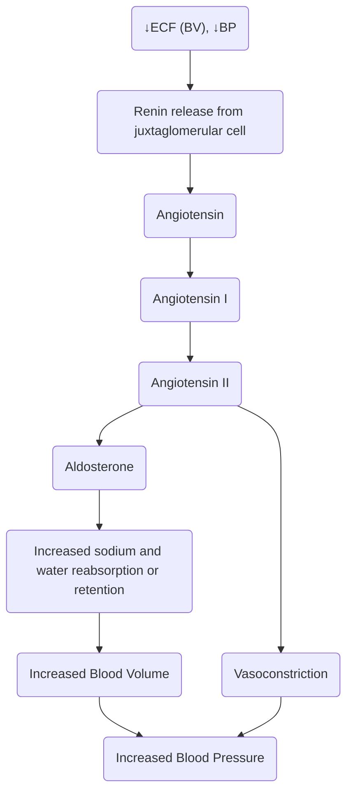

---
tags:
  - MS
  - CMPA
  - INC
title: Medical-Surgical Nursing I
draft: false
date: 2024-10-09
---
References: 
Brunner & Suddarth's Textbook of Medical-Surgical Nursing
Saunder's Comprehensive Review for NCLEX-RN Examination by Linda Anne Silvestri
___
# Fluids
In adults, 50-60% of body weight is water. It is stored in various components, generally bring divided  into ​​intracellular, extracellular, and interstitial spaces. The bodily proportion of fluid in the body and in each location varies with age and sex.
* **Age**: infants have higher proportion of body water than adults. There is rapid growth and metabolism, and infants have higher fluid turn-over due to immature kidney and rapid respiratory rate. The water content of the body decreases with age.
- **Gender and body size**: lean body has higher water content. As such, men have more water content than women, because they have more lean mass. Inversely, women have higher body fat content, with lesser water content.
## Fluid Intake and Output
The average oral fluid intake in a healthy adult is 2,500 mL/day, ranging from 1,500 to 3,000 mL/day. By weight, the standard formula for calculating necessary fluid intake is:
- 100 mL/kg (1 – 10 kg) +
- 50 mL/kg (11 – 20 kg) +
- 15 mL/kg (remaining weight)

In normal equilibrium, the fluid loss of an individual must equal their fluid intake. Therefore, in average, this 2,500 mL/day counterbalancing the input to maintain equilibrium. Fluid loss can occur from various medium of the body, with most fluid being removed through the urinary system. The are fluid loss which cannot be measured or seen, known as insensible losses. These occur through perspiration and breathing.

| Intake              | Amount           | Output                  | Amount           |
| ------------------- | ---------------- | ----------------------- | ---------------- |
| Ingested Water      | 1,200 – 1,500 mL | Kidneys (Urine)         | 1,500 mL         |
| Ingested Food       | 800 – 1,100 mL   | Insensible Loss (Skin)  | 600 – 800 mL     |
| Metabolic Oxidation | 300 mL           | Insensible Loss (Lungs) | 400 – 600 mL     |
|                     |                  | GI Tract (Stool)        | 100 mL           |
| Total               | 2,300 – 2,900 mL | Total                   | 2,600 – 3,000 mL |
The delicate balance of fluid, electrolyte, and [[#Acid-Base Balance|acid-base balance]] is ensured by an:
* Adequate intake of water and nutrients
* Physiologic mechanisms that regulate fluid volume
* Brain and excretory system
* Chemical processes that **buffer the blood** to keep its pH nearly neutral
## Components and Functions of the Body Fluids
Body fluids are composed of **solutes**, **solvents**, **electrolytes**, **proteins**, and many more. **Plasma and interstitial fluids** contain essentially the same electrolytes and solutes, but plasma has a higher protein content. The two main divisions of fluid compartments contain differing electrolyte concentrations:
1. The **major ICF electrolytes** are Potassium (3.5 – 5 or 5.5), Phosphate (2.5 – 3.5), and Magnesium
2. The **major ECF electrolytes** are Sodium (135 – 145), Bicarbonate (22 – 26), and Chloride (96 – 106).

The presence of these components, or their functions include:
- **Transport** nutrients, waste products, immune agents, etc.
* **Medium** or milieu for metabolic processes
* **Body temperature regulation**
* **Lubricant of musculoskeletal joints**
* **Insulator** and **shock absorber**
## Movement of Fluids
**Translocation** is the **movement of fluid** back and forth, and **exchange of chemicals** from one location to another. It is a continuous process in and among all areas where water is located. The components that move along with the fluid include **electrolytes**, substances that when dissolved in fluid carry an electrical charge; **acids**, substances that release H+ into fluid; and **bases**, substances that bind with H+.
1. **Diffusion**: a **solute** spreads through a solution or solvent, **moving from higher concentration to lower concentration**. A permeable membrane allows substances to pass through without restriction. A selectively permeable membrane allows some solutes to pass through without restriction, but prevents other solutes from passing freely. This occurs **within and between fluid compartments** if the membranes are permeable with the diffusing substances.
2. **Osmosis**
3. **Filtration**: the movement of solutes and solvents through hydrostatic pressure, moving from an area of higher pressure to an area of lower pressure.
4. **Hydrostatic Pressure**: a force exerted by the weight of a solution. This is the driving force for filtration, where high pressure compartments "push" solutes and solvents into lower pressure compartments.
	- A prime example of hydrostatic pressure is at the arterial end of capillaries, where hydrostatic pressure exceeds osmotic pressure and fluids and diffusible solutes move out of the capillary (e.g. oxygen from hemoglobin fuels cells) and the venous end of capillaries, where osmotic pressure exceeds hydrostatic pressure and pulls solutes and fluids into the capillary (e.g. waste products exit cells and enter the blood). 
5. **Osmolality**: the number of osmotically active particles per kilogram of water; it is the concentration of a solution. In the body, osmotic pressure is measured in milliosmoles (mOsm). The normal osmolality of plasma is 275 to 295 mOsm/kg (275 to 295 mmol/kg). This is the reference point for isotonicity of IV solutions.
## Serum Tonicity
Cell membranes and capillary walls separate body compartments. Cell membranes are selectively permeable, and permit the movement of water and solutes through several forces. Higher concentrations of solutes produce more forces that move fluid and solutes from the compartment. %%For example, in diarrhea, more electrolytes are lost than water, resulting in decreased electrolyte levels in extracellular fluid. This results in fluid shifting from ECF to ICF through osmosis.%%
1. In the case of **isotonic solutions**, both sides of a selectively permeable membrane have equal in concentration. Very little osmosis occurs as both sides have the same osmolality.
2. In the case of **hypotonic solutions**: a solution, if lower in osmolality than another, is hypotonic to that solution; for example, IV solutions with an osmolality of less than 275 mOsm/L is considered hypotonic. Osmosis occurs, "hydrating" the cells.
3. In the case of **hypertonic solutions**: a solution, if higher in osmolality than another, is hypotonic to that solution; for example, IV solutions with an osmolality of more than 295 mOsm/L is considered hypertonic. Osmosis occurs, "dehydrating" the cells.
4. **Osmotic pressure** is produced by the concentration of solutes in a solution. These are the "fighting" pressures across a semipermeable membranes.
5. **Active transport** is utilized by the body when moving electrolytes **against** the concentration gradient or osmosis. Metabolic processes in the cell utilize energy to allow this transport to occur. This includes sodium, potassium, calcium, iron, and hydrogen; some of the sugars, and the amino acids.
## Regulatory Systems
Under normal conditions, the following mechanisms regulate normal fluid volume and electrolyte concentrations:
1. **Osmoreceptors**: specialized neurons in the hypothalamus that are highly sensitive to **serum osmolality** (decrease in blood volume by 10%, systolic blood pressure below 90 mm Hg, and underfilling of the right atrium). These neurons stimulate the hypothalamus when osmolality becomes increased, producing:
	- **ADH** and releasing them through the posterior pituitary gland to increase serum dilution. When decreased, ADH is inhibited to reduce serum volume.
	- **Thirst** to promote increased fluid intake. It generally triggers once ECF volume decreases by approximately 700 mL (2% of body weight). It is also sensitive to changes in blood volume and blood pressure through the info relayed by **baroreceptors** (stretch receptors in the right atrium).
2. **Renin-Angiotensin-Aldosterone System** (RAAS): a sequence of enzyme production

3. **Natriuretic Peptides**: hormone-like substances that act in opposition to the RAAS. These are released from the overstretching of atrial and ventricular walls depending on venous return. Its effects act to reduce fluid volume: (a) **potent diuresis**, (b) **sodium wasting**, (c) **thirst inhibition**, and (d) **inhibition of renin, aldosterone, and ADH**. There are three types of NPs:
	* **Atrial NP**: released when the heart’s atrial muscle distend.
	* **Brain NP**: released when the ventricles of the heart distend.
	* **C-type NP**: brain (?).
4. **Gastrointestinal Regulation**: the GIT absorbs food and water through passive and active transport of electrolytes, water, and solutions. These aid in the fluid balance for the body.
5. **Osmosis**: the movement of **liquid or solvent** across a semipermeable membrane from a **lesser concentration to a higher concentration**. The force a solution produces for this to occur is called its **osmotic pressure**. A specific type of osmotic pressure, **colloidal osmotic pressure** (**onctic pressure**) is medically relevant as the pressure produced by the presence of **albumin and other plasma proteins**, as it is one of the main forces that retain vascular fluid volume.
6. **Filtration**: the movement of both solute and solvent across a semipermeable membrane from an area of **higher pressure to lower pressure**. This pressure is mainly from **hydrostatic pressure**– the pressure exerted by the fluids within the closed system. Filtration in the vascular system only occurs once hydrostatic pressure (outward force) exceeds osmotic pressure (inward force).
7. **Diffusion**: the movement of **particles, solutes, molecules** from an area of **higher concentration to an area of a lower concentration** through a semipermeable membrane. Its rate depends on the size of the molecules (larger particles are slower), concentration (wider difference in concentration diffuses faster), and temperature (higher temperature permits faster diffusion).
8. **Active Transport** is a form of **facilitated diffusion**, which is an “*uphill movement*” of solutes from **lower concentration to higher concentration** using energy (ATP).
___
# Electrolytes
**Electrolytes** are substances present on ICF and ECF that carry electrical charge. Depending on the energy charge of the ion, they may be categorized as **cations** (positive ions) and **anions** (negative ions). In a human, electrolytes are obtained from food, fluids, medications, intravenous fluids, and TPN solutions.

| Electrolytes | Reference Serum Range |
| :----------- | :-------------------- |
| Sodium       | 135 – 145             |
| Potassium    | 3.5 – 5.0             |
| Calcium      | 9.0 – 10.5            |
| Chloride     | 98 – 106              |
| Magnesium    | 1.3 – 2.1             |
| Phosphorus   | 3.0 – 4.5             |
## Dynamics of Electrolyte Balance
1. **Distribution**:
	- **Sodium**, **Calcium**, **Chloride** concentration are higher in ECF.
	- **Potassium**, **Magnesium**, **Potassium** concentrations are higher in ICF.
2. **Excretion**: urine, feces, surgical/wound drainage, pathological conditions
3. **Regulation**: **kidneys**, GIT, **hormones** (aldosterone, ANF, PTH, calcitonin)
## Sodium
**Sodium** (Na+, 135 – 145 mEq/L) is the major cation in ECF, and the major contributor of plasma osmolality. Sodium essentially determines the degree of water retention, excreted, or translocated (ECF osmolality and volume). It also plays a role in skeletal/heart muscle contraction and nerve impulse transmission.

The **kidneys** are major regulators of sodium, whose function is altered with aldosterone (the salt-saving hormone), ADH, and NP. These hormones are produced it inhibited in response to changes in serum sodium:
- ↑ Serum sodium results in ( - ) aldosterone, ( + ) ADH & NP
- ↓ Serum sodium results in ( + ) aldosterone, ( - ) ADH & NP

>[!TIP] Dietary References
>The average dietary intake of sodium is about 6-14 g/day
>- 1 teaspoon of **table salt** contains approximately 2000 mg of sodium.
>- 1 teaspoon of **soy sauce** contains approximately 1029 mg of sodium.
### Hyponatremia
1. **Etiology**: two main causes of hyponatremia is the **loss of** (fluids containing) **sodium** and/or **excessive introduction of fluid**, reducing the concentration of sodium (*hemodilutional hyponatremia*).
	* Profuse diaphoresis and diuresis (loss of electrolytes)
	* Excessive ingestion of plain water (dilution)
	* Administration of electrolyte-free solution (dilution)
	* Prolonged vomiting, GI suctioning (loss of electrolytes)
	* Chronic Renal Failure (dilution)
	* Syndrome of Inappropriate Antidiuretic Hormone (dilution)
2. **Manifestations**:
	* **Mental confusion**, personality changes result from cerebral edema. This occurs because the loss of serum sodium results in cerebral cells having a higher sodium concentration, pulling fluid towards them.
	* Muscular weakness, as sodium plays a part in skeletal muscle contraction.
	* Anorexia, restlessness
	* Elevated BP, tachycardia, N\&V
	* Severe: convulsions & coma
3. **Management**:
	* Underlying cause is corrected
	* Mild deficits: **oral administration of Na+**
	* Severe deficits: **IV therapy**
	* Monitor **I&O*** and **level of consciousness**
### Hypernatremia
1. **Etiology**: two main causes of hyponatremia is the **introduction of** (fluids containing) **sodium** and/or **excessive loss of fluid**, increasing the concentration of sodium (*hemoconcentrational hypernatremia*).
	* Profuse watery diarrhea (concentration)
	* Excessive salt intake without sufficient water intake (sodium intake)
	* Decreased water intake, e.g., in elderly, debilitated, or unconscious clients (concentration)
	* Excessive administration of solutions containing Na+ (sodium intake)
	* Excessive water loss without accompanying loss of sodium (concentration)
2. **Manifestations**:
	* Thirst (increased osmolality stimulates osmoreceptors)
	* Dry, sticky mucous membranes
	* Decreased UO
	* Fever
	* Rough, dry tongue
	* Lethargy; altered level of consciousness that becomes a coma if severe.
3. **Treatment**:
	* Depends on the cause, e.g., give ADH-like drugs (Vasopressin, Pitressin, Tannate) for patients with DI.
	* Oral administration of plain water to counter hemoconcentration.
	* IV administration of hypotonic solution
4. **Nursing Management**:
	* **Early detection**; monitor **I&O** (including infusion rates), **VS** (q1° – q4°), and signs/symptoms. Notify the physician if warranted.
	* Implements prescribed **dietary restrictions** or supplementation.
## Potassium
**Potassium** (K+, 3.5 – 5.0 mEq/L) is the major ICF cation (~140 mEq/L in ICF). It regulates protein synthesis, glucose use and storage, and **maintains action potentials in excitable membranes**. Because of its low serum concentration, changes in serum potassium seriously affects physiologic activities; a decrease of 1 mEq/L is a ~25% alteration in total concentration.

The **Sodium-Potassium Pump** maintains normal serum potassium levels by moving potassium into cells to retain normal levels despite heavy dietary intake (2 – 20 g/day).

>[!TIP] Common Dietary References
>- One medium **avocado** contains approximately 1097 mg of potassium.
>- One medium **banana** contains approximately 451 mg of potassium.

### Hypokalemia
1. **Etiology**:
	* K+ wasting diuretics (Furosemide \[Lasix\], Ethacrynic acid \[Edecrin\], Hydrochlorothiazide \[HydroDIURIL\])
	* Severe vomiting & diarrhea, prolonged suctioning
	* Large doses of corticosteroids
	* IV administration of insulin & glucose
	* Prolonged administration of nonelectrolyte parenteral fluids
	* Severe dieting or starvation
2. **Manifestations**:
	* Fatigue
	* Weakness
	* Anorexia
	* N&V
	* Cardiac dysrhythmias
	* Muscle weakness, paresthesia
	* Severe: hypotension, flaccid paralysis, DEATH from cardiac arrest/respiratory arrest
3. **ECG Changes**
	* ST-segment depression
	* Flat or inverted T wave
	* **Increased U wave** (distinct— remember "*hypukalemia*")
4. **Treatment**:
	* Elimination of the cause
	* Substitute K-wasting with K-Sparing diuretics (Spironolactone \[Aldactone\])
	* Increased oral intake of K-rich foods/K supplements (mild cases)
	* KCl (severe cases)
### Hyperkalemia
1. ​**Causes**:
	* Renal failure – never hypokalemia\!
	* Severe burns (during the first 24-48 hours, the damaged cells releases potassium)
	* Administration of K-sparing diuretics
	* Overuse of K supplements, salt substitutes (which contain K instead of Na), potassium rich foods
	* Crushing injuries
	* Addison’s disease
	* Rapid administration of parenteral K salts
2. **Manifestations**:
	* Diarrhea
	* Nausea
	* Muscle weakness
	* Paresthesia
	* Cardiac dysrhythmias
		* Peak T waves – Most telling sign\!
		* Prolonged PR intervals
		* Flat or absent P wave
		* Wide QRS complex
3. **Management**:
    * Treatment: depends on the cause
    * Decrease K-rich food intake, d/c oral potassium replacement until laboratory values are normal (mild cases)
    * Administration of cation-exchange resin like sodium polystyrene sulfonate (kayexalate—given ORAL or ENEMA) or combination of IV regular insulin & glucose (severe cases)
    * Peritoneal dialysis/hemodialysis
4. **Nursing Management**:
	* Assess clients for conditions with potential to cause potassium imbalances
	* Identify signs and symptoms
	* Monitor laboratory findings
	* Administer medications
		* KCl – diluted in an IV solution & administered at a rate below 10 mEq/hr
## Calcium
**Calcium** (Ca+, 9 – 10.5 mg/dL) is important for **bone strength and density**, activation of enzymes or reactions, **skeletal/cardiac muscle contraction**, nerve impulse transmission, and blood clotting. It exists in two forms when in the serum: **bound** and **unbound** calcium. Those bound are unable to exert their effects, as their are attached to proteins (albumin).

The **parathyroid glands** are major contributors in regulating calcium through the hormones **PTH** (mobilizes calcium, promoting demineralization of the bone) and **Thyrocalcitonin** (increases deposition of calcium into bone, inhibits calcium resorption). Additionally, **Vitamin D** aids in gastrointestinal absorption of calcium.
### Hypocalcemia
1. **Etiology**:
	* Vitamin D deficiency
	* Hypoparathyroidism
	* Acute pancreatitis
	* Corticosteroids
	* Rapid administration of multiple units of blood that contain an anticalcium additive blood that contain an anticalcium additive
	* Intestinal malabsorption
	* Accidental removal of parathyroid glands
2. **Manifestations**:
	* Tingling sensations (extremities, around the mouth)
	* Muscle and abdominal cramps
	* Carpopedal spasms (Positive Trousseau’s sign)
	* Mental changes
	* Positive Chvostek’s sign (spasm of facial muscle)
	* Laryngeal spasms
	* Tetany (muscle twitching)
	* Seizures
	* Bleeding
	* Cardiac dysrhythmias
3. **Management**:
	* Administration of oral Calcium & vitamin D (mild cases)
	* IV administration of Ca++ salts (calcium gluconate) – severe cases
4. **Nursing Management**:
	* Closely monitor for neurologic manifestations (tetany, seizures, spasms)
	* Seizure precautions
	* Provide bed rest for comfort, avoid falls
	* Cardiac dysrhythmias & airway obstructions
	* Check for signs of bruising or bleeding
### Hypercalcemia
1. **Etiology**:
	* Parathyroid gland tumors
	* Multiple fractures
	* Paget’s disease
	* Hyperparathyroidism
	* Excessive doses of vitamin D
	* Prolonged immobilization
	* Certain malignant diseases (multiple myeloma, acute leukemia, lymphomas)
2. **Manifestations**:
	* Deep bone pain
	* Constipation, anorexia, N\&V
	* Polyuria, Thirst
	* Pathologic fractures
	* Mental changes (decreased memory and attention span)
	* Kidney stones (calciuria = presence of calcium in urine, precipitates kidney stone)
3. **Management**:
	* Determining & correcting the cause
	* Increase fluid intake and limit calcium consumption (mild cases)
	* 45% or 0.9% NaCl (acute cases) and diuretics: furosemide (Lasix); oral phosphates; calcitonin (Cibacalcin)
	* Corticosteroids or plicamycin (Mithracin)– used for malignant diseases that do not respondto other forms of therapy  
4. **Nursing Management**:
	* Encourage increased fluid intake
	* Collaborates with dietitians to limits food sources of Ca++
	* Ambulation as tolerated\!
	* Provide assistance; avoid falls

>[!INFO] Heath Teaching for Calcium Imbalances
>* Follow the physician’s recommendations regarding the addition or restriction of Ca++ to the diet
>* Milk and dairy products, turnips, mustard greens, collards, kale, broccoli, canned fish with bones, Calcium-fortified orange juice
>* Lactose-free milk and nonprescription lactase enzymes are available for lactose-intolerant clients.
>* Take prescribed or physician-recommended drugs as directed; do not exceed or omit a dose
## Phosphorus
**Phosphorus** (3 – 4.5 mg/dL) is the major anion in ICF. Most of it (80%) is stored in the bones. It plays a role in activating B-complex vitamins, in ATP, in acid-base balance, and calcium homeostasis (it has a balanced reciprocal relationship with calcium).

Phosphorus is also regulated by **PTH**, because of its reciprocal relationship with calcium. An increase in PTH increases calcium, thus decreasing phosphorus, and vice versa.
## Magnesium
**Magnesium** (Mg, 1.3 – 2.1 mEq/L) plays important roles both in its intracellular form and extracellular form. 60% of magnesium is stored in bones and cartilage, and more is stored in intracellular fluid for the heart, liver, and skeletal muscles. This distribution is related to its functions:
- **ICF** – skeletal muscle contraction, protein metabolism and synthesis, Vitamin B complex activation, and ATP and DNA synthesis.
- **ECF** – regulates blood coagulation and **skeletal muscle contractility**.

Magnesium is regulated by the **kidneys** and **GIT** though its exact mechanism is not known.
## Hypomagnesemia
1. **Etiology**:
	* Chronic alcoholism
	* Diabetic ketoacidosis
	* Severe renal disease (polyuric phase)
	* Severe burns
	* Severe malnutrition
	* PIH
	* Intestinal malabsorption syndromes
	* Excessive diuresis (drug induced)
	* Hyperaldosteronism
	* Prolonged gastric suction
2. **Manifestations**:
	* Tachycardia and other dysrhythmias
	* Increased neuromuscular irritability
	* Paresthesia of the extremities
	* Leg and foot cramps
	* Hypertension
	* Mental changes
	* (+) Chvostek’s and Trousseau’s sign
	* Dysphagia
	* Seizures
3. **Management**:
	* Oral magnesium salts/magnesium rich foods
	* IV magnesium administration
### Hypermagnesemia
1. **Etiology**:
	* Renal failure
	* Addison’s disease
	* Excessive use of antacids or laxatives
	* Hyperaldosteronism
2. **Manifestations**:
	* Flushing, warmth, hypotension, lethargy, drowsiness, bradycardia, muscle weakness, depressed respirations, coma
3. **Management**:
	* Decreased oral magnesium intake
	* Discontinue parenteral replacement
	* Hemodialysis (severe cases)
4. **Nursing management for Magnesium Imbalances**:
	* Closely observe for dysrhythmias and early signs of neuromuscular irritability
	* If giving MgSO4, always check the BP\!\!\! (vasodilation)
		* Antidote: Calcium gluconate (kept available)
	* Monitor vital signs
	* Provide health teaching
## Chloride
**Chloride** (Cl, 98 - 106 mEq/L) is the major ECF anion. It works with sodium to maintain osmotic pressure. It is an important component of **hydrochloric acid** (HCl) produced in the stomach (and is therefore implicated in vomiting). It is an important aspect of [[Unit III#Regulatory Systems|chloride shifting]], an acid-base regulatory system.
___
# Fluid Imbalance
| Fluid Volume Imbalance | Definition                                                                  |
| ---------------------- | --------------------------------------------------------------------------- |
| Hypovolemia            | A low volume of fluids in ECF.                                              |
| Hypervolemia           | A high volume of fluids in ECF.                                             |
| Third Spacing          | The movement of fluids into interstitial faces, such as cavities or joints. |
| Dehydration            | A low volume of fluids in both ECF and ICF.                                 |
## Hypovolemia (Fluid Volume Deficit)
**Hypovolemia** is a low volume of ECF. The term may be confused with **dehydration**, which is a low volume of fluid in both ECF & ICF.
1. **Etiology**: a deficit is produced by an inequality between patient intake (lower) and output (higher).
	* Inadequate fluid intake
	- Hemorrhage
	- Prolonged vomiting and diarrhea
	* Wound loss (especially in [[#Burn Injury]])
	* Profuse urination or perspiration
	* [[#Movement of Fluids|Translocation]] of fluid (abdominal cavity)
2. **Pathophysiology**:
	* ↑ HR to maintain adequate CO
	* BP falls with postural changes, or it may become severely lowered when blood is rapidly lost
	* Hemoconcentration occurs \= ↑ potential for blood clots, urinary stones (compromises kidney’s function to excrete nitrogen wastes)
	* Eventually it depletes ICF which can affect cellular functions \= change in mentation
3. **Assessment findings**:
	- Thirst is one of the earliest symptoms of hypovolemia.
	- ​Weight loss ≥ 2 lbs within 24 hours
	- ↓BP, inc. Temp, rapid & weak thread pulse, rapid and shallow respiration, scant and dark yellow urine, dry & small volume stool, warm & flushed dry skin, poor skin turgor “tents”, sunken eyes, clear lungs, effortless breathing, weakness, flat jugular veins, reduced cognition, sleepy
4. **Medical management**: treatment is front by restoring fluid volume and preventing further losses
    - Treating its etiology
    * Increasing the volume of oral intake
    * Administering IVF replacement
    * Controlling fluid losses
5. **Health Teaching**:
	* **Respond to THIRST** because it is an early indication of reduced fluid volume.
	* Consume at least 8 – 10 (8 ounces) glasses of fluid each day, and more during hot, humid weather.
	* Drink water as an inexpensive means to meet fluid requirements.
	* Avoid beverages with alcohol and caffeine. These impose a diuretic effect on the body.
	* Include a moderate amount of table salt or foods containing sodium each day. Maintaining serum sodium also entails maintaining serum volume.
	* Rise slowly from a sitting position or lying position to avoid dizziness and potential injury.
## Hypervolemia (Fluid Volume Excess)
Hypervolemia is an **excessive volume of water** in the IV compartment.
1. **Etiology**: an excess is produced by an inequality between patient intake (higher) and output (lower).
	* Excessive oral intake
	* Heart failure
	* Kidney disease
	* Excessive salt intake
	* Adrenal gland dysfunction
	* Administration of corticosteroids (prednisolone)
2. **Assessment Findings**
	* Early signs: weight gain, elevated BP, increased breathing effort
	* Dependent edema (feet, ankles, sacrum, buttocks)
	* Rings, shoes & stockings leave marks in the skin
	* Prominent jugular vein when sitting
	* Moist breath sounds (fluid congestion in the lungs)
3. **Diagnostic Findings**
	* Hemodilution (↓ blood cell count, ↓ hematocrit)
	* Low urine SG
	* CVP (\>10 cm H2O) (\<4 cm H2O in FVD)
4. **Medical Management**
	* Treat the underlying cause
	* Restriction of oral & parenteral fluid intake
5. **Nursing Management**
	* Implements prescribed interventions (limiting Na+ & water intake)
	* Administering ordered medications
	* Elevates client head, legs, change position q2°, apply elastic stockings.
## Third Spacing
Translocation of fluid from the IV or intercellular space to tissue compartments, becoming trapped and nonfunctional. It can lead to hypotension, shock, and circulatory failure.
1. **Etiology**:
	- ​Loss of colloids (hypoalbuminemia)
	* Burns
	* Severe allergic reaction that alter capillary & cellular membrane permeability
2. **Assessment Findings**:
	- S/sx of hypovolemia *except weight loss*
	* Enlargement of organ cavities (Ascites)
	* Anasarca “brawny edema” – generalized edema
3. **Management**:
	* Restoration of colloidal osmotic pressure (albumin), then diuretics
	* Nursing care combines the assessment techniques for detecting both hypovolemia & hypervolemia.
	* For patient undergoing **paracentesis**, obtain consent, prepare special equipment (paracentesis set), skin test for anesthesia, then set for skin preparation. Also, allow the patient to void because the needle will be inserted 3 fingerbreadths under the umbilicus, in close proximity to the bladder.
___
# Acid-Base Balance

* Body fluids contain ACIDS \&BASES aside from electrolytes
	* H2CO3
	* HCO3
* Acid and base content influence the pH of the body (amount of H+ in a solution)
* Normal plasma pH is maintained by
	* Chemical regulation (bicarbonate-carbonic acid buffer system) 20:1
		* Adding/removing H+ ions
	* Respiratory regulation: releasing & conserving CO2
	* Renal regulation: retaining or excreting HCO3, production of ammonia, and net section of H+
## Metabolic Acidosis
* There is increased organic acids (other than carbonic acid) or decreased bicarbonate)
1. **Etiology**:
	* Anaerobic metabolism (formation of byproduct lactic acid) \= shock and cardiac arrest
	* Starvation, diabetic ketoacidosis (more common in type 1 DM) \= fatty acids accumulation
	* Kidney failure (cannot reabsorption HCO3)
	* Aspirin (overdose, profuse diarrhea (potassium and bicarbonate lost), intestinal wound drainage
2. **Manifestations**:
	* Kussmaul’s breathing (deep and rapid breathing)
	* Anorexia, nausea and vomiting, headache, confusion, flushing, lethargy, malaise, drowsiness, abdominal pain or discomfort, weakness
	* Cardiac dysrhythmias can develop, force of cardiac contraction can be weakened
	* Stupor & coma (severe cases)
	* **ABG**: ↓ pH, ↓ HCO3 (Normal to low PaCO2)
3. **Medical Management**:
	* Treating the cause & replacing F\&E that may have been lost
		* Digoxin/digitalis – CHF
		* Antibiotic – septic shock
		* Fluid replacement – hypovolemic shock
		* Epinephrine \+ atropine sulfate – cardiac arrest
		* Insulin (esp. fast-acting) – if DKA
	* IV bicarbonate (severe cases)
## Metabolic Alkalosis
There is increased bicarbonate or decreased H+ ion concentrations
1. **Etiology**:
	* Excessive oral or parenteral use of bicarbonate-containing drugs or alkaline salts
	* Rapid decrease in ECF (Diuretic therapy)
	* Vomiting, prolonged gastric suctioning, hypokalemia, hyperaldosteronism (retention of sodium bicarbonate)
2. **Manifestations**:
	* CNS irritability
	* Anorexia, nausea and vomiting, circumoral paresthesias, confusion, carpopedal spasm, hypertonic reflexes, tetany
	* ↓RR (compensatory effort)
	* ABG: ↑pH, ↑HCO3 (Normal to ↑ PaCO2)
3. **Medical Management**:
	* Eliminating the cause
	* Prescribing potassium (K+) to correct hypokalemia
	* NaCl if there is rapid ECF volume depletion
## Respiratory Acidosis (Acute/Chronic)
1. **Etiology**:
	* Pneumothorax, the presence of air, or hemothorax, the presence of blood within the pleural cavity, often because of chest trauma
	* Pulmonary edema
	* Acute bronchial asthma – bronchospasm, with secretion
	* Atelectasis
	* Pneumonia
	* Drug overdose – narcotics
	* Head injuries – s/t vehicular accident, GSW, falls
	* Chronic – emphysema, bronchiectasis, bronchial asthma
2. **Manifestations**:
	* Client may breathe slowly or irregularly, or stop breathing
	* Decreased respiratory volumes
	* Tachycardia (dysrhythmias), cyanosis
	* Behavioral changes – mental cloudiness, confusion, disorientation, hallucinations (accumulation of CO2)
	* Tremors, muscle twitching, flushed skin, headache, weakness, stupor, coma
	* ABG: ↓ pH, ↑ PaCo2 (Normal to ↑ HCO3)
3. **Medical Management**:
	* Treatment is individualized depending on the cause of imbalance
	* Mechanical ventilation (may be necessary to support respiratory function)
	* IV NaHCO3 if venti\`lation efforts do not adequately restore a balanced pH
	* Bronchodilators, antibiotics, airway suctioning
## Respiratory Alkalosis
1. **Etiology**: results from carbonic acid deficit
	* Anxiety, high fever, thyrotoxicosis, early salicylate (aspirin) poisoning, mechanical ventilation 
2. **Manifestations**:
	* ↑ RR
	* Lightheadedness, numbness & tingling of the fingers & the toes, circumoral paresthesias, sweating, panic dry mouth, convulsions (severe cases)
	* **ABG**: ↑ pH, ↓PaCo2 (normal to low HCO3)
___
# Burn Injury
A burn injury is a traumatic injury to the skin and underlying tissues caused by **heat**, **chemical**, or **electrical injuries**:
* Thermal burns are the most common, caused by exposure to heat.
* Chemical burns are those secondary to skin exposure to acids and alkali.
* Electrical burns are caused by travelling currents within the body. These are the most serious because of damage penetrating into deep tissue and internal structures.
* Radiation burns are the least common. Sunburns may be considered as a UV radiation burn.

Degree of tissue damage is related to:
* What agent caused the burn
* Temperature of the burning agent
* Duration of contact with the agent
* Thickness of the skin

* Immediate initial cause of cell damage is heat
* Coagulation of CHONs in the cells
* Tissue liquefaction
* Electrical burn: internal damage (cardiac dysrhythmias, CNS complications)
## Pathophysiology
1. Within the first 24 hours:
	- **Neuroendocrine changes**:
		* ACTH & ADH (released in response to hypovolemia)
			* Mineralocorticoid (aldosterone) \= Na+ retention, peripheral edema, oliguria
			* Glucocorticoids \= causes hyperglycemia
		* Client eventually enters hypermetabolic state to compensate for the accelerated tissue catabolism (increased O2 & nutrition demand)
	* **Intravascular fluid deficit**:  after a burn, fluid from the body moves toward the burn area \= edema at the burn site. Fluid lost is lost through water vapor & seepage.
	- Ultimately, this affects **fluid and electrolyte status**: fluid shifting, electrolyte deficit, loss of extracellular CHONs.
	- **Hyperkalemia**, **hyponatremia**
	* Anemia (**RBC destruction**): Hemolytic anemia, increased bilirubin, manifesting as icteric sclera
	* **Hemoconcentration** results in inadequate nutrition for body cells & organs

**The physiologic action of the sympathetic nervous system compensatory in a burn injury (early phase):**

* Risk for mortality: 90%
  * \>60 y/o
  * \>40% of TBSA
  * Presence of **inhalation injury** – the inhalation of superheated smoke and particles of smoke (ex. carbon monoxide) results in pulmonary edema and edematous airways.
## Depth of Burn Injury
1. **First Degree Burn**: superficial-thickness wounds
	* Epidermis is the only part injured
	* Desquamation occurs for 2-3 days after the burn & heals in 3-5 days without a scar or complications
    * Ex. sunburn, short (flash) exposure to a high intensity heat
 2. **Second Degree Burn**: partial-thickness wounds
    * Entire epidermis & varying depths of the dermis
    * 2 types:
		* **Superficial partial-thickness** – dermis + upper third of dermis
		* **Deep partial thickness** – dermis + 2/3 of dermis
	- **Superficial partial-thickness wound
		* There is involvement of the upper 3rd of the dermis leaving a good blood supply; wounds are **red, moist**, & **blanched** (whiten) when pressure is applied
		* **Blister formation**: leakage of large amount of plasma from the injured small vessels lifting off the destroyed epidermis
		* **Intense pain** due to exposed nerve endings especially when stimulated by touch & temperature changes
		* With standard care, heals in 10-21 days with no scar, but some minor pigment changes may occur
	- **Deep partial-thickness wound**
		* Wounds that extend **deeper into the skin, dermis** and fewer healthy cells remain; wounds are **red and dry** (because of fewer BC are patent)
		* **No Blister** formation because deep tissue layer is so thick & sticks to underlying viable dermis that it does not readily lift off the surface
		* **Lesser degree of pain** (more nerve endings have been destroyed), moderate edema is present
		* Generally heals in 3-6 weeks with scar formation
3. **Third Degree Burn**: full-thickness wound
	* **Destruction of the entire epidermis & dermis**, leaving no residual epidermal cells to repopulate; wound may be waxy, white, deep red, yellow, brown or black, **hard, dry, leathery eschar** (burn crust). **Eschar** is a dead tissue; it must slough off or can be removed from the burn wound before healing can occur.
	* **Avascular, no sensation**, healing can take from weeks to months depending on the establishment of a good blood supply to the injured areas.
4. **Fourth Degree Burn**: deep full-thickness wound
	* Wounds that extend beyond the skin into underlying fascia & tissues
	* Damages the muscle, bone, and tendons & leave them exposed
	* Wound is blackened and depressed, and sensation is completely absent
## Extent of Burn Injury
How big an area of the body is involved, measured in % of body surface area (%TBSA)
1. **Rule of Nines**: a quick initial method for determining. Its main disadvantage is an overestimation.
2. Special charts & graph (**Berkow Method**)
	* More accurate for evaluating the size of the injury
	* Uses a diagram of the body divided into sections, with the representative % of the TBSA for all ages
3. **Palm Method**: the most practical method employed in patients with scattered burns. The size of the patient's palm is approximately 1% of their TBSA.
## Factors Determining Inhalation Injury or Airway Obstruction
* Individuals who were injured in a closed space
* Clients with extensive burns or with burns of the face
* Intra-oral charcoal, especially teeth and gums
* Clients who were unconscious at the time of injury
* Clients with singed hairs, nasal hairs, eyelids, or eyelashes
* Clients who are coughing up carbonaceous sputum
* Changes in voice such as hoarseness or brassy cough
* Use of accessory muscles or stridor
* Poor oxygenation or ventilation
* Edema, erythema, and ulceration of airway mucosa
* Wheezing, bronchospasm
## Medical Management
Patient outcome depends on the initial first aid provided and the subsequent treatment in the hospital or burn center. Note the life-threatening complications of burn injury: **inhalation injury**, **hypovolemic shock**, and **infection**. There are six goals in caring for burn patients: airway, fluids, infection, pain, infection, GI function, and psychosocial support.
1. **First Goal: Promote Patent Airway**. This is part of the initial first aid, and is done to prevent further injury.
	* For thermal and chemical burns, **running water** is used to neutralize the heat.
	- Observe closely for **respiratory difficulty** (a sign of inhalation injury). If indicated, O₂ is administered, and IV fluids are given.
	* Quick assessment (extent of burn injury, additional trauma – fractures, head injuries, lacerations)
	* Maintain **adequate ventilation**.
		* Bronchoscopy (assess internal airway)
		* Warmed humidified O₂
		* ET should be available for insertion (\*\*or Tracheostomy Tube, if with burns on the neck; to improve circulation and ventilation)
		* If **eschar** is present in the neck area, a **tracheostomy** is indicated.
		* **Monitor VS, ABG, SpO₂**
		* Ventilation
		* Hyperbaric O₂ treatment (100% O₂, 3x greater than atmospheric pressure in a specifically designed chamber)
2. **Second Goal: Initiate Fluid Resuscitation**; to restore IVF, prevent tissue and cellular ischemia, and maintain vital organ function. The parameter for success of this phase is a urine output of 0.3 – 0.5 ml/kg/hr.
	* Fluid replacement regimen is calculated from the time the burn injury occurred.
	* **Lactated Ringers**: alkalinizing solution; Na+, Cl-, K+, Ca++ plus Lactate w/c is converted to HCO₃- in the liver (metabolic acidosis)
	* Assist in CVP insertion

>[!TIP] Phases of a Burn Injury
>1. **Shock Phase** (Day 1 – 2)
>	* ↑K+, ↓Na+
>	* Fluid shift from intravascular to interstitial spaces.
>	* Hypotension and hypovolemia occur from the fluid shift.
>2. **Remobilization Phase** (Day 3 – 5)
>	* Fluid shift from interstitial to intravascular (shifting back)
>	* Patient is at risk for hypervolemia
>	* Slow IV drip and monitor vital signs, auscultate lungs, and urine output.
>	* Most telling sign of adequate fluid replacement: **Hct returns to normal\!**
>3. **Wound Healing Phase** (Day 5 to wound closure)

3. **Third Goal: Relieve Pain**— morphine is the drug of choice. In severe cases, doses of up to 50 mg/hour may be used. However, **Naloxone** (Narcan), a narcotic antagonist, must be prepared for use when respiratory depression occurs from oversedation.
4. **Fourth Goal: Prevent Infection**
	* Wound management is the primary concern. When providing care, the nurse wears powder-free sterile gloves to minimize contamination.
	* Body hair around the perimeter of the burns is shaved.
	* Blisters that have ruptured are removed with scissors.
	* Tetanus Immunization is also administered
	* Clean the burned areas to remove debris.
		1. **Open method**: the wound is left uncovered; the "*exposed method*". Cradle nursing is required (support limbs). This is currently only being used for the face and perineum.
		2. **Closed method**: the wound is covered with a dressing. The current preferred method. The wound is covered first with nonadherent and absorbent dressings (gauze impregnated w/ petroleum jelly or ointment-based antimicrobials). Dressings are occlusive or semi-occlusive, made of polyvinyl, polyethylene, polyurethane and hydrocolloid materials as final dressing.
		3. Recent trends in care also include **Hydrotherapy**, the use of water to clean and debride burn wounds. One of its applications include a **whirlpool bath**, where the patient sits within a tub of circulating water. However, this bath should not exceed 30 minutes in duration to prevent hypothermia, infection, and maceration (skin breakdown).
	* **Antimicrobial Therapy**
		* Silver sulfadiazine (Silvadene) 1% ointment – less penetration on eschar
		* Mafenide (Sulfamylon) – DOC, greatest penetration on eschar
		* Silver nitrate (AgNO3) 0.5% solution
		* Anticoat (contains a thin, soluble film coat of silver)
		* Povidone-iodine (Betadine)
		* Gentamycin (Garamycin) 0.1% cream
		* Nitrofurazone (Furacin)
		* Mupirocin (Bactroban)
		* Clotrimazole (Lotrimin)
		* Ciclopirox (Loprox)
	* **Surgical Management** for enhancing healing
		* **Debridement**: the removal of damaged, non-healing tissue. This is accomplished through four means:
			1. **Natural**: tissue sloughs away by itself.
			2. **Mechanical**: tissue adheres to dressing or is detached during cleansing.
			3. **Enzymatic**: topical enzymes are applied to facilitate debridement.
			4. **Surgical**: the use of forceps and scissors for facilitated removal of tissue.
		* **Skin grafting** is the transplantation of skin. It is necessary for deep partial-thickness and full-thickness burns. It is done to **reduce the potential for infection**, **minimize fluid loss** by evaporation, hasten recovery, reduce scarring, and **prevent the loss of function**. The tissue used for skin grafting is sourced from various organisms, classified as:
			1. **Autograft**: the relocation of the client's own skin from other areas of the body.
			2. **Allograft**/**Homograft**: skin taken from a human cadaver may be used to temporarily cover large areas of tissue, but sloughs away within one week. A problem with the use of allografts is supply, and the risk for contamination.
			3. **Heterograft**/**Xenograft**: skin taken from animals. This is temporary, and rejection may occur within days to weeks. When rejection occurs, removal and replacement is required.
		* Application of a skin substitute
		* Application of culture skin
5. **Fifth Goal: Support GI Function**. In burn patients, bowel function is impaired, resulting in ischemia, and ulceration (Curling's ulcer). This occurs in conjunction with the reduced fluid volume in burn patients.
	* Local GIT effect: ↓BF àlocal GIT ischemia àUlcer (Curling’s Ulcer)
	* (severe): paralytic ileus àno peristalsis àabdominal distention
	* Management of the GIT:
		1. The patient maintains **NPO until bowel sounds return**. **Flatulence** is a sign of restored bowel function.
		2. An NGT is inserted for decompression.
		3. Monitor serum electrolytes
	- **Administer Medications**
		* Proton-pump inhibitor (Omeprazole) to prevent ulceration
		* H₂ (histamine) Blocker
		* Antacids
	- Monitor **Intake & Output**
		* Diet to promote wound healing: High protein (CHON) & carb (CHO), moderate fat; also, Vitamins & minerals
		* Patient will eat when bowel sound return to normal (2 – 3 days after burn)
		* If patient is not eating well, a 2nd NGT insertion may be used for feeding.
			* TPN is used for severe cases.
			* D10W (Vamin), a hypertonic glucose solution.
			* Aminosyn – amino acids
			* Intralipid – fatty acids (white) \+ Vitamin in side drip (indirect relationship)
			* Kabiven solution – 1.9 kcal
				* Contains amino acids, electrolytes, dextrose and lipid
6. **Sixth Goal: Provide Psychosocial Support**
	* Focus: assessing the wound & how the burn injury has affected the client’s status
	* **Calculates fluid replacement requirements** and infuses the prescribed volume according to agency’s protocol.
	* Quickly recognizes and efficiently treats **signs of shock**
	* Administered **prescribed analgesics**
	* **Wound care**
	* Helps the client & family to cope with the **change in body image**
	* **Health teaching** (pressure garments, skin care, etc.)
___
# Renal Disorders
## Diagnostic Tests
1. Urinalysis
2. **Urine Culture and Sensitivity test**
3. **24° urine collection**
4. **BUN (10-20 mg/dL)**
5. **Crea (0.6-1.1 mg/dL)**
6. **Uric Acid (2-6 mg/dL)**
7. **CBC/FBC**
8. **Electrolyte**
9. **ABG**
## Radiologic Tests
1. **KUB (X-ray)**: no contrast is required.
	- Give laxatives
	* Castor oil 30 cc HS
	* Duphalac 30 cc
	* Dulcolax 3 tabs
	- NPO 12 MN
	- Dulcolax 2 suppository
2. **IVP (Intravenous Pyelography)**: a contrast dye is given intravenously. Obtain a history of allergies, especially to seafoods and a baseline of renal function (serum creatinine). At bedtime, give laxative and castor oil. The patient must have bowel movement in the morning, or else a suppository will be given (must be frozen; use clean gloves).
3. **RGP (Retrograde Pyelography)**: a contrast dye is given through the catheter. This is done for clients with an allergy to contrast.
4. **CT Scan of the Kidneys**
5. **Ultrasound of the KUB**
	* Encourage intake of fluid (3-4 Liters), hold urination
	* Client must have full bladder.
	* Post-voiding will also be checked.
		* Normal residual volume in the bladder: about 50 mL
6. **Cystoscopy**: direct visualization of the bladder with an endoscope. This can detect chronic cystitis, chronic UTI, and stones in the urinary bladder. If stones are found, they can also be removed with the cystoscope.
	* Done under anesthesia. This may utilize general anesthesia, to relax the detrusor muscle, and is preferred. If local anesthesia is used, sedation may be given.
	* **Lithotomy** position is used.
		* Causes discomfort at the back of the knee
		* Must put paddings at the back of the knee
	* After procedure, **encourage fluid intake**.
7. **Renal Biopsy** is the most invasive but most conclusive test. A biopsy trocar is used to obtain samples for microscopic evaluation.
	* The patient is placed on NPO
	* Taken under local anesthesia in a prone position.
	* Check PT, PTT: if the client is a bleeder, give coagulants (e.g. Vit. K)
	* As the trocar is inserted, instruct the patient to hold breath (so no movement of diaphragm to prevent injury)
	* After the procedure, apply pressure dressing. Position the patient supine.
	* Apply sandbag (for about 4 hours) at the back of the client to prevent bleeding.
	  * Monitor VS (especially BP); Observe for possible bleeding
	  * Check for gross bleeding on the urine of the client (color)
	  * NPO until 4 hours
	  * Usually gets out of bed after 1 day; pressure dressing must be removed before getting out of bed
	    * Observe site for bleeding
	    * Avoid straining of stool (1-2 weeks)
	    * Avoid heavy lifting
## Pyelonephritis
Acute or chronic bacterial infection of the kidney and the lining of the collecting system (kidney pelvis).
* Acute pyelonephritis
	* Moderate to severe symptoms that usually last 1-2 weeks
	* If treatment is unsuccessful & infection recurs àchronic pyelonephritis
### Pathophysiology
Bacteria ascend to the kidney and kidney pelvis by way of the bladder and urethra: *Escherichia coli* (85%), *K. pneumoniae*, *P. mirabilis*, *Strep. Fecalis*, *P. aeruginosa*, *S. aureus*. These often reach the kidney through **ascending infection**, or **through the blood stream** (hematogenous). These are also known as a high UTI. This results in inflammation, with the kidney grossly enlarged.
### Risk Factors:
1. Instrumentation of the urethra & bladder (catheterization, cystoscopy, urologic surgery)
2. Inability to empty the bladder, pregnancy
3. Urinary stasis, Urinary obstruction (tumors, strictures, calculi, prostatic hypertrophy)
4. DM, otherrenal disease (polycystic kidney disease), neurogenic bladder.
5. Polycystic kidney disease –
6. Women with increased sexual activity, failure to void after intercourse, history of recent UTI, infection with HIV

### Clinical Manifestations
* Flank (or lumbosacral) pain and tenderness
* Chills
* Fever
* Malaise
* Urinary frequency with burning sensation (bladder infection)
	* Dysuria – painful urination
* Some are asymptomatic (chronic)
* Polyuria & nocturia (when tubules of the nephrons fail to reabsorb water efficiency)
### Diagnostic Evaluation
  * Urinalysis – **PYURIA**(pus in the urine)
    * Definite test
    * Clean catch, early AM, midstream urine
  * Urine culture – identifies the causative organism
  * Ultrasound, CT scan – determines obstruction un the urinary tract
  * Cystoscopy, IV pyelogram (not done in acute cases) or retrograde pyelogram – demonstrate obstruction or damage to structures of the urinary tract
  * KUB x-ray – reveal calculi, cysts, tumors
  * ↑ Serum creatinine and BUN – impaired renal function
### Medical Management
* Relieving fever & pain
* Antimicrobial drugs
	* Trimethoprim – sulfamethoxazole (TMP-SMZ, Septra) Gentamycin w/ or w/out ampicillin, Cephalosporin, Ciprofloxacin
* Antispasmodics & anticholinergics
	* Relax smooth muscles of the ureters & bladder, promote comfort & increase bladder capacity
	* Oxybutynin (Ditropan), propantheline (Pro-Banthine)
* **Nursing Management**:
	* Obtain complete medical, drug & allergy histories
	* Assess VS (T°, BP)
	* Physical exam
		* Determines the location of discomfort & any signs of fluid retention (peripheral edema, shortness of breath)
    * Observe & document the characteristics of the client’s urine
    * Encourage liberal fluid intake if not contraindicated (3-4 L)
    * Administer prescribed medications
    * Evaluates laboratory test results
		* BUN, Creatinine, serum electrolytes, urine culture to determine client responses to therapy
    * Provide health teaching:
		* Provide information about the disease
		* Medications
		* Increase fluid intake
		* Acid forming diet (meat, fish, poultry, eggs, corn, cranberries, prunes) – to prevent Ca++ & MgPO4stone formation
## Glomerulonephritis
* Occurs most frequently in children (boys 6-7 y/o) & young adults
* Most client recover spontaneously or with minimal therapy without sequelae
* Some develop chronic glomerulonephritis
### Pathophysiology
* Symptoms of AGN appear about 2-3 weeks after an upper respiratory infection (group A β-hemolytic strep)
  * Impetigo (skin infection), viral infections (mumps, hepa B, HIV)
  * The relationship between infection and acute glomerulonephritis is not clear
    * Microorganisms are not present in the kidney when symptoms appear, but glomeruli are acutely inflamed
  * Most believe that the inflammatory response is from *ANTIGEN-ANTIBODY*stimulation in the glomerular capillary membrane
### Clinical Manifestations
* 50% are asymptomatic
* Sudden onset with pronounced symptoms
* Fever, nausea, malaise, headache, generalize edema, **periorbital edema,**puffiness around the eyes
* Pain or tenderness over the kidney area
* Mild to moderate hypertension
* Poor appetite, irritability shortness of breath
* Hematuria, convulsions (due to hypertension), CHF, **oliguria**(UO 100-500 ml/day), anuria (\<100 ml/24hr)
### Diagnostic Evaluation
* Dark, smoky, bloody appearance (hematuria)
* Proteinuria
* Elevated anti-streptolysin O titer (recent streptococcal infection)
* ↓ Hgb, ↑ BUN, ↑ ESR
	* BUN initially normal, then rises
	* If BUN is normal, high protein diet since there is loss of CHON in urine; If elevated BUN, low protein diet
* Hyperkalemia, hypermagnesemia, hypocalcemia, dilutional hyponatremia
* Percutaneous renal biopsy – cellular changes characteristic of an Ag-Ab response. This is a definite test.
### Medical Management
* No specific treatment exist: guided by the symptoms & the underlying abnormality
* Bed rest
* Na+ \-restricted diet (edema, HPN)
* Antimicrobials (penicillin)
* Vitamins to improve general resistance
* Oral iron supplements (anemia)
* **Corticosteroids**(\*\* Prednisone: DOC)& immunosuppressive agents
	* Cause sodium and water retention, hypokalemia – edema, can be a side effect of the medication (if the BUN is under control) or disease process.
	* Promotes gluconeogenesis àhyperglycemia
		* Patient is given OHA (oral hyperglycemic agents)
	* Hypocalcemia
	* Immunocompromised àreverse isolation
		* Client is not considered cured until the urine is free of protein and RBCs for 6 months
		* Return to full activity usually is not permitted until the urine is free of protein for 1 month
* **Nursing Management**:
	* Monitor VS (BP q 4°) collects daily urine specimens to evaluate client response to treatment
	* Maintain bed rest especially if BP ↑& edema is present
	* Ensure adequate fluid intake & measure I & O
	* Diet: Na+ & CHON restricted; adequate CHO intake (prevents catabolism of body CHON stores)
	* Provide health teaching
	    * Identify the specific amount of sodium that is allowed and source of sodium to avoid
	    * Explain the purpose of diuretic therapy or other prescribed medications, the dosing regimen and side effects
	    * Recommend regular BP monitoring
	    * Caution client to avoid contact with persons who have infections
	    * Emphasize compliance with medical appointments & the necessity for repeated urinalysis
	    * Advise client to contact the physician if urinary volumes diminish, there is unexpected weight gain, or headaches or nosebleed occur
## Nephrotic Syndrome
* A condition of increased glomerular permeability that allows larger molecules to pass through the membrane into the urine and be removed from the blood
* Most common cause: Immune or inflammatory process
* **Key features of Nephrotic Syndrome:**
  * Massive proteinuria (\>3.5 g in 24 hr)
    * Moderate to severe proteinuria àfoamy urine
  * Hypoalbuminemia (\<3 g/dl)
    * Normal serum albumin: 3-5 g/dL
  * Edema
  * HPN
  * Lipiduria
  * Hyperlipidemia
    * Statins/Antihyperlipidemia – hepatotoxic àcheck liver function test (SGPT/ALT)
      * Normal ALT: 5-30 units
      * Increased ALT àhepatitis (non-viral)
    * Increased coagulation
    * Renal insufficiency
  * ***Treatment***: depends on the cause
    * Immunologic – steroids
    * ACE inhibitors – decreases proteinuria
    * Cholesterol lowering drugs
    * Heparin – lower proteinuria & renal insufficiency
    * GFR is normal – complete CHON diet
    * GFR is decreased – low CHON diet
    * Mild diuretics & Na restriction – edema & HPN
    * Assess hydration: vascular dehydration
## Urolithiasis
* Presence of calculus/calculi (stone) in the urinary tract
* **Nephrolithiasis**(kidney)
* **Pyelolithiasis**
* **Ureterolithiasis**(ureter)
* **Cystolithiasis**(bladder)
* **Urethrolithiasis**(Urethra)
* ***Predisposing factors:***
  * Calciuria, hyperparathyroidism, calcium-based antacids, excessive vit. D intake
  * Dehydration
  * UTI esp. if caused by P. mirabilis (makes urine alkaline & Ca \++ ppt.)
  * Obstructive d/o (enlarged prostate)
  * Gout (UA crystallizes)
  * Osteoporosis
  * Prolonged immobility (sluggish emptying of urine)
* ***Assessment Findings:***

**Signs and symptoms:**

* Sudden, sharp, severe flank **PAIN** that travels to the suprapubic region & external genitalia (Renal colic, painful spasm)
* Severity of pain causes nausea, vomiting, shock (\*\*neurogenic)
* Chills, fever, hypotension (if infection develops)
* Urinary retention, dysuria (obstruction)
* ***Diagnostic Findings:***
* Urinalysis
  * Gross or microscopic hematuria
  * pH conducive to stone formation
  * ↑ SG, mineral crystals, casts
  * ↑ Leukocyte (infection)
* Radiography (KUB)
* IVP
* Ultrasonography
* ***Medical management:***
  * Small calculi
    * Passed naturally with no specific interventions
    * Pain is tolerable of the stone is 5 mm or less in diameter and moving
    * Vigorous hydration

\*\* also promote movement

* Analgesics (opioids and NSAIDs)
* Antimicrobials
* Larger calculi
  * ESWL (extracorporeal shock wave lithotripsy)
  * Laser lithotripsy
* ***Surgical management:***
* Indicated for large of complicated by obstruction, ongoing UTI, kidney damage or constant bleeding
  * Percutaneous nephrolithotomy
    * Nephrostomy tube/Ureterostomy/ Cystostomy – place the drainage bag below the hypogastrium
  * Ureterolithotomy
  * Pyelolithotomy
  * Nephrolithotomy
* ***Nursing Process:***
  * Assessment:
    * History
    * Pain intensity & location, N & V
    * Vital signs
    * Urine (strain)
  * Diagnosis, planning, interventions

3 MAIN GOALS:

* Improve urinary output
* Relieve pain
* Prevent infection
## Renal Failure
* Inability of the nephrons in the kidneys to maintain F\&E, Acid-base balance, excrete nitrogen waste products & perform regulatory function
* 2 types:
  * ACUTE renal failure
    * Sudden, rapid decrease in renal function
    * Reversible with early, aggressive treatment
  * CHRONIC renal failure
    * Progressive (months to years) & irreversible damage to nephrons
  * Causes:
    * Prerenal – Hypoperfusion; must receive adequate amount of blood supply from the renal arteries (must be patent with no thrombus); must have adequate fluid volume
      * Circulating volume – must be adequate
      * Heart function – pumping action
      * Renal artery must be patent
    * Intrarenal –Renal damage; perfusion is normal, but the problem is in the kidney itself
    * Postrenal –Obstruction; perfusion and kidney is okay, but there’s problem in urine excretion
### Acute Renal Failure
* **Prerenal**– sudden and severe drop in blood pressure (shock) or interruption of blood flow to the kidneys from severe injury or illness
  * Hypovolemic shock
  * Cardiogenic shock 2° to CHF
  * Septic shock
  * Anaphylaxis
  * Dehydration
  * Renal artery thrombosis or stenosis
  * Cardiac arrest
  * Lethal dysrhythmias
* **Intrarenal**– direct damage to the kidneys by inflammation, toxins, drugs, infection, or reduced blood supply
  * Ischemia
  * Nephrotoxicity 2° to drugs (aminoglycosides – like gentamycin; antibiotics)
  * Acute & chronic glomerulonephritisànephrotic syndrome (protein is wasting away); **Cardinal signs:**proteinuria, hypoproteinemia, edema, hyperlipidemia
  * Polycystic disease – congenital, grape-like formation in the kidney; Malaki ang tiyan. Water inside the cysts
  * Untreated pre & post renal disorders
* **Postrenal**– sudden obstruction of urine flow due to enlarged prostate, kidney stones, bladder tumor, or injury
  * Ureteral calculi
  * Prostatic hypertrophy
  * Ureteral stricture – ureter is narrow, can be congenital or secondary to inflammatory process (ex. Ureteritis)
  * Ureteral or bladder tumor
* *Four phases:*
  * **Initiation phase**
    * Begins with the onset of the contributing event
    * Reduced blood flow àATN
## Acute Tubular Necrosis

* Death of cells in the collecting tubules
* **Oliguric phase (less UO)**
  * Begins within 48 hrs after the initial cellular insult (10-14 days or longer)
  * FVE develops (edema, HPN, cardiopulmonary complications)
  * **AZOTEMIA**(accumulation of urea & nitrogenous waste in the blood) àneurologic changes, seizure, coma, death
  * Hyperkalemia, metabolic acidosis, **UREMIA**develops (uremic syndrome)
* **Diuretic phase**
  * Diuresis begins as the nephrons recover
  * ↑ water content of urine but excretion of wastes & electrolytes continues to be impaired
  * ↑ BUN, creatinine, K, phosphate
* **Recovery phase**
  * Normal glomerular filtration and tubular function is restored (1 or more years)
  * Evidence: Good urine output, Normal BUN, crea
## Chronic Renal Failure

* Kidneys are extensively damaged
* 5 stages:
  * Stage 1 – GFR \> 90 mL/min, but less than 125
  * Stage 2 – GFR 60-89 mL/min
  * Stage 3 – GFR 30-59 mL/min
  * Stage 4 –GFR 15-29 mL/min
  * Stage 5 \- \<15 mL/min

\*\* Signs and symptoms:

* Increased BUN, crea, UA àUremic syndrome, Uremic encephalopathy (if brain)
  * Altered LOC
  * Seizure – cerebral edema, hyponatremia and hypocalcemia
* Edemaàpulmonary congestion, pulmonary edema, pleural effusion, ascites àDifficulty of breathing
  * Management can be paracentesis or thoracentesis, dialysis
* Hypertensive
* Metabolic acidosis
* Hyponatremia, hyperkalemia, hypocalcemia, hypermagnesemia, hyperphosphatemia
* Anemia, thrombocytopenia (increased risk for bleeding àerythema), pallor, activity intolerance
* Because of uremia àexcreted in the skin through the urine crystals àgray/ashen color \+ pruritus
* HyperkalemiaàIncreased bowel activity àAbdominal pain, Diarrhea
* Gingivitis, esophagitis, Ulcer formation, hematemesis, melena, hematochezia
* Osteoporosisàcan lead to fractures
* Reproductive: male and female (decreased libido)
* Suicidal tendencies, irritability
* ***Assessment Findings:***
* Elevated BP, weight gain, UO decreased
* Puffy face appearance
* Pale skin
* GIT ulceration & bleeding

Vague symptoms (lethargy, headache, anorexia, dry mouth)

* Pruritus (\*\* can be secondary to hyperphosphatemia), dry, scaly skin
  * Phosphate binder to relieve the pruritus
* Urine breath odor, muscle cramps, bone pain or tenderness & spontaneous fractures can develop
* ↓ mental process (confusion, depression, seizures, coma)

\*\* ***Indications for dialysis:***

* Generalized edema
* Uremic encephalopathy
* Metabolic acidosis
* Hyperkalemia
* ***Diagnostic Findings:***
  * ↑ BUN, creatinine, K, Mg, Phosphorus
  * ↓RBC count, Hct/Hgb, pH, SG
  * IVP – reveals renal dysfunction
  * Percutaneous renal biopsy shows destruction of nephrons
  * Radiography & ultrasonography demonstrate structural defects in the KUB
  * Renal angiography identifies obstructions in blood vessels
* ***Medical Management:***
  * Prevention of ARF is an important consideration
  * Risk for dehydration – adequately hydrate the client
  * Treat shock shock & hopotension as quickly as possible (replacement of fluids & blood)
  * Treat infection promptly
  * Continuous renal function monitoring
  * Dopamine (Intropin), hemodialysis, peritoneal dialysis
    * Vasopressor (Dopamine) – to increase BP due to vasoconstriction, Vasopressin is given usually if with bleeding
    * Low-dose dopamine – to improve renal perfusion
    * Dopamine is light-sensitive
  * Diet: low CHON, high calories, low Na, low K
  * Kayexalate, IV infusion of insulin & glucose for hyperkalemia
  * Na bicarbonate for acid-base imbalance
* *Medical treatment of CRF is similar to that for ARF, except the period of treatment is “lifelong” (unless kidney transplantation is performed).*
* Chronic anemia
  * Epoetin alfa (Epogen) is administered rather than blood transfusion (\*\* given subcutaneously)

***Surgical management: (Renal Transplant)***

* Done to prolong life
* To improve quality of life
* The anastomosed kidney will be supplied by the**iliac artery**
* The new kidney rests on the **iliac crest/ileum**
* Evaluate: must have *good urine output\!\!*
* Major operation
* Complications:
  * Bleeding
  * Allergy from Anesthesia
  * Tissue rejection
    * Give immunosuppressant (Imuran)& corticosteroids (high dose).
  * Immunosuppression (Increased risk to develop infection)
## Hemodialysis
Hemodialysis filters blood when the kidneys can no longer do so. Blood is channeled through a dialysis machine to remove waste. The filtered blood returns to the body.

**Blood Access**

1. Arteriovenous (AV) Fistula – takes 1-2 months to mature
   * Direct anastomosis of artery and vein
   * Internal fistula
   * Auscultate for bruits
   * Palpate for thrills
   * Complication: Thrombus formation
2. AV Shunt – silastic cannula (U-shaped shunt)
   * 2 Clamps should be available at bedside
   * External
   * Can be used right away

 

3. AV Graft – artificial graft; usually used if the blood vessels are smaller; more expensive than AV fistula

Peritoneal Dialysis

* Complication:
  * Peritonitis (cloudy dialysate, abdominal distention, hypoactive bowel sounds)
* Peritoneum acts as the semi-permeable membrane.

 
___
# Disturbances in Oxygenation
Components involved in Oxygenation:

* Heart
  * Pumps blood
* Lungs
* Red blood cells
  * Hemoglobin carry the oxygen
* Blood vessels

 

**Assessment Techniques**

* History (Focus: obtaining information about client’s risk factors & symptoms of cardiovascular disease)
  * Demographic data – age, gender, ethnic origin
    * Usually middle age and elderly (beginning 40 y/o), usually male (due to lifestyle: smoker and alcohol drinkers)
  * Family history & genetic risk
  * Personal history
  * Diet history
    * Especially high fat and high salt
  * Socioeconomic status
    * Usually rich people
  * History
    * Modifiable
      * Cigarette smoking – vasospasm
      * Physical inactivity – slow blood flow, increases risk of thrombus formation
      * Obesity – heart enlarges, fatty liver, increased risk of hypertension and diabetes mellitus
      * Psychological variables – stress (increases blood pressure, increased release of epinephrine)
      * Chronic diseases – hypertension, DM
    * Non-modifiable risk factors
      * Age, gender, ethnic background, family history
        * When female reach menopause, risk increases
      * Cigarette smoking – major risk factor for the development of CAD and PVD
      * Obesity – strong indicator of CVD especially when abdominal obesity is present
      * Physical assessment
        * Major symptoms cardiovascular disease (CVD)
          * Pain or discomfort (specifically chest pain; secondary to inadequate blood supply; chemical in nature: *Lactic acid production*)
            * Give vasodilators, nitroglycerin
          * Dyspnea (DOE \[dyspnea on exertion\], Orthopnea \[difficulty of breathing when supine, but relieved upon sitting up\], paroxysmal nocturnal dyspnea \[dyspnea while sleeping, typical of pulmonary edema and congestion\])
          * Fatigue – activity intolerance, because of decreased internal respiration/altered tissue perfusion
          * Palpitations – when you are aware of your own heartbeat; secondary to arrhythmias (Best drug: xylocaine/lidocaine)
          * Weight gain – best indicator of fluid retention (edema); secondary accumulation of fluids \[typical of Congestive Heart Failure\]
          * Syncope – transient loss of consciousness (↓ cerebral perfusion)
          * Extremity pain – due to ischemia & venous insufficiency
        * Skin color – pallor (anemia), cyanosis (late sign of decreased perfusion)
        * ↓ skin temperature – due to ↓ blood flow
        * Clubbing of finger – chronic tissue hypoxia
          * Schamroth method – using the ring fingers, they should have a diamond shape
            * Normal angle is 160 degrees.
          * Edema
          * BP changes
            * Hypertension
            * Postural hypotension
              * Change position of the client slowly.
            * Pulse pressure – (30-40 mmHg) the difference between systolic and diastolic pressure

 

Precordium (area over the heart)

**Assessment Involves:**

* Inspection
  * Apical pulse – movement in the heart area (thrills); this is normal, especially on thin individuals. Can also be assessed through palpation.
  * Symmetry, depression of sternum
* **Palpation**
* **Percussion**– percuss for dullness
* Auscultation
  * Normal heart sounds – best heard at the apex, at the 5thintercostal space at the midclavicular line (or below the nipple), left side
    * S1 – closure of atrioventricular (AV) valves
      * Low pitch, long; best heard at the apex of the heart
      * Palpate the carotid pulse while listening
      * Marks the beginning of ventricular systole
    * S2 – closure of the semilunar valves
      * High pitch, short
      * best heard at the base of the heart
    * Auscultatory areas:
      * Aortic area (2ndICS, **right**sternal area/border)
      * Pulmonic area (2ndICS, **left**sternal area/border)
      * Tricuspid area (4th\-5thICS, right sternal border)
      * Mitral area (5thICS, midclavicular line) – point of maximal impulse
    * Abnormal heart sounds
      * Murmurs
        * Reflection of turbulence of blood flow through the normal or abnormal valves
        * May indicate stenosis, diseased valves, insufficiency, or congenital disease
      * Pericardial friction rub
        * Harsh, grating sound
        * Sign of inflammation, infection or infiltration of visceral/parietal layers
      * Laboratory tests
        * Serum markers of myocardial damage (cardiac markers)
          * Troponin (T \= \< 0.2 ng/mL, I \= \< 0.03 ng/mL)
            * Onset: 3-6 hours; duration: 1-2 weeks
            * Most reliable test to confirm MI
          * Creatine Kinase (CK-MB)
            * only found in the heart
            * Onset: 3-6 hours; Duration: 3-6 days
            * Chest specific, isoenzyme of the heart
          * Myoglobin (\<90 mcg/L)
            * First to be release, in 1 to 3 hours after the onset of chest pain, but returns to normal in \< 24 hours.
            * Early diagnosis
          * Serum Lipids
            * Cholesterol (122-200 mg/dL) ; TGL (M 40-160, F 35-135 mg/dL)
            * HDL (M 45-50, F 55-60 mg/dL) ; LDL (M\&F 60-180 mg/dL)
            * HDL:LDL ratio (3:1)
          * Low cholesterol diet
            * “—statins” – for about one month
          * C-reactive protein
          * Blood Coagulation Tests (ability of the blood to clot thrombi)
            * Prothrombin time (PT) – evaluates the efficiency of Coumadin; 11-16 seconds on patients not undergoing therapy.
            * Partial Thromboplastin time (PTT) – evaluates the effectiveness of Heparin; 60-70 secs
            * Goal: 1.5-2 times that of normal.
            * NDx: *Risk for Bleeding*
              * Ready the antidote:
                * **Coumadin – Vitamin K**
                * **Heparin – Protamine sulfate**
              * Gentle handling of patient.
              * Use soft bristle toothbrush.
              * Caution when doing shaving.
            * ABG
            * Serum electrolytes (K, Ca, Na, Magnesium)
            * CBC – note especially the hemoglobin
            * Fasting Blood Sugar (70-110 mg/dL)
              * NPO for about 8 hours (or 8-10 hours)
            * Glycosylated Hemoglobin (HBA1c) – gives an idea of blood sugar for the past 2-3 months
              * 3-6 mcg%
            * Radiographic examinations
              * Chest radiography
                * Determines the size, silhouette & position of the heart

\*\*Should be done at least once a year

* Angiography (arteriography)
  * Invasive procedure involving fluoroscopy & the use of contrast media
  * Assess for allergy
  * Angiography in action: The beating heart and its surrounding blood vessels can be watched and recorded in extraordinary detail as a catheter injects a contrast dye into a patient’s coronary arteries.
* Cardiac catheterization
  * Most definitive, most invasive test used in the diagnosis of heart disease
  * Right-sided heart catheterization (catheter inserted in arm vein or femoral vein – goes together with the flow of unoxygenated blood)
  * Left-sided heart catheterization (femoral artery àabdominal aorta àmain aorta àaortic valve àleft ventricle àmitral valve àleft atrium àpulmonary vein)

\*\* **Purpose:**

1. To evaluate the function of the valves;
2. To determine the oxygen saturation;
3. To determine the pressures in the different chambers of the heart;
4. To evaluate the patency of the coronary artery

\*\* **Nursing responsibilities:**

1. Local anesthesia, sedate the patient
2. Shave the groin.
3. Bath the night before the exam.
4. Must be done under strict aseptic technique.

\*\* **Possible complications:**

1. MI
2. Thromboembolism
   * Cardiac arteriography
     * Technique is the same for left-sided heart catheterization
     * Complications: MI, Stroke, Arterial bleeding, Thromboembolism, lethal dysrhythmias, death.

**Nursing Responsibilities:**

1. Apply pressure dressing *to prevent bleeding*.
2. Apply plaster and anchor with elastic bandage.
3. Monitor the site, the dressing, the bottom sheet, the VS (BP q 15 mins, 30 mins, then hourly until stable; PP).
4. There can be some instances where sandbag can be used; put on top of the site.
5. Position client in supine to low back rest, without flexing the legs *in order to promote good circulationby not compressing the femoral artery.*
6. Observe for pulse (popliteal or posterior tibial pulse), color, and temperature.
   * Electrocardiography
     * Gold standard test
     * Graphically measures& records the electrical current travelling through the conduction system generated by the heart
     * Measured by electrodes placed on the skin & connected to an amplifier & strip chart recorder
     * In a standard 12-lead ECG:
       * Five electrodes attached to the arms, legs& chest
       * Measures electrical current from 12 different views and leads

**Characteristic of Normal Rhythms**

* HR is 60-100 bpm
* P waves are found BEFORE the QRS complex
* PR interval is 0.12 to 0.20 seconds duration
* QRS complex is 0.04 to 0.10 seconds duration
* Conduction is forward and cyclical
* The rhythm is regular with no delay

**Various forms of ECG**

* Resting ECG
* Ambulatory ECG (Holter Monitoring) – 24 hours
* Exercise ECG (Stress Test) – treadmill
  * Purposes:
    * To determine the myocardial oxygen demand during exercise.
    * To confirm the diagnosis of CAD
    * Evaluate the effectiveness of the treatment.
    * A basis for cardiac rehabilitation program.

**Assessment:**

* Echocardiography
  * Uses sound waves to assess cardiac structure and mobility, particularly at the valves
* Hemodynamic monitoring
  * Use to assess the volume & pressure of blood in the heart & vascular system by means of a surgically inserted catheter

Methods:

* Direct BP monitoring
  * Artery used: radial, brachial, femoral
  * Catheter tip contains sensor that measures & transmits the fluid pressure to a transducer
* CVP monitoring
  * Pressure produced by venous blood in the RA
  * NV: 2-7 mmHg or 4-10 cm H2O
  * Function of the right side of the heart
* Pulmonary artery pressure monitoring
  * 2 pressures: Pulmonary Capillary Pressure and Pulmonary Artery Wedge pressure
  * 4-12 mmHg for both
  * Gives us an idea of the function of the left side of the heart
  * \> 20 – pulmonarycongestion
  * \> 25 – pulmonaryedema
  * Left sided failure: PCWP and CVP ↑
  * Right sided failure: CVP ↑, PCWP ↓
___
# Heart Disorders

## Pericarditis

* Inflammation of the pericardium

**Associated**with the following:

* Malignant neoplasms
* Idiopathic cause
* Ineffective organisms (bacteria, viruses, fungi)
* Post-MI syndrome (Dressler’s syndrome)
  * Pericarditis, fever, pericardial & pleural effusion 1-2 weeks after MI
* Postpericardiotomy syndrome
* Systemic connective tissue disease
* Renal failure

**Assessment**:

* **PAIN**radiating to the neck, shoulder & back
  * Aggravated by inspiration, coughing & swallowing
  * Worst in supine position (relived by sitting up & leaning forward)
* Pericardial friction rub (scratchy high pitch sound)
* If with chronic constructive pericarditis: signs of RSHF
* Echocardiography, CT scan – reveals thickening of pericardium
* ↑ WBC count
* Atrial fibrillation is common

**Interventions**:

* NSAIDs for PAIN
* Corticosteroids
* Antibiotics
* Pericardial drainage
* Radiation or chemotherapy if caused by malignancy
* Hemodialysis (uremic pericarditis)
* Assist to assume position of comfort
* Pericardiectomy (chronic constructive pericarditis)
* Monitor for complications: pericardial effusionà**Cardiac tamponade**

**Findings:**

* *Jugular distention*with elevated CVP
* Paradoxical pulse (systolic BP 10 mmHg or more on expiration than on inspiration)
  * Hypotension with paradoxical pulse
* ↓ cardiac output
* Muffled heart sounds
* Circulatory collapse
  * Hypotension
  * Cardiogenic shock
  * Stuporous, probably coma
  * Tachypnea
  * Cold clammy skin
  * Low urine output due to decreased renal perfusionàhighly concentrated urine
  * Cyanotic
* Emergency care: Pericardiocentesis

 

## Myocarditis

**Causes:**

* Viral, bacterial, fungal & parasitic infection
* Chronic alcohol abuse
* Radiation therapy
* Autoimmune disorders
* Bulimic patients taking ipepac syrup to facilitate purging (myocardial damage)
* **Due to inflammation àabnormal function**
* ↓ cardiac output, impaired blood circulation, predispose client to CHF
* Due to ischemia: tachycardia, dysrhythmias
* Cardiomyopathy

**Assessment:**

* Pain, fever, tachycardia, dysrhythmias, dyspnea, malaise, fatigue, anorexia, pale or cyanotic skin, signs of RSHF
* ↑ WBC count, elevated CRP, elevated cardiac isoenzymes, abnormal ECG
* Abnormal chest radiography, echocardiography

**Intervention:**

* Treatment of underlying cause (antibiotic)
* Promote bed rest, Na+-restricted diet, cardiotonic drug (digitalis) are prescribed
* Monitor cardiopulmonary status and complications (CHF, dysrhythmias)
  * VS
  * Daily weight
  * I\&O
  * Heart & lung sound
  * Pulse oximetry measurements
  * Cardiac monitoring
  * Dependent edema

 

## Rheumatic Carditis/Endocarditis

* An infection of the innermost layers of the heart. It may occur in people with congenital and valvular diseases, and those who have had rheumatic fever.

 

* Causes obstruction in the mitral valve (narrowing of the valves)
  * Left atrium first affected àleft atrial hypertrophy
  * Valvular defects – Valvular stenosis (inadequate opening of mitral valve), Valvular regurgitation (valve does not close adequately)
    * All are acquired
  * Complications: Cerebrovascular Accident (due to the dislodged emboli), Congestive Heart Failure

**Disturbances in O2 transport Mechanism**

* Infectious/Inflammatory Disorders
  * Pericarditis, Myocarditis, Endocarditis, RHD
* Coronary Artery Disease
  * Atherosclerosis
  * Angina Pectoris
  * Myocardial Infarction
* Congestive Heart Failure
* Pulmonary Edema

 

## Coronary Artery Disease

**Stages of CAD**

* Atherosclerotic heart disease
* Angina pectoris
* Myocardial infarction

**Coronary Artery Disease**

* Arteriosclerosis
  * Thickening or hardening of the arterial wall
* Atherosclerosis
  * A type of arteriosclerosis caused by formation of **PLAQUE**(chiefly composed of cholesterol)
  * Leading contributor to coronary artery and cerebrovascular disease

**Assessment:**

* BP (hypertension)
* Elevated cholesterol & triglycerides
* Presence of abdominal obesity
* Elevated FBS

**Interventions:**

* Cholesterol screening
* Diet
* Smoking cessation
* Exercise
* Drug therapy

 

### Angina Pectoris

* “Chest pain” of cardiac origin
  * Levine’s sign àhand clenched over the heart area
  * Imbalance between oxygen supply and demand
  * Stimulation of sympathetic nervous system à↑ BP, HR (Tachycardia), RR (Tachypnea), Diaphoresis, Cold clammy skin
* Most common clinical manifestation of myocardial ischemia
* Myocardial ischemia causes chemical and mechanical stimulation of sensory afferent nerve endings in the coronary vessels and myocardium

| TYPES OF ANGINA | CAUSES | SYMPTOMS |
| :---- | :---- | :---- |
| Stable | \- 75% coronary occlusion that accompanies exertion \- elevated HR or BP \- Eating a large meal | \- Chest pain (15 mins or less) and may radiate \- Similar pain severity frequency & duration with each episode |
| Unstable | \- Progressive worsening of stable angina with \>90% coronary occlusion | \- Chest pain of increased frequency, severity & duration poorly relieved by rest or oral nitrates |
| Variant (Prinzmetal’s) | \- Arterial spasm in normal or diseased coronary artery | \- Chest pain that occurs at rest (usually between 2 & 8 am) (ECG: ST-Elevation) |

 

**Precipitated by:**

* Exertion – avoid exertion and exhaustion
* Eating heavy meal – advice small frequent meals
* Extremes of temperature
* Extremes of emotion

**Interventions:**

1. Provide rest *to decrease the oxygen demand.*
2. Position the client in semi-fowlers.
3. Provide O2 therapy *to increase oxygen supply*. àneeds order of the doctor
   1. 2-4 lpm, average of 3 lpm
4. Drugs:
   1. Vasodilators
      1. Short acting – sublingual, promotes vasodilation àIncreased blood supply to the heart.
         1. Nitroglycerin (NTG)
         2. Isodil
      2. Long-acting
         1. Isordil oral – TID
         2. ISMN – isosorbide mononitrate
         3. Nitrobid OD – Anterior Chest Wall (once a day); before giving the next dose, remove the previous one 2 hours before.
      3. Antihypertensive medications
         1. Betablockers “-olol”
         2. Calcium Channel Blockers “-dipine”– blocks the influx of calcium ions into the myocardial cells
      4. Antiplatelet aggregation – blood-thinning drugs
         1. Aspirin
         2. Clopidogrel
      5. Antihyperlipidemia “-statins”
      6. Oral Hyporglycemic Agents (OHA), Insulin

 

### Myocardial Infarction

* Most serious acute coronary syndrome
* Zone of ischemia – area in the heart without blood supply
* Zone of injury – if without blood supply for 1 minute to a few minutes
* Zone of infarction \--if without blood supply for 20 minutes and more.

**Types of MI:**

* Subendocardial MI
  * Affected area is just below the endocardium
* Transmural MI
  * Damage includes the entire thickness of the muscle
  * Most likely to lead to cardiogenic shock
* Intramural MI
  * Affected area are small patches in the myocardium

**ECG Changes:**

* Zone of **ischemia**– T wave inversion
* Zone of **injury**– ST elevation
  * First ECG change when there is injury to the heart muscles
* Zone of **infarction**– Abnormal Q wave (Pathologic Q wave)

**Confirmatory:**

* Chest pain, “Levine’s signs” – more than 15 or 30 minutes, not relieved by bed rest or nitroglycerin
  * Atypical – without chest pain, usually with patients with DM and those who are smokers.
* ECG Changes
* Cardiac Enzymes

**Physical Assessment/Clinical Manifestations:**

* Key features of Angina and Myocardial Infarction:

| Angina | Myocardial Infarction |
| :---- | :---- |
| Substernal chest discomfort: •   	Radiating to the left arm •   	Precipitated by exertion or stress •   	Relieved by nitroglycerin or rest •   	Lasting \<15 min Few Associated symptoms | Substernal chest pressure: •   	Radiating to the left arm, back or jaw •   	Occurring without cause, usually in the morning •   	Relived only by opioids •   	Lasting 30 mins or more •   	Frequently associated symptoms: •   	Nausea •   	Diaphoresis •   	Dyspnea •   	Feelings of fear and anxiety •   	Dysrhythmias •   	Fatigue •   	Epigastric distress •   	Feeling “short of breath” |

**Interventions:**

* Pain management: MONA
  * Morphine
    * 2- to 10-mg IV q 5-15 minutes
    * AE: respiratory depression, hypotension, bradycardia, severe vomiting
    * Antidote: Naloxone (Narcan) 0.2-0.8 mg IV
  * Oxygen: 2-4 L/m by nasal cannula
  * Nitroglycerin
  * Aspirin
* Positioning – Semifowler’s
* Providing a quiet and calm environment
* Promote rest

**Medications:**

* Nitrates
  * Nitroglycerin, Isosorbide dinitrate (Isordil), Isosorbide mononitrate (Imdur)
  * Beta blockers
  * Calcium channel blockers
  * Thrombolytics
    * Tissue plasminogen activator
    * Streptokinase
    * Urokinase

**Complications:**

* Dysrhythmia
* CHF
* Cardiac Arrest
  * No pulse, no respiration, no BP
  * Unresponsive
  * CPR must be done
  * Drug: epinephrine, atropine sulfate
  * Defibrillation

**Surgical Management for CAD:**

* Angioplasty
1. The balloon-tipped catheter is positioned in the artery.
2. The uninflated balloon is centered in the obstruction.
3. The balloon is inflated which flattens plaque against the artery wall.
4. The balloon is removed and the artery is left unoccluded.
   * Coronary stent – more expensive
* Coronary Artery Bypass Grafting

**\*\*Nursing Care Pre-op:**

* Obtain consent.
* Medications:
  * Vagolytic atropine sulfate
  * Narcotic analgesic \-- to decrease pain perception
* NPO 12 midnight.

**\*\*Nursing Care Post-op:**

* Percardiostomy – attached to a drainage tube
* Thoracostomy tube
* NGT – for GIT decompression
  * Give H2 blockers to prevent ulcer.
* IV line
* Respirator
* Foley catheter
* Do deep breathing exercises to prevent atelectasis.
* Monitor skin color.
* Monitor serum electrolytes, input and output.
* Position the client in low back rest
* Leg should be straightened at all times.
* Assess it for peripheral pulses, CRT, skin color.
* Advice for small frequent meals.
* Turn to sides every 2 hours.

 

## Congestive Heart Failure

**Heart Failure**

* “Pump failure”, inadequacy of the heart to pump blood throughout the body
* Congestive heart failure
* Types:
  * Left-sided Heart Failure
  * Right-sided Heart Failure
* Causes:
  * Damage to muscular wall (MI), cardiomyopathy, Hypertension, CAD, Valvular defects, Infections
1. *Influx of blood to the heart is greatly increased (Increased preload).*
   * Hypervolemia
     * CRF
     * SIADH
     * Cushing’s
2. *Inflow of blood is greatly decreased(decreased preload).*
   * Hypovolemia
   * Cardiac tamponade
3. *Damage to the heart muscles.*
   * Cardiomyopathy
   * MI
4. *Outflow is difficult/obstructed.*
   * Hypertension
   * Aortic stenosis
   * Valvular defect
5. *Increased metabolic states (problems in thyroid gland).*
   * Hyperthyroidism
     * Pheochromocytoma – tumor in the adrenal medulla

**Compensatory Mechanisms of the Heart:**

1. Ventricular Hypertrophy – increase in size and diameter of the heart
2. Ventricular dilation/dilatation – stretching and lengthening of the heart muscle
3. SNS stimulation
   * ↑HR

**Decompensatory manifestations:**

1. Low CO.
   * Low cerebral perfusion etc.
   * NDx: Activity Intolerance
2. Pulmonary congestion and pulmonary edema
   * DOB, orthopnea, productive coughing, rales or crackles.
   * High PCWP
   * NDx: Impaired Gas exchange

**Scenarios:**

Cause is Left-sided Heart Failure(LSHF) if with:

* Cough
* Hemoptysis
* Orthopnea
* Pulmonary Congestion

LSHF Backward Effect:

* DOB
* Productive cough

LSHF Forward Effect:

* Altered LOC
* Chest pain
* Oliguria/Anuria

Cause is Right-sided Heart Failure(RSHF) if with:

* Hepatomegaly
* Edema
* Ascites
* Distended neck vein

RSHF Backward Effect:

* Peripheral edema
* Engorgement of organs

RSHF Forward Effect:

* Decreased pulmonary capillary pressure

**Medical Management:**

* Low-sodium diet, fluid restriction
* Inotropic agents: àincreases the force of cardiac contraction
  * Digitalis: Digoxin (Lanoxin)
    * ↑ contractility or (+) inotropic effect, ↓ HR or (-) chronotropic effect, ↓ conduction (AV node) or (-) dromotropic effect
    * (-) sympa. activity, (+) parasympathetic activity
    * Watch out for DIGITALIS toxicity: loss of apetite, N\&V, rapid, slow, irregular heart rate, disturbance in color vision
    * Increase in tissue perfusion àIncreased renal perfusion, Increased Urine *(has diuretic effect\!)*
    * ANTIDOTE: Digibind
  * Dopamine (Intropin, Docard), Dobutamine (Dobutrex)
    * Classification: Vasopressor (most cases, given to increase blood pressure)
    * In low dose: will improve renal perfusion *to prevent renal failure*
  * **Diuretics**: Furosemide (Lasix), Chlorothiazide(Diuril)
  * Vasodilators (Nitroglycerin), ACE inhibitors (pril)

**Nursing Management:**

* Most clients manage chronic heart failure at home
* Many medications, lifestyle changes & diet restrictions are involved to control heart failure
* Administer prescribed medications & monitor for therapeutic & adverse effects
* Promote heart’s ability to eject as much blood as possible
* Monitor for signs of excess fluid volume, electrolyte imbalances
* Promote oxygenation, balance activity according to client’s tolerance
* Support family members

 

### Pulmonary Edema

* Fluid accumulation in the lungs
* Usually a complication of LSHF
* Causes:
  * Cardiogenic – LSHF
  * Noncardiogenic
    * Pulmonary embolism
    * Infection (Ex. Pneumonia)
    * Alteration of the pulmonary capillary membrane (Ex. Inhalation injury)
  * NDx: Impaired Gas Exchange
    * S/Sx includes rales, crackles, PND, Orthopnea, frothy sputum
    * ABG: Respiratory Acidosis, Moderate to severe hypoxemia, Low pH, ↑ PaCo2 (More than 50 mmHg) ↓PaO2 (Less than 50 mmHg)

**Assessment Findings:**

* Dyspnea
* Wheezing
* Orthopnea
* Restlessness
* Productive cough (pink, frothy sputum)
* Cyanosis
* Tachycardia
* Apprehension
* Metabolic Acidosis

**Medical Management:**

* Effort is made to relieve lung congestion
* Drug Therapy
  * Inotropic drugs
    * Dopamine (Intropin), Dobutamine (Dobutrex), Amrinone (Inocor), Digitalis
  * Diuretics
  * Vasodilators
    * Nitrates, ACE inhibitors, Ca++-channel blockers
  * Morphine
    * Lessen anxiety, muscle relaxation & reduces work of breathing
  * Supplemental O2
  * If drug therapy & O2is inadequate àinvasive measures

**Nursing Management:**

* Similar for clients experiencing CHF
* Need close assessment in an ICU
* Establish an IV line for medications
* Monitor the therapeutic & adverse effects of medication therapy
* Monitor ECG, pulse oximetry, VS q 15-30 minutes
* Critically ill: may have pulmonary catheter inserted to measure the pressure readings in the heart chambers & estimates cardiac output
* Urinary catheter is inserted to monitor UO
* Give proper oxygenation.
___
# Pulmonary Disorders

## Chronic Airflow Limitations (CAL)

* A group if chronic lung diseases that includes:
  * Asthma – related to allergy
    * Wheezing
  * Chronic Bronchitis
  * Emphysema – one can have this even if not a smoker, has a familial predisposition
    * Initially has normal ABG
    * The only one which affects the alveoli (The other three affects the lower airway)
  * Bronchiectasis
* COPD

 

## Bronchial Asthma

* Intermittent & reversible airflow obstruction affecting the lower airway.
* Obstruction is due to:
  * **Inflammation**
  * Airway hyper-responsiveness **(bronchospasm)**
    * Constriction o bronchial smooth muscle due to stimulation of the nerve fibers
  * **Etiology:**
    * Allergens, cold air, dry air, airborne particles, microorganism, aspirin àinflammation
      * Avoid exposure to allergens\!
    * Exercise, upper respiratory illness (viruses), unknown reasons àbronchospasm

**Physical Assessment Findings:**

* **Audible wheezing &↑RR**(acute episode)
  * Wheezing is louder during exhalation
* Dyspnea, cough, use of accessory muscle of respiration, barrel chest (chronic severe asthma)

**Laboratory Assessment:**

* ABG, elevated eosinophil count, elevated IgE levels
* Pulmonary Function Tests – most accurate test for asthma
* Lung volumes, lung capacities
  * **Tidal Volume**– Normal (effortless breathing), volume of air inspired and expired with each breath during normal breathing \= 500 mL
  * **Vital Capacity**– how much can be exhaled (about 4,800)
  * **Total Lung Capacity**– up to 6,000
  * **Residual volume**– how much remains in the lungs after exhalation (about 1, 200\)

**Nursing Interventions:**

* Goals:
  * To relieve airflow
  * Relieve symptoms
  * Prevent episodes
* Management plan includes:
  * Client education
  * Drug therapy
  * Lifestyle management including exercises
* Client Education Guide
  * Avoid factors that triggers asthma attack
  * Use bronchodilator 30 minutes before exercise to prevent or reduce exercise-induced asthma
  * Proper technique & correct use of metered dose inhalers
  * Adequate rest and sleep, reduce stress and anxiety; learn relaxation techniques
  * Failure of medications to control worsening symptoms, seek immediate emergency care
* Bronchodilators:
  * B2 Agonist
    * Albuterol (Ventolin), Bitolterol, Pirbuterol, Salmeterol, Formoterol
  * Methylxanthines
    * Theophylline, Aminophylline, Ox
  * Cholinergic antagonist
    * Ipratropium (Atrovent)
  * Anti-Inflammatory agents:
    * Corticosteroids
      * Oral – prednisolone, Prednisone
      * Inhaler, Budesonide, Fluticasone, Beclomethasone, Triamcinolone, Flunisolide
    * Mast cell stabilizer
      * Cromolyn sodium (Intal); helps prevent atopic asthma attacks(prevent mast cell membranes from opening when an allergen binds to IgE) but are not useful during an acute episode
    * Monoclonal antibodies
      * Omalizumab (Xolair), approved in 2003 only – binds to IgE receptor sites on mast cells & basophils preventing the release of chemical mediators for inflammation
    * Exercise/Activity
      * Aerobic exercise (recommended)
        * Assist in maintaining cardiac health, enhancing skeletal muscle strength, and promoting ventilation and perfusion
      * Swimming
    * Oxygen therapy
      * Often used during an acute asthma attack

 

## Bronchitis

* Inflammation of the bronchial tube/mucosa
* Causes:
  * Allergy
  * Microorganisms

### Acute Bronchitis

* Inflamed primary and secondary bronchi
  * Acute bronchitis usually results from an infection such as cold or flu
* Typically begins as an URTI (viruses, bacteria)
  * *influenzae*, *S. pneumoniae*,*M. pneumoniae*
* Chemical irritants (noxious fumes, gases, air contaminants)
* **Assessment Findings:**
  * Fever, chills, malaise, headache, dry irritating nonproductive cough (initial) àmucopurulent sputum
* **Medical management:**
  * Usually self-limiting
  * Bedrest, antipyretics, expectorants, antitussives, ↑ fluids (best mucolytic\!), humidifiers, antibiotics
* **Nursing Management:**
  * Auscultates breath sounds, monitors VS q 4 hrs especially if client has fever
  * Encourage client to cough and deep breath q2 hours while awake & to expectorate rather than swallow sputum
  * Provide humidification of surroundings (loosens bronchial secretions)
  * Changes the bedding & client’s clothes is they become damp with perspiration
  * Offers fluid frequently
  * Prevent infection (teach to wash hands frequently)
  * Teach to cover the mouth when sneezing and coughing
  * Discard soiled tissues in a plastic bag; avoid sharing of eating utensils & personal articles

 

### Chronic Bronchitis

* Prolonged inflammation of the bronchi accompanies by a chronic cough & excessive production of mucus for at least 3 months each year for 2 consecutive years
* **Etiology**
  * **Cigarette Smoking**
  * Long history of bronchial asthma, RTI, air pollution
* **Assessment Findings:**
  * Chronic productive cough – thick mucus (earliest symptom) àyellow, purulent, copious, blood-streaked sputum
  * Bronchospasm, acute respiratory infections, cyanosis, DOE, **RSHF (corpulmonale)**
* **Medical Management:**
  * Smoking cessation
  * Bronchodilators, ↑ fluid intake, Well-balanced diet, postural drainage, steroid therapy, antibiotic therapy
* **Nursing management:**

Focus: educating clients in managing their disease

* Smoking cessation, occupational counseling, monitoring air quality & pollution levels, avoiding cold air and wind exposure (triggers bronchospasm)
* Preventing infection, avoid others with RTI, immunizations, monitor sputum for signs of infection, proper use of metered-dose inhaler (MDIs)

 

## Emphysema

* A chronic disease characterized by loss of lung elasticity & hyperinflation of the lung
* Most common COPD

**Etiology/Genetic Risk:**

* Major cause:
  * **Smoking**
  * Alpha1\-Antitrypsin Deficiency (AAT)
    * AAT is made by the liver and is normally present in the lungs
    * Function: regulates proteases from working on lung structures
    * If AAT is deficient, **COPD develops even if the person is not exposed to cigarette smoke or other irritants**

**Assessment Findings:**

* Exertional dyspnea – 1stsymptom
  * Shortness of breath with minimal activity
  * Chronic productive cough with mucopurulent sputum
  * Decreased breath sounds, wheezing, crackles
  * “Barrel shaped chest”
  * Use of accessory muscle of respiration
  * Toxic CO2 levels àLethargy, stupor, coma, (carbon dioxide narcosis)

**Classification:**

* Panlobar or Panacinar
  * Destruction of the entire alveolus uniformly; diffuse & more severe in the lower lung areas.

**Medical Management:**

* Meds: Bronchodilators, mucolytics, antibiotics, corticosteroids (limited basis to assist with bronchodilation & removal of secretions)
* Physical therapy: deep breathing, CPT, postural drainage

**Nursing Management:**

* Administer O2 via nasal cannula (2-3 L/min)
  * High flow of O2 may lead to loss of hypoxic drive
* Teach abdominal breathing (using the diaphragm effectively), pursed-lip breathing

 

## COPD

**Clinical Management:**

* General appearance
* RR of 40-50 breaths/min
* Presence of “Barrel chest”
* Cyanosis, clubbing of fingers
* Manifestations of RSHF (dependent edema)

**Psychosocial Assessment**

* Socialization may be reduced when friends avoid the client with COPD because of annoying coughs, excessive sputum or dyspnea (can lead to *social isolation)*

**Laboratory Assessment**

* Abnormal ABG results (hypoxemia, hypercarbia), Sputum C/S, Hgb./Hct., serum electrolyte levels are examined because ↓ phosphate, K+, Ca++ & Mg \++ reduced muscle strength
  * Three times collected, during the morning
* CXR to rule out other chest diseases & to check the progress of clients with respiratory infections or chronic disease
* Pulmonary Function Test (VC, TLC, Tidal Volume)

**Interventions**

Mainstays of COPD management:

* *Airway maintenance*
  * Orthopneic position
  * Place pillow vertically to support the trunk as well as the head
  * Encourage deep breathing and coughing exercises
  * Avoid smoke-filled environment and overcrowded places
  * Chest Physiotherapy, Postural drainage
  * Assist the client’s head, neck and chest in alignment
  * Assist the client to liquefy secretions and clear the airway of secretions
  * Breathing techniques:
* *Monitoring*
  * For complications
  * VS
  * Assess COPD client at least q2°
* *Drug Therapy*
  * Involves the same inhaled and systemic drugs for asthma
    * Mucolytics \[acetylcysteine (Mucomyst), Guaifesin\]
  * Pneumonia
    * One of the most common complications of COPD:
    * Teach clients to avoid large crows and stress the importance of receiving a pneumonia vaccination and a yearly influenza vaccine “flu shot”
  * *O2 therapy*
    * The need to O2 therapy & its effectiveness can be determined by ABG values & O2 saturation by pulse oximetry
    * Usually, 2-4 L/min or even 1-2 L/min via nasal cannula or up to 40% via venturi mask
    * **Low-flow O2**because low arterial oxygen level is the COPD client’s primary drive for breathing (hypoxic drive)

**Complications (COPD)**

* Hypoxemia & acidosis – due to impaired exchange of gases
* Respiratory infections (ex. Pneumonia) – due to ↑ mucus & poor oxygenation (most common: S. pneumoniae, H. influenza, Moraxella catarrhalis)
  * Due to infection, COPD manifestations worsens due to increasing inflammation & mucus production
* Cardiac dysrhythmias – results from ↓O2 supply to the heart, other cardiac disease, drug effects, or acidosis
* Corpulmonale – RSHF caused by pulmonary disease

 

## Bronchiectasis

* An **abnormal and permanent dilatation of bronchi**& bronchioles
* It results from inflammation and destruction of the structural components of the bronchial wall brought about by:
  * Chronic pulmonary infection (P. aeruginosa, H. influenza)
  * Tumor or foreign body
  * Congenital abnormalities
  * Exposure to toxic gases
* The structure of the wall tissue changes, resulting in the formation of saccular dilationswhich collects purulent materials causing more dilation, structural damage & more infection

**Assessment Findings**

* Chronic coughing (copious, purulent, blood-streak sputum)
  * Coughing worsens when the client changes upon position
* Fatigue, weight loss, anorexia, dyspnea
* CXR & bronchoscopy – reveals increased size of bronchioles, atelectasis & changes in the pulmonary tissues
  * Informed consent
  * Remove the denture of the patient
  * After procedure, maintain on NPO until gag reflex returns to normal
* Sputum C/S identify causative microorganism

**Medical Management:**

* Drainage of purulent material from the bronchi
* Antibiotics
* Bronchodilators
* Mucolytics
* Humidification
* Surgery removal of bronchiectasis if confined to a small area

**Nursing Management:**

* Instruct the client in postural drainage techniques
* CPT
* Oral hygiene

 

**Restrictive Disorders**

## Pneumonia

* An inflammatory process affecting the bronchioles and alveoli
* Most common cause of death from an infection in the US

**Causes:**

* Usually infection
  * Bacterial pneumonia “Typical pneumonia”
    * pneumoniae (most common microorganism), P. carinii, S. aureus, K. pneumoniae, P. aeruginosa, H. influenza
  * “Atypical pneumonia”
    * Mycoplasma pneumonia, Chlamydia pneumoniae, Chlamydia psittaci, Legionella pnemophila, Mycobacterium tuberculosis, viruses, parasite, fungi
  * Radiation Therapy (Radiation pneumonia)
    * Damage to the normal lung mucosa during radiation therapy for Breast CA, lung CA
  * Chemical ingestion or inhalation (Chemical pneumonia)
    * Ingestion of kerosene, gasoline or other chemical
    * Inhalation of volatile hydrocarbons
  * Aspiration of foreign bodies or gastric contents (Aspiration pneumonia)

Types depending on the part affected:

* Bronchopneumonia
  * Infection is patchy, diffuse & scattered throughout both lungs.
* Lobar pneumonia
  * Inflammation is confined to one or more lobes of the lungs

**4 General Categories of Pneumonia**

* CAP (Community-Acquired Pneumonia)
  * Illness is contracted in a community setting or within 48 hours of admission to a healthcare facility
* HAP (Hospital-acquired pneumonia)/Nosocomial pneumonia)
  * Occurs in healthcare setting \>48 hours after admission
* Opportunistic Pneumonia (immunocompromised host)
  * cariniineumonia (*Pneumocystis jirovecii)*, Fungal pneumonia, pneumonia related to TB
* Aspiration Pneumonia

**Assessment Findings:**

* Fever
* Chills
* Productive cough, sputum (rust colored)
* Discomfort in the chest wall muscles
* General malaise
* Pain during breathing (patient exhibits shallow breathing)

**Diagnostic Findings:**

* Wheezing, crackles, decreased breath sounds
* Cyanosis (nail beds, lips, oral mucosa)
* Sputum culture reveals infectious microorganism
* CXR shows areas of infiltrates & consolidation

**Medical Management:**

* Prompt initiation of antibiotic therapy for bacterial pneumonia
* Hydration to thin secretions
* Supplemental O2 to alleviate hypoxemia
* Bed rest, CPT, bronchodilators, analgesics, antipyretics, & cough expectorants or suppressants
* F\&E replacement secondary to fever, dehydration & inadequate nutrition
* Severe respiratory difficulty – intubation along with mechanical ventilation

**Nursing Management:**

* Auscultate the lung sounds & monitor the client for signs of respiratory difficulty
* Check oxygenation status(pulse oximetry) & monitor ABGs.
* Position: Semi-Fowler’s position
* Encourage ↑ fluid intake
* Monitor I\&O, skin turgor, VS & serum electrolytes
* Administer antipyretics as indicated
* Encourage at-risk \&elderly clients to receive vaccination against pneumococcal & influenza infections

 

## Pleural Effusion

* Abnormal collection of fluid between the visceral & parietal pleural & parietal pleurae as a complication of
  * Pneumonia
  * Lung CA
  * TB
  * Pulmonary embolism
  * CHF
* Normal: 5-15 mL

**Assessment Findings:**

* Fever
* Pain
* Dyspnea
* Dullness over the involved area during chest percussion
* Diminished or absent breath sounds
* Friction rub
* CXR & CT scan – shows fluid accumulation

**Medical Management:**

* Main goal: eliminate the cause & relieve discomfort
  * Antibiotics
  * Analgesics
  * Cardiotonic drugs to control CHF if present
  * **THORACENTESIS**
  * Insertion of a CTT (Closed-Tube Thoracostomy)
  * Surgery if caused by CA

 

**Thoracentesis**(Nursing guidelines)

* Explain the procedure to the client
* Reassure the client that he or she will receive local anesthesia. Explain that the client will still experience a pressure-like pain when the needle pierces the pleura & when the fluid is withdrawn
* Assist client to an appropriate position (sitting with arms and head on padded table or in side-lying position on unaffected side)
* Instruct the client not to move during the procedure, including no coughing or deep breathing
* Provide comfort, inform client about what is happening
* Maintain asepsis
* Monitor VS during the procedure – also monitor pulse oximetry if client is connected to it
* During removal of fluid, monitor respiratory distress, dyspnea, tachypnea or hypotension
* Apply small sterile pressure dressing to the side after the procedure
* Position the client on the unaffected side. Instruct client to stay in this position for at least 1 hour and to remain on bed rest for several hours.
* Check that chest radiography is done after the procedure
* Record the amount, color and other characteristics of fluid removed
* Monitor for signs of increased RR, asymmetry in respiratory movement, syncope or vertigo, chest tightness, uncontrolled cough or cough that produces blood-tinged or frothy mucus (or both), tachycardia and hypoxemia

**Nursing Management (CTT)**

* If with the CTT, monitor the function of the drainage system & the amount & nature of the drainage
* CTT works by principle of:
  * Gravity
  * Small positive pressure
    * 300 ml base water, long glass tube immersed 2-3 cm in water
      * Creates a small pressure of 761
    * Suction
      * On a 3-way bottle, on the suction bottle, the glass tube is immersed 20 cm in water
    * 3 CXR will be done – diagnosis, to check placement of tube, and before removal of the tube
    * Best position: semi-fowlers
    * Palpate the area around, if there’s crackling sound, then there is air leak: Subcutaneous emphysema
    * When will the tube be removed:
      * No longer dyspneic
      * No more fluctuations
      * Lung re-expanded on the CXR
    * **Valsalva maneuver**during the removal of the tube (Instruct to inhale deeply, then to hold breath); then apply air-tight dressing (wound heals within 1 week)

 

## Fracture Ribs/ Sternum

* Common injury resulting from a hard fall or blow to the chest
  * Automobile & household accidents (frequent cause)
  * Sharp end of the broken rib may tear the lung or thoracic blood vessels
* **FLAIL Chest**
  * 2 or more affected ribs
  * Complication of chest trauma occurring when 2 or more adjacent ribs are fractured at two or more sites, resulting in free-floating rib segments
* Paradoxic movement of the chest
  * The chest is pulled INWARD during inspiration, reducing the amount of air that can be drawn into the lungs
  * The chest bulges OUTWARD during expiration, because the intra-thoracic pressure exceeds atmospheric pressure. The patient has impaired exhalation
* This paradoxical movement will lead to:
  * Reduced gas exchange
  * Decreased lung compliance, retained secretions
  * Atelectasis, Hypoxemia

**Assessment Findings:**

* Severe**pain** on inspiration & expiration & obvious trauma
* Shortness of breath
* Hypotension & inadequate tissue perfusion 2° to ↓ CO
* Respiratory acidosis
* CXR – confirms the diagnosis

**Medical Management:**

* Immobilize the fractured rib
  * **Rib belt or elastic bandage**is used especially in multiple rib fractures
  * It can lead to decreased lung expansion followed by pulmonary complications (pneumonia & atelectasis)
* Pain: analgesics (codeine), regional nerve block
* Support ventilation, clear lung secretions
* Antibiotics

**Nursing Management:**

* Apply immobilization device
* Stress the importance of taking deep breaths every 1-2° even though breathing is painful
* Assess, monitor the client for signs of respiratory distress, infection &↑ pain

 

## Pneumothorax

* Accumulation of airin the pleural space it can lead to partial or complete collapse of the lung
* **Types:**
  * **Spontaneous Pneumothorax**
    * Most common type of closed pneumothorax
    * Air accumulates within the pleural space without an obvious cause (no antecedent traumato thorax)
    * Rupture of a small bleb on the visceral pleura most frequently produces this type of pneumothorax
  * **Open Pneumothorax**
    * Usually caused by stabbing or gunshot wound
    * Causes the mediastinal structure to go to the unaffected side during inhalation, while it goes to the affected side during exhalation.
      * *Mediastinal Flutter*– movement of mediastinal area from side to side during inhalation and exhalation.
      * If not treated, can cause cardiac arrest.
    * **Tension Pneumothorax**
      * Pressure in the pleural space is POSITIVE throughout the respiratory cycle
      * Occurs in mechanical ventilation or resuscitation
      * Air enters the pleural space with each inspiration but cannot escape
      * Causes ↑ intra-thoracic pressure & shifting of the mediastinal contents to the unaffected side (mediastinal shift)

\*\* More painful than open pneumothorax

\*\*To help with the pain, during inhalation, cover; during exhalation, uncover. Then prepare the patient for CTT insertion.

 

## Hemothorax

* Accumulation of BLOOD in the pleural space
* Frequently found with an open pneumothorax resulting in a hemopneumothorax/pneumohemothorax

**Assessment Findings:**

* Pain, dyspnea
* Diminished/absent breath sounds on affected side
* ↓ respiration excursion on affected side
* Hyper resonance on percussion
* Tracheal shift to the opposite side (tension pneumothorax accompanied by mediastinal shift)
* Weak, rapid pulse; anxiety, diaphoresis

**Diagnostic Tests**(For pneumothorax/hemothorax):

* Chest X-ray reveals area and degree of pneumothorax
* ABG

**Nursing Interventions:**

* Provide nursing care for the with an ET tube
  * Suction secretions, vomitus, blood from nose, mouth, throat
  * Monitor mechanical ventilation
* Restore/Promote adequate respiratory function
  * Assist with thoracentesis and provide appropriate nursing care
  * Assist with insertion of a CTT to water-seal drainage and provide appropriate nursing care

Et Tube – insert 8-10 inches of the suction catheter.

* Turn patient to side every 2 hrs.

**Lung resections**

* Lobectomy
  * Removal of one lobe of a lung; treatment for bronchiectasis, bronchogenic carcinoma, emphysematous blebs, lung abscesses
* Pneumonectomy
  * Removal of an entire lung; most commonly done as treatment for bronchogenic CA
* Segmentectomy/Segmental Resection
  * Segment of lung removed; most often done as treatment for bronchiectasis
* Wedge resection
  * Removal lesions that occupy only part of a segment of lung tissue; for excision of small nodules or to obtain a biopsy

**Nursing care for lung resections:**

* Informed consent
* Explain the procedure.
* NPO at 12 midnight.
* Refer to the anesthesiologist.
* 
* Vagolytic – Atropine sulfate to decrease secretion.
* Anti-histamine
* Narcotic analgesic to decrease pain perception.
* Teach patient deep breathing and cough exercises pre-op.
* POSITION: turn to the unaffected side (segmentectomy, Lobectomy) while to the affected side if Pneumonectomy.
* CTT inserted. Pneumonectomy least likely to need chest tube.
___
# Blood and Blood Disorders
* To transport oxygen
* Blood formation in the bone marrow à
* WBC – body soldiers
  * Neutrophils – most abundant
  * Eosinophils – during allergy
  * Monocytes – during chronic inflammation
* All blood components come from the pluripotent stem cells.
* Aplastic anemia – bone marrow injury/suppression
  * Bone marrow transplantation – definite treatment

**RBC destruction process:**

* Life span of RBC – 120 days
* RBC ruptured by the spleen; hemoglobin set free and dissociates into heme portion and globin molecule. Globin is reused for protein synthesis.
* Heme portion dissociates into iron and Biliverdin.
* Liver releases the bile with Bilirubin.
* When fat id present in the small intestine, the gall blader contracts and releases bile.
* Yellow pigment in urine – Urobilin, bilirubin
  * Excess in the urine results to tea-coloredurine
* Yellow pigment in feces – Stercobilin

 

## Anemia

* Deficiency of RBCs, Hgb, Hct
  * Hct – percentage of PRBCs/dl of blood
    * Ratio between RBC and plasma
  * Anemia results from:
    * Blood loss (Ac
      * May lead to hypovolemic shock
      * **Hemorrhagic anemia**
    * Inadequate or abnormal RBC production
      * **Hypoproliferative anemia**
    * Destruction of RBCs
      * May be premature destruction or excessive destruction
      * **Hemolytic anemia**

**Things needed for RBC Production:**

* **Iron**
  * **For hemoglobin synthesis**
  * **Gives color to the blood**
  * **Iron-deficiency anemia**
* **Folic acid**
  * **Needed for maturation of RBC**
  * **Extrinsic factor**
  * **Folic acid-deficiency anemia**
* **Vitamin B12**
  * **Needed for maturation of RBC**
  * **Extrinsic factor**
  * **B12-deficiency anemia**
* **Intrinsic factor**
  * **Produced by gastric mucosa**
  * **Needed for absorption of Vit B12**
  * **Pernicious anemia**
* **Bone marrow**
  * **Aplastic anemia**
* **Erythropoietin**
  * **Anemia secondary in origin**

 

### **Iron-Deficiency Anemia**

* Microcytic, Hypochromic anemia **caused by**:
  * Inadequate intake of iron
  * Decreased absorption of iron in the GIT
  * Excessive loss of iron (excessive bleeding or blood loss)

**Assessment Findings:**

* Reduced energy, Cold sensitivity, fatigue, DOE
* ↑ HR even at rest
* Decreased CBC, Hgb, Hvt, serum Fe
* Blood smear reveals microcytic & hypochromic RBCs

**Medical Management:**

* Treatment & eliminate the cause
* Correction of faulty diet, oral supplement or parenteral administration of iron is prescribed
* Blood transfusion in severe cases
  * If acute blood loss, whole pack.
  * 8 below Hgb levels is the indication

**Nursing Management:**

* Monitor for signs and symptoms of abnormal bleeding especially from the GIT
* Provide for adequate rest: plan activities so as not to overtire
* Provide a thorough explanation of all diagnostic tests used to determine sources of possible bleeding (helps allay anxiety and ensure cooperation)
* Administer iron preparations as ordered.
  * Ferrous sulfate
* Oral iron supplements for mild iron losses (FeSO4)
  * Prophylactic use: 300-325 mg
  * Therapeutic use – 600 \-1200 mg daily in divided dose
* Take iron with or immediately after a meal to avoid GI upset
  * Take with orange juice or Vitamin C source (↑ absorption)
  * Use straw (elixir preparations) to prevent staining of teeth
  * Expect iron to color stool dark green or black
  * Causes constipation
    * Encourage to eat high fiber diet\!
  * **Parenteral: used in clients intolerant to oral preparations, who are noncompliant with therapy, or who have severe iron deficiency anemia**
    * **Use one needle to withdraw and another to administer iron preparations as tissue staining and irritation are a problem**
    * **Use the Z-trackinjection technique to prevent leakage into tissues.**
    * **Do not massage injection site but encourage ambulation as this will enhance absorption; advise against vigorous exercise and constricting garments**
  * Provide dietary teaching regarding foods high in iron.
    * Liver especially pork a& lamb
    * Red meat, organ meats, kidney beans
    * Whole-wheat breads and cereals
    * Leafy green vegetables
    * Carrots, egg yolk, raisins

 

### Pernicious Anemia

* **Caused by a deficiency of intrinsic factor (substance normally secreted by the gastric mucosa)**
* **Intrinsic Factor is necessary for absorption of Vitamin B12**
* **Vitamin B12 is needed is needed for the maturation of erythrocytes**

**Without Vit B12:**

* **Precursor cells undergo improper DNA synthesis (few are release from the bone marrow)**
* **Increased in size: MEGALOBALSTICor MACROCYTIC cells**
* **Paresthesia: Vitamin B12 is needed for normal nerve function**

**Assessment Findings:**

* **Usually seen in elderly (production of IF decreases with age & gastric mucosal atrophy) & in clients w/ history of surgical removal of stomach, bowel resection (Ileum)**
* **Stomatitis, glossitis (a smooth, beefy-red tongue)**
* **Pallor, fatigue, DOE**
* **Severe cases: jaundice, irritability, confusion**
* **Numbness and tinglingin the arms & legs \&difficulty with gait or balance(neurologic involvement)**

**Diagnostic Findings:**

* **Client’s history, symptoms, blood & BM studies**
* **Microscopic exam: large & immature erythrocytes (megaloblastic macrocytic)**
* **Schilling test**
  * **Measures absorption of radioactive Vit. B12before and after parenteral administration of intrinsic factor**
  * **Definitive test for pernicious anemia**
  * **Used to detect lack of intrinsic factor**
  * **The Schilling test is performed by administering 58Co-labeled cobalamin and collecting urine for 24 hours and is dependent upon normal renal and bladder function. As a consequence, cobalamin absorption may be abnormal in pernicious anemia.**

**Medical management:**

* **Administration of Vitamin B12(IM) weekly & monthly for maintenance**

**Nursing Management:**

* **Provide Vitamin B12\-rick diet**
  * **Liver, organ meats, dried beans, nuts, green leafy vegetables, citrus fruits, Brewer’s yeast**
* **Avoid highly seasoned coarse, or very hot foods if client has stomatitis & glossitis**
* **Provide mouth care before & after meals using a soft toothbrush and nonirritating rinses**
* **Provide safety when ambulating (especially if carrying hot items, etc.)**
* **Provide client teaching and discharge planning concerning:**
  * **Dietary instruction**
  * **Importance of lifelong Vitamin B12therapy for neurologic deficits, as well as instruction regarding safety**

 

### Folic Acid Deficiency Anemia

* **Folate aids in the production of red blood cells**
* **Folate aids in the synthesis of DNA**
* **Folate works with B12 and Vitamin C to help the body digest and utilize proteins**
* **Folic acid deficiency can also cause megaloblastic anemia**
* **Manifestations are similar to those of Vitamin B12 deficiency except for the nervous system involvement (folic acid does not affect nerve function)**
* **Absence of neurologic problems in FADA**

**3 Main Causes of FADA:**

* **Poor nutrition**
  * **Beef liver, organ meats, eggs, green leafy vegetables, cabbage, broccoli, yeast, citrus fruits, peanut butter, oatmeal, asparagus**
* **Malabsorption**
  * **Crohn’s disease**
  * **Chronic alcohol abuse (malnutrition)**
* **Drugs**
  * **Anticonvulsants, oral contraceptives**
    * **Prevent absorption & conversion of folic acid to its active form leading to folic acid deficiency & anemia**

**Assessment Findings:**

* **Severe fatigue, sore & beefy red tongue**
* **Dyspnea, nausea, anorexia, headaches, weakness, lightheadedness**
* **↓Hgb/Hct, ↓ serum folate**
* **Schilling test – differentiates pernicious anemia & FADA**

 

### Aplastic Anemia

* Deficiency of circulating RBCs usually accompanied by leukopenia & thrombocytopenia
  * There is **PANCYTOPENIA**in aplastic anemia

**Causes:**

* Failure of the bone marrow to produce cells (***pluripotent stem cell injury***)
* Long-term exposure to toxic agents (drugs, chemicals)
* Ionizing radiation
* Viral infection
* Autoimmune
* 50% of cases UNKNOWN??? – Idiopathic

**Assessment Findings:**

* **Weakness & fatigue (typical for any type of anemia)**
* **Frequent opportunistic infections**
* **Coagulation abnormalities (unusual bleeding, petechiae\&ecchymoses “bruises”)**
* **Splenomegaly**
  * **Accumulation of client’s blood cells destroyed by lymphocytes that failed to recognize them as normal cells**
* **CBC – macrocytic anemia, leukopenia, thrombocytopenia**
* **Most common site is the iliac crest**

**\*\*Nursing Responsibility for bone marrow:**

* **Informed consent**
* **May not need NPO**
* **Prepare equipments: Bone marrow aspiration set, sterile glove, local anesthesia (skin test may be done), cotton balls, gauze, plaster.**
* **Position the client side-lying during procedure.**
* **After procedure, apply pressure dressing and position the client supine or turn to the side of the affected side.**

**Medical Management:**

* **Blood transfusion: MAINSTAY of treatment**
  * **Discontinued if client’s own marrow begins to produce blood cells**
  * **Fresh whole Blood – contains all blood components \+ plasma**
    * **Less than 24 hours old**
  * **Antibiotic for infection**
  * **Corticosteroids (if autoimmune)**
  * **Bone marrow transplant – definitive treatment**
    * **Donor bone marrow cells repopulate recipient’s bone marrow**
    * **Client will be hospitalized with different machines attached for monitoring**
    * **Reverse Isolation**
      * **Practice good handwashing technique with gloves, mask, etc.**
    * **Identification and withdrawal of offending agent or drug**

**Nursing Management:**

* **Administer blood transfusions as ordered**
* **Provide nursing care for client with BM transplantation**
* **Administer medications as ordered**
* **Monitor for signs of infection and provide care to minimize risk**
  * **Implement special isolation procedures**
  * **Encourage high-protein, high-vitamin diet to help reduce incidence of infection**
  * **Provide mouth care before and after meals**
* **Monitor for signs of bleeding and provide measures to minimize**

 

### Hemolytic Anemia

* **Anemia caused by increased destruction of RBCs**
  * **Acquired**
    * **Cardiopulmonary bypass surgery, arsenic or lead poisoning, malarial infection, toxins & hazardous chemicals, transfusion reactions**
  * **Hereditary**
    * **Hereditary spherocytosis, G6PD deficiency, sickle cells anemia, thalassemia**

**Assessment Finding:**

* **Clinical manifestations vary depending on severity of anemia and the rate of inset (acute vs chronic)**
  * **Dyspnea, pallor, fatigue, jaundice (chronic)**
  * **Chills, fever, irritability, precordial pain**
  * **Abdominal pain, N\&V, diarrhea, melena, hematuria**
  * **Splenomegaly, hepatomegaly & symptoms of cholelithiasis**

**Laboratory tests:**

* **↓Hgb/Hct**
* **↑ Reticulocyte count**
* **Coombs’ test (direct): positive if autoimmune features present**
* **Bilirubin (indirect): elevated unconjugated fraction**

**Medical management:**

* **Identify and eliminate the cause (if possible)**
* **Administration of corticosteroids (autoimmune)**
* **Blood transfusion**
* **Splenectomy (fails to respond to medical treatment)**

**Nursing management:**

* **Monitor for signs and symptoms of hypoxia including confusion, cyanosis, shortness of breath, tachycardia, and palpitations**
* **Presence of jaundice may make assessment of skin color in hypoxia unreliable**
* **If jaundice and associated pruritus are present, avoid soap during bathing and use cool or tepid water**
* **Frequent turning and meticulous skin care are important as skin friability increased**
* **Teach clients about the nature of the disease and identification of factors that predispose to episodes of hemolytic crisis**

 

**Hemostasis/Blood Clotting**

* **Blood clotting mechanism involves 3 sequential process:**
  * **Platelet aggregation with formation of a platelet plug**
  * **Blood clothing cascade**
  * **Formation of a complete fibrin clot**

**1\)  Platelet adhesion (come closer together) à2) Platelet release reaction à3) platelet aggregation**

* **Platelet plug formationtriggers the blood clotting mechanism**
  * **Intrinsic pathway**
    * **Intrinsic factors are problems or substances directly in the blood itself that first make platelets clump & then activate the blood-clotting cascade**
    * **Example: Ag-Ab reaction, circulating debris, prolonged venous stasis, bacterial toxins**
  * **Extrinsic pathway**
    * **Outside the blood: TRAUMA**

 

## Idiopathic Thrombocytopenic Purpura/Autoimmune Thrombocytopenic Purpura

* Destruction of platelets causing a slow blood clotting process
  * Cause: Autoimmune
    * Autoantibodies directed towards own platelets

**Assessment Findings:**

* Ecchymoses (Bruises), petechial rashes on the arms, legs, upper chest & neck
* Mucosal leading occurs easily
* Significant blood loss àanemia
* Intracranial bleed induced stroke (very rare)
  * Assess for neurologic function & mental status

Cerebral Hemorrhage àIncreased ICP – therefore assess LOC

**Diagnostic Findings:**

* Decreased platelet count
* Large amount of megakaryocytes (primitive cells) in the bone marrow
* Presence of antiplatelet antibodies
* Decrease Hgb/ Hct (due to bleeding)

**Medical Management:**

* Treatment of underlying condition & protection from trauma-induced bleeding episodes
* Corticosteroids & Azathioprine (Imuran)
  * Suppresses immune function
* Platelet transfusion (not performed routinely because they will be destroyed also)
  * Must be given together with immunosuppressant to prevent destruction by antibodies
* Maintain a safe environment & protect the client from conditions that can lead to bleeding

**Nursing Interventions:**

* Control bleeding
* Prevent bruising
* Provide support to client and be sensitive to change in body image.

NDX: Risk for bleeding r/t low platelet count, Altered Body Image

* Measure normal circumference of extremities for baseline
* Administer medication orally, rectally, or IV rather than IM; if administering immunizations, give subcutaneously (SC) and hold pressure on site for 5 minutes.
* Administer analgesics (acetaminophen) as ordered; avoid aspirin.

 

## Disseminated Intravascular Coagulation

* **Diffuse fibrin deposition**within arterioles and capillaries with widespread coagulation all over the body and subsequent depletion of clotting factors
  * Hemmorrhage (kidneys, brain, adrenals, heart, and other organs)

\*\* Poor prognosis, High mortality

* Cause: UNKNOWN
* Clients are usually critically ill with an obstetric, surgical, hemolytic, or neoplastic disease
* May be linked with entry of entry of thromboplastic substances into the blood
* Mortality rate is high, usually because underlying disease cannot be corrected

**Assessment Findings:**

* Petechiae and ecchymoses on the skin, mucous membranes, heart, lungs, and other organs
* Prolonged bleeding from breaks in the skin (e.g. IV or venipuncture sites)
* Severe and uncontrollable hemorrhage during childbirth or surgical procedures
* Oliguria and acute renal failure
* Convulsions, coma, death

**Laboratory Findings:**

* PT/PTT/Thrombin prolonged
* Fibrinogen levels & platelet count usually depressed
* Fibrin split products elevated
* Protamine products elevated
* Protamine sulfate test strongly positive
* Factor assays (II, V, VII) depressed

**Medical Management:**

* Identification and control of underlying disease is key
* Blood transfusions: WB, PRBC, platelets, plasma, cryoprecipitate, & volume expanders
* Heparin administration
  * Somewhat CONTROVERSIAL\!\!
  * Inhibits thrombi thus preventing further clot formation, allowing coagulation factors to accumulate

**Nursing Interventions**

* Monitor blood loss and attempt to quantify
* Observe for signs of additional bleeding or thrombus formation
* Monitor appropriate laboratory data
* Prevent further injury
* Avoid IM injections
  * Apply pressure to bleeding sites
  * Gently turn to & position client frequently
  * Provide frequent nontraumatic mouth care (soft toothbrush or gauze sponge)
  * Provide emotional support to client and significant others
  * Administer blood transfusions and medications as ordered

## Blood Vessel Disturbances

* Arteriosclerosis – thickening or hardening of the arterial wall
* Atherosclerosis – a type of arteriosclerosis that involves formation of plaque within the arterial wall

 

Hypertension

* Generally defined as:
  * A systolic BP ≥ 135 mmHg/ or
  * A diastolic BP ≥ 85 mmHg
* New classification (2003) “ Normal adult BP”
  * \<120 mmHg systolic
  * \<80 mmHg diastolic
    * Prehypertension:
      * 120-139/80-89 mmHg
    * Stage 1 hypertension:
      * 140-159/90-99 mmHg
    * Stage 2 hypertension:
      * \>160/\>100 mmHg
    * **Etiology**

| Essential (Primary) | Secondary |
| :---- | :---- |
| \-   	No known cause \-   	Associated risk factors: ü Age \>60 years of age ü Family history ü Excessive calorie consumption ü Physical inactivity ü Excessive alcohol intake ü Hyperlipidemia ü African-American ethnicity ü High intake of salt or caffeine; reduced intake of K+, Ca++, Mg++ ü Obesity ü Smoking\!\! ü stress | \-	Due to specific disease states & some medications ü Renal vascular & renal parenchymal disease ü Primary aldosteronism ü Pheochromocytoma ü Cushing’s syndrome ü Coarctation of aorta ü Brain tumors ü Encephalitis ü Psychiatric disturbances ü Pregnancy ü Medications § Estrogen (oral contraceptions) § Glucocorticoids § Mineralocorticoids § Sympathomimetics |

Aldrenal medulla – catecholamines (sympathetic stimulation)

Adrenal cortex – aldosteroneàincreased sodium and water retention

**Causes of increased blood pressure:**

* Increasein fluid volume
* Sympathetic nervous system stimulation
* Increase in peripheral vascular resistance

**Assessment Findings:**

* History (review client’s risk factors for hypertension)
* Physical assessment
  * Most clients have no symptoms; however, they may experience **headaches, dizziness, fainting**
  * Check for Orthostatic hypotension (decrease in BP of 20 mmHg systolic &/or 10 mmHg diastolic when the client changes position from lying to sitting in 2 minutes interval)
  * Tachycardia, sweating & pallor suggest a pheochromocytoma (tumor of adrenal medulla – secretes epinephrine & norepinephrine) oradrenal medulla tumor
* Psychosocial assessment
  * Assess for psychosocial stressors (job-related, economic & other life stressors)

**Diagnostic Assessment:**

* No laboratory tests are diagnostic of essential hypertensionbut several laboratory test can assess possible causes of secondary hypertension
* Presence of CHONs, RBCs, pus, casts, ↑ BUN & CREA indicate renal disease
* CXR reveals cardiomegaly, ECG determines the degree of cardiac involvement

**Interventions:**

* Lifestyle modifications
  * **Sodium restriction** \- ↓ sodium intake from the average of 150 mEq/L to \<100 mEq/L
  * **Weight reduction**– weight loss is encourage if BMI is 25 or higher
  * **Moderation of alcohol intake**– limit alcohol to no \>1 ounce of ethanol (2 ounces of liquor, 8 ounces of wine or 24 ounces of beer daily). Excessive alcohol intake elevates BP and can add “empty” calories
  * **Exercise**– start an exercise program slowly and gradually work up to more rigorous activities
  * **Tobacco and caffeine avoidance**
* Drug Therapy
  * **Diuretics– DOC**for hypertensive clients who have asthma, chronic airway limitations (CAL) & chronic renal disease
    * Mc SE: hypokalemia (monitor K+ levelm assess for irregular pulse & muscle weakness)
    * Thiazide (low-ceiling) diuretics – prevent Na+ & water reabsorption in the distal tubules while promoting K+ excretion
    * Loop (high-ceiling) diuretics – depress Na+ reabsorption in the ascending loop of Henle & promote K+ excretion (ex; Lasix)
    * Potassium-sparing diuretics – inhibits reabsorption of Na+ in DCT in exchange for K+, thereby retaining K+ \[Spironolactone (aldactone)\]
  * **Calcium channel blocking agents**“dipine”
    * Lower BP by interfering with transmembrane flux of Ca++ ion resulting to vasodilation & subsequent ↓in BP (Verapamil, Amlodipine, Diltiazem)
  * **ACE inhibitors**“pril”
    * Inhibits conversion of angiotensin I to II, one of the most powerful vasoconstrictors in the body (Captopril, Enalapril, Lisinopril)
  * **Angiotension II receptor blockers**“sartan”
    * Candesartan, Losartan, Telmisartan
  * **Aldosterone receptor antagonist**
  * **Beta blockers**“olol”
    * DOC for hypertensive clients with ischemic heart disease because the heart is the most common target of end-organ damage with hypertension
___
# Vascular Disorders
## Aneurysm

* A permanent localized dilation of an artery, which enlarges the artery to at least 2 times its normal diameter
* Aneurysm tends to occur at a specific anatomic sites but **most commonly in the abdominal aorta**
  * Abdominal aortic aneurysm
    * Pulsatile/pulsating abdominal mass – most telling sign
  * Aneurysm forms when the middle layer (T. media) of the artery is weakened, producing a stretching effect in the inner layer (T. intima) and outer layer (T. adventitia) of the artery
  * As the aneurysm grows, the risk of arterial rupture increases

**Etiology:**

* Atherosclerosis is the most common cause of an aneurysm with hypertension &cigarette smokingbeing contributing factors
* Also, syphilis, Marfan syndrome (an autoimmune disease) & Ehlers-Danios syndrome (a rare genetic d/o causes AAAs

**Assessment Finding**

* **Most are asymptomatic until discovered by routine examination or during radiographic study performed for another reason**
* **Steady with gnawing quality abdominal, flank, or back PAIN especially if it’s AAA**
* **With a rupturing AAA, signs include hypotension, diaphoresis, mental obtundation, oliguria & dysrhythmias (s/sx of hypovolemic shock)**

**Diagnostic Test**

* X-ray reveals “eggshell” appearance in cases of AAA
* Standard tool: CT SCAN (determines the size and location)
* Ultrasonography (Abdominal); noninvasive technique that provides accurate diagnosis, as well as information about the size & location of AAA
  * Serial Ultrasound of the Abdomen – series, ever 2 weeks, monthly; to monitor the size of the aneurysm

**Interventions**

* Nonsurgical management: goal is to monitor the growth of the aneurysm (frequent CT scanning) and maintenance of BP at a normal level to ↓ risk of rupture
  * w/ hypertension; treated with antihypertensive agents
* Surgical management
  * Abdominal Aortic Aneurysm Resection – excision of aneurysm from the abdominal aorta to prevent or repair the rupture
  * Goal: to secure a stable aortic integrity & tissue perfusion throughout the body
    * Relieve the pain
    * Position the client semi-fowlers
    * No straining of stool
    * Observe the incision site, bottom linen.
    * Encourage deep breathing but no coughing exercises.
      * If unavoidable, splint it and teach to cough with an open mouth.

 

## Peripheral Vascular Disease

* Disorders that alter the natural flow of blood through the arteries & veins of the peripheral circulation
* Most frequently affected are the lower extremities

Peripheral Arterial Disease

* Chronic partial or total arterial occlusion resulting from systemic atherosclerosis leading to deprivation of O2 & nutrients
* PAD of lower extremities is also called “Lower Extremity Arterial Disease” (LEAD)

**Classification:**

* Inflow of obstruction – involves the distal end of the aorta & the common, internal, external iliac arteries (located above the inguinal ligament)
* Outflow obstruction – involves femoral, popliteal \&tibial arteries (below the superficial femoral artery)

**Etiology and Risk Factors:**

* Atherosclerosis – most common cause
* Risk factors includes hypertension, hyperlipidemia, DM, CIGARETTE SMOKING, obesity & familial predisposition

**Assessment:**

* Clients initially seek treatment for a characteristic leg pain known as an**intermittent claudication**(usually they can walk only a certain distance before cramping, burning discomfort or pain forces them to stop)
* Presence of **Rest Pain**– numbness or burning sensation often described as a feeling like a toothache, that is severe enough to awaken clients at night located in the distal portion of the extremities (heal, toes)
* Inflow disease – discomfort in the lower back, buttocks or thighs
* Outflow disease – burning or cramping in the valves, ankles, feet & toes
* Loss of hair on the lower calf, ankle & foot; dry, scaly, dusky, pale or mottled skin; thickened toenails
* Cold extremities & cyanotic; pallor occurs when the extremity is elevated
* Palpate all pulses in both legs – most sensitive & specific indication of arterial function is the quality of the posterior tibial pulse (not palpable)
* Note for early signs of ulcer formation

**Diagnostic Assessment:**

* Radiographic Assessment
  * Arteriography – not commonly performed today because this procedure involves injecting contrast medium into the arterial system and can have risks which include hemorrhage, thrombosis, embolus & death
* Segmental Systolic BP measurements
  * Inexpensive, noninvasive method of assessing PAD using a Doppler probe
  * Normally, BP readings on the thigh and calf are higher than those in the upper extremities; with the presence of arterial disease, these procedures are lower than the brachial pressure
  * Ankle-Brachial Index – an ABI of \<0.9 in either leg is diagnostic of PAD (derived by dividing the ankle BP by the brachial BP)
* Exercise Tolerance Testing
  * Done by stress test or treadmill and gives valued information about claudication (muscle pain) without rest pain
* Plethysmography
  * Used to evaluate arterial flow in the lower extremities

**Interventions**

* Drugs
  * Antidiabetic drug
    * OHA
  * Antihyperlipidemia
    * Statins
  * Antiplatelet aggregation
* Exercise
  * Improve arterial blood flow to the affected limb through buildup of the collateral circulation
  * Exercise is individualized for each client, but people with severe rest pain, venous ulcers or gangrene should not participate
* Positioning
  * Positioning of the client to promote circulation has been somewhat controversial
  * Refrain from raising the legs above the heart level because extreme elevation slows arterial blood flow to the feet
  * In severe cases, clients with PAD & swelling may sleep with the affected limb hanging from the bed or they may sit upright in a chair for comfort
  * Avoid crossing the legs and refrain from wearing restrictive clothing which interferes with blood flow.
* Promote Vasodilation
  * Provide warmth to the affected extremity & prevent long periods of exposure to cold
  * Never apply direct heat to the limb(sensitivity might be ↓ to the affected limb: burn injury)
  * Drink adequate fluids to prevent increased blood viscosity
  * Emotional stress, caffeine, nicotine causes vasoconstriction (1 cigarette \= 1 hour vasoconstriction)
* Teaching
  * Relief of pain
  * Regular exercise (walking), but if pain is present even in rest, walking is no longer indicated.
  * Peripheral vasodilators

 

## Buerger’s Disease

* Aka “Thromboangitis obliterans”
* Cause: UNKNOWN
* An occlusive disease limited to the medium & small arteries & veins; distal upper & lower limbs are the most frequently affected
* Identified in young adult men who smoke; cessation of cigarette smoking usually arrests the disease process, but persistence in smoking causes occlusion in the most proximal vessels
* Pathologists look for:
1. Inflamed/scarred neurovascular bundles
2. Neutrophils adjacent to epithelioid giant cells deep inside thrombi

**Assessment:**

* 1stclinical manifestation: claudication of the arch of the foot
* Increased sensitivity to cold, coldness & numbness
* Diminished pulses
* Diagnosis of Buerger’s disease is commonly based on a physical finding of **Peripheral ischemia**leading to ulceration, gangrene

**Interventions:**

* Complete abstinence from tobacco in all forms
* Avoid to extreme cold and prolonged exposure to cold to prevent vasoconstriction
* Treatment: similar to that of PAD

 

## Raynaud’s disease

* Caused by vasospasm of the arterioles and arteries of the upper & lower extremities
* Usually occurs in people older than 30 years of age; but can occur between the ages of 17 & 50 years of age; more common in women
* Etiology: UNKNOWN

**Assessment:**

* As a result of vasospasm, the cutaneous vessels are constricted & blanching of the extremities occurs followed by cyanosis
* Numbness, coldness, pain swelling, ulcers may also be present

**Management:**

* Treatment involves relieving or preventing the vasoconstriction by drug therapy; help relieve symptoms but they can cause uncomfortable side effects such as facial flushing, headaches, hypotension, & dizziness
* For severe symptoms not relived by drugs: **Lumbar sympathectomy**is performed
* Health teaching & education
* Warm water during bathing.
* Do not hold cold food items directly

 

## Venous Thromboembolism

* Thrombus – a blot clot usually as a result of:
  * Endothelial injury
  * Venous stasis
  * Hypercoagulability (ex. Polycythemia)
* Embolus
  * A blood clot air/fat that has moved from its place of origin that can obstruct the circulation in a blood vessel
* Thrombophlebitis
  * A thrombus that is associated with inflammation
* Phlebothrombosis
  * A thrombus without inflammation

 

## Thrombophlebitis/ Deep Vein Thrombosis (DVT)

* Can be caused by: Prolonged cannulation
* S/Sx: pain, swelling
* No massage *to prevent dislodging the embolus*
* Exercise, ROM, turn to sides/change positions
* At risk: Comatose patients, paralyzed, patients on CBR

**Assessment Findings:**

* Classic S/Sx: Calf or groin tenderness & pain, & sudden onset of unilateral swelling of the leg
* **Checking of Homan’s sign is not advised\!\!\!\!**(pain in the calf on dorsiflexion of the foot) because only 10% of clients appears to be positive from this test
* **Localized edema**is one extremity may suggest thrombophlebitis
* **Contrast venography (GOLD STANDARD),** duplex ultrasonography, Doppler flow studies, impedance plethysmography, MRI

**Management:**

* Drug Therapy
  * Warfarin Therapy
    * Works in the liver to inhibit synthesis of the four Vitamin K-dependent clothing factors
    * Takes 3-4 days before it can exert therapeutic anticoagulation
  * Thrombolytic therapy – directly dissolve blood clot
    * Recombinant tissue plasminogen activator, Abciximab (Reopro), Tirofiban (Aggrastat), Alteplase, Reteplase
    * Effecting in dissolving clots or preventing new clots
    * Serious complication: intracerebral bleeding

**Surgical Management:**

* Thrombectomy
  * Most common surgical procedure done
* Inferior Vena Cava Interruption
  * Indicated if there is recurrent DVT or pulmonary emboli that do not respond to medical treatment& for clients who cannot tolerate anticoagulation therapy
  * The surgeon insists a filter device, or “umbrella”, percutaneously into the inferior vena cava trapping emboli in the IVC before they progress to the lungs
* Ligation or external Clips
  * Ligation and insertion of external clips in the inferior vena cava by means of abdominal laparotomy

**Health teaching:**

* Avoid & STOP SMOKING\!\!
* Avoid the use of oral contraceptives to ↓ the risk of recurrence
* Usually clients are discharged on a regimen of warfarin or heparin so instruct clients & their families to avoid potentially traumatic situations (contact sports)
* Watch out for S/Sx of bleeding

 

## Varicosities

* Dilated tortuous veins
* Commonly affected:
  * **Saphenous leg veins**(lack support from surrounding muscles)
  * Also occurs in:
    * Rectum àHemorrhoids
    * EsophagiaàEsophageal varices

**Etiology:**

* Familial tendency
* Incompetent valves (early adulthood)
* Anything that constricts or interfered with venous return (venous congestion or pooling)
  * Prolonged standing, obesity, pregnancy, abdominal tumor
* Thrombophlebitis (may damage the valves)

**Assessment Findings:**

* **Legs feel heavy & tired**particularly after prolonged standing (patient will say that activity or elevation of the legs relives the discomfort)
* Leg veins look **distended & torturous**seen under the skin as dark blue or purple, snakelike elevations
* Feet, ankles, legs may appear swollen

**Diagnostic Findings:**

* Brodie-Trendelenburg test
  * Client lie flat & elevates the affected leg to empty veins, tourniquet is then applied to the upper thigh, & the client is asked to stand
  * If blood flows from upper part of the leg into the superficial veins à**INCOMPETENT valves**
  * Ultrasonography
  * Venography

**Medical Management:**
* MILD varicose veins
  * Exercise (walking swimming)
  * Losing weight
  * Wearing elastic support stockings
  * Avoidance of prolonged sitting & standing
* SEVERE OR MULTIPLE varicose veins
  * Surgery
    * Vein ligation
      * Veins are tied off above & below the area of incompetent valves, but the dysfunctional vein remains
    * Vein stripping
      * Ligated veins are severed & removed

**Nursing Management:**

* ASSESSMENT: skin, distal circulation, peripheral edema
* Postoperative: nurse monitors for swelling in the operative leg(s) & its effect on circulation
* Nurse can remove & rewrap the roller bandage to facilitate blood flow
* Nurse inspects the dressing for signs of active bleeding
* Immediate post-operative period: nurse elevates the foot of the bed to aid venous circulation to the heart & reminds the client to alternately contract & relax the lower leg muscles
* Nurse helps the client ambulate as soon as possible to promote venous circulation, reduce edema, & prevent venous thrombosis
* When bleeding is no longer a problem, nurse applies elastic antiembolism stockings in place of the elastic roller bandage
* Provide adequate fluid (to decrease potential thrombosis)
* Health teaching: Avoid wearing elastic girdles or tight belts, prolonged standing & sitting with the knees crossed)

