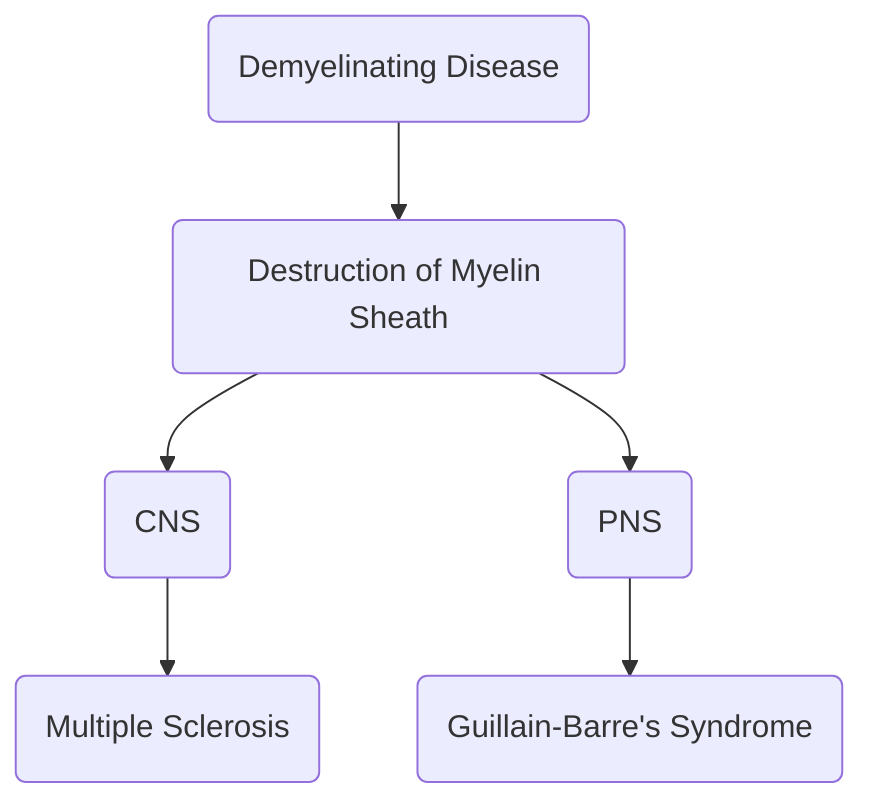

---
tags:
  - CMPA
date: 2024-04-03
---

___
# Parkinson's Disease
Degenerative patchy demyelination and damage to the basal ganglia, affecting movement. Tremors and a shuffling gait is present.
# Myasthenia Gravis
A chronic autoimmune disease. Results in ptosis and descending paralysis.
# Multiple Sclerosis
A chronic autoimmune disease.
Main concern: memory, fatigue, and sensation. Individuals become spastic and display constant muscular rigidity, resulting in fatigue.
## Diagnostic Examination
1. CT Scan
2. Fatigue
## Treatment
1. **Corticosteroids**: IV methylprednisone
2. **Baclofen** for muscle spasms
## Nursing Care
1. Avoid **hot baths**. Priority nursing management.
2. Teach the patient for the use of **assistive devices**
___
# Guillain-Barre Syndrome
An acute autoimmune attack on the peripheral myelin, which results in **ascending paralysis**. Memory is unaffected.
## Diagnosis
## Treatment
1. **Intravenous Immunoglobulin** (IV Ig)
2. **Plasmapheresis**
3. **Prevent immobility** and **protect the airway** of the patient.
## Nursing Care
1. Prepare suctioning and endotracheal tube.
___
# Spinal Shock
A decreased blood pressure, heart rate (prep. atropine), cardiac output, and developing flaccid paralysis.
- Paralytic ileus (and constipation) may develop. Auscultate for bowel sounds. Prepare for NGT decompression.
2. **Autonomic Dysreflexia** occurs only after spinal shock is resolved, with cord lesions above T6.
	- **S/S**: **pounding headache**, profuse sweating, **paroxysmal hypertension**, nasal congestion, sweating, bradycardia.
	- **Management**:
		- Maintain high back rest (sitting) to lower blood pressure.
		- A urinary catheter is applied to empty the bladder. Check for fecal impaction. Examine the skin for pressure ulcers, irritation, and other immobility precautions.
		- Examine room temperature.
		- Antihypertensive medication
___
# Cardiovascular Accident
Either hemorrhagic (rupture) or ischemic (due to blood clot).
## Risk Factors
1. Race and family history
2. Advanced Age
3. Gender: **male**
4. **Modifiable**: cardiac diseases, diabetes mellitus, hypertension, hyperlipidemia, obesity, and smoking.
## Diagnostic Examination
1. **CT Scan** identifies and differentiates stroke into ischemic or hemorrhagic forms.
2. **EEG**
3. **Cerebral arterio**
## Transient Ischemic Attack
A warning sign of a stroke. A temporary neural loss lasting less than one hour.
## Management
1. **Thrombolytics** to dissolve clot given **within 3 hours** of an episode: tPA (Alteplase), Streptokinase, Urokinase
2. Monitor **Airway, VS, GCS, ICP, Pupil Size, and Seizures**
3. **IVF**, **NGT**
4. **Mannitol**, **Diazepam**