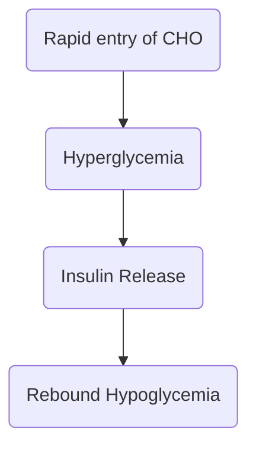

A constellation of vasomotor symptoms (diaphoresis, weakness, dizziness, flushing, palpitations) after eating, especially after a [[20-3#Gastrojejunostomy (Billroth II)|Billroth II Procedure]]. There is rapid gastric emptying into the small intestine, causing abdominal distention and shifting of fluid.
# Assessment Findings
- **Early Manifestations**: within 30 minutes; **vertigo**, **tachycardia**, **syncope**, **diaphoresis**, **pallor**, **palpitations**, a strong **desire to lie down**.
- **Late Dumping Syndrome**: 90 to 180 minutes p.c.; **dizziness**, **light-headedness**, **palpitations**, **diaphoresis**, and **confusion**.

# Dietary Management
- **Decrease the amount of food taken during feedings**. Avoid **ingesting liquids** with meals.
- **Diet**: **High CHON** (increased colloidal osmotic pressure = fluid retention), **high fat** (slower gastric emptying), and **low/moderate CHO** (avoid rebound hypoglycemia).