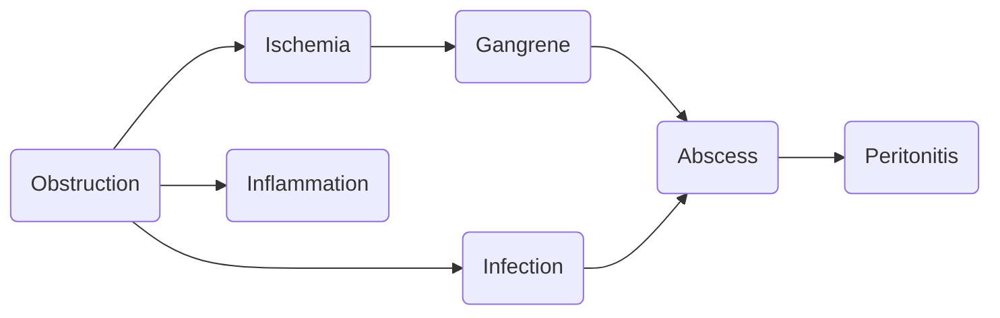

The **inflammation of the vermiform appendix** that prevents mucus from passing into the cecum. If unmanaged, **ischemia** occurs, which develops into **gangrene**, **rupturing the appendix**, and causing **peritonitis**. It may be caused by:
- **Mechanical obstruction**: ==fecaliths==, calcium-phosphate rich mucus and inorganic salts, worms, tumors, vital infection, and inflammation.
- **Decreased dietary fiber**, or a **diet high in refined carbohydrate**.
# Pathophysiology
It begins with an **obstruction of the appendix lumen**. The **mucosa in the appendix continues to secrete fluids** until the pressure in the appendix equals venous pressure. This pressure and stasis results in **ischemia** of the appendix, **mucosal inflammation**, and **bacterial proliferation**. **Gangrene develops within 24 to 36 hours** from hypoxia; **an abscess forms**. This eventually leads to [[21-3|Peritonitis]].

# Assessment Findings
- **Pain**, the main presenting symptom, starting at the **epigastric or umbilical region**. It becomes localized at **McBurney's point**, the midpoint between the *anterior iliac spine* and the *umbilicus*.
	- **Blumberg's Sign**: rebound tenderness.
	- **Psoas Sign**: pain with extension of the right thigh.
	- **Rovsing's Sign**: referred pain; **right quadrant pain** when the left quadrant is palpated.
	- **Obturator Sign**: pain on passive internal rotation of the flexed thigh.
- **Nausea and Vomiting**
- **Anorexia**
- **Decreased bowel sounds**
- **Fever**: low grade (38.0 to 38.5°C) that escalates to high grade if the appendix ruptures.
# Diagnostic Examinations
- **WBC Count** (≥10,000/mm³)
- **Ultrasound** and **Abdominal X-ray** (for detection of fecalith obstruction)
- **Differential Diagnosis** for [[Ectopic Pregnancy]]: **pregnancy test**
# Nursing Interventions
- Administer **antibiotics** and **antipyretics** as ordered.
- **NPO** in anticipation for emergency surgery.
- Prevent **rupture** of the appendix. **Don't give enemas**, **cathartics**, **or use heating pads**.
- **Cold Therapy** for pain.
# Surgical Management
- ==**Appendectomy**==.