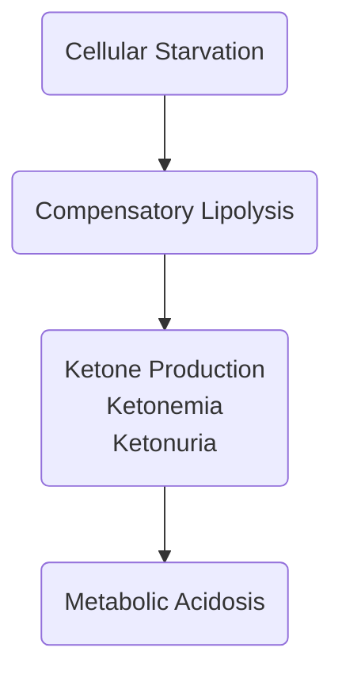

---
tags:
  - MS
title: Diabetic Ketoacidosis (DKA)
description: A state of metabolic acidosis resulting from compensatory lipolysis in patients with diabetes mellitus.
date: 2024-01-01
---
**Read Also**: [[MS/25-1|Diabetes Mellitus]]
___
A state of [[MS/07|metabolic acidosis]] resulting from **compensatory lipolysis** in patients with [[MS/25-1|diabetes mellitus]]. It may be **precipitated** by neglect of treatment, infection, cardiovascular disorders, and other stressors.
___
# Assessment
- Acute complication of DM results in [[MS/25-3|hyperglycemia]] and **ketonemia**.
- Polyphagia, Polydipsia, Polyuria
- **Nausea and Vomiting**, **Abdominal Pain**
- **Dry Mucous Membranes**, **Soft Eyeballs**
- **Kussmaul's Breathing** or **Tachypnea**, **Acetone**/**Fruity Breath**
- **Altered Level of Consciousness** (metabolic acidosis causes CNS depression), **Hypotension**
- **Tachycardia**
# Diagnostic Examination
- **Serum Glucose** is elevated, up to **600 mg/dL**.
- **Serum Ketones** are elevated, and **Ketonuria** is present.
- **BUN**, **Creatinine**, and **Hematocrit** are **elevated** due to dehydration.
- **Na** is **decreased**, **K** is **elevated** (due to acidosis)
- **ABG**: **Metabolic Acidosis with Compensatory Respiratory Alkalosis**
- **Metabolic Acidosis compatible with Hyperkalemia**
# Management
- Establish and maintain a **patent airway**.
- Maintain **F&E** balance (fluid overload, hypokalemia, hyperkalemia)
- **IV Therapy**:
	- **0.9NaCl**, then **0.45NaCl**
	- If blood glucose drops to **250 mg/dL**, **D5W** may be added.
	- **Potassium Chloride** will be added once urine output is adequate.
- **Insulin Therapy**: Regular Insulin (**IV** drip or push; **SC**). If **IV**, add **albumin** because insulin adheres to IV tubing. Monitor blood glucose levels frequently.
- **Health education** for reasons for developing DKA and diabetic education if necessary.
___
# Pathophysiology

