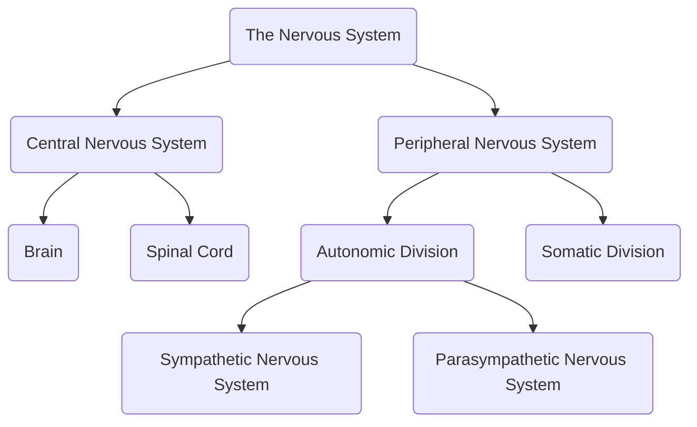

---
tags:
  - MS
title: Diagnostic Examination of The Nervous System
---
# Anatomy and Physiology of the Nervous System
Also Read: ANPH/The Nervous System
The nervous system is divided into two major parts, the **central nervous system** (brain and spinal cord) and **peripheral nervous system** (cranial nerves, spinal nerves, and autonomic nervous system). These systems exist to **control motor, sensory, autonomic, cognitive, and behavioral activities** with more than 100 billion cells just in the brain that link the motor and sensory pathways, monitor the body's processes, respond to the internal and external environment, maintain homeostasis, and conduct all psychological, biologic, and physical activity through complex chemical and electrical messages.

- The **Autonomic Division of the PNS** (involuntary) regulates the internal environment of the body and carries information from the CNS to the organs, blood vessels, and glands. It is divided between **sympathetic** (arouses the body; *fight or flight*) and **parasympathetic** (calms the body after arousal; *rest and digest*) subdivisions.
- The **Somatic Division of the PNS** is voluntary, mainly playing roles in skeletal muscles. It carries information to the CNS from the senses and from the CNS to the skeletal muscles.
## Cells of the Nervous System
The basic functional unit of the brain is the neuron, which is made up of dendrites, a cell body, and an axon.
- **Dendrites**: branch-type structures for receiving electrochemical messages.
- **Axon**: a long projection that carries electrical impulses away from the cell body.
- **Myelinated Sheath**: some neurons have a myelin sheath that increases the speed of conduction of a neuron.
- **Ganglia**/**Nuclei**: a cluster of nerve cell bodies. If the bodies serve the same function, it is a **center**, as in the "*respiratory center*", etc..
- **Neuroglial Cells** are cells supporting, protecting, and nourishing neurons at around 50 cells per 1 neuron in the brain.
## Brain Areas
1. **Frontal Lobe**: behavior, intelligence, memory, movement
2. **Temporal Lobe**: behavior, hearing, memory, speech, vision
3. **Parietal Lobe**: intelligence, language, reading, sensations
4. **Optical Lobe**: vision
5. **Cerebellum**: balance, coordination
6. **Brain Stem**: blood pressure, breathing, consciousness, swallowing, heartbeat
___
# Assessment of the Nervous System
1. **Health History**: present illness, overall appearance, mental status, posture, movement, and affect.
	- Onset, character, severity, location, duration, and frequency of signs and symptoms
	- Associated complaints
	- Precipitating, aggravating, and relieving symptoms
	- Progression, remission, exacerbation
	- Presence or absence of similar symptoms among family members
	- **Family History**: any genetic diseases
	- **Patient History**: trauma or falls affecting the head or the spine, alcohol use, and drug use.
2. **Common S/S**: pain, seizures (from abnormal paroxysmal secretions), dizziness/vertigo (disorder of the vestibular system), visual disturbances (lesions of the eye, etc.), muscle weakness (stroke, degenerative diseases), abnormal sensations. Ask the patient about these symptoms when assessing.
3. **Physical** (Neurologic) **Assessment**:
	- **Consciousness** and **Cognition**: mental status, intellectual function, thought content, emotional status, language ability, lifestyle, and level of consciousness.
	- **Cranial Nerves**
	- **Motor Systems**
	- **Sensory Systems**
	- **Reflexes**
___
# Diagnostic Examination of the Nervous System
## X-Ray
**X-Ray**: determines bony fractures, curvatures, bone erosions, bone dislocations, and possible calcification of soft tissue that may damage the nervous system. Various orientations may be required for accurate imaging.
- **Nursing Management**: explain the procedures, importance of staying still, ensure understanding of radiologic exposure and its minimal risk, removal of hairpins, glasses, and hearing aids.
- Patients in traction or those who cannot walk may require a stretcher or aid in positioning.
## Cerebral Arteriography/Angiography
**Cerebral Arteriography/Angiography**: the visualization of cerebral vessels, determining the presence of tumors, aneurysms, occlusions, hematomas, and abscesses.
- A **radiopaque substance** is injected into cerebral circulation via the carotid, vertebral, femoral, or brachial artery. Catheterization may be used.
- **Digital Subtraction Angiography** may be used, where an x-ray with and without a contrast dye are subtracted from one-another, removing bones and other background structures, allowing for easier visualization of blood vessels.
- **Nursing Management**: as it is invasive, a **consent form** is required.
	- Check for **allergies** to iodinated contrast agents. Allergy manifests as dyspnea, nausea and vomiting, sweating, tachycardia, and numbness of extremities. Report to the physician at once if a reaction occurs. Administration of epinephrine, antihistamines, or corticosteroids may be required. Vessel injuries, bleeding, and a cerebrovascular accident may occur.
	- Educate the client on the importance of **not moving** during the procedure.
	- **NPO 4 to 6 hours before the exam** is required, with **clear liquids permitted** until the examination. Maintain hydration.
	- Record **vital signs** (neurologic vital signs)
	- Empty bladder for comfort and because the procedure may last for a considerable amount of time.
	- After examination, re-examine vital signs, neurologic status, and neurovascular checks cross-referenced with pre-angiography signs. Enforce bed rest and continue to monitor VS and neuro checks.
	- The **extremity used for catheterization should be kept straight and immobilized during bed rest**. Hematoma may form, and an **ice bag** may be applied intermittently to the puncture site.
	- Check for the **extremity's skin color and temperature, pulses distal to the injection, and capillary refill**.
	- Inspect the puncture site for bleeding.
	- **Increase oral or IVF** if not contraindicated.
## Computed (Axial) Tomography
**Computed Tomography** (CT)/**Computed Axial Tomography** (CAT) Scans are used to detect **==intracranial and spinal cord lesions==** and to monitor effects of surgery or other therapies. Ionizing radiation is used to scan the body parts in successive layers. Contrast media may or may not be used. **CVA and potentially its cause/form may be identified by CT Scans**.
- No special preparations are required. Inform the patient to **remain still during the scan**.
- **Nursing Management**: contrast requires a **consent form**.
	- If contrast is being used, **check for risk factors** and inform the physician.
	- All **metallic belongings should be removed** from the patient. Hairpins, hairpieces, or wigs are also removed.
	- Explain **importance of not moving** during examination.
	- After the procedure, check for **delayed allergic responses** (if contrast is used). Check for I&O as **consequential osmotic diuresis** may require replacement of fluids.
## Magnetic Resonance Imaging
The use of a powerful magnetic field to visualize body parts, including the nervous system. Being clearer than CT scans and not involving ionizing radiation, it is better suited for identifying brain tumors, [[CVA]], and [[multiple sclerosis]].
- **Nursing Management**: identify **implants that contraindicate MRI scans**, wherein the implants may be damaged or cause damage due to the magnetic fields.
	- **All metal items should be removed** before the test. Some medications with foil also need to be removed.
	- Assess for a **history of claustrophobia** which may interfere with the test.
## Positron Emission Tomography
A PET scan is a computer-based nuclear imaging technique that produces images of actual organ functioning.