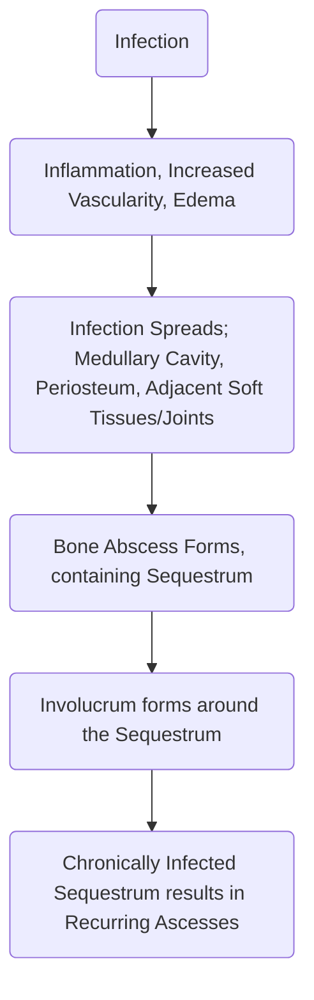

---
tags:
  - MS
title: Osteomyelitis
description: An infection of the bone that results in inflammation, necrosis, and formation of new bone (involucrum)
date: 2024-01-01
---
**Osteomyelitis** is an infection of the bone that results in inflammation, necrosis, and formation of new bone. It may be classified according to what caused the infection:
1. **Hematogenous Osteomyelitis**, i.e. from bloodborne spread of infection
2. **Contiguous-focus Osteomyelitis**, an infection directly from surgery e.g. through contact with hardware.
3. **Osteomyelitis with Vascular Insufficiency**, inflammation and necrosis resulting from ischemia of the bone tissue.
___
# Risk Factors
1. **Older age**
2. **Poor nourishment or obesity**
3. Impaired immune systems, chronic illnesses, **long-term corticosteroid therapy** or use of **immunosuppressive agents**
4. Use of illicit **IV drugs**
5. **Postoperatively**, typically occuring within 30 days. This may be incisional or deep (depending on if the incision reaches beyond the deep fascia layer). **Implants** can become a source of deep postoperative infection within a year.
___
# Pathophysiology
Over half of bone infections are caused by *Staphylococcus aureus*, and increasingly of the variety that is methicillin-resistant (MRSA). Other pathogens include the gram-positive organisms *streptococci* and *enterococci*, followed by gram-negative bacteria, including *pseudomonas*.
1. The initial response to infection is **inflammation**, **increased vascularity**, and **edema**.
2. Within 2 to 3 days, **thrombosis of the local blood vessels occur**, resulting in **ischemia with bone necrosis**.
3. The infection **extends into the medullary cavity and under the periosteum** and may spread into **adjacent soft tissues and joints**.
4. If untreated, **a bone abscess forms**. The cavity formed by the abscess contains **sequestrum** (dead bone tissue), which **does not easily liquefy and drain**.
5. The cavity **fails to drain, collapse and heal**.
6. **New bone growth**, the **involucrum** forms and surrounds the sequestrum, resulting in a **chronically infected sequestrum** remains and **produces recurring abscesses** throughout the patient's life. This is known as **chronic osteomyelitis**.

___
# Clinical Manifestations
1. If the infection is **bloodborne**, onset is often **sudden** with the **clinical manifestations of sepsis**: **chills, high fever, general malaise, tachycardia**.
	- These systemic manifestations may initially overshadow the local manifestations of infection.
	- **As infection progresses** through the cortex of the bone, **the periosteum and soft tissues are infected, producing pain, swelling, and extreme tenderness**.
	- The patient may describe a **constant, pulsating pain** that intensifies with movement as a result of **the pressure of collecting purulent material**.
2. If the infection **spreads from an adjacent infection** or **direct contamination**, manifestations of sepsis are absent. The area over the infected bone becomes **swollen, warm, painful, and tender to touch**.
3. The patient with **chronic osteomyelitis** presents with a **nonhealing ulcer that overlies the infected bone with a connecting sinus** that will intermittently and spontaneously **drain pus**.
4. **Diabetic Osteomyelitis** may occur without any external wounds. This may present as a **nonhealing fracture**. **Micro-** and **macrovascular pathophysiologic changes** along with an **impaired immune system** in diabetics can exacerbate the spread of infection. Any foot ulcer more than 2 cm in diameter is highly suspicious for osteomyelitis.
___
# Diagnostic Examination
1. **X-ray Findings**
	- Early: **soft tissue edema**
	- 2 to 3 weeks: **periosteum elevation** and **bone necrosis**
2. **Radioisotope Bone Scans** and **MRI** help with early definitive diagnosis.
3. **Blood studies** reveal leukocytosis and an elevated ESR.
4. Wound and blood cultures are used but only positive in 50% of cases.
5. **Bone Cultures** may be used to isolate organisms involved.
___
# Prevention
1. **Delay surgery if any ongoing infection is present**.
2. **Prophylactic antibiotics** before and after surgery.
3. **Aseptic postoperative wound care** and **prompt management of soft tissue infections** reduces extension of infection to the bone or hematogenous spread.
___
# Management
The initial goal of therapy is the control and halt the infective process. **General supportive measures** e.g. hydration, dieting, and correction of anemia are instituted. **Immobilization of the infected area** decreases discomfort and to prevent **pathologic fractures of the weakened bone**.
1. **Pharmacologic**: because of the avascularity and immune system having difficulty accessing the bone, infections are harder to eradicate.
	- **Antibiotic Therapy** is longer-term, typically continuing for 6 to 12 weeks. Initially administered intravenously, the antibiotics may be given orally after the infection appears to be controlled.
2. **Surgical**: chronic infection that does not respond to antibiotic therapy is indicative of **surgical debridement**. All dead and infected cartilage and bone must be removed before permanent healing can occur.
	- Exposure of the infected bone and removal of the purulent and necrotic material.
	- **Sequestrectomy**: removal of enough involucrum to enable the surgeon to remove the sequestrum.
	- **Saucerization**: if enough bone material is removed, the deep cavity is shaped into a shallow saucer.
	- **Saline Irrigation** is required if debris remains, typically not exceeding beyond a week.
	- The resulting cavity may be tightly closed or packed and **closed later by granulation or grafting** (with cancellous bone graft). Large cavities may be filled with a vascular muscle flap or bone transfer.
	- **Internal fixation or external supportive devices** may be required to prevent pathologic fractures as debridement weakens the bone.
___
# Nursing Process
## Assessment
- An acute onset of signs and symptoms e.g. localized pain, edema, erythema, fever.
- **Recurrent drainage of an infected sinus** with associated **pain, edema, and low-grade fever**.
- Assess for **risk factors**: old age, diabetes, long-term corticosteroid therapy, etc.
- History of previous injury, infection, or orthopedic surgery
- **Altered gait** as the patient attempts to avoid pressure and movement of the area.
- **Generalized malaise** as a systemic reaction to acute hematogenous osteomyelitis.
- **Physical Examination** reveals **inflamed, markedly edematous, and warm tender area**. **Purulent drainage** may be noted.
- **Elevated temperature** is present in infection, but may only be present in the afternoon or evening for those with chronic osteomyelitis.
## Diagnosis
1. **Acute pain** associated with inflammation and edema
2. **Impaired mobility** associated with pain, use of immobilization devices, and weight-bearing limitations
3. **Risk for infection**: bone abscess formation
4. **Lack of knowledge** associated with treatment regimen
## Planning, Goals, and Intervention
Goals include pain relief, improved physical mobility, control and eradication of infection, and knowledge of treatment regimen.
1. **Relieving Pain**:
	-  **Immobilization via splint** reduces pain and muscle spasming. This entails monitoring of the skin and neurovascular status of the affected extremity.
	- **Great care and gentleness** is observed in handling wounded extremities.
	- **Elevation** reduces swelling and associated discomfort.
	- **Analgesics and other pain-reducing agents when prescribed** may also be used.
2. **Improving Physical Mobility**:
	- The patient must **understand the rationale for activity restrictions**.
	- **ROM Exercises** for the joints above and below the affected region.
	- **Full participation in ADLs** should be encouraged to promote general well-being.
3. **Controlling the Infectious Process**: monitor the response to antibiotic therapy; observe the IV access site for phlebitis, infection, or infiltration.
	- In long-term intensive antibiotic therapy, **monitor the patient for superinfection** (oral or vaginal candidiasis, loose or foul-smelling stools), and for **development of additional painful sites** or **sudden increases in body temperature**.
	- **If surgery is necessary, ensure adequate vascular flow** (wound suction for fluid accumulation, elevation for venous drainage).
	- **Ensure adherence to weight-bearing restrictions**.
	- Maintain the **aseptic technique** when changing dressings to promote healing and to prevent cross contamination.
## Evaluation
1. **Experiences pain relief**: reports decreased pain at rest, experiences no tenderness, and experiences minimal discomfort with movement.
2. **Increases in safe physical mobility**: participates in self-care activities, maintains full function of unimpaired extremities, demonstrates safe use of immobilizing and assistive devices, and modifies environment to promote safety and to avoid falls.
3. **Shows absence of infection**: takes antibiotics as prescribed, reports normal temperature, exhibits no edema, drainage is absent, normal WBC/ESR results, and wound cultures are negative.