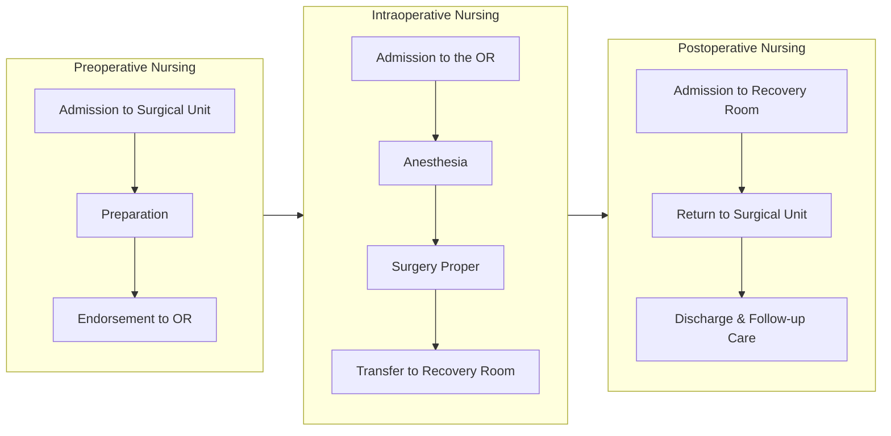

This is the beginning of a series of three notes spanning perioperative nursing:
1. **Preoperative Nursing** (You're here!)
2. [[Intraoperative Nursing]]
3. [[Postoperative Nursing]]

As a preface, **perioperative nursing** is a practice wherein clients and families are assisted to recover functioning to its highest possible degree. This requires knowledge and skill in perioperative care, and an in-depth understanding of related disease processes. The span of practice in perioperative nursing starts at admission and ends at discharge.

**Preoperative nursing** spans from admission to the endorsement of the patient to the operating room. This phase is primarily focused on **preparation** for the surgical procedure. **Intraoperative nursing** spans from admission to the operating room up to the transfer of the patient to the recovery room. This phase is primarily focused on assisting in anesthesia and surgery. **Postoperative nursing** extends from the time the client is admitted to the recovery room until their discharge, including follow-up care. It is primarily focused on monitoring and evaluation.
___
# Surgical Context

| Classification                  | Types                                                                                                                                                                                                                                                                                                                                                  |
| ------------------------------- | ------------------------------------------------------------------------------------------------------------------------------------------------------------------------------------------------------------------------------------------------------------------------------------------------------------------------------------------------------ |
| **According to Purpose**        | **Curative**: to repair or remove damaged tissue to cure disease **Diagnostic**: to verify or establish a diagnosis **Exploratory**: to explore the extent of disease or damage **Ablative**: to remove non-functional tissue **Palliative**: to reduce symptoms, without curing the disease process **Transplant**: to transfer organs |
| **According to Location**       | **External**, e.g., a hysterectomy **Internal**, e.g., skin grating                                                                                                                                                                                                                                                                                 |
| **According to Mode**           | **Constructive**: to create structures, especially in congenital defects **Reconstructive**: to restore structures                                                                                                                                                                                                                                  |
| **According to Degree of Risk** | **Minor**: non-life-threatening procedures **Major**: involves vital signs or vasculature, or with the potential for bleeding.                                                                                                                                                                                                                      |
| **According to Urgency**        | **Emergency**: immediately required procedures **Urgent**/**Imperative**: procedures that must be done within 24 to 48 hours. **Elective**: may still be required, but can be scheduled within days to months.                                                                                                                                   |
>[!ERROR] Pathologic Conditions
>There are four basic pathologic conditions that require surgery: **obstruction**, such as in a blocked bile duct; **perforation**, the rupture of an organ, artery, or bleb i.e. in aneurysms; **erosion**, a break in the continuity of tissue surfaces caused by irritation, infection, ulceration, or inflammation; and **tumors**, abnormal growths of tissue that serve no physiologic function in the body.
## Surgical Risks
**General Risk Factors** are those that increase the probability of complication or untoward reactions during surgery.
1. **Aging**: older patients have a lower capacity for homeostasis. The potential for injury is increased, along with elevated reactions to medications and anesthesia. Dosages should be adjusted accordingly.
2. **Obesity**: surgery becomes technically complicated. Almost all body systems are affected by obesity, such as the immune system, respiratory system (hypoventilation), thermoregulation system, etc. If possible, weight loss should be attempted prior to schedule.
3. **Poor Nutrition**: malnutrition greatly impairs wound healing. **Alcoholism** is related to malnutrition, along with potentially increased tolerance to anesthetics.
4. **Fluid and Electrolyte Imbalances**: dehydration and electrolyte imbalance can alter the effects of anesthesia. Volume losses can also be altered, resulting in shock and dysrhythmia.
5. **Comorbidities**, especially those that compromise cardiovascular function, can complicate a surgery. These include angina, myocardial infarction, congestive heart failure, pulmonary edema, etc. **Diabetes mellitus**, in particular, produces poor wound healing and hyperglycemia (further increased by surgical stress).
6. **Concurrent or prior pharmacotherapy**: drug interactions can cause adverse effects. This includes herbal substances.

Other miscellaneous factors can also increase the risk of a surgery:
1. **Nature of the disease condition**
2. **Location of the condition**
3. **Magnitude and urgency of the surgical procedure**
4. **Mental attitude of the person toward surgery**
5. **Caliber of the professional staff and health care facilities**
___
# Care During the Preoperative Period
The nurse works to **assess** conditions that can contribute to surgical risk. Additionally, the nurse **educates** the patient on the requisite knowledge for surgery and those exercises which may benefit the person during the postoperative period. This discussion includes discharge planning and projected lifestyle changes after undergoing surgery.
## Nursing Assessment

| Physiology                        | Related Risk Factors                                                                                                                                                                                                                                                                   |
| --------------------------------- | -------------------------------------------------------------------------------------------------------------------------------------------------------------------------------------------------------------------------------------------------------------------------------------- |
| **Age**                           | Normal physiologic changes in old age                                                                                                                                                                                                                                                  |
| **Presence of Pain**              | Baseline data about the presence of chronic pain, or if postoperative findings of pain is attributable to the surgery.                                                                                                                                                                 |
| **Nutritional Status**            | Malnourishment                                                                                                                                                                                                                                                                         |
| **Fluid and Electrolyte Balance** | Dehydration, fluid volume excess, electrolyte imbalances                                                                                                                                                                                                                               |
| **Infection**                     | Existing infection can result in sepsis if surgery is done.                                                                                                                                                                                                                            |
| **Cardiovascular Function**       | Pathologic cardiac conditions; decreased tissue perfusion                                                                                                                                                                                                                              |
| **Pulmonary Function**            | Chronic lung disease that impair gas exchange                                                                                                                                                                                                                                          |
| **Renal Function**                | Impaired renal function can affect the removal of anesthetic agents.                                                                                                                                                                                                                   |
| **Gastrointestinal Function**     | Gastrointestinal conditions are related to malnutrition and N&V, which produce poor surgical outcomes.                                                                                                                                                                                 |
| **Liver Function**                | The liver functions to detoxify medications. Toxicity can occur if its function is impaired.                                                                                                                                                                                           |
| **Endocrine Function**            | Diabetes mellitus (most common), and thyroid disorders (risk of cardiac arrest)                                                                                                                                                                                                        |
| **Neurologic Function**           | Baseline data should be obtained to determine neurologic changes. Neurologic conditions such as unconditional epilepsy or severe Parkinson's disease increase surgical risk.                                                                                                           |
| **Hematologic Function**          | Blood coagulation disorders (hemorrhage, shock)                                                                                                                                                                                                                                        |
| **Use of Medication**             | Medication history, whether prescription, nonprescription, and herbal, are obtained. Some herbal preparations such as Gingko biloba, garlic, ginger, and ginseng can prevent blood clotting. Many drug interactions can cause untoward reactions, so all of them should be documented. |
| **Presence of Trauma**            | Musculoskeletal damage are documented and considered to prevent further injury.                                                                                                                                                                                                        |

**Psychosocial Assessment** is an important aspect of nursing care, and focuses on patient fears and their manifestations. The most common sources of fear include:
1. **Fear of the unknown**, the most common source of fear, is the uncertainty of surgical outcomes
2. **Fear of anesthesia**, vulnerability of unconsciousness, and adverse outcomes
3. **Fear of pain**, agony, suffering, or distress that may result from the surgical procedure
4. **Fear of death**
5. **Fear of disturbance of body image**
6. **Fear and worries from loss of finances, employment, social and family roles**

These fears can manifest in various domains of functioning, from physical to psychological:
- **Anxiousness**
- **Bewilderment**
- **Anger**
- **Tendency to exaggerate**
- **Sad, evasiveness, tearfulness, and clinging behavior**
- **Inability to concentrate**, **short attention span**, **dazed appearance**, **failure to carry out simple directions**

The nurse may implement the following **nursing interventions** to minimize anxiety:
- Explore the client’s feelings. Encourage the client to **speak openly about fears and concerns**.
- **Give accurate information** regarding surgery.
- Provide **empathetic support**. Accept individual’s reactions to the surgical experience.
- Consider the person’s **cultural and religious preferences**. Arrange for visit by chaplain/priest/ minister/religious adviser as desired by the patient and his family.
## Informed Consent
Any invasive procedure or anesthesia requires written informed consent, due to their invasive and risky nature. "*Informed*" indicates the necessity of **understanding on the part of the client about all pertinent information related to the surgery**. This includes the nature of the procedure itself, its risks, benefits, and alternatives (and their risks and benefits).

A written informed consent is used to ensure that **the client understands the nature of the treatment including its complications and disfigurement**. When signed, the patient should be **free of duress or pressure** (voluntary), **be of age** (≥18), and **of sound mind**. This protects the client against unauthorized procedures, and the surgeon and hospital against legal actions by clients.
- A **witness** is required. The nurse, physician, or other authorized persons verify that the prerequisites for a valid consent are in place.
- If patients are unable to give consent, their **parents or significant others may sign consent** in their place. **Emancipated minors** include those who are married, those who live independently, or are financially independent (*Not applicable to the Philippines*). These individuals are able to provide their own consent even before the age of 18.
- If no consent is obtainable from a patient or their relatives in case of an emergency, a call may suffice. If still unobtainable, the healthcare providers may use the principle of *beneficence* to pursue life-saving interventions.
- A **sound mind** is that free from duress, pressure, sedation, or the influence of drugs or alcohol.
## Preoperative Client Preparation
1. **Physical preparations** of the patient before surgery are done to make the patient as fit for surgery as possible, with minimal risks.
	- Correcting any **dietary deficiencies**.
	- **Reducing weight** for obese patients, as time permits.
	- Correcting **fluid and electrolyte imbalances**.
	- Restoring **adequate blood volume** with blood transfusion.
	- **Managing diseases**, such as chronic conditions and infectious processes
	- Treating an **alcoholic person** with vitamin supplementation, IV fluids or oral fluids, if dehydrated.
2. **Postoperative exercises** are taught during this phase. These are exercises that helps to prevent postoperative complications.
    - Deep breathing and coughing exercises. To promote adequate lung expansion and ventilation, and expel mucous secretions.
    - Incentive spirometry. To enhance deep inspiration and promote maximum lung expansion
    - Turning exercises. To promote adequate lung expansion, promote circulation, and prevent pressure sores.
    - Foot and leg exercises. Flexion and extension exercises of the lower extremities promote circulation; prevent venous stasis, thereby preventing thrombophlebitis.
3. **The Evening Before Surgery**:
	- **Skin**: the patient is advised to take a bath using bacteriostatic soap to reduce microorganisms on the skin. Shaving is not yet done, as hair grows back overnight. Shaving is done just before the surgery.
	- **Gastrointestinal Tract**: the bowel is cleaned for surgeries involving the gastrointestinal tract. This is done to reduce the risk of infection. **Laxatives** (cathartics) and **enemas** ("*Enema until clear*"; Maximum of 3 times) can be used. **NPO status** also begins at midnight the day before surgery.
	- **Anesthesia**
___
(unformatted)
- NPO for 6 hours before surgery. Patients having morning surgery are kept NPO from midnight. Clear fluids, like water may be given up to 4 hours before surgery if ordered to help client swallow medications.
3. Preparing for Anesthesia: the patient should avoid alcohol and cigarette smoking for at least 24 hours before surgery. This can help reduce potential complications of anesthesia. 
4. Promoting Rest and Sleep
	- Provide comfort measures, e.g. clean gown and linens, correct room temperature, subdued lighting, back rub.
	- Administer sedative as ordered.

- When preparing the patient on the day of surgery, the nurse should include the following:
	1. Awaken the patient, one hour before preoperative medications.
	2. Provide morning bath and mouth wash. Morning bath reduces microorganisms in the skin. Mouthwash prevents surgical parotitis. (Mumps).
	3. Provide clean gown.
	4. Remove hairpins, braid long hairs, cover hair with cap.
	5. Remove dentures, foreign materials (chewing gum) from patient’s mouth.
	6. Remove colored nail polish, hearing aid, contact lens, jewelries. If the patient refuses to remove the wedding ring, tie it with gauze and fasten around the wrist. 
	7. Take baseline vital signs before administration of preop medications.
	8. Check patient identification (ID) band and area of “skin prep” as applicable.
	9. Check for special orders, e.g. enema, gastrointestinal tube insertion, IV line. Ensure that these orders are carried out.
	10. Check if NPO is maintained.
	11. Have client void before administration of preop medications. Some preop medications may cause hypotension and increase risk for falls. For patient safety, put up side rails, put call light within patient’s reach, and instruct patient to ask for help if he/she needs to void.
	12. Continue to support the patient emotionally. Anxiety level may be high at this time.
	13. Accomplish the “Preop Care Checklist”.
## Preoperative/Preanesthetic Drugs
Drugs are provided prior to surgery to facilitate the administration of any anesthetic, to minimize respiratory tract secretions and changes in heart rate, and to relax the client and reduce anxiety.
- Types of Preop Medications
	1. **Opiates**: morphine (Roxanol) and meperidine (Demerol) are given to relax the patient and potentiate anesthesia.
	2. **Anticholinergics**: atropine sulfate, scopolamine, and glycopyrrolate (Robinul) are given to reduce respiratory tract secretions and to prevent severe reflex slowing of the heart during anesthesia.
	3. **Barbiturates**/**Tranquilizers**: Phenobarbital (Nembutal) and other hypnotic agents are given the night before surgery to help ensure a restful night’s sleep.
	4. **Prophylactic antibiotic**: administered just before or during surgery when bacterial contamination is expected; ideally before skin incision is made

- When transporting the patient to the operating room, promote safety. 
- Care of the patient’s family includes the following:
	1. Directing the family to the proper visiting room or waiting lounge.
	2. Informing them that they will be contacted by the surgeon immediately.
	3. Explaining reason for long interval of waiting. This is due to anesthesia preparation, skin prep, surgical procedure and recovery room/post anesthesia care unit stay. This action helps prevent unnecessary anxiety by the family.
	4. Explaining what to expect during the postoperative period, e.g., IV fluids, blood transfusions, oxygen therapy, tubes and other contraptions
___
